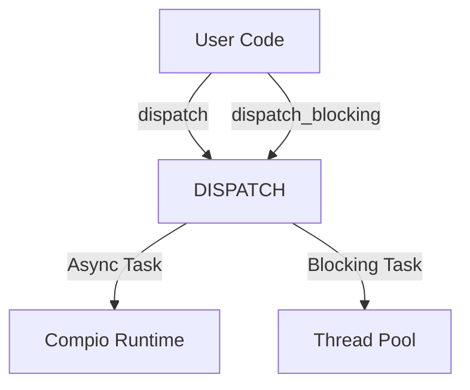

# compio_dispatch : Global Task Dispatch Engine

Global, lazy-loaded task dispatcher for Compio applications.

## Table of Contents
- [compio\_dispatch : Global Task Dispatch Engine](#compio_dispatch--global-task-dispatch-engine)
  - [Table of Contents](#table-of-contents)
  - [Introduction](#introduction)
  - [Usage](#usage)
  - [Features](#features)
  - [Design](#design)
  - [Tech Stack](#tech-stack)
  - [File Structure](#file-structure)
  - [API](#api)
    - [`pub static DISPATCH: Dispatcher`](#pub-static-dispatch-dispatcher)

## Introduction
`compio_dispatch` provides a global singleton `Dispatcher` to simplify task offloading in `compio` applications. It allows scheduling asynchronous tasks (running on the compio runtime) and blocking tasks (running on a dedicated thread pool) without passing dispatcher references between modules.

## Usage
```rust
use aok::{OK, Void};
use log::info;

#[compio::test]
async fn test() -> Void {
  // Dispatch an async task
  let rx = compio_dispatch::DISPATCH
    .dispatch(|| async {
      info!("> dispatch async");
      OK
    })
    .unwrap();
  
  rx.await.unwrap();

  // Dispatch a blocking task
  let rx_blocking = compio_dispatch::DISPATCH
    .dispatch_blocking(|| {
      info!("> dispatch blocking");
      OK
    })
    .unwrap();
  
  rx_blocking.await.unwrap()
}
```

## Features
- **Global Access**: Call directly from any module, eliminating the need for reference passing.
- **Lazy Loading**: Implemented via `static_init` for safe initialization upon first use.
- **Dual Mode**: Natively supports both `async` (Compio Runtime) and `blocking` (Thread Pool) modes.

## Design
The crate exports a global static variable `pub static DISPATCH` (alias for `compio_dispatcher::Dispatcher`). It utilizes `static_init` to ensure the safe and dynamic initialization of the runtime environment and dispatcher components.



## Tech Stack
- **compio**: Core asynchronous runtime.
- **compio-dispatcher**: Underlying dispatcher implementation.
- **static_init**: Global static initialization assurance.

## File Structure
```
.
├── src/
│   └── lib.rs    # Global DISPATCH export
└── tests/
    └── main.rs   # Integration tests and demo
```

## API
### `pub static DISPATCH: Dispatcher`
Global dispatcher instance. Dereference to access core methods of `compio_dispatcher::Dispatcher`:
- `dispatch<F, Fut>(f: F) -> io::Result<Receiver<T>>`: Dispatch an async task.
- `dispatch_blocking<F, T>(f: F) -> io::Result<Receiver<T>>`: Dispatch a blocking task.

---

**Did you know?**
In the 1960s, the advent of Multiprogramming and Time-sharing systems gave rise to the concept of the "Dispatcher" in operating systems. As a core component of the scheduler, the dispatcher was responsible for switching CPU resources from one task to another within milliseconds, creating the illusion of "parallelism" in the single-core era. Today, `compio_dispatch` brings this ancient wisdom into modern Rust asynchronous programming, efficiently coordinating the flow of tasks between the runtime and thread pools in user space.
