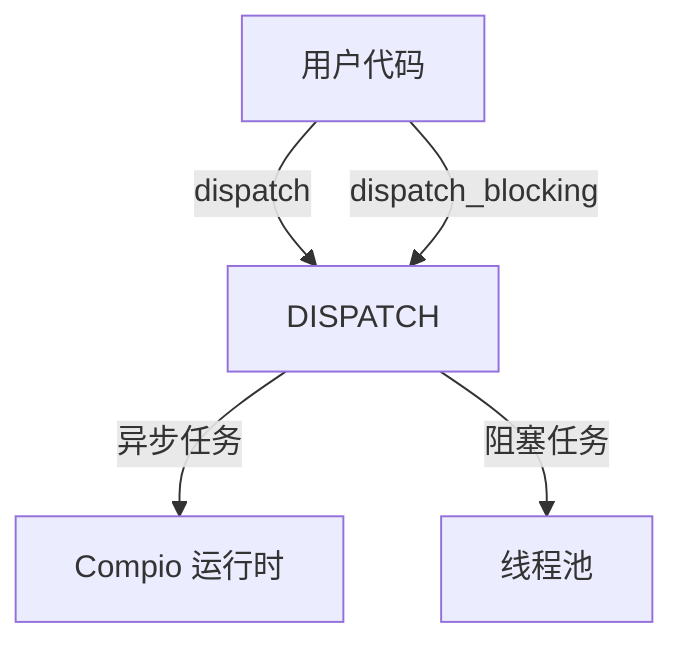

# compio_dispatch : 全局任务分发引擎

Compio 应用的全局、懒加载任务分发方案。

## 目录
- [compio\_dispatch : 全局任务分发引擎](#compio_dispatch--全局任务分发引擎)
  - [目录](#目录)
  - [简介](#简介)
  - [使用演示](#使用演示)
  - [特性](#特性)
  - [设计思路](#设计思路)
  - [技术堆栈](#技术堆栈)
  - [目录结构](#目录结构)
  - [API 说明](#api-说明)
    - [`pub static DISPATCH: Dispatcher`](#pub-static-dispatch-dispatcher)

## 简介
`compio_dispatch` 提供全局单例 `Dispatcher`，旨在简化 `compio` 应用中的任务卸载流程。无需在模块间传递分发器引用，即可直接调度异步任务（运行于 compio 运行时）与阻塞任务（运行于专用线程池）。

## 使用演示
```rust
use aok::{OK, Void};
use log::info;

#[compio::test]
async fn test() -> Void {
  // 分发异步任务
  let rx = compio_dispatch::run(|| async {
    info!("> dispatch async");
    OK
  })
  .unwrap();
  
  rx.await.unwrap();

  // 分发阻塞任务
  let rx_blocking = compio_dispatch::blocking(|| {
    info!("> dispatch blocking");
    OK
  })
  .unwrap();
  
  rx_blocking.await.unwrap()
}
```

## 特性
- **全局访问**: 任意模块均可直接调用，彻底告别引用传递。
- **懒加载**: 基于 `static_init` 实现，首次使用时安全初始化。
- **双模分发**: 原生支持 `async` (Compio 运行时) 与 `blocking` (线程池) 两种模式。

## 设计思路
本 crate 导出一项全局静态变量 `pub static DISPATCH` (即 `compio_dispatcher::Dispatcher`)。利用 `static_init` 保障运行时环境与分发器组件的动态初始化过程安全可靠。



## 技术堆栈
- **compio**: 核心异步运行时。
- **compio-dispatcher**: 底层分发器实现。
- **static_init**: 全局静态初始化保障。

## 目录结构
```
.
├── src/
│   └── lib.rs    # 全局 DISPATCH 导出
└── tests/
    └── main.rs   # 集成测试与演示
```

## API 说明
### `pub static DISPATCH: Dispatcher`
全局分发器实例。解引用后即可访问 `compio_dispatcher::Dispatcher` 的核心方法：
- `dispatch<F, Fut>(f: F) -> io::Result<Receiver<T>>`: 派发异步任务。
- `dispatch_blocking<F, T>(f: F) -> io::Result<Receiver<T>>`: 派发阻塞任务。

---

**你知道吗？**
早在 20 世纪 60 年代，多道程序设计 (Multiprogramming) 与分时系统 (Time-sharing) 的诞生促使了操作系统中“分发器” (Dispatcher) 概念的形成。作为调度器的核心组件，分发器负责在毫秒级时间内将 CPU 资源从一个任务切换至另一个任务，从而在单核时代创造了“并行”的错觉。如今，`compio_dispatch` 将这一古老的智慧带入现代 Rust 异步编程，负责在用户态高效协调任务在运行时与线程池间的流转。