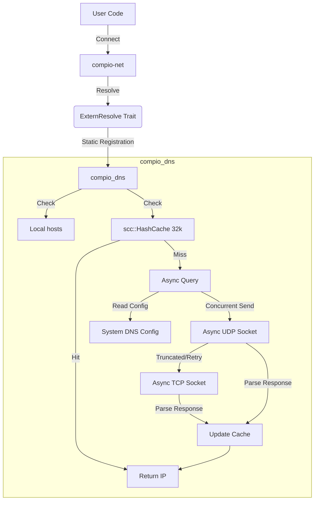

# compio_dns : Supercharged DNS Resolution for the compio Ecosystem

For financial high-frequency trading, every millisecond matters. `compio_dns` was born from the pursuit of extreme performance.

It seamlessly integrates into the `compio` ecosystem, non-intrusive, **allowing you to gain near-free performance acceleration without modifying any calling code**.

The default `compio` DNS resolution relies on `spawn_blocking` to call the synchronous `getaddrinfo` system call (similar to `tokio`).

This occupies thread pool resources.

`compio_dns` replaces the default thread-pool-based implementation, providing true fully asynchronous resolution capabilities. Coupled with domain resolution caching, it achieves **crushing performance improvements**!


## Usage

First, install the dependency:

```bash
cargo add compio_dns
```

Add the following to your `lib.rs` or `main.rs`:

```rust
extern crate compio_dns;
```

This ensures that `compio_dns` is compiled and registered during linking.

Finally, clean the compilation cache and rebuild with the `cfg` set to take effect (you must set `RUSTFLAGS` during compilation):

```bash
cargo clean -p compio-net
RUSTFLAGS="--cfg compio_dns $RUSTFLAGS" cargo build
```

For convenience, it is recommended to use [mise](https://github.com/jdx/mise/blob/main/README.md) to automatically set `RUSTFLAGS`.

For example, my `mise.toml` configuration is as follows:

```toml
[env]
RUSTFLAGS = "--cfg compio_dns {{ env.RUSTFLAGS }}"
```

## Key Features

- **Zero-Cost Abstraction**: Replaces the resolver implementation at compile time via `compio-net`'s `resolve_set!` macro, eliminating dynamic dispatch overhead.
- **Native Async**: Built on the `compio` runtime, utilizing `JoinHandle` and async tasks for non-blocking resolution.
- **Smart Cache**: Built-in `scc::HashCache` (32k capacity) with **TTL clamping** (min 60s, max 24h) and lazy eviction, significantly accelerating hot domain resolution.
- **System Integration**: Fully supports `/etc/hosts` and `/etc/resolv.conf`, including `search domain` and `ndots` policies, ensuring consistent system behavior.
- **High Availability**: Queries all Nameservers concurrently (Happy Eyeballs) and handles UDP truncation via **TCP Fallback** mechanism.
- **Custom Protocol Stack**: Pure Rust implementation of DNS protocol parsing, supporting zero-copy operations.

## Design Philosophy

The diagram below illustrates how `compio_dns` interacts with `compio-net` and its internal processing flow:



## Tech Stack

- **Runtime**: `compio-runtime`
- **IO & Buffer**: `compio-io`, `compio-buf`
- **Network**: `compio-net`
- **Concurrency & Cache**: `scc` (Scalable Concurrent Containers)
- **Static Initialization**: `static_init`
- **Hash Algorithm**: `rapidhash`
- **Binary Parsing**: `zerocopy`
- **Error Handling**: `thiserror`

## File Structure

```
.
├── bench/                  # Benchmark data and results
├── compio_dns_test/        # Performance testing project
├── readme/                 # Documentation resources and bilingual docs
├── src/
│   ├── cache.rs            # LRU cache implementation
│   ├── error.rs            # Error definitions
│   ├── extern.rs           # compio-net integration interface
│   ├── lib.rs              # Library entry and API exports
│   ├── os/                 # System config reading (hosts, resolv.conf)
│   ├── protocol/           # DNS protocol parsing and construction
│   └── resolve.rs          # Core resolution logic
├── svg.js                  # Benchmark chart generation script
└── ...
```

## API Reference

`compio_dns` is primarily invoked automatically by `compio-net` via `extern crate`, but it also exposes a few APIs for advanced usage.

### `use compio_dns::Resolve;`

The core resolver struct.

- **`Resolve::new() -> io::Result<Self>`**
  Creates a new resolver instance. Automatically loads system configuration.

- **`resolve.lookup(name: &str) -> io::Result<IntoIter<SocketAddr>>`**
  Performs domain resolution. Automatically handles hosts, caching, and recursive queries.

### `compio_dns::resolve_sock_addrs`

```rust
pub async fn resolve_sock_addrs(host: &str, port: u16) -> io::Result<IntoIter<SocketAddr>>
```
Convenience function to resolve a domain and attach a port, returning an iterator of `SocketAddr`.

### `compio_dns::DnsError`

Enumerates various DNS resolution errors, such as `ResolutionFailed`, `InvalidData`, etc.

## A Bit of History

In the early days of the Internet, the `HOSTS.TXT` file was maintained by the NIC at Stanford Research Institute (SRI). Every host on the network had to periodically download this single text file for name resolution. As the number of ARPANET hosts surged, this centralized management became unsustainable. In 1983, Paul Mockapetris invented DNS (Domain Name System), transforming domain management into a distributed hierarchical structure, solving the scalability problem once and for all. Today, `compio_dns` stands on the shoulders of giants, reinterpreting this ancient protocol with the asynchronous power of Rust for efficiency and elegance.