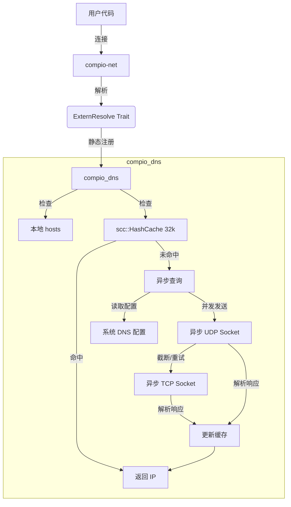

# compio_dns : compio 生态域名解析的超级加速

对应金融高频交易而言，每一毫秒都很重要，`compio_dns` 诞生于对极致性能的追求。

它能无缝集成到 `compio` 生态中， 非侵入式，**无需修改调用代码就可以获得近乎免费的性能加速**

`compio` DNS 解析默认依赖 `spawn_blocking` ，调用同步的 `getaddrinfo` 系统调用（类似 `tokio`）。

这占用了线程池资源。

`compio_dns` 替换默认的基于线程池的实现，提供真正的全异步解析能力。配合域名解析缓存，实现了**碾压级的性能提升**！


## 使用

先安装依赖:

```bash
cargo add compio_dns
```

`lib.rs` 或 `main.rs` 加上:

```rust
extern crate compio_dns;
```

这是用来确保 `compio_dns` 会被编译并在链接时注册。

最后，清理编译缓存并设置 `cfg` 重新编译即可生效（编译时要设置 `RUSTFLAGS`）。

```bash
cargo clean -p compio-net
RUSTFLAGS="--cfg compio_dns $RUSTFLAGS" cargo build
```

为了方便，建议配合 [mise](https://github.com/jdx/mise/blob/main/README.md) 实现自动设置 `RUSTFLAGS`。

比如，我的 `mise.toml` 配置如下:

```toml
[env]
RUSTFLAGS = "--cfg compio_dns {{ env.RUSTFLAGS }}"
```

## 特性介绍

- **零开销抽象**：借由 `compio-net` 的 `resolve_set!` 宏，直接在编译期替换解析器实现，无动态分发开销。
- **原生异步**：基于 `compio` 运行时构建，利用 `JoinHandle` 和异步任务实现非阻塞解析。
- **智能缓存**：内置 `scc::HashCache` (容量 32k)，支持 **TTL 钳制** (最小 60s，最大 24h) 和惰性淘汰，显著加速热点域名解析。
- **系统集成**：完整支持 `/etc/hosts`、`/etc/resolv.conf`，包括 `search domain` 和 `ndots` 策略，行为与系统一致。
- **高可用设计**：并发查询所有 Nameserver (Happy Eyeballs)，并通过 **TCP 回退** 机制处理 UDP 截断响应。
- **自研协议栈**：纯 Rust 实现的 DNS 协议解析，支持零拷贝操作。

## 设计思路

下图展示了 `compio_dns` 如何与 `compio-net` 交互以及内部处理流程：



## 技术堆栈

- **运行时**: `compio-runtime`
- **IO & Buffer**: `compio-io`, `compio-buf`
- **网络**: `compio-net`
- **并发锁与缓存**: `scc` (Scalable Concurrent Containers)
- **静态初始化**: `static_init`
- **哈希算法**: `rapidhash`
- **二进制解析**: `zerocopy`
- **错误处理**: `thiserror`

## 目录结构

```
.
├── bench/                  # 基准测试数据与结果
├── compio_dns_test/        # 性能测试专用项目
├── readme/                 # 文档资源与双语文档
├── src/
│   ├── cache.rs            # LRU 缓存实现
│   ├── error.rs            # 错误定义
│   ├── extern.rs           # compio-net 集成接口
│   ├── lib.rs              # 库入口与 API 导出
│   ├── os/                 # 系统配置读取 (hosts, resolv.conf)
│   ├── protocol/           # DNS 协议解析与构建
│   └── resolve.rs          # 核心解析逻辑
├── svg.js                  # Benchmark 图表生成脚本
└── ...
```

## API 说明

`compio_dns` 主要通过 `extern crate` 方式被 `compio-net` 自动调用，但也暴露了少量 API 供高级使用。

### `use compio_dns::Resolve;`

核心解析器结构体。

- **`Resolve::new() -> io::Result<Self>`**
  创建新的解析器实例。会自动加载系统配置。

- **`resolve.lookup(name: &str) -> io::Result<IntoIter<SocketAddr>>`**
  执行域名解析。会自动处理 hosts、缓存、递归查询。

### `compio_dns::resolve_sock_addrs`

```rust
pub async fn resolve_sock_addrs(host: &str, port: u16) -> io::Result<IntoIter<SocketAddr>>
```
便捷函数，解析域名并附加端口，返回 `SocketAddr` 迭代器。

### `compio_dns::DnsError`

枚举了各类 DNS 解析错误，如 `ResolutionFailed`, `InvalidData` 等。

## 历史小故事

在早期的互联网时代，HOSTS. TXT 文件由斯坦福研究院 (SRI) 的 NIC 维护，网络中的每台主机都需要定期下载更新这个单一的文本文件以进行名称解析。随着 ARPANET 主机数量的激增，这种集中式管理变得不可持续。1983 年，Paul Mockapetris 发明了 DNS (Domain Name System)，将域名管理变成了分布式的层级结构，彻底解决了扩展性问题。今天，`compio_dns` 站在巨人的肩膀上，用 Rust 的异步力量重新诠释了这一古老协议的高效与优雅。