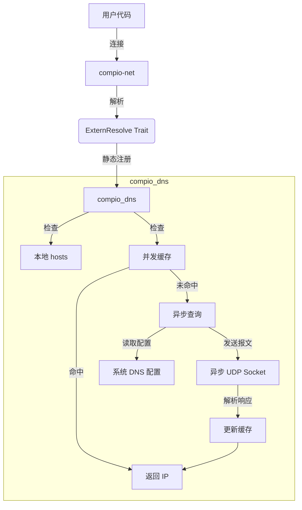

# compio_dns : 零开销带缓存的异步 DNS 解析器

`compio_dns` 为 `compio` 生态系统提供了一个高性能的异步 DNS 解析器。

它能无缝集成到 `compio-net` 中，替换默认的基于线程池的实现，提供真正的全异步解析能力。


`compio` DNS 解析依赖 `spawn_blocking` 调用同步的 `getaddrinfo` 系统调用（类似 `tokio`）。

这占用了线程池资源。

对应金融高频交易而言，每一毫秒都很重要！

`compio_dns` 诞生于对极致性能的追求——通过纯 Rust 实现全异步解析，实现了编译期替换且零运行时开销的插件化设计, 性能提升巨大， 非侵入式集成，**无需修改调用代码就可以获得近乎免费的性能加速**。

## 使用

先安装依赖:

```bash
cargo add compio_dns
```

`lib.rs` 或 `main.rs` 加上:

```rust
extern crate compio_dns;
```

这是用来确保 `compio_dns` 会被编译并在链接时注册。

最后，清理编译缓存并设置 `cfg` 重新编译即可生效：

```bash
cargo clean -p compio-net
RUSTFLAGS="--cfg compio_dns $RUSTFLAGS" cargo build
```

编译要设置 `RUSTFLAGS`。

为了方便，建议配合 [mise](https://github.com/jdx/mise/blob/main/README.md) 使用。

比如，我的 `mise.toml` 配置如下:

```toml
[env]
RUSTFLAGS = "--cfg compio_dns {{ env.RUSTFLAGS }}"
```


## 特性

- **零开销抽象**：借由 `compio-net` 的 `resolve_set!` 宏，直接在编译期替换解析器实现，无动态分发开销。
- **原生异步**：基于 `compio` 运行时构建，利用 `JoinHandle` 和异步任务实现非阻塞解析。
- **智能缓存**：内置基于 `scc` 的高性能并发缓存，采用 `static_init` 动态初始化，显著加速重复查询。
- **系统集成**：正确解析 `/etc/hosts` 和系统 DNS 配置，确保行为与系统一致。
- **自研协议栈**：纯 Rust 实现的 DNS 协议解析，支持零拷贝操作。

## 🧩 架构设计

下图展示了 `compio_dns` 如何与 `compio-net` 交互：



## 技术栈

- **运行时**: `compio-runtime`
- **网络**: `compio-net`
- **并发锁与缓存**: `scc` (Scalable Concurrent Containers)
- **静态初始化**: `static_init`
- **哈希算法**: `rapidhash`
- **二进制解析**: `zerocopy`
- **错误处理**: `thiserror`