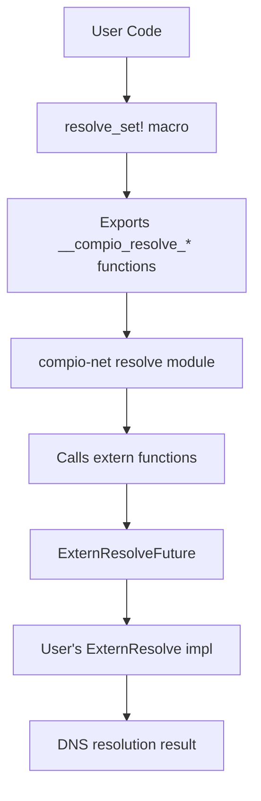
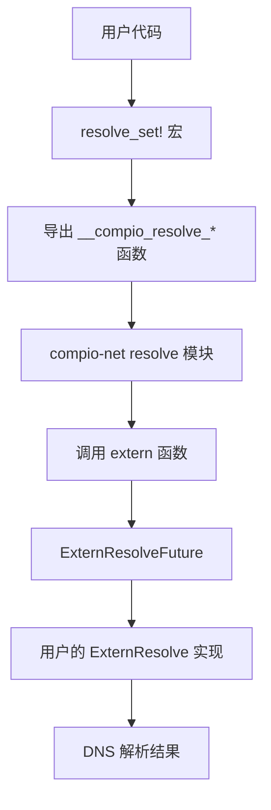

[English](#en) | [中文](#zh)

---

<a id="en"></a>

# compio_net_extern_resolve : Plug custom async DNS resolvers into compio

> Please use with [compio_dns](https://crates.io/crates/compio_dns).

## Table of Contents

- [Introduction](#introduction)
- [Usage](#usage)
- [Features](#features)
- [Design](#design)
- [Tech Stack](#tech-stack)
- [Directory Structure](#directory-structure)
- [API Reference](#api-reference)
- [Historical Note](#historical-note)

## Introduction

This crate enables integration of custom async DNS resolvers into the compio networking ecosystem. 

compio is a thread-per-core async runtime. Its default DNS resolution spawns blocking tasks on Unix or uses Windows native async APIs. This crate provides a mechanism to replace the built-in resolver with any implementation that satisfies the `ExternResolve` trait.

The approach uses extern "Rust" ABI functions and compile-time trait verification, achieving zero runtime overhead while maintaining type safety.

## Usage

### Setup

Enable the `compio_dns` cfg flag during compilation:

```bash
export RUSTFLAGS="--cfg compio_dns"
```

Or configure in `mise.toml`:

```toml
[env]
RUSTFLAGS = "--cfg compio_dns {{ env.RUSTFLAGS }}"
```

### Implement Custom Resolver

Define a resolver struct and implement the `ExternResolve` trait:

```rust
use std::{
  io,
  net::SocketAddr,
  task::{Poll, Waker},
};

struct MyResolver {
  // Internal state for async resolution
}

impl compio_net_extern_resolve::ExternResolve for MyResolver {
  fn new(host: &str, port: u16) -> Self {
    // Initiate async DNS query
    Self { /* ... */ }
  }

  fn poll(&mut self, waker: &Waker) -> Poll<io::Result<Vec<SocketAddr>>> {
    // Check completion status
    // Return Poll::Pending and store waker if not ready
    // Call waker.wake() when resolution completes
    todo!()
  }
}
```

### Register Resolver

Use the `resolve_set!` macro to register:

```rust
compio_net::resolve_set!(MyResolver);
```

After registration, compio's networking APIs will use your resolver for all DNS queries.

## Features

- **Zero Overhead**: No virtual function calls or heap allocations beyond what the resolver itself requires
- **Compile-Time Safety**: Missing trait implementations produce clear compiler errors, not linker failures
- **ABI Stability**: Uses stable extern "Rust" ABI for cross-crate integration
- **Build-Time Patching**: Automatically patches compio-net dependency at compile time

## Design



### Call Flow

1. Build script locates `compio-net` crate via `cargo metadata`
2. Patcher copies `extern_resolve.rs` into compio-net's source tree
3. Patcher modifies `resolve/mod.rs` to conditionally include the module
4. Patcher exposes `resolve` module publicly in `lib.rs`
5. At runtime, compio calls `resolve_sock_addrs` which uses extern functions
6. User's `ExternResolve` implementation handles the actual DNS query

### Trait Contract

The `ExternResolve` trait defines three operations:

| Function | Purpose |
|----------|---------|
| `new(host, port)` | Create resolver state and initiate query |
| `poll(waker)` | Check completion, register waker if pending |
| `drop` (implicit) | Clean up resources |

## Tech Stack

| Category | Technology |
|----------|------------|
| Runtime | compio (thread-per-core) |
| Serialization | sonic-rs |
| Error Handling | thiserror |
| Build Dependencies | serde |

## Directory Structure

```
compio_net_extern_resolve/
├── build.rs           # Build script for patching compio-net
├── Cargo.toml
├── src/
│   ├── lib.rs         # Module exports
│   └── extern_resolve.rs  # Core trait and macro definitions
└── readme/
    ├── en.md
    └── zh.md
```

## API Reference

### Trait: `ExternResolve`

```rust
pub trait ExternResolve {
  fn new(host: &str, port: u16) -> Self;
  fn poll(&mut self, waker: &Waker) -> Poll<io::Result<Vec<SocketAddr>>>;
}
```

Contract for custom async DNS resolvers.

**Methods:**

- `new(host, port)` — Creates a new resolver instance. The implementation should initiate the DNS query immediately.
- `poll(waker)` — Polls for completion. Returns `Poll::Pending` if not ready, storing the waker for later notification. Returns `Poll::Ready(Ok(...))` with resolved addresses on success, or `Poll::Ready(Err(...))` on failure.

### Macro: `resolve_set!`

```rust
resolve_set!($resolver:ty);
```

Registers a custom resolver type. Performs compile-time verification that the type implements `ExternResolve`, then exports the required extern functions.

### Function: `resolve_sock_addrs`

```rust
pub async fn resolve_sock_addrs(host: &str, port: u16) -> io::Result<std::vec::IntoIter<SocketAddr>>;
```

Resolves a hostname to socket addresses. Used internally by compio's networking APIs.

## Historical Note

The Domain Name System was invented by Paul Mockapetris in 1983 at USC's Information Sciences Institute. Before DNS, the ARPANET relied on a single HOSTS.TXT file maintained at SRI International. As the network grew beyond a few hundred hosts, this centralized approach became unsustainable.

Mockapetris designed DNS as a distributed, hierarchical system. His first implementation, called "Jeeves," became the foundation for modern name resolution. The design elegantly separated the namespace management from the actual lookup mechanism — a principle that echoes in this crate's design, where the resolution strategy is pluggable rather than hardcoded.

Interestingly, Mockapetris initially proposed a much simpler system. The hierarchical structure we know today emerged through collaboration with Jon Postel, who recognized that the explosive growth of networks would require delegated administration. This foresight proved correct: DNS now handles over 300 billion queries per day across millions of domains.

---

## About

This project is an open-source component of [js0.site ⋅ Refactoring the Internet Plan](https://js0.site).

We are redefining the development paradigm of the Internet in a componentized way. Welcome to follow us:

* [Google Group](https://groups.google.com/g/js0-site)
* [js0site.bsky.social](https://bsky.app/profile/js0site.bsky.social)

---

<a id="zh"></a>

# compio_net_extern_resolve : 将自定义异步 DNS 解析器接入 compio

> 请配合 [compio_dns](https://crates.io/crates/compio_dns) 使用。

## 目录

- [简介](#简介)
- [使用方法](#使用方法)
- [特性](#特性)
- [设计思路](#设计思路)
- [技术栈](#技术栈)
- [目录结构](#目录结构)
- [API 说明](#api-说明)
- [历史轶事](#历史轶事)

## 简介

本 crate 支持将自定义异步 DNS 解析器集成到 compio 网络生态中。

compio 是线程每核心的异步运行时。其默认 DNS 解析在 Unix 上通过阻塞任务池实现，在 Windows 上使用原生异步 API。本 crate 提供机制将内置解析器替换为任意实现了 `ExternResolve` trait 的实现。

该方案使用 extern "Rust" ABI 函数和编译期 trait 验证，在保持类型安全的同时实现零运行时开销。

## 使用方法

### 配置环境

编译时启用 `compio_dns` cfg 标志：

```bash
export RUSTFLAGS="--cfg compio_dns"
```

或在 `mise.toml` 中配置：

```toml
[env]
RUSTFLAGS = "--cfg compio_dns {{ env.RUSTFLAGS }}"
```

### 实现自定义解析器

定义解析器结构体并实现 `ExternResolve` trait：

```rust
use std::{
  io,
  net::SocketAddr,
  task::{Poll, Waker},
};

struct MyResolver {
  // 异步解析的内部状态
}

impl compio_net_extern_resolve::ExternResolve for MyResolver {
  fn new(host: &str, port: u16) -> Self {
    // 启动异步 DNS 查询
    Self { /* ... */ }
  }

  fn poll(&mut self, waker: &Waker) -> Poll<io::Result<Vec<SocketAddr>>> {
    // 检查完成状态
    // 若未就绪则返回 Poll::Pending 并存储 waker
    // 解析完成时调用 waker.wake()
    todo!()
  }
}
```

### 注册解析器

使用 `resolve_set!` 宏注册：

```rust
compio_net::resolve_set!(MyResolver);
```

注册后，compio 的网络 API 将使用自定义解析器进行所有 DNS 查询。

## 特性

- **零开销**：无虚函数调用，除解析器自身外无额外堆分配
- **编译期安全**：缺失 trait 实现产生清晰的编译错误，而非链接错误
- **ABI 稳定**：使用稳定的 extern "Rust" ABI 实现跨 crate 集成
- **编译期注入**：在编译时自动修补 compio-net 依赖

## 设计思路



### 调用流程

1. 构建脚本通过 `cargo metadata` 定位 `compio-net` crate
2. Patcher 将 `extern_resolve.rs` 复制到 compio-net 源码树
3. Patcher 修改 `resolve/mod.rs`，条件性地包含该模块
4. Patcher 在 `lib.rs` 中公开 `resolve` 模块
5. 运行时，compio 调用 `resolve_sock_addrs`，使用 extern 函数
6. 用户的 `ExternResolve` 实现处理实际的 DNS 查询

### Trait 契约

`ExternResolve` trait 定义了三种操作：

| 函数 | 用途 |
|------|------|
| `new(host, port)` | 创建解析器状态并启动查询 |
| `poll(waker)` | 检查完成状态，若未就绪则注册 waker |
| `drop`（隐式） | 清理资源 |

## 技术栈

| 类别 | 技术 |
|------|------|
| 运行时 | compio（线程每核心） |
| 序列化 | sonic-rs |
| 错误处理 | thiserror |
| 构建依赖 | serde |

## 目录结构

```
compio_net_extern_resolve/
├── build.rs           # 用于修补 compio-net 的构建脚本
├── Cargo.toml
├── src/
│   ├── lib.rs         # 模块导出
│   └── extern_resolve.rs  # 核心 trait 和宏定义
└── readme/
    ├── en.md
    └── zh.md
```

## API 说明

### Trait: `ExternResolve`

```rust
pub trait ExternResolve {
  fn new(host: &str, port: u16) -> Self;
  fn poll(&mut self, waker: &Waker) -> Poll<io::Result<Vec<SocketAddr>>>;
}
```

自定义异步 DNS 解析器的契约。

**方法：**

- `new(host, port)` — 创建新的解析器实例。实现应立即启动 DNS 查询。
- `poll(waker)` — 轮询完成状态。未就绪时返回 `Poll::Pending` 并存储 waker 以便后续通知。成功时返回 `Poll::Ready(Ok(...))` 包含解析的地址，失败时返回 `Poll::Ready(Err(...))`。

### Macro: `resolve_set!`

```rust
resolve_set!($resolver:ty);
```

注册自定义解析器类型。执行编译期验证确保类型实现了 `ExternResolve`，然后导出所需的 extern 函数。

### Function: `resolve_sock_addrs`

```rust
pub async fn resolve_sock_addrs(host: &str, port: u16) -> io::Result<std::vec::IntoIter<SocketAddr>>;
```

将主机名解析为套接字地址。由 compio 网络 API 内部使用。

## 历史轶事

域名系统（DNS）由 Paul Mockapetris 于 1983 年在南加州大学信息科学研究所发明。在 DNS 出现之前，ARPANET 依赖由 SRI International 维护的单一 HOSTS.TXT 文件。当网络规模增长到数百台主机时，这种集中式方案变得不可持续。

Mockapetris 将 DNS 设计为分布式、层次化的系统。他的第一个实现名为 "Jeeves"，成为现代名称解析的基础。该设计优雅地将命名空间管理与实际查询机制分离——这一原则在本 crate 的设计中亦有呼应，解析策略可插拔而非硬编码。

有趣的是，Mockapetris 最初提出的系统要简单得多。我们今天熟知的层次结构是通过与 Jon Postel 的协作形成的，Postel 认识到网络的爆炸式增长需要委托管理。这一远见已被证明正确：DNS 现在每天处理超过 3000 亿次查询，覆盖数百万个域名。

---

## 关于

本项目为 [js0.site ⋅ 重构互联网计划](https://js0.site) 的开源组件。

我们正在以组件化的方式重新定义互联网的开发范式，欢迎关注：

* [谷歌邮件列表](https://groups.google.com/g/js0-site)
* [js0site.bsky.social](https://bsky.app/profile/js0site.bsky.social)
