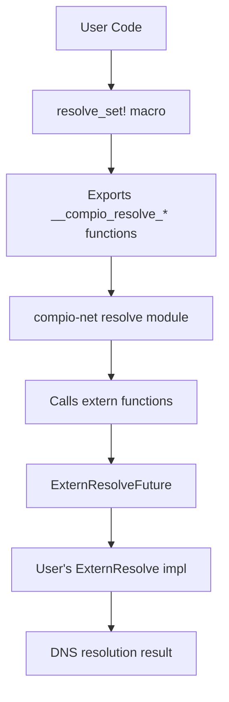

# compio_net_extern_resolve : Plug custom async DNS resolvers into compio

> Please use with [compio_dns](https://crates.io/crates/compio_dns).

## Table of Contents

- [Introduction](#introduction)
- [Usage](#usage)
- [Features](#features)
- [Design](#design)
- [Tech Stack](#tech-stack)
- [Directory Structure](#directory-structure)
- [API Reference](#api-reference)
- [Historical Note](#historical-note)

## Introduction

This crate enables integration of custom async DNS resolvers into the compio networking ecosystem. 

compio is a thread-per-core async runtime. Its default DNS resolution spawns blocking tasks on Unix or uses Windows native async APIs. This crate provides a mechanism to replace the built-in resolver with any implementation that satisfies the `ExternResolve` trait.

The approach uses extern "Rust" ABI functions and compile-time trait verification, achieving zero runtime overhead while maintaining type safety.

## Usage

### Setup

Enable the `compio_dns` cfg flag during compilation:

```bash
export RUSTFLAGS="--cfg compio_dns"
```

Or configure in `mise.toml`:

```toml
[env]
RUSTFLAGS = "--cfg compio_dns {{ env.RUSTFLAGS }}"
```

### Implement Custom Resolver

Define a resolver struct and implement the `ExternResolve` trait:

```rust
use std::{
  io,
  net::SocketAddr,
  task::{Poll, Waker},
};

struct MyResolver {
  // Internal state for async resolution
}

impl compio_net_extern_resolve::ExternResolve for MyResolver {
  fn new(host: &str, port: u16) -> Self {
    // Initiate async DNS query
    Self { /* ... */ }
  }

  fn poll(&mut self, waker: &Waker) -> Poll<io::Result<Vec<SocketAddr>>> {
    // Check completion status
    // Return Poll::Pending and store waker if not ready
    // Call waker.wake() when resolution completes
    todo!()
  }
}
```

### Register Resolver

Use the `resolve_set!` macro to register:

```rust
compio_net::resolve_set!(MyResolver);
```

After registration, compio's networking APIs will use your resolver for all DNS queries.

## Features

- **Zero Overhead**: No virtual function calls or heap allocations beyond what the resolver itself requires
- **Compile-Time Safety**: Missing trait implementations produce clear compiler errors, not linker failures
- **ABI Stability**: Uses stable extern "Rust" ABI for cross-crate integration
- **Build-Time Patching**: Automatically patches compio-net dependency at compile time

## Design



### Call Flow

1. Build script locates `compio-net` crate via `cargo metadata`
2. Patcher copies `extern_resolve.rs` into compio-net's source tree
3. Patcher modifies `resolve/mod.rs` to conditionally include the module
4. Patcher exposes `resolve` module publicly in `lib.rs`
5. At runtime, compio calls `resolve_sock_addrs` which uses extern functions
6. User's `ExternResolve` implementation handles the actual DNS query

### Trait Contract

The `ExternResolve` trait defines three operations:

| Function | Purpose |
|----------|---------|
| `new(host, port)` | Create resolver state and initiate query |
| `poll(waker)` | Check completion, register waker if pending |
| `drop` (implicit) | Clean up resources |

## Tech Stack

| Category | Technology |
|----------|------------|
| Runtime | compio (thread-per-core) |
| Serialization | sonic-rs |
| Error Handling | thiserror |
| Build Dependencies | serde |

## Directory Structure

```
compio_net_extern_resolve/
├── build.rs           # Build script for patching compio-net
├── Cargo.toml
├── src/
│   ├── lib.rs         # Module exports
│   └── extern_resolve.rs  # Core trait and macro definitions
└── readme/
    ├── en.md
    └── zh.md
```

## API Reference

### Trait: `ExternResolve`

```rust
pub trait ExternResolve {
  fn new(host: &str, port: u16) -> Self;
  fn poll(&mut self, waker: &Waker) -> Poll<io::Result<Vec<SocketAddr>>>;
}
```

Contract for custom async DNS resolvers.

**Methods:**

- `new(host, port)` — Creates a new resolver instance. The implementation should initiate the DNS query immediately.
- `poll(waker)` — Polls for completion. Returns `Poll::Pending` if not ready, storing the waker for later notification. Returns `Poll::Ready(Ok(...))` with resolved addresses on success, or `Poll::Ready(Err(...))` on failure.

### Macro: `resolve_set!`

```rust
resolve_set!($resolver:ty);
```

Registers a custom resolver type. Performs compile-time verification that the type implements `ExternResolve`, then exports the required extern functions.

### Function: `resolve_sock_addrs`

```rust
pub async fn resolve_sock_addrs(host: &str, port: u16) -> io::Result<std::vec::IntoIter<SocketAddr>>;
```

Resolves a hostname to socket addresses. Used internally by compio's networking APIs.

## Historical Note

The Domain Name System was invented by Paul Mockapetris in 1983 at USC's Information Sciences Institute. Before DNS, the ARPANET relied on a single HOSTS.TXT file maintained at SRI International. As the network grew beyond a few hundred hosts, this centralized approach became unsustainable.

Mockapetris designed DNS as a distributed, hierarchical system. His first implementation, called "Jeeves," became the foundation for modern name resolution. The design elegantly separated the namespace management from the actual lookup mechanism — a principle that echoes in this crate's design, where the resolution strategy is pluggable rather than hardcoded.

Interestingly, Mockapetris initially proposed a much simpler system. The hierarchical structure we know today emerged through collaboration with Jon Postel, who recognized that the explosive growth of networks would require delegated administration. This foresight proved correct: DNS now handles over 300 billion queries per day across millions of domains.
