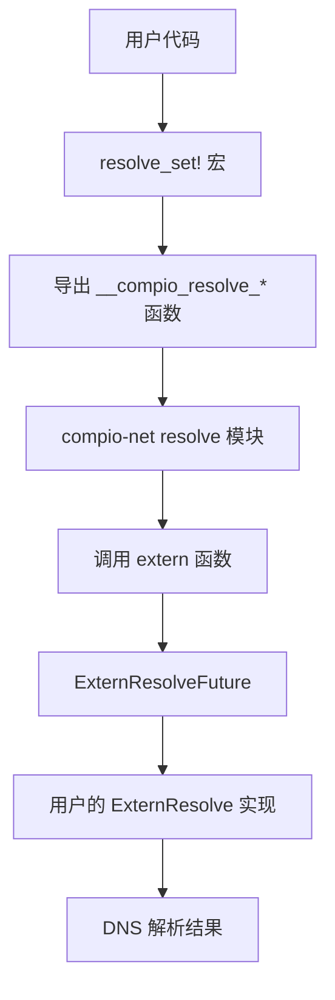

# compio_net_extern_resolve : 将自定义异步 DNS 解析器接入 compio

> 请配合 [compio_dns](https://crates.io/crates/compio_dns) 使用。

## 目录

- [简介](#简介)
- [使用方法](#使用方法)
- [特性](#特性)
- [设计思路](#设计思路)
- [技术栈](#技术栈)
- [目录结构](#目录结构)
- [API 说明](#api-说明)
- [历史轶事](#历史轶事)

## 简介

本 crate 支持将自定义异步 DNS 解析器集成到 compio 网络生态中。

compio 是线程每核心的异步运行时。其默认 DNS 解析在 Unix 上通过阻塞任务池实现，在 Windows 上使用原生异步 API。本 crate 提供机制将内置解析器替换为任意实现了 `ExternResolve` trait 的实现。

该方案使用 extern "Rust" ABI 函数和编译期 trait 验证，在保持类型安全的同时实现零运行时开销。

## 使用方法

### 配置环境

编译时启用 `compio_dns` cfg 标志：

```bash
export RUSTFLAGS="--cfg compio_dns"
```

或在 `mise.toml` 中配置：

```toml
[env]
RUSTFLAGS = "--cfg compio_dns {{ env.RUSTFLAGS }}"
```

### 实现自定义解析器

定义解析器结构体并实现 `ExternResolve` trait：

```rust
use std::{
  io,
  net::SocketAddr,
  task::{Poll, Waker},
};

struct MyResolver {
  // 异步解析的内部状态
}

impl compio_net_extern_resolve::ExternResolve for MyResolver {
  fn new(host: &str, port: u16) -> Self {
    // 启动异步 DNS 查询
    Self { /* ... */ }
  }

  fn poll(&mut self, waker: &Waker) -> Poll<io::Result<Vec<SocketAddr>>> {
    // 检查完成状态
    // 若未就绪则返回 Poll::Pending 并存储 waker
    // 解析完成时调用 waker.wake()
    todo!()
  }
}
```

### 注册解析器

使用 `resolve_set!` 宏注册：

```rust
compio_net::resolve_set!(MyResolver);
```

注册后，compio 的网络 API 将使用自定义解析器进行所有 DNS 查询。

## 特性

- **零开销**：无虚函数调用，除解析器自身外无额外堆分配
- **编译期安全**：缺失 trait 实现产生清晰的编译错误，而非链接错误
- **ABI 稳定**：使用稳定的 extern "Rust" ABI 实现跨 crate 集成
- **编译期注入**：在编译时自动修补 compio-net 依赖

## 设计思路



### 调用流程

1. 构建脚本通过 `cargo metadata` 定位 `compio-net` crate
2. Patcher 将 `extern_resolve.rs` 复制到 compio-net 源码树
3. Patcher 修改 `resolve/mod.rs`，条件性地包含该模块
4. Patcher 在 `lib.rs` 中公开 `resolve` 模块
5. 运行时，compio 调用 `resolve_sock_addrs`，使用 extern 函数
6. 用户的 `ExternResolve` 实现处理实际的 DNS 查询

### Trait 契约

`ExternResolve` trait 定义了三种操作：

| 函数 | 用途 |
|------|------|
| `new(host, port)` | 创建解析器状态并启动查询 |
| `poll(waker)` | 检查完成状态，若未就绪则注册 waker |
| `drop`（隐式） | 清理资源 |

## 技术栈

| 类别 | 技术 |
|------|------|
| 运行时 | compio（线程每核心） |
| 序列化 | sonic-rs |
| 错误处理 | thiserror |
| 构建依赖 | serde |

## 目录结构

```
compio_net_extern_resolve/
├── build.rs           # 用于修补 compio-net 的构建脚本
├── Cargo.toml
├── src/
│   ├── lib.rs         # 模块导出
│   └── extern_resolve.rs  # 核心 trait 和宏定义
└── readme/
    ├── en.md
    └── zh.md
```

## API 说明

### Trait: `ExternResolve`

```rust
pub trait ExternResolve {
  fn new(host: &str, port: u16) -> Self;
  fn poll(&mut self, waker: &Waker) -> Poll<io::Result<Vec<SocketAddr>>>;
}
```

自定义异步 DNS 解析器的契约。

**方法：**

- `new(host, port)` — 创建新的解析器实例。实现应立即启动 DNS 查询。
- `poll(waker)` — 轮询完成状态。未就绪时返回 `Poll::Pending` 并存储 waker 以便后续通知。成功时返回 `Poll::Ready(Ok(...))` 包含解析的地址，失败时返回 `Poll::Ready(Err(...))`。

### Macro: `resolve_set!`

```rust
resolve_set!($resolver:ty);
```

注册自定义解析器类型。执行编译期验证确保类型实现了 `ExternResolve`，然后导出所需的 extern 函数。

### Function: `resolve_sock_addrs`

```rust
pub async fn resolve_sock_addrs(host: &str, port: u16) -> io::Result<std::vec::IntoIter<SocketAddr>>;
```

将主机名解析为套接字地址。由 compio 网络 API 内部使用。

## 历史轶事

域名系统（DNS）由 Paul Mockapetris 于 1983 年在南加州大学信息科学研究所发明。在 DNS 出现之前，ARPANET 依赖由 SRI International 维护的单一 HOSTS.TXT 文件。当网络规模增长到数百台主机时，这种集中式方案变得不可持续。

Mockapetris 将 DNS 设计为分布式、层次化的系统。他的第一个实现名为 "Jeeves"，成为现代名称解析的基础。该设计优雅地将命名空间管理与实际查询机制分离——这一原则在本 crate 的设计中亦有呼应，解析策略可插拔而非硬编码。

有趣的是，Mockapetris 最初提出的系统要简单得多。我们今天熟知的层次结构是通过与 Jon Postel 的协作形成的，Postel 认识到网络的爆炸式增长需要委托管理。这一远见已被证明正确：DNS 现在每天处理超过 3000 亿次查询，覆盖数百万个域名。
