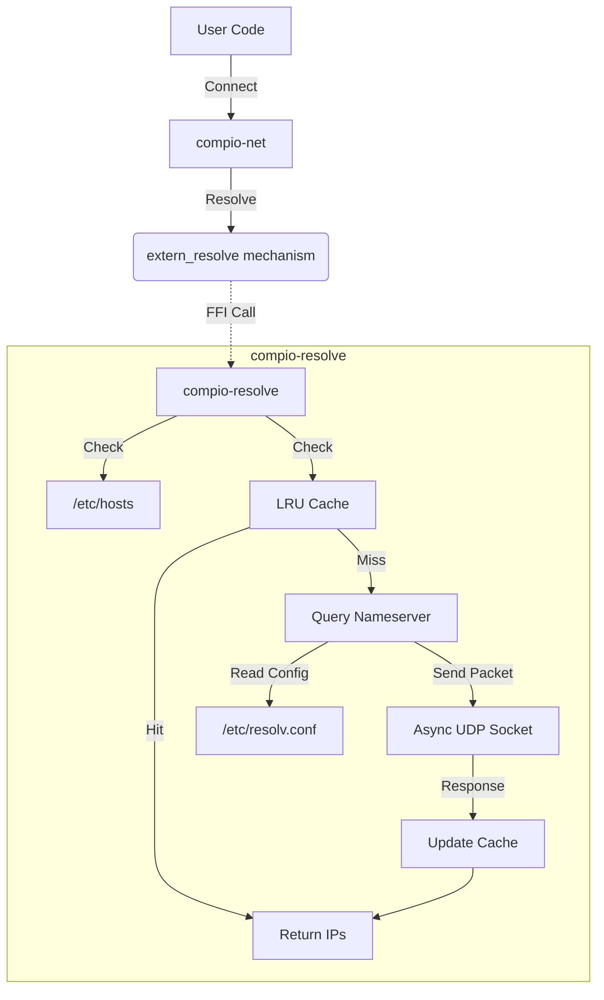

# compio-resolve : Zero-cost Async DNS Resolver with Cache

`compio-resolve` provides a high-performance, asynchronous DNS resolver for the `compio` ecosystem. It integrates seamlessly with `compio-net` to provide custom DNS resolution capabilities, replacing the default thread-pool based implementation with a true async approach.

## ✨ Features

- **Zero-Cost Abstraction**: Uses `extern "Rust"` FFI to plug into `compio-net` without dynamic dispatch (`dyn`).
- **Async Native**: Built on `compio` runtime, efficient and non-blocking.
- **Smart Caching**: Built-in LRU cache (enabled by default) for high-speed repeated lookups.
- **System Integrated**: Reads `/etc/hosts` and `/etc/resolv.conf` (on Unix) for correct resolution.

## 📦 Installation

Add this to your `Cargo.toml`:

```toml
[dependencies]
compio-resolve = "0.1"
```

**Note**: Adding this crate will automatically enable the `extern_resolve` feature in `compio-net`, causing `compio` to use this resolver instead of the default one.

## 🚀 Usage

**CRITICAL**: You MUST explicitly import `compio_resolve` in your crate root (`lib.rs` or `main.rs`) to ensure the linker includes the resolver symbols.

```rust
// main.rs or lib.rs
// ⚠️ Must import compio_resolve to ensure symbols are linked
extern crate compio_resolve;

fn main() {
    compio::task::block_on(async {
        let stream = compio::net::TcpStream::connect("google.com:80").await.unwrap();
        // ... use stream
    });
}
```

If you don't do this, the linker might discard `compio_resolve` as "unused", leading to a "symbol not found" error or fallback to the (disabled) default resolver depending on configuration.

## 🧩 Architecture

The following diagram illustrates how `compio-resolve` integrates with `compio-net`:



## 🛠️ Tech Stack

- **Runtime**: `compio-runtime`
- **Networking**: `compio-net` (UDP/TCP)
- **Caching**: `scc` (Scalable Concurrent Containers) for high-performance concurrent LRU cache.
- **Parsing**: `logos` (lexer), `zerocopy` (zero-copy parsing).

## 📜 History & Trivia

In the early days of `compio`, DNS resolution relied on `spawn_blocking` to call the synchronous `getaddrinfo` syscall (similar to `tokio`). While robust, this consumed thread pool resources. `compio-resolve` was born from the desire to implement a pure-Rust, fully async resolver that could be swapped in at compile time with zero runtime overhead—achieved through some clever FFI tricks and compile-time assertions!