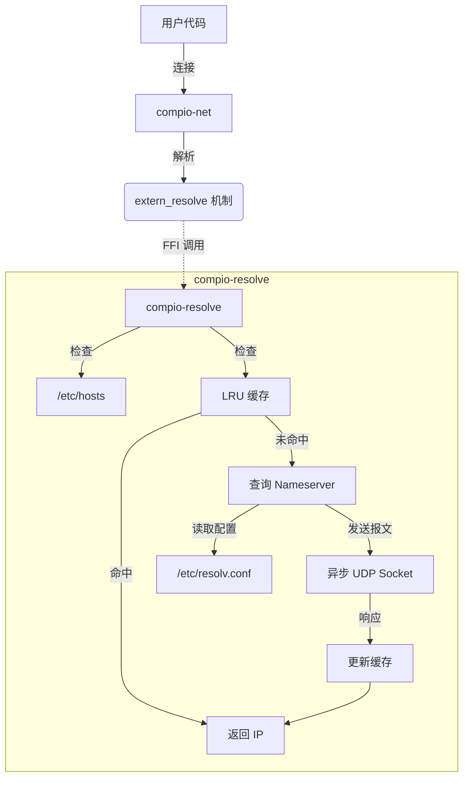

# compio-resolve : 零开销带缓存的异步 DNS 解析器

`compio-resolve` 为 `compio` 生态系统提供了一个高性能的异步 DNS 解析器。它能无缝集成到 `compio-net` 中，替换默认的基于线程池的实现，提供真正的全异步解析能力。

## ✨ 特性

- **零开销抽象**：使用 `extern "Rust"` FFI 接入 `compio-net`，无动态分发（无 `dyn`）。
- **原生异步**：基于 `compio` 运行时构建，高效非阻塞。
- **智能缓存**：内置 LRU 缓存（默认启用），显著加速重复查询。
- **系统集成**：正确读取 `/etc/hosts` 和 `/etc/resolv.conf` (Unix) 以符合系统行为。

## 📦 安装

在 `Cargo.toml` 中添加：

```toml
[dependencies]
compio-resolve = "0.1"
```

**注意**：引入此 crate 会自动启用 `compio-net` 的 `extern_resolve` 特性，使 `compio` 在链接时使用本解析器。

## 🚀 使用方法

**重要**：你必须在 crate 根文件（`lib.rs` 或 `main.rs`）中显式引入 `compio_resolve`，以确保链接器包含解析器符号。

```rust
// main.rs 或 lib.rs
// ⚠️ 必须引入 compio_resolve，确保 resolve_set! 生成的符号被链接
extern crate compio_resolve;

fn main() {
    compio::task::block_on(async {
        // 无需修改代码，compio::net 会自动使用 compio-resolve
        let stream = compio::net::TcpStream::connect("google.com:80").await.unwrap();
        // ... 使用 stream
    });
}
```

如果不这样做，链接器可能会将 `compio_resolve` 视为“未使用”而丢弃，导致符号未找到错误。

## 🧩 架构设计

下图展示了 `compio-resolve` 如何与 `compio-net` 交互：



## 🛠️ 技术栈

- **运行时**: `compio-runtime`
- **网络**: `compio-net` (UDP/TCP)
- **缓存**: `scc` (Scalable Concurrent Containers) 实现高性能并发 LRU 缓存。
- **解析**: `logos` (词法分析), `zerocopy` (零拷贝解析)。

## 📜 历史与趣闻

在 `compio` 早期，DNS 解析依赖 `spawn_blocking` 调用同步的 `getaddrinfo` 系统调用（类似 `tokio`）。虽然稳健，但这占用了线程池资源。`compio-resolve` 诞生于对极致性能的追求——通过纯 Rust 实现全异步解析，并通过巧妙的 FFI 技巧和编译时断言，实现了编译期替换且零运行时开销的插件化设计！