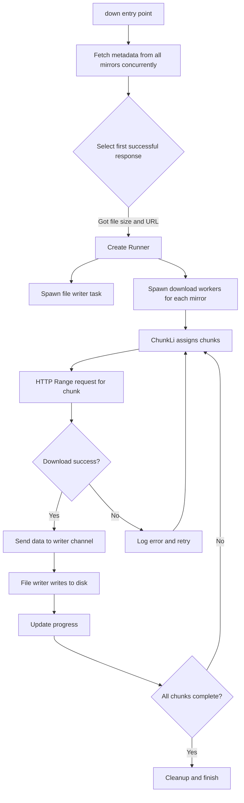
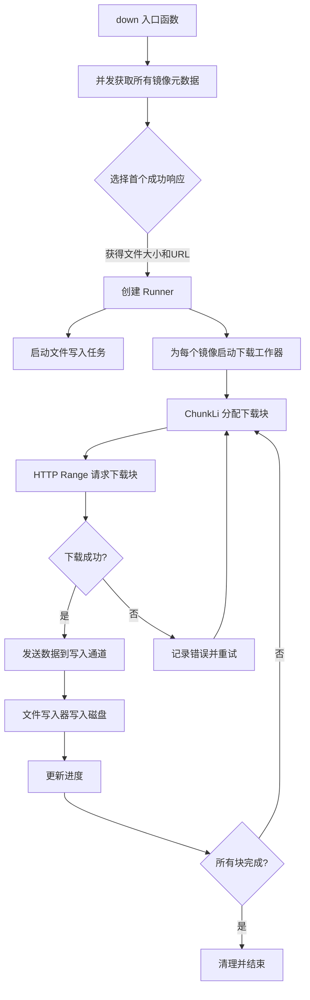

[English](#en) | [中文](#zh)

---

<a id="en"></a>

# down : Multi-source Parallel Download with Automatic Failover

High-performance Rust library for downloading files from multiple mirror sources simultaneously with automatic failover and chunked parallel downloading.

## Table of Contents

- [Features](#features)
- [Installation](#installation)
- [Quick Start](#quick-start)
- [API Reference](#api-reference)
- [Design Architecture](#design-architecture)
- [Technical Stack](#technical-stack)
- [Project Structure](#project-structure)
- [Historical Context](#historical-context)

## Features

- **Multi-source Download**: Automatically tries multiple mirror URLs for the same file
- **Parallel Chunking**: Splits files into 512KB chunks for concurrent downloading
- **Automatic Failover**: Seamlessly switches to alternative sources when errors occur
- **Progress Tracking**: Real-time download progress via async channel
- **Retry Mechanism**: Automatically retries failed chunks with 6-second timeout
- **Zero-copy I/O**: Uses `bytes::Bytes` for efficient memory management
- **Lockless Channels**: Powered by `crossfire` for high-performance async communication

## Installation

Add to your `Cargo.toml`:

```toml
[dependencies]
down = "0.1"
tokio = { version = "1", features = ["full"] }
```

## Quick Start

```rust
use down::down;
use std::path::PathBuf;

#[tokio::main]
async fn main() -> Result<(), Box<dyn std::error::Error>> {
    let file_path = PathBuf::from("/tmp/myfile.tar");

    // Provide multiple mirror URLs for the same file
    let mirrors = [
        "https://mirror1.example.com/file.tar",
        "https://mirror2.example.com/file.tar",
        "https://mirror3.example.com/file.tar",
    ];

    // Start download and get progress receiver
    let progress = down(mirrors, &file_path).await?;

    // Track download progress
    if let Ok(total_size) = progress.recv().await {
        println!("File size: {} bytes", total_size);

        while let Ok(downloaded) = progress.recv().await {
            let percent = (downloaded * 100) / total_size;
            println!("Progress: {}% ({}/{})", percent, downloaded, total_size);
        }
    }

    println!("Download complete: {}", file_path.display());
    Ok(())
}
```

## API Reference

### Functions

#### `meta(url: impl IntoUrl) -> Result<(u64, Url)>`

Fetches file metadata from URL.

**Returns**: Tuple of `(file_size, resolved_url)`

**Example**:

```rust
let (size, url) = down::meta("https://example.com/file.tar").await?;
println!("File size: {} bytes", size);
```

#### `down<U: IntoUrl>(url_li: impl IntoIterator<Item = U>, to_path: impl Into<PathBuf>) -> Result<AsyncRx<u64>>`

Downloads file from multiple mirror sources with automatic failover.

**Parameters**:

- `url_li`: Iterator of mirror URLs pointing to the same file
- `to_path`: Destination file path

**Returns**: `AsyncRx<u64>` channel receiver for progress updates

- First message: Total file size
- Subsequent messages: Cumulative bytes downloaded

**Example**:

```rust
let progress = down(
    ["https://cdn1.com/file", "https://cdn2.com/file"],
    "/tmp/file"
).await?;
```

### Types

#### `Error`

Error types returned by the library:

- `HttpResponse(StatusCode)`: HTTP error with status code
- `Reqwest(reqwest::Error)`: Network request error
- `Io(std::io::Error)`: File I/O error
- `SendError`: Channel communication error

#### `Result<T>`

Type alias for `std::result::Result<T, Error>`

## Design Architecture

### Module Call Flow



### Core Components

**ChunkLi** (`chunk_li.rs`)

- Manages download chunk queue (512KB per chunk)
- Implements retry logic with 6-second timeout
- Thread-safe chunk distribution using `IndexSet`

**Runner** (`runner.rs`)

- Coordinates file writing and download workers
- Spawns async file writer task
- Manages worker lifecycle and cleanup

**Error Handling** (`error.rs`)

- Unified error types using `thiserror`
- Automatic conversion from underlying errors

## Technical Stack

- **Async Runtime**: `tokio` - Multi-threaded async executor
- **HTTP Client**: `ireq` - High-performance HTTP client with proxy support
- **Channels**: `crossfire` - Lockless MPSC channels for async communication
- **Concurrency**: `parking_lot` - Fast mutex implementation
- **Error Handling**: `thiserror` - Ergonomic error type derivation
- **Data Structures**: `indexmap` - Ordered hash set for chunk management
- **Time**: `coarsetime` - Fast monotonic clock for retry timing

## Project Structure

```
down/
├── src/
│   ├── lib.rs          # Public API: meta(), down()
│   ├── runner.rs       # Download coordinator and file writer
│   ├── chunk_li.rs     # Chunk queue management
│   └── error.rs        # Error types and conversions
├── tests/
│   └── main.rs         # Integration tests
├── readme/
│   ├── en.md           # English documentation
│   └── zh.md           # Chinese documentation
└── Cargo.toml          # Package metadata
```

## Historical Context

### The Evolution of Download Managers

Download managers have evolved significantly since the early days of the internet. In the 1990s, tools like GetRight and Download Accelerator pioneered the concept of splitting files into chunks for parallel downloading, dramatically improving speeds on unreliable dial-up connections.

The HTTP Range header (RFC 7233), standardized in 2014, formalized partial content requests that make chunked downloading possible. This specification built upon earlier work in HTTP/1.1 (RFC 2616, 1999) which first introduced range requests.

### Multi-source Downloading

The concept of downloading from multiple mirrors simultaneously emerged from the open-source community's need for reliable software distribution. Projects like Debian and Apache maintain worldwide mirror networks, but traditional download tools could only use one mirror at a time.

Modern CDN architectures and mirror networks make multi-source downloading increasingly relevant. By attempting multiple sources concurrently and using the first successful response, applications can achieve both speed and reliability - automatically routing around network issues or overloaded servers.

### Rust and Async I/O

Rust's async/await syntax, stabilized in 2019, brought zero-cost abstractions for asynchronous programming. The `tokio` runtime, first released in 2016, has become the de facto standard for async Rust applications. This library leverages these modern Rust features to provide safe, efficient concurrent downloads without data races or memory leaks.

The `crossfire` channel library represents the latest evolution in lockless concurrent data structures, pushing performance boundaries by eliminating traditional mutex-based synchronization in favor of atomic operations and careful memory ordering.

---

## About

This project is an open-source component of [js0.site ⋅ Refactoring the Internet Plan](https://js0.site).

We are redefining the development paradigm of the Internet in a componentized way. Welcome to follow us:

- [Google Group](https://groups.google.com/g/js0-site)
- [js0site.bsky.social](https://bsky.app/profile/js0site.bsky.social)

---

<a id="zh"></a>

# down : 多源并行下载与自动故障转移

高性能 Rust 库，支持从多个镜像源同时下载文件，具备自动故障转移和分块并行下载能力。

## 目录

- [功能特性](#功能特性)
- [安装](#安装)
- [快速开始](#快速开始)
- [API 参考](#api-参考)
- [设计架构](#设计架构)
- [技术栈](#技术栈)
- [项目结构](#项目结构)
- [历史背景](#历史背景)

## 功能特性

- **多源下载**：自动尝试同一文件的多个镜像 URL
- **并行分块**：将文件分割为 512KB 块进行并发下载
- **自动故障转移**：出错时无缝切换到备用源
- **进度跟踪**：通过异步通道实时获取下载进度
- **重试机制**：失败的块自动重试，超时时间 6 秒
- **零拷贝 I/O**：使用 `bytes::Bytes` 实现高效内存管理
- **无锁通道**：基于 `crossfire` 实现高性能异步通信

## 安装

在 `Cargo.toml` 中添加：

```toml
[dependencies]
down = "0.1"
tokio = { version = "1", features = ["full"] }
```

## 快速开始

```rust
use down::down;
use std::path::PathBuf;

#[tokio::main]
async fn main() -> Result<(), Box<dyn std::error::Error>> {
    let file_path = PathBuf::from("/tmp/myfile.tar");

    // 提供同一文件的多个镜像 URL
    let mirrors = [
        "https://mirror1.example.com/file.tar",
        "https://mirror2.example.com/file.tar",
        "https://mirror3.example.com/file.tar",
    ];

    // 开始下载并获取进度接收器
    let progress = down(mirrors, &file_path).await?;

    // 跟踪下载进度
    if let Ok(total_size) = progress.recv().await {
        println!("文件大小: {} 字节", total_size);

        while let Ok(downloaded) = progress.recv().await {
            let percent = (downloaded * 100) / total_size;
            println!("进度: {}% ({}/{})", percent, downloaded, total_size);
        }
    }

    println!("下载完成: {}", file_path.display());
    Ok(())
}
```

## API 参考

### 函数

#### `meta(url: impl IntoUrl) -> Result<(u64, Url)>`

从 URL 获取文件元数据。

**返回值**：元组 `(文件大小, 解析后的URL)`

**示例**：

```rust
let (size, url) = down::meta("https://example.com/file.tar").await?;
println!("文件大小: {} 字节", size);
```

#### `down<U: IntoUrl>(url_li: impl IntoIterator<Item = U>, to_path: impl Into<PathBuf>) -> Result<AsyncRx<u64>>`

从多个镜像源下载文件，支持自动故障转移。

**参数**：

- `url_li`：指向同一文件的镜像 URL 迭代器
- `to_path`：目标文件路径

**返回值**：`AsyncRx<u64>` 通道接收器，用于接收进度更新

- 第一条消息：文件总大小
- 后续消息：累计已下载字节数

**示例**：

```rust
let progress = down(
    ["https://cdn1.com/file", "https://cdn2.com/file"],
    "/tmp/file"
).await?;
```

### 类型

#### `Error`

库返回的错误类型：

- `HttpResponse(StatusCode)`：HTTP 错误及状态码
- `Reqwest(reqwest::Error)`：网络请求错误
- `Io(std::io::Error)`：文件 I/O 错误
- `SendError`：通道通信错误

#### `Result<T>`

类型别名，等同于 `std::result::Result<T, Error>`

## 设计架构

### 模块调用流程



### 核心组件

**ChunkLi** (`chunk_li.rs`)

- 管理下载块队列（每块 512KB）
- 实现重试逻辑，超时时间 6 秒
- 使用 `IndexSet` 实现线程安全的块分配

**Runner** (`runner.rs`)

- 协调文件写入和下载工作器
- 生成异步文件写入任务
- 管理工作器生命周期和清理

**错误处理** (`error.rs`)

- 使用 `thiserror` 统一错误类型
- 自动转换底层错误

## 技术栈

- **异步运行时**：`tokio` - 多线程异步执行器
- **HTTP 客户端**：`ireq` - 高性能 HTTP 客户端，支持代理
- **通道**：`crossfire` - 无锁 MPSC 通道，用于异步通信
- **并发**：`parking_lot` - 快速互斥锁实现
- **错误处理**：`thiserror` - 符合人体工程学的错误类型派生
- **数据结构**：`indexmap` - 有序哈希集合，用于块管理
- **时间**：`coarsetime` - 快速单调时钟，用于重试计时

## 项目结构

```
down/
├── src/
│   ├── lib.rs          # 公共 API：meta()、down()
│   ├── runner.rs       # 下载协调器和文件写入器
│   ├── chunk_li.rs     # 块队列管理
│   └── error.rs        # 错误类型和转换
├── tests/
│   └── main.rs         # 集成测试
├── readme/
│   ├── en.md           # 英文文档
│   └── zh.md           # 中文文档
└── Cargo.toml          # 包元数据
```

## 历史背景

### 下载管理器的演进

下载管理器自互联网早期以来经历了显著演变。在 1990 年代，GetRight 和 Download Accelerator 等工具开创了将文件分割成块进行并行下载的概念，在不可靠的拨号连接上大幅提升了下载速度。

HTTP Range 头（RFC 7233）于 2014 年标准化，正式确立了使分块下载成为可能的部分内容请求机制。该规范建立在 HTTP/1.1（RFC 2616，1999）的早期工作之上，后者首次引入了范围请求。

### 多源下载

从多个镜像同时下载的概念源于开源社区对可靠软件分发的需求。Debian 和 Apache 等项目维护着全球镜像网络，但传统下载工具一次只能使用一个镜像。

现代 CDN 架构和镜像网络使多源下载变得越来越重要。通过同时尝试多个源并使用第一个成功的响应，应用程序可以同时实现速度和可靠性——自动绕过网络问题或过载的服务器。

### Rust 与异步 I/O

Rust 的 async/await 语法于 2019 年稳定，为异步编程带来了零成本抽象。`tokio` 运行时首次发布于 2016 年，已成为异步 Rust 应用程序的事实标准。本库利用这些现代 Rust 特性，提供安全、高效的并发下载，无数据竞争或内存泄漏。

`crossfire` 通道库代表了无锁并发数据结构的最新演进，通过消除传统的基于互斥锁的同步机制，转而采用原子操作和精心设计的内存顺序，突破了性能边界。

---

## 关于

本项目为 [js0.site ⋅ 重构互联网计划](https://js0.site) 的开源组件。

我们正在以组件化的方式重新定义互联网的开发范式，欢迎关注：

- [谷歌邮件列表](https://groups.google.com/g/js0-site)
- [js0site.bsky.social](https://bsky.app/profile/js0site.bsky.social)
