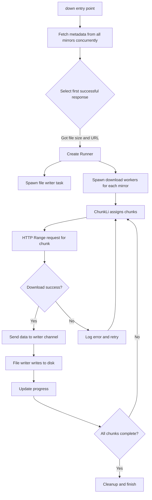

# down : Multi-source Parallel Download with Automatic Failover

High-performance Rust library for downloading files from multiple mirror sources simultaneously with automatic failover and chunked parallel downloading.

## Table of Contents

- [Features](#features)
- [Installation](#installation)
- [Quick Start](#quick-start)
- [API Reference](#api-reference)
- [Design Architecture](#design-architecture)
- [Technical Stack](#technical-stack)
- [Project Structure](#project-structure)
- [Historical Context](#historical-context)

## Features

- **Multi-source Download**: Automatically tries multiple mirror URLs for the same file
- **Parallel Chunking**: Splits files into 512KB chunks for concurrent downloading
- **Automatic Failover**: Seamlessly switches to alternative sources when errors occur
- **Progress Tracking**: Real-time download progress via async channel
- **Retry Mechanism**: Automatically retries failed chunks with 6-second timeout
- **Zero-copy I/O**: Uses `bytes::Bytes` for efficient memory management
- **Lockless Channels**: Powered by `crossfire` for high-performance async communication

## Installation

Add to your `Cargo.toml`:

```toml
[dependencies]
down = "0.1"
tokio = { version = "1", features = ["full"] }
```

## Quick Start

```rust
use down::down;
use std::path::PathBuf;

#[tokio::main]
async fn main() -> Result<(), Box<dyn std::error::Error>> {
    let file_path = PathBuf::from("/tmp/myfile.tar");
    
    // Provide multiple mirror URLs for the same file
    let mirrors = [
        "https://mirror1.example.com/file.tar",
        "https://mirror2.example.com/file.tar",
        "https://mirror3.example.com/file.tar",
    ];
    
    // Start download and get progress receiver
    let progress = down(mirrors, &file_path).await?;
    
    // Track download progress
    if let Ok(total_size) = progress.recv().await {
        println!("File size: {} bytes", total_size);
        
        while let Ok(downloaded) = progress.recv().await {
            let percent = (downloaded * 100) / total_size;
            println!("Progress: {}% ({}/{})", percent, downloaded, total_size);
        }
    }
    
    println!("Download complete: {}", file_path.display());
    Ok(())
}
```

## API Reference

### Functions

#### `meta(url: impl IntoUrl) -> Result<(u64, Url)>`

Fetches file metadata from URL.

**Returns**: Tuple of `(file_size, resolved_url)`

**Example**:
```rust
let (size, url) = down::meta("https://example.com/file.tar").await?;
println!("File size: {} bytes", size);
```

#### `down<U: IntoUrl>(url_li: impl IntoIterator<Item = U>, to_path: impl Into<PathBuf>) -> Result<AsyncRx<u64>>`

Downloads file from multiple mirror sources with automatic failover.

**Parameters**:
- `url_li`: Iterator of mirror URLs pointing to the same file
- `to_path`: Destination file path

**Returns**: `AsyncRx<u64>` channel receiver for progress updates
- First message: Total file size
- Subsequent messages: Cumulative bytes downloaded

**Example**:
```rust
let progress = down(
    ["https://cdn1.com/file", "https://cdn2.com/file"],
    "/tmp/file"
).await?;
```

### Types

#### `Error`

Error types returned by the library:

- `HttpResponse(StatusCode)`: HTTP error with status code
- `Reqwest(reqwest::Error)`: Network request error
- `Io(std::io::Error)`: File I/O error
- `SendError`: Channel communication error

#### `Result<T>`

Type alias for `std::result::Result<T, Error>`

## Design Architecture

### Module Call Flow



### Core Components

**ChunkLi** (`chunk_li.rs`)
- Manages download chunk queue (512KB per chunk)
- Implements retry logic with 6-second timeout
- Thread-safe chunk distribution using `IndexSet`

**Runner** (`runner.rs`)
- Coordinates file writing and download workers
- Spawns async file writer task
- Manages worker lifecycle and cleanup

**Error Handling** (`error.rs`)
- Unified error types using `thiserror`
- Automatic conversion from underlying errors

## Technical Stack

- **Async Runtime**: `tokio` - Multi-threaded async executor
- **HTTP Client**: `ireq` - High-performance HTTP client with proxy support
- **Channels**: `crossfire` - Lockless MPSC channels for async communication
- **Concurrency**: `parking_lot` - Fast mutex implementation
- **Error Handling**: `thiserror` - Ergonomic error type derivation
- **Data Structures**: `indexmap` - Ordered hash set for chunk management
- **Time**: `coarsetime` - Fast monotonic clock for retry timing

## Project Structure

```
down/
├── src/
│   ├── lib.rs          # Public API: meta(), down()
│   ├── runner.rs       # Download coordinator and file writer
│   ├── chunk_li.rs     # Chunk queue management
│   └── error.rs        # Error types and conversions
├── tests/
│   └── main.rs         # Integration tests
├── readme/
│   ├── en.md           # English documentation
│   └── zh.md           # Chinese documentation
└── Cargo.toml          # Package metadata
```

## Historical Context

### The Evolution of Download Managers

Download managers have evolved significantly since the early days of the internet. In the 1990s, tools like GetRight and Download Accelerator pioneered the concept of splitting files into chunks for parallel downloading, dramatically improving speeds on unreliable dial-up connections.

The HTTP Range header (RFC 7233), standardized in 2014, formalized partial content requests that make chunked downloading possible. This specification built upon earlier work in HTTP/1.1 (RFC 2616, 1999) which first introduced range requests.

### Multi-source Downloading

The concept of downloading from multiple mirrors simultaneously emerged from the open-source community's need for reliable software distribution. Projects like Debian and Apache maintain worldwide mirror networks, but traditional download tools could only use one mirror at a time.

Modern CDN architectures and mirror networks make multi-source downloading increasingly relevant. By attempting multiple sources concurrently and using the first successful response, applications can achieve both speed and reliability - automatically routing around network issues or overloaded servers.

### Rust and Async I/O

Rust's async/await syntax, stabilized in 2019, brought zero-cost abstractions for asynchronous programming. The `tokio` runtime, first released in 2016, has become the de facto standard for async Rust applications. This library leverages these modern Rust features to provide safe, efficient concurrent downloads without data races or memory leaks.

The `crossfire` channel library represents the latest evolution in lockless concurrent data structures, pushing performance boundaries by eliminating traditional mutex-based synchronization in favor of atomic operations and careful memory ordering.
