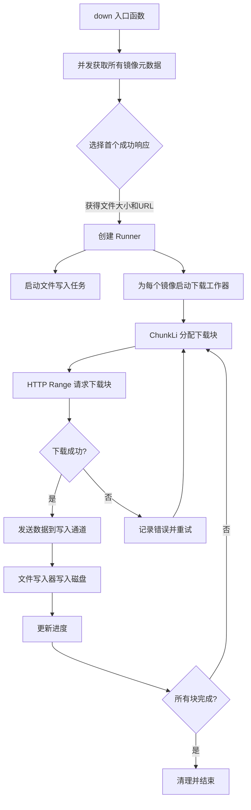

# down : 多源并行下载与自动故障转移

高性能 Rust 库，支持从多个镜像源同时下载文件，具备自动故障转移和分块并行下载能力。

## 目录

- [功能特性](#功能特性)
- [安装](#安装)
- [快速开始](#快速开始)
- [API 参考](#api-参考)
- [设计架构](#设计架构)
- [技术栈](#技术栈)
- [项目结构](#项目结构)
- [历史背景](#历史背景)

## 功能特性

- **多源下载**：自动尝试同一文件的多个镜像 URL
- **并行分块**：将文件分割为 512KB 块进行并发下载
- **自动故障转移**：出错时无缝切换到备用源
- **进度跟踪**：通过异步通道实时获取下载进度
- **重试机制**：失败的块自动重试，超时时间 6 秒
- **零拷贝 I/O**：使用 `bytes::Bytes` 实现高效内存管理
- **无锁通道**：基于 `crossfire` 实现高性能异步通信

## 安装

在 `Cargo.toml` 中添加：

```toml
[dependencies]
down = "0.1"
tokio = { version = "1", features = ["full"] }
```

## 快速开始

```rust
use down::down;
use std::path::PathBuf;

#[tokio::main]
async fn main() -> Result<(), Box<dyn std::error::Error>> {
    let file_path = PathBuf::from("/tmp/myfile.tar");
    
    // 提供同一文件的多个镜像 URL
    let mirrors = [
        "https://mirror1.example.com/file.tar",
        "https://mirror2.example.com/file.tar",
        "https://mirror3.example.com/file.tar",
    ];
    
    // 开始下载并获取进度接收器
    let progress = down(mirrors, &file_path).await?;
    
    // 跟踪下载进度
    if let Ok(total_size) = progress.recv().await {
        println!("文件大小: {} 字节", total_size);
        
        while let Ok(downloaded) = progress.recv().await {
            let percent = (downloaded * 100) / total_size;
            println!("进度: {}% ({}/{})", percent, downloaded, total_size);
        }
    }
    
    println!("下载完成: {}", file_path.display());
    Ok(())
}
```

## API 参考

### 函数

#### `meta(url: impl IntoUrl) -> Result<(u64, Url)>`

从 URL 获取文件元数据。

**返回值**：元组 `(文件大小, 解析后的URL)`

**示例**：
```rust
let (size, url) = down::meta("https://example.com/file.tar").await?;
println!("文件大小: {} 字节", size);
```

#### `down<U: IntoUrl>(url_li: impl IntoIterator<Item = U>, to_path: impl Into<PathBuf>) -> Result<AsyncRx<u64>>`

从多个镜像源下载文件，支持自动故障转移。

**参数**：
- `url_li`：指向同一文件的镜像 URL 迭代器
- `to_path`：目标文件路径

**返回值**：`AsyncRx<u64>` 通道接收器，用于接收进度更新
- 第一条消息：文件总大小
- 后续消息：累计已下载字节数

**示例**：
```rust
let progress = down(
    ["https://cdn1.com/file", "https://cdn2.com/file"],
    "/tmp/file"
).await?;
```

### 类型

#### `Error`

库返回的错误类型：

- `HttpResponse(StatusCode)`：HTTP 错误及状态码
- `Reqwest(reqwest::Error)`：网络请求错误
- `Io(std::io::Error)`：文件 I/O 错误
- `SendError`：通道通信错误

#### `Result<T>`

类型别名，等同于 `std::result::Result<T, Error>`

## 设计架构

### 模块调用流程



### 核心组件

**ChunkLi** (`chunk_li.rs`)
- 管理下载块队列（每块 512KB）
- 实现重试逻辑，超时时间 6 秒
- 使用 `IndexSet` 实现线程安全的块分配

**Runner** (`runner.rs`)
- 协调文件写入和下载工作器
- 生成异步文件写入任务
- 管理工作器生命周期和清理

**错误处理** (`error.rs`)
- 使用 `thiserror` 统一错误类型
- 自动转换底层错误

## 技术栈

- **异步运行时**：`tokio` - 多线程异步执行器
- **HTTP 客户端**：`ireq` - 高性能 HTTP 客户端，支持代理
- **通道**：`crossfire` - 无锁 MPSC 通道，用于异步通信
- **并发**：`parking_lot` - 快速互斥锁实现
- **错误处理**：`thiserror` - 符合人体工程学的错误类型派生
- **数据结构**：`indexmap` - 有序哈希集合，用于块管理
- **时间**：`coarsetime` - 快速单调时钟，用于重试计时

## 项目结构

```
down/
├── src/
│   ├── lib.rs          # 公共 API：meta()、down()
│   ├── runner.rs       # 下载协调器和文件写入器
│   ├── chunk_li.rs     # 块队列管理
│   └── error.rs        # 错误类型和转换
├── tests/
│   └── main.rs         # 集成测试
├── readme/
│   ├── en.md           # 英文文档
│   └── zh.md           # 中文文档
└── Cargo.toml          # 包元数据
```

## 历史背景

### 下载管理器的演进

下载管理器自互联网早期以来经历了显著演变。在 1990 年代，GetRight 和 Download Accelerator 等工具开创了将文件分割成块进行并行下载的概念，在不可靠的拨号连接上大幅提升了下载速度。

HTTP Range 头（RFC 7233）于 2014 年标准化，正式确立了使分块下载成为可能的部分内容请求机制。该规范建立在 HTTP/1.1（RFC 2616，1999）的早期工作之上，后者首次引入了范围请求。

### 多源下载

从多个镜像同时下载的概念源于开源社区对可靠软件分发的需求。Debian 和 Apache 等项目维护着全球镜像网络，但传统下载工具一次只能使用一个镜像。

现代 CDN 架构和镜像网络使多源下载变得越来越重要。通过同时尝试多个源并使用第一个成功的响应，应用程序可以同时实现速度和可靠性——自动绕过网络问题或过载的服务器。

### Rust 与异步 I/O

Rust 的 async/await 语法于 2019 年稳定，为异步编程带来了零成本抽象。`tokio` 运行时首次发布于 2016 年，已成为异步 Rust 应用程序的事实标准。本库利用这些现代 Rust 特性，提供安全、高效的并发下载，无数据竞争或内存泄漏。

`crossfire` 通道库代表了无锁并发数据结构的最新演进，通过消除传统的基于互斥锁的同步机制，转而采用原子操作和精心设计的内存顺序，突破了性能边界。
