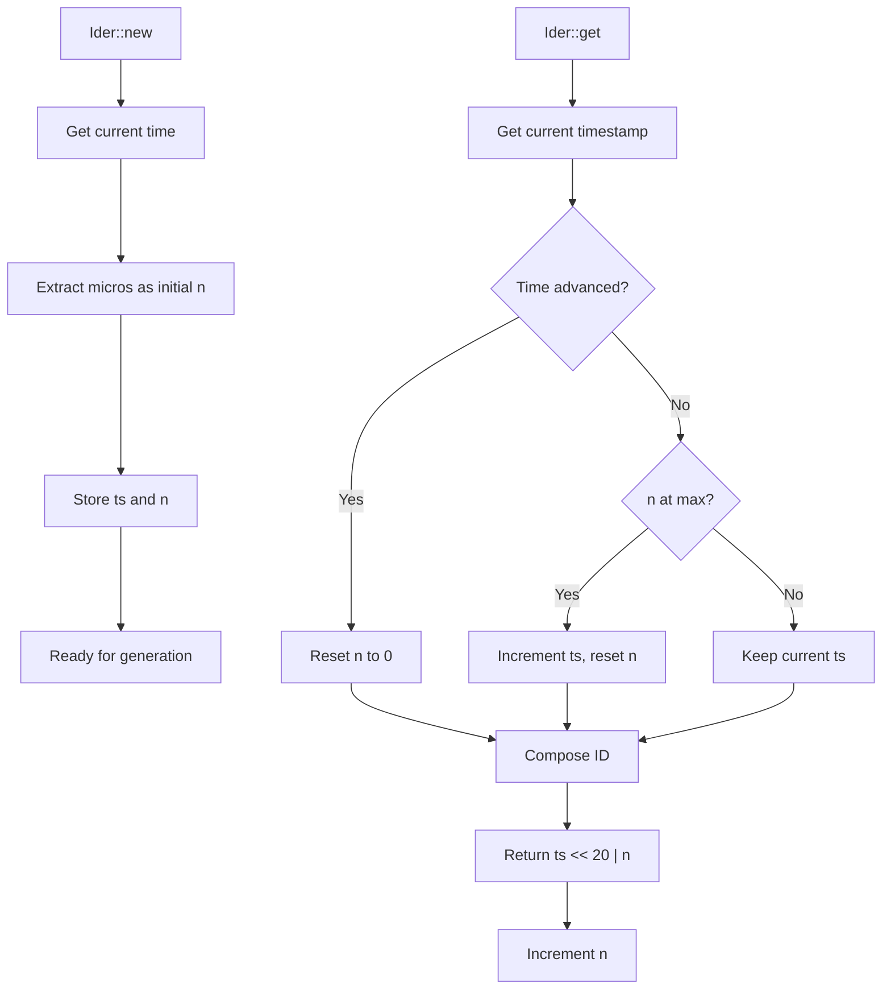
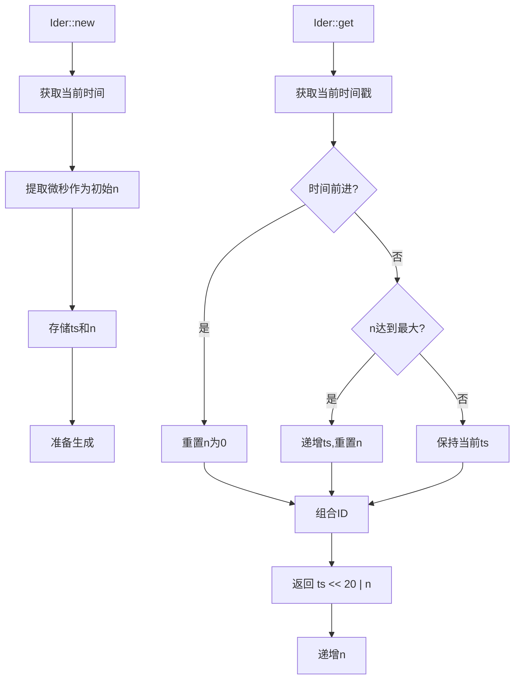

[English](#en) | [中文](#zh)

---

<a id="en"></a>

# Ider : High-Performance Time-Based ID Generator

## Table of Contents

- [Overview](#overview)
- [Features](#features)
- [Installation](#installation)
- [Usage](#usage)
- [API Reference](#api-reference)
- [Design](#design)
- [Performance](#performance)
- [Technical Stack](#technical-stack)
- [Directory Structure](#directory-structure)
- [Historical Context](#historical-context)

## Overview

Ider is a high-performance, time-based unique ID generator written in Rust. It generates 64-bit monotonically increasing IDs with clock backward tolerance and restart collision avoidance.

## Features

- Monotonic increasing IDs
- ~1M IDs per second generation rate
- Clock backward tolerance
- Restart collision avoidance
- O(1) time complexity with no heap allocation
- Iterator support for sequential generation

## Installation

Add this to your `Cargo.toml`:

```toml
[dependencies]
ider = "0.1.0"
```

## Usage

### Basic Usage

```rust
use ider::Ider;

let mut ider = Ider::new();
let id = ider.get();
println!("Generated ID: {}", id);
```

### Iterator Usage

```rust
use ider::Ider;

let mut ider = Ider::new();
let ids: Vec<u64> = ider.by_ref().take(5).collect();
```

### Recovery from Persistence

```rust
use ider::Ider;

let mut ider = Ider::new();
let last_id = load_last_id_from_storage();
ider.init(last_id);
let new_id = ider.get();
```

## API Reference

### Ider Structure

The main ID generator structure with fields:
- `ts`: Unix timestamp in seconds
- `n`: Microsecond position within the second

### Methods

#### `new() -> Self`
Creates new generator with microsecond-based initialization to avoid collision after restart.

#### `init(&mut self, last_id: u64)`
Initializes generator to ensure it's ahead of last_id. Must call after recovery from persistent storage.

#### `get(&mut self) -> u64`
Generates next unique 64-bit ID with O(1) time complexity.

### ID Format

```
| 44 bits timestamp | 20 bits sequence |
|---------------------------------------|
| seconds since epoch | micros within second |
```

## Design

The ID generation follows a two-phase approach:

1. **Initialization Phase**: Uses microseconds within second as initial position
2. **Generation Phase**: Combines timestamp and sequence for unique IDs



## Performance

- **Generation Rate**: ~1,000,000 IDs per second
- **Time Complexity**: O(1)
- **Memory Usage**: Minimal (16 bytes per generator)
- **Allocation**: No heap allocation during generation

## Technical Stack

- **Language**: Rust
- **Edition**: 2024
- **Dependencies**: 
  - `coarsetime` for efficient time operations
- **License**: MulanPSL-2.0

## Directory Structure

```
ider/
├── src/
│   └── lib.rs          # Core implementation
├── tests/
│   └── main.rs         # Test cases
├── readme/
│   ├── en.md           # English documentation
│   └── zh.md           # Chinese documentation
├── Cargo.toml          # Project configuration
└── README.mdt          # Documentation index
```

## Historical Context

The concept of time-based ID generation dates back to the early days of distributed systems. Twitter's Snowflake, introduced in 2010, popularized the approach of combining timestamps with sequence numbers. Ider builds upon this foundation but optimizes for simplicity and performance in single-node scenarios.

Unlike Snowflake's 41-bit timestamp with machine ID and sequence, Ider uses a 44-bit timestamp with 20-bit sequence, providing sufficient capacity for most applications while eliminating the need for machine ID allocation. This design choice reflects the evolution toward containerized and stateless services where unique machine identification becomes less critical.

The microsecond-based initialization strategy in Ider addresses a common pain point in time-based ID generators: collision avoidance after service restarts. By using the current microsecond position as the starting sequence, Ider minimizes the probability of ID collision without requiring persistent state synchronization.

---

## About

This project is an open-source component of [js0.site ⋅ Refactoring the Internet Plan](https://js0.site).

We are redefining the development paradigm of the Internet in a componentized way. Welcome to follow us:

* [Google Group](https://groups.google.com/g/js0-site)
* [js0site.bsky.social](https://bsky.app/profile/js0site.bsky.social)

---

<a id="zh"></a>

# Ider : 高性能时间戳ID生成器

## 目录

- [概述](#概述)
- [特性](#特性)
- [安装](#安装)
- [使用](#使用)
- [API参考](#api参考)
- [设计](#设计)
- [性能](#性能)
- [技术栈](#技术栈)
- [目录结构](#目录结构)
- [历史背景](#历史背景)

## 概述

Ider是用Rust编写的高性能基于时间的唯一ID生成器。它生成64位单调递增ID，具有时钟回拨容错和重启冲突避免功能。

## 特性

- 单调递增ID
- 每秒约100万个ID生成速率
- 时钟回拨容错
- 重启冲突避免
- O(1)时间复杂度，无堆分配
- 支持顺序生成的迭代器

## 安装

在`Cargo.toml`中添加：

```toml
[dependencies]
ider = "0.1.0"
```

## 使用

### 基础用法

```rust
use ider::Ider;

let mut ider = Ider::new();
let id = ider.get();
println!("生成的ID: {}", id);
```

### 迭代器用法

```rust
use ider::Ider;

let mut ider = Ider::new();
let ids: Vec<u64> = ider.by_ref().take(5).collect();
```

### 持久化恢复

```rust
use ider::Ider;

let mut ider = Ider::new();
let last_id = load_last_id_from_storage();
ider.init(last_id);
let new_id = ider.get();
```

## API参考

### Ider结构体

主要的ID生成器结构，包含字段：
- `ts`: Unix时间戳（秒）
- `n`: 秒内微秒位置

### 方法

#### `new() -> Self`
创建基于微秒初始化的新生成器，避免重启后冲突。

#### `init(&mut self, last_id: u64)`
初始化生成器确保领先于last_id。从持久化存储恢复后必须调用。

#### `get(&mut self) -> u64`
生成下一个唯一64位ID，时间复杂度O(1)。

### ID格式

```
| 44位时间戳 | 20位序列 |
|---------------------------------------|
| 自纪元秒数 | 秒内微秒 |
```

## 设计

ID生成采用两阶段方法：

1. **初始化阶段**：使用秒内微秒作为初始位置
2. **生成阶段**：组合时间戳和序列号生成唯一ID



## 性能

- **生成速率**：每秒约1,000,000个ID
- **时间复杂度**：O(1)
- **内存使用**：最小（每个生成器16字节）
- **分配**：生成期间无堆分配

## 技术栈

- **语言**：Rust
- **版本**：2024
- **依赖**：
  - `coarsetime` 用于高效时间操作
- **许可证**：MulanPSL-2.0

## 目录结构

```
ider/
├── src/
│   └── lib.rs          # 核心实现
├── tests/
│   └── main.rs         # 测试用例
├── readme/
│   ├── en.md           # 英文文档
│   └── zh.md           # 中文文档
├── Cargo.toml          # 项目配置
└── README.mdt          # 文档索引
```

## 历史背景

基于时间的ID生成概念可以追溯到分布式系统的早期。Twitter在2010年推出的Snowflake普及了将时间戳与序列号组合的方法。Ider在此基础之上构建，但针对单节点场景进行了简单性和性能的优化。

与Snowflake的41位时间戳加机器ID和序列号不同，Ider使用44位时间戳和20位序列号，为大多数应用提供足够容量，同时消除了机器ID分配的需要。这种设计选择反映了向容器化和无状态服务的演进，在这些场景中，唯一机器标识变得不那么关键。

Ider中基于微秒的初始化策略解决了基于时间ID生成器的常见痛点：服务重启后的冲突避免。通过使用当前微秒位置作为起始序列，Ider在不需要持久化状态同步的情况下最小化了ID冲突的概率。

---

## 关于

本项目为 [js0.site ⋅ 重构互联网计划](https://js0.site) 的开源组件。

我们正在以组件化的方式重新定义互联网的开发范式，欢迎关注：

* [谷歌邮件列表](https://groups.google.com/g/js0-site)
* [js0site.bsky.social](https://bsky.app/profile/js0site.bsky.social)
