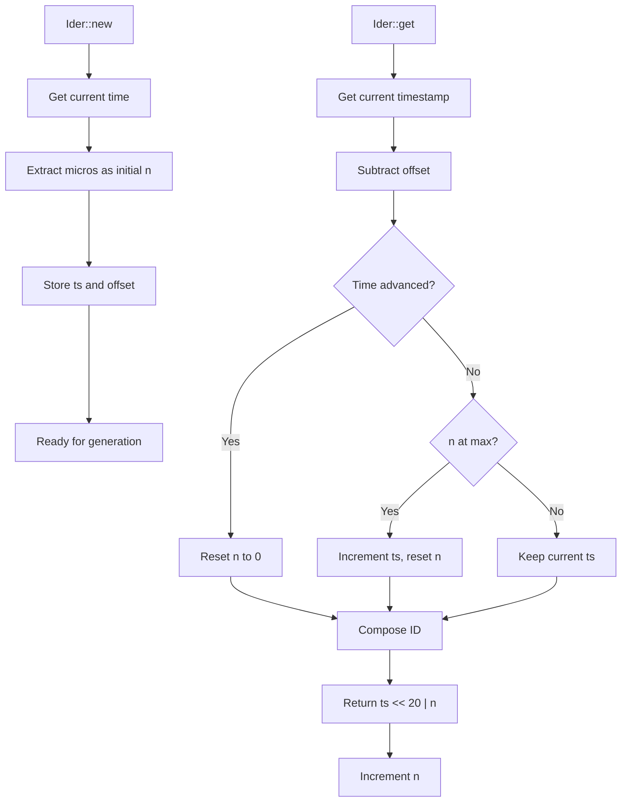
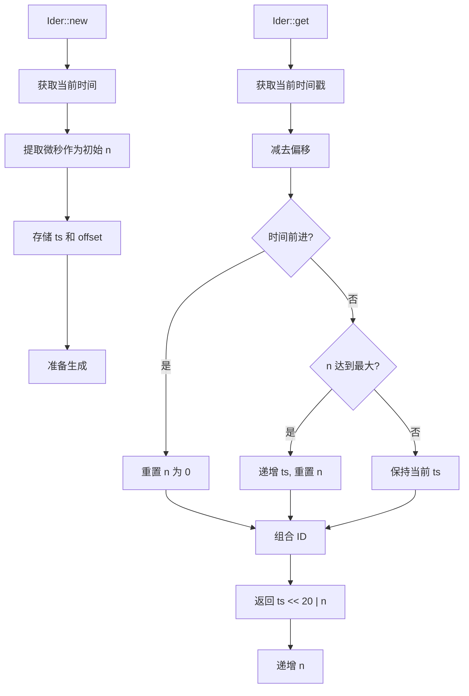

[English](#en) | [中文](#zh)

---

<a id="en"></a>

# Ider : High-Performance Time-Based ID Generator

## Table of Contents

- [Overview](#overview)
- [Features](#features)
- [Installation](#installation)
- [Usage](#usage)
  - [Basic Usage](#basic-usage)
  - [Global ID Generator](#global-id-generator)
  - [File Path Encoding](#file-path-encoding)
  - [Iterator Usage](#iterator-usage)
  - [Recovery from Persistence](#recovery-from-persistence)
  - [Extract Timestamp from ID](#extract-timestamp-from-id)
- [API Reference](#api-reference)
- [Design](#design)
- [Performance](#performance)
- [Technical Stack](#technical-stack)
- [Directory Structure](#directory-structure)
- [Historical Context](#historical-context)

## Overview

Ider is a high-performance, time-based unique ID generator written in Rust. It generates 64-bit monotonically increasing IDs with clock backward tolerance, restart collision avoidance, and configurable timestamp offset.

## Features

- **Monotonic increasing IDs**: Guaranteed to be strictly increasing
- **High throughput**: ~1M IDs per second generation rate
- **Clock backward tolerance**: Handles system clock adjustments gracefully
- **Restart collision avoidance**: Microsecond-based initialization prevents collisions
- **Configurable timestamp offset**: Customize ID epoch for flexibility
- **Global ID generator**: Thread-local singleton for convenient ID generation
- **File path encoding**: Base32 encoding for filesystem-safe IDs
- **O(1) time complexity**: No heap allocation during generation
- **Iterator support**: Sequential ID generation via iterator interface

## Installation

Add this to `Cargo.toml`:

```toml
[dependencies]
ider = "0.1.3"
```

### Features

The crate supports optional features:

- `id` (default: disabled): Enables global ID generator (`id()` and `id_init()`)
- `path` (default: disabled): Enables file path encoding utilities (`encode()`, `decode()`, `new()`)

Enable features as needed:

```toml
[dependencies]
ider = { version = "0.1.3", features = ["id", "path"] }
```

## Usage

### Basic Usage

```rust
use ider::Ider;

let mut ider = Ider::new();
let id = ider.get();
println!("Generated ID: {}", id);
```

### Global ID Generator

The `id` feature provides a thread-local global ID generator for convenient use:

```rust
// Enable the "id" feature in Cargo.toml
use ider::id;

let id1 = id();
let id2 = id();
assert!(id2 > id1); // Monotonically increasing

// Initialize with a base ID (e.g., after recovery from storage)
use ider::id_init;
id_init(last_id_from_storage);
```

### File Path Encoding

The `path` feature provides utilities for encoding IDs as filesystem-safe paths:

```rust
// Enable the "path" feature in Cargo.toml (also enables "id")
use ider::path::{encode, decode, new};
use std::path::Path;

// Encode an ID to a base32 string
let id = 1234567890u64;
let encoded = encode(id);
println!("Encoded: {}", encoded);

// Decode back to ID
let decoded = decode(&encoded);
assert_eq!(decoded, Some(id));

// Create a path with auto-generated ID
let dir = Path::new("/tmp/data");
let (id, path) = new(dir);
println!("Generated ID: {}, Path: {:?}", id, path);
```

### Iterator Usage

```rust
use ider::Ider;

let mut ider = Ider::new();
let ids: Vec<u64> = ider.by_ref().take(5).collect();
```

### Recovery from Persistence

```rust
use ider::Ider;

let mut ider = Ider::new();
let last_id = load_last_id_from_storage();
ider.init(last_id);
let new_id = ider.get();
```

### Extract Timestamp from ID

```rust
use ider::{Ider, id_to_ts, id_to_ts_with_offset};

let mut ider = Ider::new();
let id = ider.get();

// Using default offset
let ts = id_to_ts(id);

// Using custom offset
let offset = 1735689600;
let ts_custom = id_to_ts_with_offset(id, offset);
```

## API Reference

### Ider Structure

Main ID generator structure with fields:

- `ts`: Relative timestamp in seconds (adjusted by offset)
- `n`: Sequence number within second (0 to 1,048,575)
- `offset`: Timestamp offset in seconds (default: 2026-01-01 00:00:00 UTC)

### Methods

#### `new() -> Self`

Creates new generator with default offset (2026-01-01 00:00:00 UTC). Uses microseconds within second as initial sequence to avoid collision after restart.

#### `with_offset(offset: u64) -> Self`

Creates new generator with custom timestamp offset. Uses microseconds within second as initial sequence.

**Parameters:**

- `offset`: Timestamp offset in seconds

#### `init(&mut self, last_id: u64)`

Initializes generator to ensure it's ahead of last_id. Must call after recovery from persistent storage to prevent ID collision.

**Parameters:**

- `last_id`: Last generated ID from persistent storage

#### `get(&mut self) -> u64`

Generates next unique 64-bit ID with O(1) time complexity.

**Returns:**

- Monotonically increasing 64-bit ID

### Global ID Functions (requires `id` feature)

#### `id() -> u64`

Generate a unique ID using the thread-local global generator.

**Returns:**

- Unique 64-bit ID

#### `id_init(base: u64)`

Initialize the global ID generator with a base ID. Useful for recovery from persistent storage.

**Parameters:**

- `base`: Base ID to initialize from

### Path Functions (requires `path` feature)

#### `encode(id: u64) -> String`

Encode an ID to a base32 string suitable for filesystem use.

**Parameters:**

- `id`: ID to encode

**Returns:**

- Base32 encoded string

#### `decode(name: &str) -> Option<u64>`

Decode a base32 string back to an ID.

**Parameters:**

- `name`: Base32 encoded string

**Returns:**

- The decoded ID, or `None` if invalid

#### `new(dir: &Path) -> (ID, PathBuf)`

Create a path by joining the directory with an auto-generated encoded ID. Returns both the generated ID and the path.

**Parameters:**

- `dir`: Base directory path

**Returns:**

- A tuple containing:
  - `ID`: The generated unique ID
  - `PathBuf`: Path with encoded ID appended

### Type Aliases

#### `ID`

Type alias for `u64`, representing a unique ID.

```rust
use ider::ID;

let id: ID = 1234567890u64;
```

### Helper Functions

#### `id_to_ts(id: u64) -> u64`

Extracts timestamp from ID using default offset.

**Parameters:**

- `id`: ID to parse

**Returns:**

- Absolute timestamp in seconds since Unix epoch

#### `id_to_ts_with_offset(id: u64, offset: u64) -> u64`

Extracts timestamp from ID using custom offset.

**Parameters:**

- `id`: ID to parse
- `offset`: Timestamp offset in seconds

**Returns:**

- Absolute timestamp in seconds since Unix epoch

### ID Format

```
| 44 bits timestamp | 20 bits sequence |
|---------------------------------------|
| seconds since offset | sequence number |
```

- **Timestamp**: 44 bits (supports ~550 years from offset)
- **Sequence**: 20 bits (0 to 1,048,575, ~1M IDs per second)

## Design

ID generation follows two-phase approach:

1. **Initialization Phase**: Uses microseconds within second as initial sequence
2. **Generation Phase**: Combines timestamp and sequence for unique IDs



### Offset Strategy

Timestamp offset allows customization of ID epoch. Default offset (2026-01-01) extends ID lifespan and provides flexibility for different deployment scenarios. The relative timestamp stored in ID is calculated as: `actual_timestamp - offset`.

### Thread-Local Global Generator

The global ID generator (`id()`) uses thread-local storage, providing a separate generator per thread. This design ensures thread safety without locks and maintains monotonicity within each thread.

### File Path Encoding

The `path` module uses Crockford's base32 encoding for filesystem compatibility. This encoding avoids ambiguous characters and works well across different filesystems.

## Performance

- **Generation Rate**: ~1,000,000 IDs per second
- **Time Complexity**: O(1)
- **Memory Usage**: Minimal (24 bytes per generator)
- **Allocation**: No heap allocation during generation

## Technical Stack

- **Language**: Rust
- **Edition**: 2024
- **Dependencies**:
  - `coarsetime` for efficient time operations
  - `fast32` for base32 encoding/decoding
- **License**: MulanPSL-2.0

## Directory Structure

```
ider/
├── src/
│   ├── lib.rs          # Library entry point
│   ├── ider.rs         # Core Ider implementation
│   ├── id.rs           # Global ID generator (feature: id)
│   └── path.rs         # File path encoding (feature: path)
├── tests/
│   └── main.rs         # Test cases
├── readme/
│   ├── en.md           # English documentation
│   └── zh.md           # Chinese documentation
├── Cargo.toml          # Project configuration
└── README.mdt          # Documentation index
```

## Historical Context

The concept of time-based ID generation dates back to early distributed systems. Twitter's Snowflake, introduced in 2010, popularized combining timestamps with sequence numbers. Ider builds upon this foundation but optimizes for simplicity and performance in single-node scenarios.

Unlike Snowflake's 41-bit timestamp with machine ID and sequence, Ider uses 44-bit timestamp with 20-bit sequence, providing sufficient capacity for most applications while eliminating need for machine ID allocation. This design choice reflects evolution toward containerized and stateless services where unique machine identification becomes less critical.

The microsecond-based initialization strategy in Ider addresses common pain point in time-based ID generators: collision avoidance after service restarts. By using current microsecond position as starting sequence, Ider minimizes probability of ID collision without requiring persistent state synchronization.

The offset feature in Ider draws inspiration from database timestamp strategies where epoch customization helps with data migration and multi-region deployment. Setting custom offset allows applications to align ID generation with business timelines or extend ID lifespan beyond default 44-bit capacity.

The thread-local global generator design ensures thread safety without locking overhead, making it ideal for high-throughput concurrent applications.

---

## About

This project is an open-source component of [js0.site ⋅ Refactoring the Internet Plan](https://js0.site).

We are redefining the development paradigm of the Internet in a componentized way. Welcome to follow us:

- [Google Group](https://groups.google.com/g/js0-site)
- [js0site.bsky.social](https://bsky.app/profile/js0site.bsky.social)

---

<a id="zh"></a>

# Ider : 高性能时间戳ID生成器

## 目录

- [概述](#概述)
- [特性](#特性)
- [安装](#安装)
- [使用](#使用)
  - [基础用法](#基础用法)
  - [全局 ID 生成器](#全局-id-生成器)
  - [文件路径编码](#文件路径编码)
  - [迭代器用法](#迭代器用法)
  - [持久化恢复](#持久化恢复)
  - [从 ID 提取时间戳](#从-id-提取时间戳)
- [API 参考](#api-参考)
- [设计](#设计)
- [性能](#性能)
- [技术栈](#技术栈)
- [目录结构](#目录结构)
- [历史背景](#历史背景)

## 概述

Ider 是用 Rust 编写的高性能基于时间的唯一 ID 生成器。它生成 64 位单调递增 ID，具有时钟回拨容错、重启冲突避免和可配置时间戳偏移功能。

## 特性

- **单调递增 ID**：保证严格递增
- **高吞吐量**：每秒约 100 万个 ID 生成速率
- **时钟回拨容错**：优雅处理系统时钟调整
- **重启冲突避免**：基于微秒的初始化防止冲突
- **可配置时间戳偏移**：自定义 ID 纪元以提高灵活性
- **全局 ID 生成器**：线程局部单例，便于 ID 生成
- **文件路径编码**：Base32 编码，适用于文件系统
- **O(1) 时间复杂度**：生成期间无堆分配
- **迭代器支持**：通过迭代器接口顺序生成 ID

## 安装

在 `Cargo.toml` 中添加：

```toml
[dependencies]
ider = "0.1.3"
```

### 功能特性

该 crate 支持可选功能：

- `id`（默认禁用）：启用全局 ID 生成器（`id()` 和 `id_init()`）
- `path`（默认禁用）：启用文件路径编码工具（`encode()`、`decode()`、`new()`）

根据需要启用功能：

```toml
[dependencies]
ider = { version = "0.1.3", features = ["id", "path"] }
```

## 使用

### 基础用法

```rust
use ider::Ider;

let mut ider = Ider::new();
let id = ider.get();
println!("生成的 ID: {}", id);
```

### 全局 ID 生成器

`id` 功能提供了线程局部全局 ID 生成器，方便使用：

```rust
// 在 Cargo.toml 中启用 "id" 功能
use ider::id;

let id1 = id();
let id2 = id();
assert!(id2 > id1); // 单调递增

// 使用基础 ID 初始化（例如从存储恢复后）
use ider::id_init;
id_init(last_id_from_storage);
```

### 文件路径编码

`path` 功能提供了将 ID 编码为文件系统安全路径的工具：

```rust
// 在 Cargo.toml 中启用 "path" 功能（同时启用 "id"）
use ider::path::{encode, decode, new};
use std::path::Path;

// 将 ID 编码为 base32 字符串
let id = 1234567890u64;
let encoded = encode(id);
println!("编码后: {}", encoded);

// 解码回 ID
let decoded = decode(&encoded);
assert_eq!(decoded, Some(id));

// 创建自动生成 ID 的路径
let dir = Path::new("/tmp/data");
let (id, path) = new(dir);
println!("生成的 ID: {}, 路径: {:?}", id, path);
```

### 迭代器用法

```rust
use ider::Ider;

let mut ider = Ider::new();
let ids: Vec<u64> = ider.by_ref().take(5).collect();
```

### 持久化恢复

```rust
use ider::Ider;

let mut ider = Ider::new();
let last_id = load_last_id_from_storage();
ider.init(last_id);
let new_id = ider.get();
```

### 从 ID 提取时间戳

```rust
use ider::{Ider, id_to_ts, id_to_ts_with_offset};

let mut ider = Ider::new();
let id = ider.get();

// 使用默认偏移
let ts = id_to_ts(id);

// 使用自定义偏移
let offset = 1735689600;
let ts_custom = id_to_ts_with_offset(id, offset);
```

## API 参考

### Ider 结构体

主要 ID 生成器结构，包含字段：

- `ts`: 相对时间戳（秒，经偏移调整）
- `n`: 秒内序列号（0 到 1,048,575）
- `offset`: 时间戳偏移（秒，默认：2026-01-01 00:00:00 UTC）

### 方法

#### `new() -> Self`

创建使用默认偏移（2026-01-01 00:00:00 UTC）的新生成器。使用秒内微秒作为初始序列，避免重启后冲突。

#### `with_offset(offset: u64) -> Self`

创建带自定义时间戳偏移的新生成器。使用秒内微秒作为初始序列。

**参数：**

- `offset`: 时间戳偏移（秒）

#### `init(&mut self, last_id: u64)`

初始化生成器确保领先于 last_id。从持久化存储恢复后必须调用，防止 ID 碰撞。

**参数：**

- `last_id`: 来自持久化存储的最后生成的 ID

#### `get(&mut self) -> u64`

生成下一个唯一 64 位 ID，时间复杂度 O(1)。

**返回：**

- 单调递增的 64 位 ID

### 全局 ID 函数（需要 `id` 功能）

#### `id() -> u64`

使用线程局部全局生成器生成唯一 ID。

**返回：**

- 唯一的 64 位 ID

#### `id_init(base: u64)`

使用基础 ID 初始化全局 ID 生成器。适用于从持久化存储恢复。

**参数：**

- `base`: 初始化的基础 ID

### 路径函数（需要 `path` 功能）

#### `encode(id: u64) -> String`

将 ID 编码为适用于文件系统的 base32 字符串。

**参数：**

- `id`: 要编码的 ID

**返回：**

- Base32 编码的字符串

#### `decode(name: &str) -> Option<u64>`

将 base32 字符串解码回 ID。

**参数：**

- `name`: Base32 编码的字符串

**返回：**

- 解码后的 ID，如果无效则返回 `None`

#### `new(dir: &Path) -> (ID, PathBuf)`

通过将目录与自动生成的编码 ID 拼接来创建路径。返回生成的 ID 和路径。

**参数：**

- `dir`: 基础目录路径

**返回：**

- 包含以下内容的元组：
  - `ID`: 生成的唯一 ID
  - `PathBuf`: 附加编码 ID 的路径

### 类型别名

#### `ID`

`u64` 的类型别名，表示唯一 ID。

```rust
use ider::ID;

let id: ID = 1234567890u64;
```

### 辅助函数

#### `id_to_ts(id: u64) -> u64`

使用默认偏移从 ID 提取时间戳。

**参数：**

- `id`: 要解析的 ID

**返回：**

- 自 Unix 纪元以来的绝对时间戳（秒）

#### `id_to_ts_with_offset(id: u64, offset: u64) -> u64`

使用自定义偏移从 ID 提取时间戳。

**参数：**

- `id`: 要解析的 ID
- `offset`: 时间戳偏移（秒）

**返回：**

- 自 Unix 纪元以来的绝对时间戳（秒）

### ID 格式

```
| 44 位时间戳 | 20 位序列 |
|---------------------------------------|
| 自偏移的秒数 | 序列号 |
```

- **时间戳**：44 位（支持从偏移点起约 550 年）
- **序列**：20 位（0 到 1,048,575，每秒约 100 万个 ID）

## 设计

ID 生成采用两阶段方法：

1. **初始化阶段**：使用秒内微秒作为初始序列
2. **生成阶段**：组合时间戳和序列号生成唯一 ID



### 偏移策略

时间戳偏移允许自定义 ID 纪元。默认偏移（2026-01-01）延长 ID 使用寿命，并为不同部署场景提供灵活性。ID 中存储的相对时间戳计算为：`实际时间戳 - 偏移`。

### 线程局部全局生成器

全局 ID 生成器（`id()`）使用线程局部存储，为每个线程提供单独的生成器。这种设计确保了线程安全而无需锁，并在每个线程内保持单调性。

### 文件路径编码

`path` 模块使用 Crockford 的 base32 编码以确保文件系统兼容性。此编码避免了歧义字符，在不同文件系统上都能很好地工作。

## 性能

- **生成速率**：每秒约 1,000,000 个 ID
- **时间复杂度**：O(1)
- **内存使用**：最小（每个生成器 24 字节）
- **分配**：生成期间无堆分配

## 技术栈

- **语言**：Rust
- **版本**：2024
- **依赖**：
  - `coarsetime` 用于高效时间操作
  - `fast32` 用于 base32 编码/解码
- **许可证**：MulanPSL-2.0

## 目录结构

```
ider/
├── src/
│   ├── lib.rs          # 库入口
│   ├── ider.rs         # 核心 Ider 实现
│   ├── id.rs           # 全局 ID 生成器（功能：id）
│   └── path.rs         # 文件路径编码（功能：path）
├── tests/
│   └── main.rs         # 测试用例
├── readme/
│   ├── en.md           # 英文文档
│   └── zh.md           # 中文文档
├── Cargo.toml          # 项目配置
└── README.mdt          # 文档索引
```

## 历史背景

基于时间的 ID 生成概念可以追溯到分布式系统的早期。Twitter 在 2010 年推出的 Snowflake 普及了将时间戳与序列号组合的方法。Ider 在此基础之上构建，但针对单节点场景进行了简单性和性能的优化。

与 Snowflake 的 41 位时间戳加机器 ID 和序列号不同，Ider 使用 44 位时间戳和 20 位序列号，为大多数应用提供足够容量，同时消除了机器 ID 分配的需要。这种设计选择反映了向容器化和无状态服务的演进，在这些场景中，唯一机器标识变得不那么关键。

Ider 中基于微秒的初始化策略解决了基于时间 ID 生成器的常见痛点：服务重启后的冲突避免。通过使用当前微秒位置作为起始序列，Ider 在不需要持久化状态同步的情况下最小化了 ID 冲突的概率。

Ider 的偏移功能借鉴了数据库时间戳策略，其中纪元自定义有助于数据迁移和多区域部署。设置自定义偏移允许应用程序将 ID 生成与业务时间线对齐，或延长 ID 使用寿命超出默认 44 位容量。

线程局部全局生成器设计确保了线程安全而无需锁定开销，使其非常适合高吞吐量并发应用程序。

---

## 关于

本项目为 [js0.site ⋅ 重构互联网计划](https://js0.site) 的开源组件。

我们正在以组件化的方式重新定义互联网的开发范式，欢迎关注：

- [谷歌邮件列表](https://groups.google.com/g/js0-site)
- [js0site.bsky.social](https://bsky.app/profile/js0site.bsky.social)
