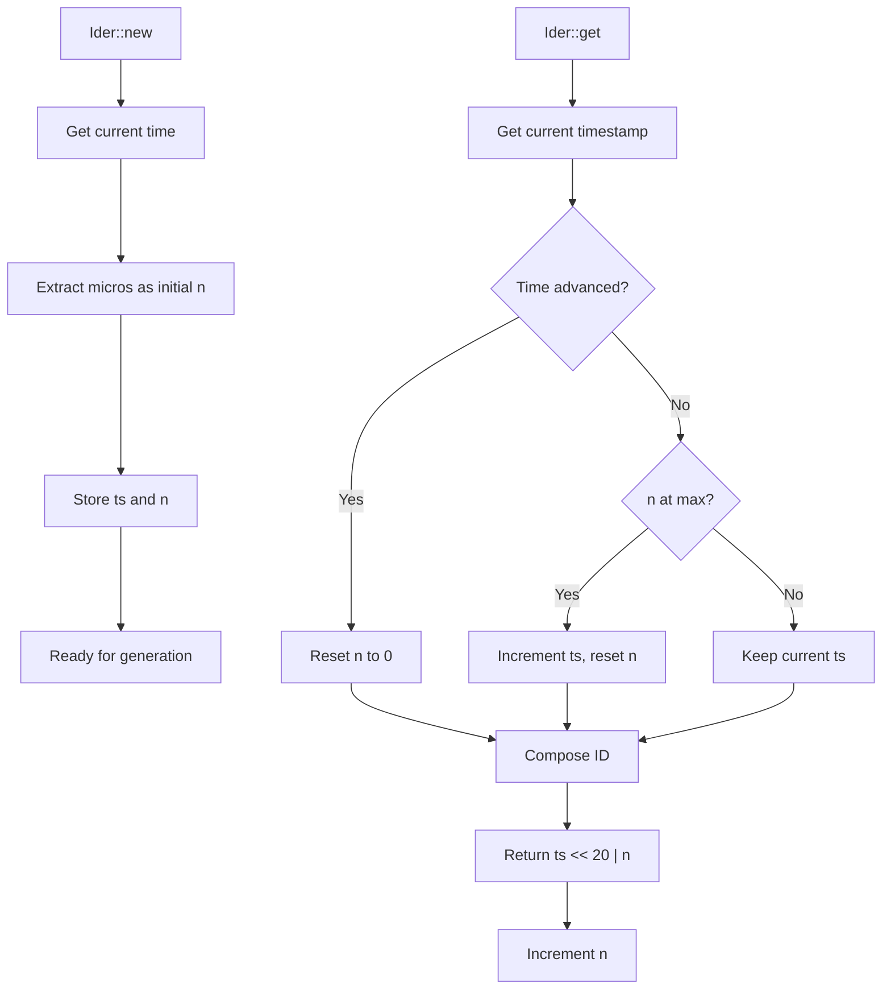

# Ider : High-Performance Time-Based ID Generator

## Table of Contents

- [Overview](#overview)
- [Features](#features)
- [Installation](#installation)
- [Usage](#usage)
- [API Reference](#api-reference)
- [Design](#design)
- [Performance](#performance)
- [Technical Stack](#technical-stack)
- [Directory Structure](#directory-structure)
- [Historical Context](#historical-context)

## Overview

Ider is a high-performance, time-based unique ID generator written in Rust. It generates 64-bit monotonically increasing IDs with clock backward tolerance and restart collision avoidance.

## Features

- Monotonic increasing IDs
- ~1M IDs per second generation rate
- Clock backward tolerance
- Restart collision avoidance
- O(1) time complexity with no heap allocation
- Iterator support for sequential generation

## Installation

Add this to your `Cargo.toml`:

```toml
[dependencies]
ider = "0.1.0"
```

## Usage

### Basic Usage

```rust
use ider::Ider;

let mut ider = Ider::new();
let id = ider.get();
println!("Generated ID: {}", id);
```

### Iterator Usage

```rust
use ider::Ider;

let mut ider = Ider::new();
let ids: Vec<u64> = ider.by_ref().take(5).collect();
```

### Recovery from Persistence

```rust
use ider::Ider;

let mut ider = Ider::new();
let last_id = load_last_id_from_storage();
ider.init(last_id);
let new_id = ider.get();
```

## API Reference

### Ider Structure

The main ID generator structure with fields:
- `ts`: Unix timestamp in seconds
- `n`: Microsecond position within the second

### Methods

#### `new() -> Self`
Creates new generator with microsecond-based initialization to avoid collision after restart.

#### `init(&mut self, last_id: u64)`
Initializes generator to ensure it's ahead of last_id. Must call after recovery from persistent storage.

#### `get(&mut self) -> u64`
Generates next unique 64-bit ID with O(1) time complexity.

### ID Format

```
| 44 bits timestamp | 20 bits sequence |
|---------------------------------------|
| seconds since epoch | micros within second |
```

## Design

The ID generation follows a two-phase approach:

1. **Initialization Phase**: Uses microseconds within second as initial position
2. **Generation Phase**: Combines timestamp and sequence for unique IDs



## Performance

- **Generation Rate**: ~1,000,000 IDs per second
- **Time Complexity**: O(1)
- **Memory Usage**: Minimal (16 bytes per generator)
- **Allocation**: No heap allocation during generation

## Technical Stack

- **Language**: Rust
- **Edition**: 2024
- **Dependencies**: 
  - `coarsetime` for efficient time operations
- **License**: MulanPSL-2.0

## Directory Structure

```
ider/
├── src/
│   └── lib.rs          # Core implementation
├── tests/
│   └── main.rs         # Test cases
├── readme/
│   ├── en.md           # English documentation
│   └── zh.md           # Chinese documentation
├── Cargo.toml          # Project configuration
└── README.mdt          # Documentation index
```

## Historical Context

The concept of time-based ID generation dates back to the early days of distributed systems. Twitter's Snowflake, introduced in 2010, popularized the approach of combining timestamps with sequence numbers. Ider builds upon this foundation but optimizes for simplicity and performance in single-node scenarios.

Unlike Snowflake's 41-bit timestamp with machine ID and sequence, Ider uses a 44-bit timestamp with 20-bit sequence, providing sufficient capacity for most applications while eliminating the need for machine ID allocation. This design choice reflects the evolution toward containerized and stateless services where unique machine identification becomes less critical.

The microsecond-based initialization strategy in Ider addresses a common pain point in time-based ID generators: collision avoidance after service restarts. By using the current microsecond position as the starting sequence, Ider minimizes the probability of ID collision without requiring persistent state synchronization.