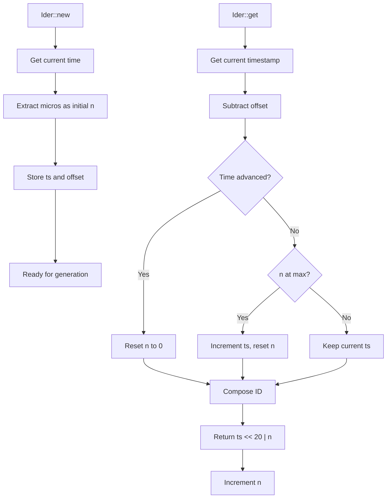

# Ider : High-Performance Time-Based ID Generator

## Table of Contents

- [Overview](#overview)
- [Features](#features)
- [Installation](#installation)
- [Usage](#usage)
  - [Basic Usage](#basic-usage)
  - [Global ID Generator](#global-id-generator)
  - [File Path Encoding](#file-path-encoding)
  - [Iterator Usage](#iterator-usage)
  - [Recovery from Persistence](#recovery-from-persistence)
  - [Extract Timestamp from ID](#extract-timestamp-from-id)
- [API Reference](#api-reference)
- [Design](#design)
- [Performance](#performance)
- [Technical Stack](#technical-stack)
- [Directory Structure](#directory-structure)
- [Historical Context](#historical-context)

## Overview

Ider is a high-performance, time-based unique ID generator written in Rust. It generates 64-bit monotonically increasing IDs with clock backward tolerance, restart collision avoidance, and configurable timestamp offset.

## Features

- **Monotonic increasing IDs**: Guaranteed to be strictly increasing
- **High throughput**: ~1M IDs per second generation rate
- **Clock backward tolerance**: Handles system clock adjustments gracefully
- **Restart collision avoidance**: Microsecond-based initialization prevents collisions
- **Configurable timestamp offset**: Customize ID epoch for flexibility
- **Global ID generator**: Thread-local singleton for convenient ID generation
- **File path encoding**: Base32 encoding for filesystem-safe IDs
- **O(1) time complexity**: No heap allocation during generation
- **Iterator support**: Sequential ID generation via iterator interface

## Installation

Add this to `Cargo.toml`:

```toml
[dependencies]
ider = "0.1.3"
```

### Features

The crate supports optional features:

- `id` (default: disabled): Enables global ID generator (`id()` and `id_init()`)
- `path` (default: disabled): Enables file path encoding utilities (`encode()`, `decode()`, `new()`)

Enable features as needed:

```toml
[dependencies]
ider = { version = "0.1.3", features = ["id", "path"] }
```

## Usage

### Basic Usage

```rust
use ider::Ider;

let mut ider = Ider::new();
let id = ider.get();
println!("Generated ID: {}", id);
```

### Global ID Generator

The `id` feature provides a thread-local global ID generator for convenient use:

```rust
// Enable the "id" feature in Cargo.toml
use ider::id;

let id1 = id();
let id2 = id();
assert!(id2 > id1); // Monotonically increasing

// Initialize with a base ID (e.g., after recovery from storage)
use ider::id_init;
id_init(last_id_from_storage);
```

### File Path Encoding

The `path` feature provides utilities for encoding IDs as filesystem-safe paths:

```rust
// Enable the "path" feature in Cargo.toml (also enables "id")
use ider::path::{encode, decode, new};
use std::path::Path;

// Encode an ID to a base32 string
let id = 1234567890u64;
let encoded = encode(id);
println!("Encoded: {}", encoded);

// Decode back to ID
let decoded = decode(&encoded);
assert_eq!(decoded, Some(id));

// Create a path with auto-generated ID
let dir = Path::new("/tmp/data");
let (id, path) = new(dir);
println!("Generated ID: {}, Path: {:?}", id, path);
```

### Iterator Usage

```rust
use ider::Ider;

let mut ider = Ider::new();
let ids: Vec<u64> = ider.by_ref().take(5).collect();
```

### Recovery from Persistence

```rust
use ider::Ider;

let mut ider = Ider::new();
let last_id = load_last_id_from_storage();
ider.init(last_id);
let new_id = ider.get();
```

### Extract Timestamp from ID

```rust
use ider::{Ider, id_to_ts, id_to_ts_with_offset};

let mut ider = Ider::new();
let id = ider.get();

// Using default offset
let ts = id_to_ts(id);

// Using custom offset
let offset = 1735689600;
let ts_custom = id_to_ts_with_offset(id, offset);
```

## API Reference

### Ider Structure

Main ID generator structure with fields:

- `ts`: Relative timestamp in seconds (adjusted by offset)
- `n`: Sequence number within second (0 to 1,048,575)
- `offset`: Timestamp offset in seconds (default: 2026-01-01 00:00:00 UTC)

### Methods

#### `new() -> Self`

Creates new generator with default offset (2026-01-01 00:00:00 UTC). Uses microseconds within second as initial sequence to avoid collision after restart.

#### `with_offset(offset: u64) -> Self`

Creates new generator with custom timestamp offset. Uses microseconds within second as initial sequence.

**Parameters:**

- `offset`: Timestamp offset in seconds

#### `init(&mut self, last_id: u64)`

Initializes generator to ensure it's ahead of last_id. Must call after recovery from persistent storage to prevent ID collision.

**Parameters:**

- `last_id`: Last generated ID from persistent storage

#### `get(&mut self) -> u64`

Generates next unique 64-bit ID with O(1) time complexity.

**Returns:**

- Monotonically increasing 64-bit ID

### Global ID Functions (requires `id` feature)

#### `id() -> u64`

Generate a unique ID using the thread-local global generator.

**Returns:**

- Unique 64-bit ID

#### `id_init(base: u64)`

Initialize the global ID generator with a base ID. Useful for recovery from persistent storage.

**Parameters:**

- `base`: Base ID to initialize from

### Path Functions (requires `path` feature)

#### `encode(id: u64) -> String`

Encode an ID to a base32 string suitable for filesystem use.

**Parameters:**

- `id`: ID to encode

**Returns:**

- Base32 encoded string

#### `decode(name: &str) -> Option<u64>`

Decode a base32 string back to an ID.

**Parameters:**

- `name`: Base32 encoded string

**Returns:**

- The decoded ID, or `None` if invalid

#### `new(dir: &Path) -> (ID, PathBuf)`

Create a path by joining the directory with an auto-generated encoded ID. Returns both the generated ID and the path.

**Parameters:**

- `dir`: Base directory path

**Returns:**

- A tuple containing:
  - `ID`: The generated unique ID
  - `PathBuf`: Path with encoded ID appended

### Type Aliases

#### `ID`

Type alias for `u64`, representing a unique ID.

```rust
use ider::ID;

let id: ID = 1234567890u64;
```

### Helper Functions

#### `id_to_ts(id: u64) -> u64`

Extracts timestamp from ID using default offset.

**Parameters:**

- `id`: ID to parse

**Returns:**

- Absolute timestamp in seconds since Unix epoch

#### `id_to_ts_with_offset(id: u64, offset: u64) -> u64`

Extracts timestamp from ID using custom offset.

**Parameters:**

- `id`: ID to parse
- `offset`: Timestamp offset in seconds

**Returns:**

- Absolute timestamp in seconds since Unix epoch

### ID Format

```
| 44 bits timestamp | 20 bits sequence |
|---------------------------------------|
| seconds since offset | sequence number |
```

- **Timestamp**: 44 bits (supports ~550 years from offset)
- **Sequence**: 20 bits (0 to 1,048,575, ~1M IDs per second)

## Design

ID generation follows two-phase approach:

1. **Initialization Phase**: Uses microseconds within second as initial sequence
2. **Generation Phase**: Combines timestamp and sequence for unique IDs



### Offset Strategy

Timestamp offset allows customization of ID epoch. Default offset (2026-01-01) extends ID lifespan and provides flexibility for different deployment scenarios. The relative timestamp stored in ID is calculated as: `actual_timestamp - offset`.

### Thread-Local Global Generator

The global ID generator (`id()`) uses thread-local storage, providing a separate generator per thread. This design ensures thread safety without locks and maintains monotonicity within each thread.

### File Path Encoding

The `path` module uses Crockford's base32 encoding for filesystem compatibility. This encoding avoids ambiguous characters and works well across different filesystems.

## Performance

- **Generation Rate**: ~1,000,000 IDs per second
- **Time Complexity**: O(1)
- **Memory Usage**: Minimal (24 bytes per generator)
- **Allocation**: No heap allocation during generation

## Technical Stack

- **Language**: Rust
- **Edition**: 2024
- **Dependencies**:
  - `coarsetime` for efficient time operations
  - `fast32` for base32 encoding/decoding
- **License**: MulanPSL-2.0

## Directory Structure

```
ider/
├── src/
│   ├── lib.rs          # Library entry point
│   ├── ider.rs         # Core Ider implementation
│   ├── id.rs           # Global ID generator (feature: id)
│   └── path.rs         # File path encoding (feature: path)
├── tests/
│   └── main.rs         # Test cases
├── readme/
│   ├── en.md           # English documentation
│   └── zh.md           # Chinese documentation
├── Cargo.toml          # Project configuration
└── README.mdt          # Documentation index
```

## Historical Context

The concept of time-based ID generation dates back to early distributed systems. Twitter's Snowflake, introduced in 2010, popularized combining timestamps with sequence numbers. Ider builds upon this foundation but optimizes for simplicity and performance in single-node scenarios.

Unlike Snowflake's 41-bit timestamp with machine ID and sequence, Ider uses 44-bit timestamp with 20-bit sequence, providing sufficient capacity for most applications while eliminating need for machine ID allocation. This design choice reflects evolution toward containerized and stateless services where unique machine identification becomes less critical.

The microsecond-based initialization strategy in Ider addresses common pain point in time-based ID generators: collision avoidance after service restarts. By using current microsecond position as starting sequence, Ider minimizes probability of ID collision without requiring persistent state synchronization.

The offset feature in Ider draws inspiration from database timestamp strategies where epoch customization helps with data migration and multi-region deployment. Setting custom offset allows applications to align ID generation with business timelines or extend ID lifespan beyond default 44-bit capacity.

The thread-local global generator design ensures thread safety without locking overhead, making it ideal for high-throughput concurrent applications.
