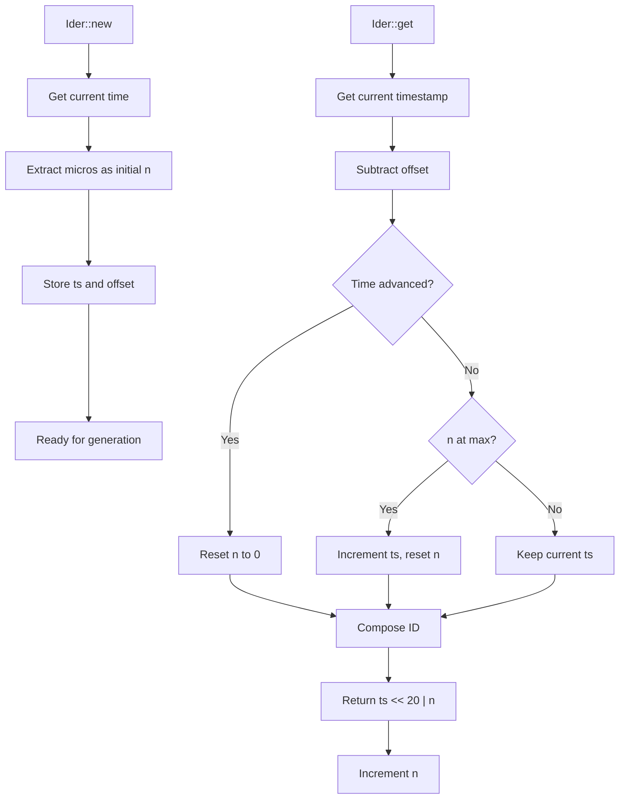

# Ider : High-Performance Time-Based ID Generator

## Table of Contents

- [Overview](#overview)
- [Features](#features)
- [Installation](#installation)
- [Usage](#usage)
- [API Reference](#api-reference)
- [Design](#design)
- [Performance](#performance)
- [Technical Stack](#technical-stack)
- [Directory Structure](#directory-structure)
- [Historical Context](#historical-context)

## Overview

Ider is high-performance, time-based unique ID generator written in Rust. It generates 64-bit monotonically increasing IDs with clock backward tolerance, restart collision avoidance, and configurable timestamp offset.

## Features

- Monotonic increasing IDs
- ~1M IDs per second generation rate
- Clock backward tolerance
- Restart collision avoidance
- Configurable timestamp offset
- O(1) time complexity with no heap allocation
- Iterator support for sequential generation

## Installation

Add this to `Cargo.toml`:

```toml
[dependencies]
ider = "0.1.0"
```

## Usage

### Basic Usage

```rust
use ider::Ider;

let mut ider = Ider::new();
let id = ider.get();
println!("Generated ID: {}", id);
```

### Custom Offset

```rust
use ider::Ider;

let offset = 1735689600; // 2026-01-01 00:00:00 UTC
let mut ider = Ider::with_offset(offset);
let id = ider.get();
```

### Iterator Usage

```rust
use ider::Ider;

let mut ider = Ider::new();
let ids: Vec<u64> = ider.by_ref().take(5).collect();
```

### Recovery from Persistence

```rust
use ider::Ider;

let mut ider = Ider::new();
let last_id = load_last_id_from_storage();
ider.init(last_id);
let new_id = ider.get();
```

### Extract Timestamp from ID

```rust
use ider::{Ider, id_to_ts, id_to_ts_with_offset};

let mut ider = Ider::new();
let id = ider.get();

// Using default offset
let ts = id_to_ts(id);

// Using custom offset
let offset = 1735689600;
let ts_custom = id_to_ts_with_offset(id, offset);
```

## API Reference

### Ider Structure

Main ID generator structure with fields:
- `ts`: Relative timestamp in seconds (adjusted by offset)
- `n`: Sequence number within second (0 to 1,048,575)
- `offset`: Timestamp offset in seconds (default: 2026-01-01 00:00:00 UTC)

### Methods

#### `new() -> Self`
Creates new generator with default offset (2026-01-01 00:00:00 UTC). Uses microseconds within second as initial sequence to avoid collision after restart.

#### `with_offset(offset: u64) -> Self`
Creates new generator with custom timestamp offset. Uses microseconds within second as initial sequence.

**Parameters:**
- `offset`: Timestamp offset in seconds

#### `init(&mut self, last_id: u64)`
Initializes generator to ensure it's ahead of last_id. Must call after recovery from persistent storage to prevent ID collision.

**Parameters:**
- `last_id`: Last generated ID from persistent storage

#### `get(&mut self) -> u64`
Generates next unique 64-bit ID with O(1) time complexity.

**Returns:**
- Monotonically increasing 64-bit ID

### Helper Functions

#### `id_to_ts(id: u64) -> u64`
Extracts timestamp from ID using default offset.

**Parameters:**
- `id`: ID to parse

**Returns:**
- Absolute timestamp in seconds since Unix epoch

#### `id_to_ts_with_offset(id: u64, offset: u64) -> u64`
Extracts timestamp from ID using custom offset.

**Parameters:**
- `id`: ID to parse
- `offset`: Timestamp offset in seconds

**Returns:**
- Absolute timestamp in seconds since Unix epoch

### ID Format

```
| 44 bits timestamp | 20 bits sequence |
|---------------------------------------|
| seconds since offset | sequence number |
```

- **Timestamp**: 44 bits (supports ~550 years from offset)
- **Sequence**: 20 bits (0 to 1,048,575, ~1M IDs per second)

## Design

ID generation follows two-phase approach:

1. **Initialization Phase**: Uses microseconds within second as initial sequence
2. **Generation Phase**: Combines timestamp and sequence for unique IDs



### Offset Strategy

Timestamp offset allows customization of ID epoch. Default offset (2026-01-01) extends ID lifespan and provides flexibility for different deployment scenarios. The relative timestamp stored in ID is calculated as: `actual_timestamp - offset`.

## Performance

- **Generation Rate**: ~1,000,000 IDs per second
- **Time Complexity**: O(1)
- **Memory Usage**: Minimal (24 bytes per generator)
- **Allocation**: No heap allocation during generation

## Technical Stack

- **Language**: Rust
- **Edition**: 2024
- **Dependencies**:
  - `coarsetime` for efficient time operations
- **License**: MulanPSL-2.0

## Directory Structure

```
ider/
├── src/
│   └── lib.rs          # Core implementation
├── tests/
│   └── main.rs         # Test cases
├── readme/
│   ├── en.md           # English documentation
│   └── zh.md           # Chinese documentation
├── Cargo.toml          # Project configuration
└── README.mdt          # Documentation index
```

## Historical Context

The concept of time-based ID generation dates back to early distributed systems. Twitter's Snowflake, introduced in 2010, popularized combining timestamps with sequence numbers. Ider builds upon this foundation but optimizes for simplicity and performance in single-node scenarios.

Unlike Snowflake's 41-bit timestamp with machine ID and sequence, Ider uses 44-bit timestamp with 20-bit sequence, providing sufficient capacity for most applications while eliminating need for machine ID allocation. This design choice reflects evolution toward containerized and stateless services where unique machine identification becomes less critical.

The microsecond-based initialization strategy in Ider addresses common pain point in time-based ID generators: collision avoidance after service restarts. By using current microsecond position as starting sequence, Ider minimizes probability of ID collision without requiring persistent state synchronization.

The offset feature in Ider draws inspiration from database timestamp strategies where epoch customization helps with data migration and multi-region deployment. Setting custom offset allows applications to align ID generation with business timelines or extend ID lifespan beyond default 44-bit capacity.