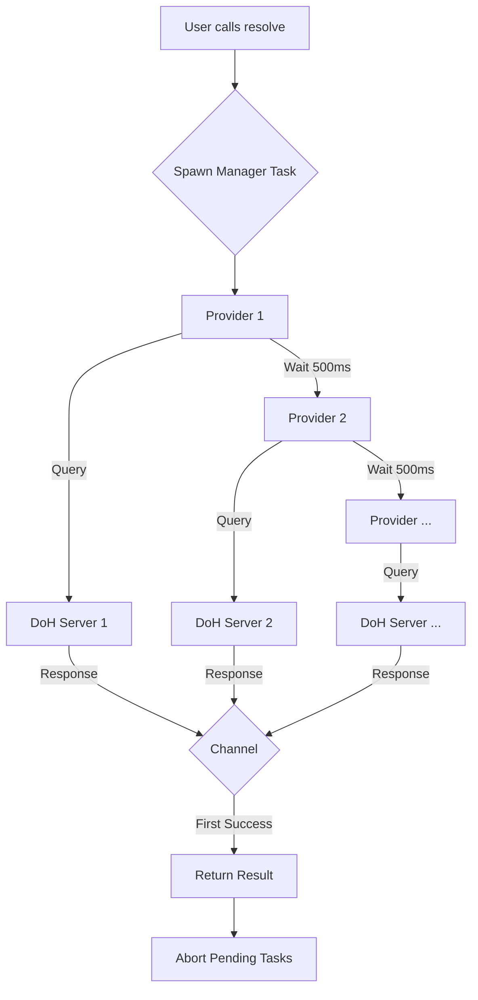
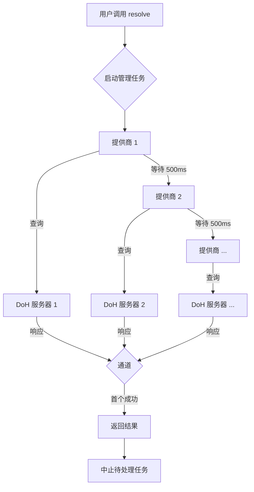

[English](#en) | [中文](#zh)

---

<a id="en"></a>

# idoh : Fast and secure DNS over HTTPS resolution

`idoh` is a lightweight, high-performance Rust library for DNS over HTTPS (DoH) resolution. It concurrently queries multiple DoH providers and returns the fastest response, ensuring both speed and reliability.

## Table of Contents

- [Features](#features)
- [Usage](#usage)
  - [Basic Usage](#basic-usage)
  - [Using MX Feature](#using-mx-feature)
- [Design](#design)
- [Tech Stack](#tech-stack)
- [Directory Structure](#directory-structure)
- [API Reference](#api-reference)
- [History: The Rise of DoH](#history-the-rise-of-doh)

## Features

*   **Concurrent Resolution**: Queries multiple DoH providers (Google, Cloudflare, Tencent, etc.) simultaneously.
*   **Fastest Response Wins**: Returns the result from the first provider to respond successfully.
*   **Robust Error Handling**: Automatically handles failures from individual providers without compromising the overall resolution process.
*   **Simple API**: Easy-to-use `resolve` function for common DNS record types.
*   **Typed MX Records**: Optional `mx` feature provides structured MX record parsing.
*   **Customizable**: Supports custom extraction logic for DNS answers.

## Usage

Add `idoh` to your `Cargo.toml`:

```toml
[dependencies]
idoh = "0.1.7"
```

### Basic Usage

Use the generic `resolve` function for any DNS record type:

```rust
use aok::{Result, OK};

#[tokio::main]
async fn main() -> Result<()> {
  let domain = "example.com";

  // Resolve A records
  let records = idoh::resolve(domain, "A", |answers| {
    let mut ips = Vec::new();
    for answer in answers {
      if answer.r#type == idoh::record_type::A {
        ips.push(answer.data);
      }
    }
    Ok(Some(ips))
  })
  .await?;

  println!("A Records: {:?}", records);
  OK
}
```

### Using MX Feature

Enable the `mx` feature for structured MX record parsing:

```toml
[dependencies]
idoh = { version = "0.1.7", features = ["mx"] }
```

```rust
use aok::{Result, OK};

#[tokio::main]
async fn main() -> Result<()> {
  let mx_records = idoh::mx("gmail.com").await?;
  
  for record in mx_records {
    println!("Priority: {}, Server: {}, TTL: {}s", 
      record.priority, record.server, record.ttl);
  }
  
  OK
}
```

## Design

The core design philosophy of `idoh` is **speed through concurrency**.

1.  **Task Spawning**: When `resolve` is called, it spawns a background task.
2.  **Staggered Concurrency**: The task iterates through a predefined list of high-quality DoH providers (`DOH_LI`). It spawns a sub-task for a provider every **500ms**. This strategy balances speed and resource usage: if the first provider is fast, we don't waste resources querying others.
3.  **Race to Finish**: A bounded channel (`crossfire::mpsc::bounded_async`) acting as a message queue with a capacity of 1 is used to collect the result. The first successful response wins and is sent to the channel.
4.  **Cancellation**: Once a result is received, the main `resolve` function returns, and the background tasks are aborted using `defer-lite` to clean up resources.

### Flowchart



## Tech Stack

*   **[tokio](https://tokio.rs/)**: Asynchronous runtime for executing concurrent tasks.
*   **[ireq](https://crates.io/crates/ireq)**: Simple and efficient HTTP client for making DoH requests.
*   **[sonic-rs](https://github.com/cloudwego/sonic)**: High-performance JSON parsing for processing DNS responses.
*   **[crossfire](https://crates.io/crates/crossfire)**: High-performance channels for task communication.

## Directory Structure

*   `src/lib.rs`: The main entry point. Exports the public API and modules.
*   `src/resolve.rs`: Contains the core `resolve` logic and the list of DoH providers (`DOH_LI`).
*   `src/post.rs`: Handles the HTTP GET requests to DoH providers and defines the `Answer` struct.
*   `src/record_type.rs`: Defines constants for common DNS record types (e.g., `A`, `MX`, `TXT`).
*   `src/mx.rs`: (Optional, requires `mx` feature) Provides the `mx` function and `Mx` struct for structured MX record queries.

## API Reference

### `resolve`

```rust
pub async fn resolve<T>(
  name: impl AsRef<str>,
  record_type: impl AsRef<str>,
  extract: impl Fn(Vec<Answer>) -> Result<Option<T>> + Send + 'static + Clone,
) -> Result<T>
```

*   `name`: The domain name to resolve.
*   `record_type`: The DNS record type (e.g., "A", "AAAA", "MX", "TXT").
*   `extract`: A closure to process the list of `Answer`s and return the desired result `T`.

### `mx` (requires `mx` feature)

```rust
pub async fn mx(domain: impl AsRef<str>) -> Result<Vec<Mx>>
```

Queries MX records for a domain and returns structured results.

*   `domain`: The domain name to query.
*   Returns: A vector of `Mx` structs, sorted by the DNS server (not by priority).

### `Mx` Struct

```rust
pub struct Mx {
  pub priority: u16,
  pub server: String,
  pub ttl: u64,
}
```

Represents a mail exchange record:
*   `priority`: Mail server priority (lower values indicate higher priority).
*   `server`: Mail server hostname (trailing dots are automatically removed).
*   `ttl`: Time to live in seconds.

### `Answer` Struct

```rust
pub struct Answer {
  pub name: String,
  pub r#type: u16,
  pub ttl: u64,
  pub data: String,
}
```

Represents a single DNS record returned by the DoH provider.

### `record_type` Module

Contains constants for DNS record types:
*   `A` (1) - IPv4 address
*   `NS` (2) - Name server
*   `CNAME` (5) - Canonical name
*   `SOA` (6) - Start of authority
*   `PTR` (12) - Pointer record
*   `MX` (15) - Mail exchange
*   `TXT` (16) - Text record
*   `AAAA` (28) - IPv6 address
*   `SRV` (33) - Service locator
*   `ANY` (255) - Any record type

## History: The Rise of DoH

DNS over HTTPS (DoH) was introduced to address the privacy and security vulnerabilities of traditional DNS. Traditional DNS queries are sent in plaintext, allowing anyone on the network path to see which websites a user is visiting.

*   **2018**: The IETF standardized DoH as RFC 8484.
*   **Adoption**: Major browsers like Firefox and Chrome began supporting DoH to protect user privacy.
*   **Impact**: DoH encrypts DNS traffic, preventing eavesdropping and manipulation, making the internet safer for everyone.

`idoh` builds on this legacy by providing a tool to easily integrate secure and fast DNS resolution into Rust applications.

---

## About

This project is an open-source component of [js0.site ⋅ Refactoring the Internet Plan](https://js0.site).

We are redefining the development paradigm of the Internet in a componentized way. Welcome to follow us:

* [Google Group](https://groups.google.com/g/js0-site)
* [js0site.bsky.social](https://bsky.app/profile/js0site.bsky.social)

---

<a id="zh"></a>

# idoh : 极速安全的 DNS over HTTPS 解析库

`idoh` 是一个轻量级、高性能的 Rust 库，用于 DNS over HTTPS (DoH) 解析。它并发查询多个 DoH 提供商并返回最快的响应，确保速度和可靠性。

## 目录

- [功能特性](#功能特性)
- [使用指南](#使用指南)
  - [基础用法](#基础用法)
  - [使用 MX 特性](#使用-mx-特性)
- [设计思路](#设计思路)
- [技术栈](#技术栈)
- [目录结构](#目录结构)
- [API 参考](#api-参考)
- [历史背景：DoH 的崛起](#历史背景doh-的崛起)

## 功能特性

*   **并发解析**：同时查询多个 DoH 提供商（Google, Cloudflare, 腾讯等）。
*   **极速响应**：返回首个成功响应的提供商结果，唯快不破。
*   **健壮容错**：自动处理单个提供商的失败，不影响整体解析流程。
*   **API 简洁**：提供简单易用的 `resolve` 函数，满足常见 DNS 记录类型查询。
*   **类型化 MX 记录**：可选的 `mx` 特性提供结构化的 MX 记录解析。
*   **高度定制**：支持自定义 DNS 结果提取逻辑。

## 使用指南

在 `Cargo.toml` 中添加 `idoh`：

```toml
[dependencies]
idoh = "0.1.7"
```

### 基础用法

使用通用的 `resolve` 函数查询任意 DNS 记录类型：

```rust
use aok::{Result, OK};

#[tokio::main]
async fn main() -> Result<()> {
  let domain = "example.com";

  // 解析 A 记录
  let records = idoh::resolve(domain, "A", |answers| {
    let mut ips = Vec::new();
    for answer in answers {
      if answer.r#type == idoh::record_type::A {
        ips.push(answer.data);
      }
    }
    Ok(Some(ips))
  })
  .await?;

  println!("A 记录: {:?}", records);
  OK
}
```

### 使用 MX 特性

启用 `mx` 特性以获得结构化的 MX 记录解析：

```toml
[dependencies]
idoh = { version = "0.1.7", features = ["mx"] }
```

```rust
use aok::{Result, OK};

#[tokio::main]
async fn main() -> Result<()> {
  let mx_records = idoh::mx("gmail.com").await?;
  
  for record in mx_records {
    println!("优先级: {}, 服务器: {}, TTL: {}秒", 
      record.priority, record.server, record.ttl);
  }
  
  OK
}
```

## 设计思路

`idoh` 的核心设计理念是 **通过并发实现极速**。

1.  **任务生成**：调用 `resolve` 时，会启动一个后台任务。
2.  **交错并发**：任务遍历预定义的优质 DoH 提供商列表 (`DOH_LI`)，每隔 **500毫秒** 启动一个新的查询子任务。这种策略在速度和资源之间取得了平衡：如果第一个提供商响应够快，就不必浪费资源查询后续提供商。
3.  **竞速机制**：使用容量为 1 的有界通道 (`crossfire::mpsc::bounded_async`) 作为消息队列来收集结果。谁先成功响应，谁的结果就会被写入通道并返回。
4.  **自动清理**：一旦收到结果，主 `resolve` 函数返回，并通过 `defer-lite` 自动中止剩余的后台任务，释放资源。

### 流程图



## 技术栈

*   **[tokio](https://tokio.rs/)**：用于执行并发任务的异步运行时。
*   **[ireq](https://crates.io/crates/ireq)**：简单高效的 HTTP 客户端，用于发送 DoH 请求。
*   **[sonic-rs](https://github.com/cloudwego/sonic)**：高性能 JSON 解析库，用于处理 DNS 响应。
*   **[crossfire](https://crates.io/crates/crossfire)**：高性能通道，用于任务间通信。

## 目录结构

*   `src/lib.rs`：库入口，导出公共 API 和模块。
*   `src/resolve.rs`：包含核心 `resolve` 逻辑和 DoH 提供商列表 (`DOH_LI`)。
*   `src/post.rs`：处理向 DoH 提供商发送 HTTP GET 请求，定义 `Answer` 结构体。
*   `src/record_type.rs`：定义常用 DNS 记录类型的常量（如 `A`, `MX`, `TXT`）。
*   `src/mx.rs`：（可选，需要 `mx` 特性）提供 `mx` 函数和 `Mx` 结构体，用于结构化 MX 记录查询。

## API 参考

### `resolve`

```rust
pub async fn resolve<T>(
  name: impl AsRef<str>,
  record_type: impl AsRef<str>,
  extract: impl Fn(Vec<Answer>) -> Result<Option<T>> + Send + 'static + Clone,
) -> Result<T>
```

*   `name`: 要解析的域名。
*   `record_type`: DNS 记录类型（如 "A", "AAAA", "MX", "TXT"）。
*   `extract`: 处理 `Answer` 列表并返回所需结果 `T` 的闭包。

### `mx`（需要 `mx` 特性）

```rust
pub async fn mx(domain: impl AsRef<str>) -> Result<Vec<Mx>>
```

查询域名的 MX 记录并返回结构化结果。

*   `domain`: 要查询的域名。
*   返回值: `Mx` 结构体的向量，按 DNS 服务器返回顺序排序（不按优先级排序）。

### `Mx` 结构体

```rust
pub struct Mx {
  pub priority: u16,
  pub server: String,
  pub ttl: u64,
}
```

表示邮件交换记录：
*   `priority`: 邮件服务器优先级（数值越小优先级越高）。
*   `server`: 邮件服务器主机名（自动移除末尾的点号）。
*   `ttl`: 生存时间（秒）。

### `Answer` 结构体

```rust
pub struct Answer {
  pub name: String,
  pub r#type: u16,
  pub ttl: u64,
  pub data: String,
}
```

表示 DoH 提供商返回的单条 DNS 记录。

### `record_type` 模块

包含 DNS 记录类型的常量：
*   `A` (1) - IPv4 地址
*   `NS` (2) - 名称服务器
*   `CNAME` (5) - 规范名称
*   `SOA` (6) - 授权起始
*   `PTR` (12) - 指针记录
*   `MX` (15) - 邮件交换
*   `TXT` (16) - 文本记录
*   `AAAA` (28) - IPv6 地址
*   `SRV` (33) - 服务定位
*   `ANY` (255) - 任意记录类型

## 历史背景：DoH 的崛起

DNS over HTTPS (DoH) 的引入是为了解决传统 DNS 的隐私和安全漏洞。传统 DNS 查询以明文形式发送，允许网络路径上的任何人查看用户正在访问的网站。

*   **2018年**：IETF 将 DoH 标准化为 RFC 8484。
*   **普及**：Firefox 和 Chrome 等主流浏览器开始支持 DoH 以保护用户隐私。
*   **影响**：DoH 加密了 DNS 流量，防止窃听和篡改，让互联网对每个人都更安全。

`idoh` 建立在这一基础之上，为 Rust 应用提供了一种简单、快速且安全的 DNS 解析集成方案。

---

## 关于

本项目为 [js0.site ⋅ 重构互联网计划](https://js0.site) 的开源组件。

我们正在以组件化的方式重新定义互联网的开发范式，欢迎关注：

* [谷歌邮件列表](https://groups.google.com/g/js0-site)
* [js0site.bsky.social](https://bsky.app/profile/js0site.bsky.social)
