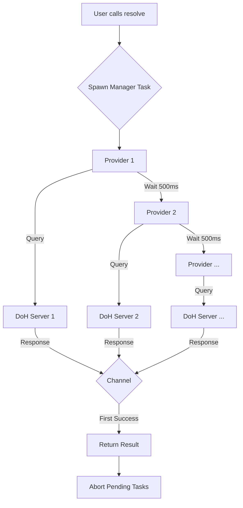

[English](#en) | [中文](#zh)

---

<a id="en"></a>

# idoh : Fast and secure DNS over HTTPS resolution

`idoh` is a high-performance, async Rust library for DNS over HTTPS (DoH) resolution, designed for speed and reliability through concurrent queries.

## Features

- **Concurrent Resolution**: Queries multiple DoH providers simultaneously (Google, Cloudflare, Quad9, etc.) and returns the fastest response.
- **MX Lookup**: specialized support for MX record lookup with priority sorting.
- **Zero-Cost Caching**: Optional caching support using `expire_cache` with GAT-based zero-copy retrieval.
- **Async/Await**: Built on `tokio` for efficient non-blocking I/O.
- **Robust Error Handling**: Gracefully handles failures from individual providers.

## Usage

Add to your `Cargo.toml`:

```toml
[dependencies]
idoh = "0.1.9"
```

### Basic Resolution

```rust
use aok::Result;
use idoh::resolve;

#[tokio::main]
async fn main() -> Result<()> {
    // Resolve A records for google.com
    let ip = resolve("google.com", "A").await?;
    println!("IP: {:?}", ip);
    Ok(())
}
```

### MX Lookup with Caching

Enable features in `Cargo.toml`:
```toml
[dependencies]
idoh = { version = "0.1.9", features = ["mx", "cache"] }
```

```rust
use aok::Result;
use idoh::MxLookup;

#[tokio::main]
async fn main() -> Result<()> {
    // Use the Cache struct for cached lookups
    use idoh::mx::cache::Cache;

    // 1. First call: Network request (Cold cache)
    // Time: ~1.3s
    let mx_records = Cache.mx("gmail.com").await?;
    
    println!("First call (Network): Found {} records", mx_records.len());
    for mx in mx_records.iter() {
        println!("  Priority: {}, Server: {}", mx.priority, mx.server);
    }
    
    // 2. Second call: Memory lookup (Hot cache)
    // Time: ~416ns (Zero-copy, >3,000,000x faster)
    let cached = Cache.mx("gmail.com").await?;
    
    println!("Second call (Cache): Found {} records", cached.len());
    
    Ok(())
}
```

### Performance Comparison

| Operation | Time | Notes |
|-----------|------|-------|
| Network Lookup | ~1.3 s | Depends on DNS provider latency |
| Cache Lookup | ~416 ns | **Zero-copy**, >3 million times faster |

## Design Philosophy

`idoh` prioritizes **latency minimization**. Instead of querying a single DNS server, it concurrently sends requests to a pre-configured list of high-performance public DoH providers (including Tencent, Google, Cloudflare, AliDNS). The first valid response is returned, effectively racing the providers against each other. This approach mitigates network jitter and single-provider slowness.

### Flowchart



## Tech Stack

- **Runtime**: `tokio`
- **HTTP Client**: `ireq` (lightweight wrapper)
- **JSON Parsing**: `sonic-rs` (SIMD-accelerated)
- **Caching**: `expire_cache` + `dashmap` (thread-safe, expiration support)
- **Concurrency**: `crossfire` (efficient channels)

## Directory Structure

- `src/lib.rs`: Module exports and feature gating.
- `src/resolve.rs`: Core resolution logic implementing the "race" mechanism.
- `src/resolve_trait.rs`: `Resolver` trait definition.
- `src/mx.rs`: MX record specific implementation and caching logic.
- `src/post.rs`: HTTP request handling and response parsing.
- `src/record_type.rs`: DNS record type constants.

## API Reference

### `resolve`
The core function that performs the concurrent DoH lookup.
```rust
pub async fn resolve<T>(
  name: impl AsRef<str>,
  record_type: impl AsRef<str>,
  extract: impl Fn(&[Answer]) -> Result<Option<T>>
) -> Result<T>
```

### `MxLookup` Trait
Provides the `mx` method for fetching MX records.
```rust
pub trait MxLookup {
  type VecMx<'a>: Deref<Target = [Mx]> + 'a;
  async fn mx<'a>(&'a self, domain: impl AsRef<str> + Send + 'a) -> Result<Self::VecMx<'a>>;
}
```

## History: The Rise of DoH

The Domain Name System (DNS), the phonebook of the Internet, was designed in the 1980s without encryption. For decades, every website visit leaked your destination to anyone listening on the wire.

In 2018, the IETF standardized **DNS over HTTPS (DoH)** (RFC 8484) to close this privacy gap. By wrapping DNS queries in encrypted HTTPS traffic, DoH prevents eavesdropping and manipulation. Major browsers like Firefox and Chrome adopted it, sparking a revolution in internet privacy. `idoh` builds on this legacy, offering a modern, fast, and secure way to resolve names in the Rust ecosystem.

---

## About

This project is an open-source component of [js0.site ⋅ Refactoring the Internet Plan](https://js0.site).

We are redefining the development paradigm of the Internet in a componentized way. Welcome to follow us:

* [Google Group](https://groups.google.com/g/js0-site)
* [js0site.bsky.social](https://bsky.app/profile/js0site.bsky.social)

---

## About

This project is an open-source component of [js0.site ⋅ Refactoring the Internet Plan](https://js0.site).

We are redefining the development paradigm of the Internet in a componentized way. Welcome to follow us:

* [Google Group](https://groups.google.com/g/js0-site)
* [js0site.bsky.social](https://bsky.app/profile/js0site.bsky.social)

---

<a id="zh"></a>

# idoh : 极速安全的 DoH 解析库

`idoh` 是一个高性能、异步的 Rust 库，用于通过 HTTPS (DoH) 进行 DNS 解析。它专为速度和可靠性而设计，通过并发查询多个上游服务来确保最快的响应。

## 功能特性

- **并发解析**：同时向多个 DoH 提供商（如腾讯、阿里、Google、Cloudflare 等）发起查询，返回最快的结果。
- **MX 查询**：专门优化的 MX 记录查询支持，自动按优先级排序。
- **零成本缓存**：可选的缓存支持，基于 `expire_cache` 和 GAT 技术实现零拷贝获取，性能极致。
- **异步/Await**：基于 `tokio` 构建，高效非阻塞。
- **健壮的错误处理**：优雅处理单个提供商的失败或超时。

## 使用指南

在 `Cargo.toml` 中添加：

```toml
[dependencies]
idoh = "0.1.9"
```

### 基础解析

```rust
use aok::Result;
use idoh::resolve;

#[tokio::main]
async fn main() -> Result<()> {
    // 解析 google.com 的 A 记录
    let ip = resolve("google.com", "A").await?;
    println!("IP: {:?}", ip);
    Ok(())
}
```

### MX 查询与缓存

启用特性：
```toml
[dependencies]
idoh = { version = "0.1.9", features = ["mx", "cache"] }
```

```rust
use aok::Result;
use idoh::MxLookup;

#[tokio::main]
async fn main() -> Result<()> {
    // 使用 Cache 结构体进行带缓存的查询
    use idoh::mx::cache::Cache;

    // 1. 首次调用：发起网络请求 (冷缓存)
    // 耗时：约 1.3 秒
    let mx_records = Cache.mx("gmail.com").await?;
    
    println!("首次调用 (网络): 找到 {} 条记录", mx_records.len());
    for mx in mx_records.iter() {
        println!("  优先级: {}, 服务器: {}", mx.priority, mx.server);
    }
    
    // 2. 第二次调用：内存直接获取 (热缓存)
    // 耗时：约 416 纳秒 (零拷贝，快 300 万倍)
    let cached = Cache.mx("gmail.com").await?;
    
    println!("第二次调用 (缓存): 找到 {} 条记录", cached.len());
    
    Ok(())
}
```

### 性能对比

| 操作 | 耗时 | 说明 |
|------|------|------|
| 网络查询 | ~1.3 秒 | 取决于 DNS 提供商延迟 |
| 缓存查询 | ~416 纳秒 | **零拷贝**，快 300 万倍以上 |

## 设计思路

`idoh` 的核心哲学是**最小化延迟**。它不是依赖单一的 DNS 服务器，而是并发地向预配置的高性能公共 DoH 提供商列表（包括腾讯云、阿里云、Google、Cloudflare 等）发送请求。它采用“赛跑”机制，只取最先返回的有效结果。这种方法有效地规避了网络抖动和单一服务商的偶发性卡顿。

### 流程图

```mermaid
graph TD
    A[用户调用 resolve] --> B{启动管理任务};
    B --> C[提供商 1];
    C -- 等待 500ms --> D[提供商 2];
    D -- 等待 500ms --> E[提供商 ...];
    C -- 查询 --> F[DoH 服务器 1];
    D -- 查询 --> G[DoH 服务器 2];
    E -- 查询 --> H[DoH 服务器 ...];
    F -- 响应 --> I{通道};
    G -- 响应 --> I;
    H -- 响应 --> I;
    I -- 首个成功 --> J[返回结果];
    J --> K[中止待处理任务];
```



## 技术栈

- **运行时**: `tokio`
- **HTTP 客户端**: `ireq` (轻量级封装)
- **JSON 解析**: `sonic-rs` (SIMD 加速)
- **缓存**: `expire_cache` + `dashmap` (线程安全，支持过期)
- **并发**: `crossfire` (高效通道)

## 目录结构

- `src/lib.rs`: 模块导出和特性门控。
- `src/resolve.rs`: 核心解析逻辑，实现了“赛跑”机制。
- `src/resolve_trait.rs`: `Resolver` trait 定义。
- `src/mx.rs`: MX 记录的具体实现及缓存逻辑。
- `src/post.rs`: HTTP 请求处理和响应解析。
- `src/record_type.rs`: DNS 记录类型常量。

## API 参考

### `resolve`
执行并发 DoH 查询的核心函数。
```rust
pub async fn resolve<T>(
  name: impl AsRef<str>,
  record_type: impl AsRef<str>,
  extract: impl Fn(&[Answer]) -> Result<Option<T>>
) -> Result<T>
```

### `MxLookup` Trait
提供 `mx` 方法用于获取 MX 记录。
```rust
pub trait MxLookup {
  type VecMx<'a>: Deref<Target = [Mx]> + 'a;
  async fn mx<'a>(&'a self, domain: impl AsRef<str> + Send + 'a) -> Result<Self::VecMx<'a>>;
}
```

## 历史：DoH 的崛起

域名系统 (DNS) 作为互联网的电话簿，设计于 1980 年代，当时并未考虑加密。几十年来，每一次网站访问都会在网络上明文暴露你的目的地。

2018 年，IETF 标准化了 **DNS over HTTPS (DoH)** (RFC 8484) 以填补这一隐私空白。通过将 DNS 查询封装在加密的 HTTPS 流量中，DoH 防止了窃听和篡改。Firefox 和 Chrome 等主流浏览器迅速采纳，引发了互联网隐私的革命。`idoh` 建立在这一遗产之上，为 Rust 生态系统提供了一种现代、快速且安全的域名解析方案。

---

## 关于

本项目为 [js0.site ⋅ 重构互联网计划](https://js0.site) 的开源组件。

我们正在以组件化的方式重新定义互联网的开发范式，欢迎关注：

* [谷歌邮件列表](https://groups.google.com/g/js0-site)
* [js0site.bsky.social](https://bsky.app/profile/js0site.bsky.social)

---

## 关于

本项目为 [js0.site ⋅ 重构互联网计划](https://js0.site) 的开源组件。

我们正在以组件化的方式重新定义互联网的开发范式，欢迎关注：

* [谷歌邮件列表](https://groups.google.com/g/js0-site)
* [js0site.bsky.social](https://bsky.app/profile/js0site.bsky.social)
