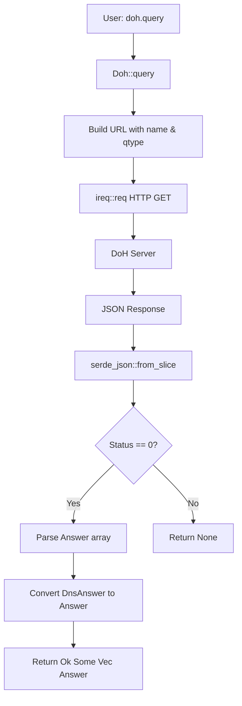
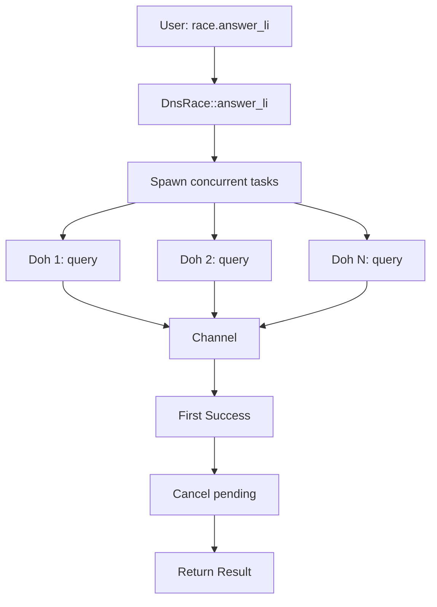

# idoh : Async DoH Client for Rust

## Table of Contents

- [Introduction](#introduction)
- [Features](#features)
- [Usage](#usage)
- [Design](#design)
- [API Reference](#api-reference)
- [Tech Stack](#tech-stack)
- [Directory Structure](#directory-structure)
- [History](#history)
- [About](#about)

## Introduction

`idoh` is an async Rust library for DNS over HTTPS (DoH) resolution.

Built on [idns](https://crates.io/crates/idns), which provides `DnsRace`, `Cache`, `Parse` trait, and more.

## Features

- Multiple DoH providers (Tencent, Google, Cloudflare, DNS.SB, 360, NextDNS, AliDNS)
- Simple API with direct DNS answer access
- Async/await based on `tokio`
- Robust error handling for provider failures
- Optional static initialization for global DoH client
- Strong type safety

## Usage

Add to `Cargo.toml`:

```toml
[dependencies]
idoh = "0.2"
idns = "0.2"
```

### Basic Query

```rust
use idns::QType;
use idoh::Doh;

#[tokio::main]
async fn main() -> Result<(), Box<dyn std::error::Error>> {
  let doh = Doh::new("dns.google/resolve");
  let answers = doh.query("google.com", QType::A).await?;

  if let Some(answers) = answers {
    for answer in answers {
      println!("IP: {}", answer.val);
    }
  }
  Ok(())
}
```

### TXT Record Lookup

```rust
use idns::QType;
use idoh::Doh;

#[tokio::main]
async fn main() -> Result<(), Box<dyn std::error::Error>> {
  let doh = Doh::new("dns.google/resolve");
  let answers = doh.query("qq.com", QType::TXT).await?;

  if let Some(answers) = answers {
    for answer in answers {
      if answer.val.starts_with("v=spf1") {
        println!("SPF: {}", answer.val);
      }
    }
  }
  Ok(())
}
```

### DnsRace + Cache (Recommended)

Race multiple DoH servers and cache results:

```rust
use idoh::{DOH_LI, doh_li};
use idns::{Cache, DnsRace, Mx, Query};
use std::time::Instant;

#[tokio::main]
async fn main() {
  let race = DnsRace::new(doh_li(DOH_LI));
  let cache: Cache<Mx> = Cache::new(60); // 60s TTL

  // First query (cache miss)
  let t1 = Instant::now();
  let r1 = cache.query(&race, "gmail.com").await;
  let d1 = t1.elapsed();
  println!("First: {}ms", d1.as_millis());
  if let Some(mx_list) = &*r1.unwrap() {
    for mx in mx_list {
      println!("  {} {}", mx.priority, mx.server);
    }
  }

  // Second query (cache hit)
  let t2 = Instant::now();
  let _ = cache.query(&race, "gmail.com").await;
  let d2 = t2.elapsed();
  println!("Cache: {}μs", d2.as_micros());
}
```

Output:

```
First: 744ms
  5 gmail-smtp-in.l.google.com
  10 alt1.gmail-smtp-in.l.google.com
  20 alt2.gmail-smtp-in.l.google.com
  30 alt3.gmail-smtp-in.l.google.com
  40 alt4.gmail-smtp-in.l.google.com
Cache: 1μs
```

### Performance

| Operation | Time | Notes |
|-----------|------|-------|
| Network Lookup | ~744 ms | Depends on provider latency |
| Cache Lookup | ~1.8 µs | Zero-copy, >400,000x faster |

## Design

`idoh` prioritizes latency minimization through concurrent queries to multiple DoH providers. The first valid response wins, mitigating network jitter and single-provider slowness.

### Call Flow



### With DnsRace (idns)



## API Reference

### Struct: Doh

DoH client for DNS resolution.

```rust
pub struct Doh {
  pub url: String,
}

impl Doh {
  pub fn new(url: impl Into<String>) -> Self;
  pub async fn query(&self, name: &str, qtype: QType) -> Result<Option<Vec<Answer>>>;
}
```

Implements `idns::Query` trait for integration with `DnsRace` and `Cache`.

### Struct: Answer (from idns)

DNS answer record.

```rust
pub struct Answer {
  pub name: String,
  pub type_id: u16,
  pub ttl: u32,
  pub val: String,
}
```

### Enum: Error

```rust
pub enum Error {
  Http(ireq::Error),
  Json(serde_json::Error),
}
```

### Function: doh_li

Create DoH clients from URL list.

```rust
pub fn doh_li(li: &[&str]) -> Vec<Doh>
```

### Constant: DOH_LI

Pre-configured DoH provider URLs:

```rust
pub static DOH_LI: &[&str] = &[
  "doh.pub/resolve",              // Tencent
  "dns.google/resolve",           // Google
  "cloudflare-dns.com/dns-query", // Cloudflare
  "doh.sb/dns-query",             // DNS.SB
  "doh.360.cn/resolve",           // 360
  "dns.nextdns.io",               // NextDNS
  "dns.alidns.com/resolve",       // AliDNS
];
```

### Static: DOH (feature = "static")

Global `DnsRace<Doh>` instance for convenient access.

```rust
pub static DOH: idns::DnsRace<Doh>
```

## Tech Stack

| Component | Crate | Purpose |
|-----------|-------|---------|
| Runtime | tokio | Async execution |
| HTTP | ireq | Lightweight client with proxy support |
| JSON | serde_json | Response parsing |
| Error | thiserror | Error handling |
| Static Init | static_init | Optional global client |

## Directory Structure

```
├── src/
│   ├── lib.rs      # Module exports, Doh struct, DOH_LI constant
│   └── error.rs    # Error and Result types
├── tests/
│   └── main.rs     # Integration tests
├── Cargo.toml
└── readme/
    ├── en.md       # English documentation
    └── zh.md       # Chinese documentation
```

## History

DNS, the phonebook of the Internet, was designed in the 1980s without encryption. Every website visit leaked destinations in plaintext.

In 2018, IETF standardized DNS over HTTPS (RFC 8484). By wrapping DNS queries in encrypted HTTPS traffic, DoH prevents eavesdropping and manipulation.

Paul Mockapetris invented DNS in 1983 (RFC 882/883). He later reflected that security was not considered because "the Internet was a friendly place." Thirty-five years later, DoH finally addressed this oversight.

The name "idoh" follows the naming convention of the js0.site project: "i" prefix + functionality. Here, "doh" represents DNS over HTTPS.

---

## About

This project is part of [js0.site · Refactoring the Internet Plan](https://js0.site).

- [Google Group](https://groups.google.com/g/js0-site)
- [js0site.bsky.social](https://bsky.app/profile/js0site.bsky.social)
