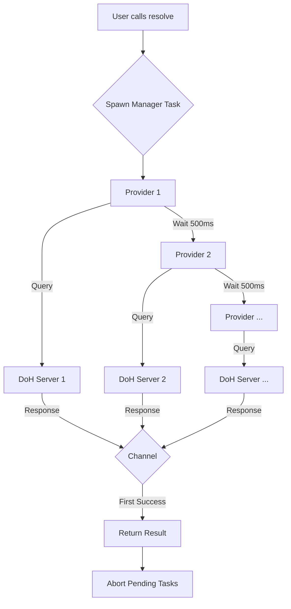

# idoh : Fast and secure DNS over HTTPS resolution

`idoh` is a lightweight, high-performance Rust library for DNS over HTTPS (DoH) resolution. It concurrently queries multiple DoH providers and returns the fastest response, ensuring both speed and reliability.

## Table of Contents

- [Features](#features)
- [Usage](#usage)
  - [Basic Usage](#basic-usage)
  - [Using MX Feature](#using-mx-feature)
- [Design](#design)
- [Tech Stack](#tech-stack)
- [Directory Structure](#directory-structure)
- [API Reference](#api-reference)
- [History: The Rise of DoH](#history-the-rise-of-doh)

## Features

*   **Concurrent Resolution**: Queries multiple DoH providers (Google, Cloudflare, Tencent, etc.) simultaneously.
*   **Fastest Response Wins**: Returns the result from the first provider to respond successfully.
*   **Robust Error Handling**: Automatically handles failures from individual providers without compromising the overall resolution process.
*   **Simple API**: Easy-to-use `resolve` function for common DNS record types.
*   **Typed MX Records**: Optional `mx` feature provides structured MX record parsing.
*   **Customizable**: Supports custom extraction logic for DNS answers.

## Usage

Add `idoh` to your `Cargo.toml`:

```toml
[dependencies]
idoh = "0.1.7"
```

### Basic Usage

Use the generic `resolve` function for any DNS record type:

```rust
use aok::{Result, OK};

#[tokio::main]
async fn main() -> Result<()> {
  let domain = "example.com";

  // Resolve A records
  let records = idoh::resolve(domain, "A", |answers| {
    let mut ips = Vec::new();
    for answer in answers {
      if answer.r#type == idoh::record_type::A {
        ips.push(answer.data);
      }
    }
    Ok(Some(ips))
  })
  .await?;

  println!("A Records: {:?}", records);
  OK
}
```

### Using MX Feature

Enable the `mx` feature for structured MX record parsing:

```toml
[dependencies]
idoh = { version = "0.1.7", features = ["mx"] }
```

```rust
use aok::{Result, OK};

#[tokio::main]
async fn main() -> Result<()> {
  let mx_records = idoh::mx("gmail.com").await?;
  
  for record in mx_records {
    println!("Priority: {}, Server: {}, TTL: {}s", 
      record.priority, record.server, record.ttl);
  }
  
  OK
}
```

## Design

The core design philosophy of `idoh` is **speed through concurrency**.

1.  **Task Spawning**: When `resolve` is called, it spawns a background task.
2.  **Staggered Concurrency**: The task iterates through a predefined list of high-quality DoH providers (`DOH_LI`). It spawns a sub-task for a provider every **500ms**. This strategy balances speed and resource usage: if the first provider is fast, we don't waste resources querying others.
3.  **Race to Finish**: A bounded channel (`crossfire::mpsc::bounded_async`) acting as a message queue with a capacity of 1 is used to collect the result. The first successful response wins and is sent to the channel.
4.  **Cancellation**: Once a result is received, the main `resolve` function returns, and the background tasks are aborted using `defer-lite` to clean up resources.

### Flowchart



## Tech Stack

*   **[tokio](https://tokio.rs/)**: Asynchronous runtime for executing concurrent tasks.
*   **[ireq](https://crates.io/crates/ireq)**: Simple and efficient HTTP client for making DoH requests.
*   **[sonic-rs](https://github.com/cloudwego/sonic)**: High-performance JSON parsing for processing DNS responses.
*   **[crossfire](https://crates.io/crates/crossfire)**: High-performance channels for task communication.

## Directory Structure

*   `src/lib.rs`: The main entry point. Exports the public API and modules.
*   `src/resolve.rs`: Contains the core `resolve` logic and the list of DoH providers (`DOH_LI`).
*   `src/post.rs`: Handles the HTTP GET requests to DoH providers and defines the `Answer` struct.
*   `src/record_type.rs`: Defines constants for common DNS record types (e.g., `A`, `MX`, `TXT`).
*   `src/mx.rs`: (Optional, requires `mx` feature) Provides the `mx` function and `Mx` struct for structured MX record queries.

## API Reference

### `resolve`

```rust
pub async fn resolve<T>(
  name: impl AsRef<str>,
  record_type: impl AsRef<str>,
  extract: impl Fn(Vec<Answer>) -> Result<Option<T>> + Send + 'static + Clone,
) -> Result<T>
```

*   `name`: The domain name to resolve.
*   `record_type`: The DNS record type (e.g., "A", "AAAA", "MX", "TXT").
*   `extract`: A closure to process the list of `Answer`s and return the desired result `T`.

### `mx` (requires `mx` feature)

```rust
pub async fn mx(domain: impl AsRef<str>) -> Result<Vec<Mx>>
```

Queries MX records for a domain and returns structured results.

*   `domain`: The domain name to query.
*   Returns: A vector of `Mx` structs, sorted by the DNS server (not by priority).

### `Mx` Struct

```rust
pub struct Mx {
  pub priority: u16,
  pub server: String,
  pub ttl: u64,
}
```

Represents a mail exchange record:
*   `priority`: Mail server priority (lower values indicate higher priority).
*   `server`: Mail server hostname (trailing dots are automatically removed).
*   `ttl`: Time to live in seconds.

### `Answer` Struct

```rust
pub struct Answer {
  pub name: String,
  pub r#type: u16,
  pub ttl: u64,
  pub data: String,
}
```

Represents a single DNS record returned by the DoH provider.

### `record_type` Module

Contains constants for DNS record types:
*   `A` (1) - IPv4 address
*   `NS` (2) - Name server
*   `CNAME` (5) - Canonical name
*   `SOA` (6) - Start of authority
*   `PTR` (12) - Pointer record
*   `MX` (15) - Mail exchange
*   `TXT` (16) - Text record
*   `AAAA` (28) - IPv6 address
*   `SRV` (33) - Service locator
*   `ANY` (255) - Any record type

## History: The Rise of DoH

DNS over HTTPS (DoH) was introduced to address the privacy and security vulnerabilities of traditional DNS. Traditional DNS queries are sent in plaintext, allowing anyone on the network path to see which websites a user is visiting.

*   **2018**: The IETF standardized DoH as RFC 8484.
*   **Adoption**: Major browsers like Firefox and Chrome began supporting DoH to protect user privacy.
*   **Impact**: DoH encrypts DNS traffic, preventing eavesdropping and manipulation, making the internet safer for everyone.

`idoh` builds on this legacy by providing a tool to easily integrate secure and fast DNS resolution into Rust applications.