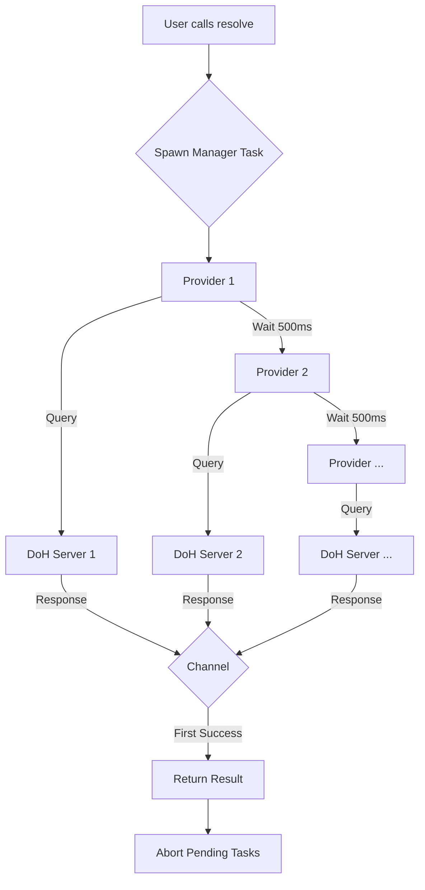

# idoh : Fast and secure DNS over HTTPS resolution

`idoh` is a high-performance, async Rust library for DNS over HTTPS (DoH) resolution, designed for speed and reliability through concurrent queries.

## Features

- **Concurrent Resolution**: Queries multiple DoH providers simultaneously (Google, Cloudflare, Quad9, etc.) and returns the fastest response.
- **MX Lookup**: specialized support for MX record lookup with priority sorting.
- **Zero-Cost Caching**: Optional caching support using `expire_cache` with GAT-based zero-copy retrieval.
- **Async/Await**: Built on `tokio` for efficient non-blocking I/O.
- **Robust Error Handling**: Gracefully handles failures from individual providers.

## Usage

Add to your `Cargo.toml`:

```toml
[dependencies]
idoh = "0.1.9"
```

### Basic Resolution

```rust
use aok::Result;
use idoh::resolve;

#[tokio::main]
async fn main() -> Result<()> {
    // Resolve A records for google.com
    let ip = resolve("google.com", "A").await?;
    println!("IP: {:?}", ip);
    Ok(())
}
```

### MX Lookup with Caching

Enable features in `Cargo.toml`:
```toml
[dependencies]
idoh = { version = "0.1.9", features = ["mx", "cache"] }
```

```rust
use aok::Result;
use idoh::MxLookup;

#[tokio::main]
async fn main() -> Result<()> {
    // Use the Cache struct for cached lookups
    use idoh::mx::cache::Cache;

    // 1. First call: Network request (Cold cache)
    // Time: ~1.3s
    let mx_records = Cache.mx("gmail.com").await?;
    
    println!("First call (Network): Found {} records", mx_records.len());
    for mx in mx_records.iter() {
        println!("  Priority: {}, Server: {}", mx.priority, mx.server);
    }
    
    // 2. Second call: Memory lookup (Hot cache)
    // Time: ~416ns (Zero-copy, >3,000,000x faster)
    let cached = Cache.mx("gmail.com").await?;
    
    println!("Second call (Cache): Found {} records", cached.len());
    
    Ok(())
}
```

### Performance Comparison

| Operation | Time | Notes |
|-----------|------|-------|
| Network Lookup | ~1.3 s | Depends on DNS provider latency |
| Cache Lookup | ~416 ns | **Zero-copy**, >3 million times faster |

## Design Philosophy

`idoh` prioritizes **latency minimization**. Instead of querying a single DNS server, it concurrently sends requests to a pre-configured list of high-performance public DoH providers (including Tencent, Google, Cloudflare, AliDNS). The first valid response is returned, effectively racing the providers against each other. This approach mitigates network jitter and single-provider slowness.

### Flowchart



## Tech Stack

- **Runtime**: `tokio`
- **HTTP Client**: `ireq` (lightweight wrapper)
- **JSON Parsing**: `sonic-rs` (SIMD-accelerated)
- **Caching**: `expire_cache` + `dashmap` (thread-safe, expiration support)
- **Concurrency**: `crossfire` (efficient channels)

## Directory Structure

- `src/lib.rs`: Module exports and feature gating.
- `src/resolve.rs`: Core resolution logic implementing the "race" mechanism.
- `src/resolve_trait.rs`: `Resolver` trait definition.
- `src/mx.rs`: MX record specific implementation and caching logic.
- `src/post.rs`: HTTP request handling and response parsing.
- `src/record_type.rs`: DNS record type constants.

## API Reference

### `resolve`
The core function that performs the concurrent DoH lookup.
```rust
pub async fn resolve<T>(
  name: impl AsRef<str>,
  record_type: impl AsRef<str>,
  extract: impl Fn(&[Answer]) -> Result<Option<T>>
) -> Result<T>
```

### `MxLookup` Trait
Provides the `mx` method for fetching MX records.
```rust
pub trait MxLookup {
  type VecMx<'a>: Deref<Target = [Mx]> + 'a;
  async fn mx<'a>(&'a self, domain: impl AsRef<str> + Send + 'a) -> Result<Self::VecMx<'a>>;
}
```

## History: The Rise of DoH

The Domain Name System (DNS), the phonebook of the Internet, was designed in the 1980s without encryption. For decades, every website visit leaked your destination to anyone listening on the wire.

In 2018, the IETF standardized **DNS over HTTPS (DoH)** (RFC 8484) to close this privacy gap. By wrapping DNS queries in encrypted HTTPS traffic, DoH prevents eavesdropping and manipulation. Major browsers like Firefox and Chrome adopted it, sparking a revolution in internet privacy. `idoh` builds on this legacy, offering a modern, fast, and secure way to resolve names in the Rust ecosystem.

---

## About

This project is an open-source component of [js0.site ⋅ Refactoring the Internet Plan](https://js0.site).

We are redefining the development paradigm of the Internet in a componentized way. Welcome to follow us:

* [Google Group](https://groups.google.com/g/js0-site)
* [js0site.bsky.social](https://bsky.app/profile/js0site.bsky.social)