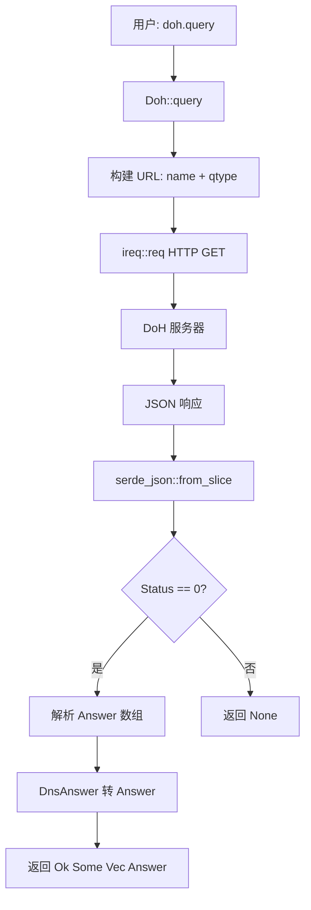
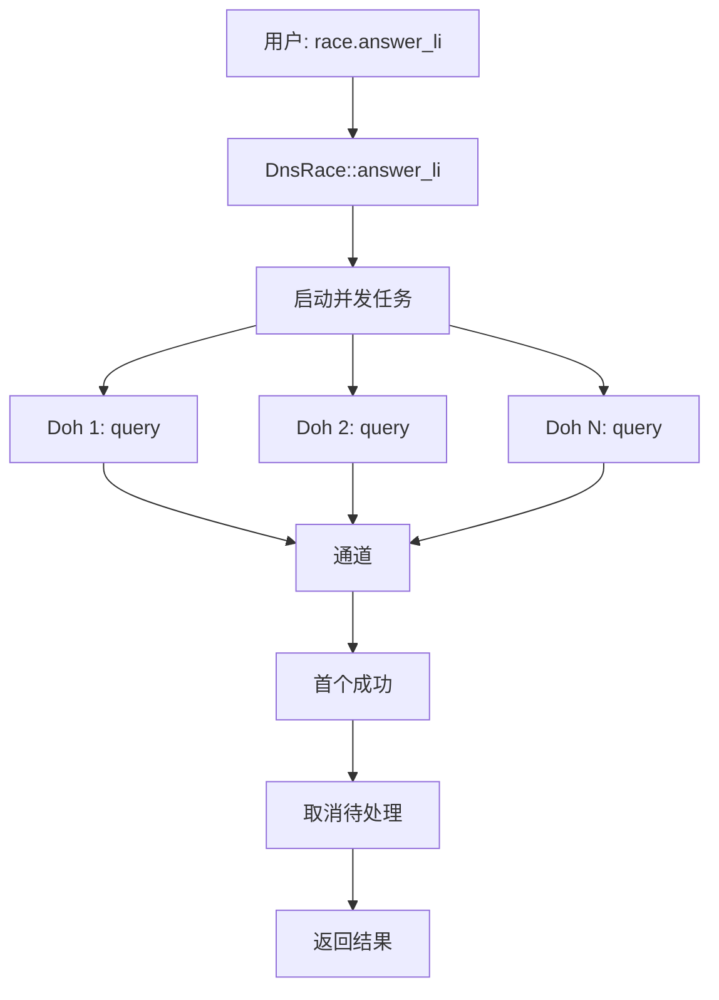

# idoh : Rust 异步 DoH 客户端

## 目录

- [简介](#简介)
- [特性](#特性)
- [使用](#使用)
- [设计](#设计)
- [API 参考](#api-参考)
- [技术栈](#技术栈)
- [目录结构](#目录结构)
- [历史](#历史)
- [关于](#关于)

## 简介

`idoh` 是 Rust 异步 DNS over HTTPS (DoH) 解析库。

基于 [idns](https://crates.io/crates/idns) 构建，idns 提供 `DnsRace`、`Cache`、`Parse` trait 等功能。

## 特性

- 多 DoH 提供商支持（腾讯、Google、Cloudflare、DNS.SB、360、NextDNS、阿里）
- 简洁 API，直接返回 DNS 应答
- 基于 `tokio` 的异步设计
- 健壮的错误处理
- 可选静态初始化全局客户端
- 强类型安全

## 使用

添加到 `Cargo.toml`：

```toml
[dependencies]
idoh = "0.2"
idns = "0.2"
```

### 基础查询

```rust
use idns::QType;
use idoh::Doh;

#[tokio::main]
async fn main() -> Result<(), Box<dyn std::error::Error>> {
  let doh = Doh::new("dns.google/resolve");
  let answers = doh.query("google.com", QType::A).await?;

  if let Some(answers) = answers {
    for answer in answers {
      println!("IP: {}", answer.val);
    }
  }
  Ok(())
}
```

### TXT 记录查询

```rust
use idns::QType;
use idoh::Doh;

#[tokio::main]
async fn main() -> Result<(), Box<dyn std::error::Error>> {
  let doh = Doh::new("dns.google/resolve");
  let answers = doh.query("qq.com", QType::TXT).await?;

  if let Some(answers) = answers {
    for answer in answers {
      if answer.val.starts_with("v=spf1") {
        println!("SPF: {}", answer.val);
      }
    }
  }
  Ok(())
}
```

### DnsRace + Cache（推荐）

竞速查询多 DoH 服务器并缓存结果：

```rust
use idoh::{DOH_LI, doh_li};
use idns::{Cache, DnsRace, Mx, Query};
use std::time::Instant;

#[tokio::main]
async fn main() {
  let race = DnsRace::new(doh_li(DOH_LI));
  let cache: Cache<Mx> = Cache::new(60); // 60 秒 TTL

  // 首次查询（缓存未命中）
  let t1 = Instant::now();
  let r1 = cache.query(&race, "gmail.com").await;
  let d1 = t1.elapsed();
  println!("首次: {}ms", d1.as_millis());
  if let Some(mx_list) = &*r1.unwrap() {
    for mx in mx_list {
      println!("  {} {}", mx.priority, mx.server);
    }
  }

  // 再次查询（缓存命中）
  let t2 = Instant::now();
  let _ = cache.query(&race, "gmail.com").await;
  let d2 = t2.elapsed();
  println!("缓存: {}μs", d2.as_micros());
}
```

输出：

```
首次: 744ms
  5 gmail-smtp-in.l.google.com
  10 alt1.gmail-smtp-in.l.google.com
  20 alt2.gmail-smtp-in.l.google.com
  30 alt3.gmail-smtp-in.l.google.com
  40 alt4.gmail-smtp-in.l.google.com
缓存: 1μs
```

### 性能

| 操作     | 耗时    | 说明                   |
| -------- | ------- | ---------------------- |
| 网络查询 | ~744 ms | 取决于提供商延迟       |
| 缓存查询 | ~1.8 µs | 零拷贝，快 40 万倍以上 |

## 设计

`idoh` 通过并发查询多 DoH 提供商实现延迟最小化。首个有效响应胜出，规避网络抖动和单点故障。

### 调用流程



### 配合 DnsRace (idns)



## API 参考

### 结构体: Doh

DoH 客户端。

```rust
pub struct Doh {
  pub url: String,
}

impl Doh {
  pub fn new(url: impl Into<String>) -> Self;
  pub async fn query(&self, name: &str, qtype: QType) -> Result<Option<Vec<Answer>>>;
}
```

实现 `idns::Query` trait，可与 `DnsRace`、`Cache` 集成。

### 结构体: Answer (来自 idns)

DNS 应答记录。

```rust
pub struct Answer {
  pub name: String,
  pub type_id: u16,
  pub ttl: u32,
  pub val: String,
}
```

### 枚举: Error

```rust
pub enum Error {
  Http(ireq::Error),
  Json(serde_json::Error),
}
```

### 函数: doh_li

从 URL 列表创建 DoH 客户端。

```rust
pub fn doh_li(li: &[&str]) -> Vec<Doh>
```

### 常量: DOH_LI

预配置 DoH 提供商 URL：

```rust
pub static DOH_LI: &[&str] = &[
  "doh.pub/resolve",              // 腾讯
  "dns.google/resolve",           // Google
  "cloudflare-dns.com/dns-query", // Cloudflare
  "doh.sb/dns-query",             // DNS.SB
  "doh.360.cn/resolve",           // 360
  "dns.nextdns.io",               // NextDNS
  "dns.alidns.com/resolve",       // 阿里
];
```

### 静态变量: DOH (feature = "static")

全局 `DnsRace<Doh>` 实例。

```rust
pub static DOH: idns::DnsRace<Doh>
```

## 技术栈

| 组件       | Crate       | 用途                 |
| ---------- | ----------- | -------------------- |
| 运行时     | tokio       | 异步执行             |
| HTTP       | ireq        | 轻量客户端，支持代理 |
| JSON       | serde_json  | 响应解析             |
| 错误       | thiserror   | 错误处理             |
| 静态初始化 | static_init | 可选全局客户端       |

## 目录结构

```
├── src/
│   ├── lib.rs      # 模块导出、Doh 结构体、DOH_LI 常量
│   └── error.rs    # Error 和 Result 类型
├── tests/
│   └── main.rs     # 集成测试
├── Cargo.toml
└── readme/
    ├── en.md       # 英文文档
    └── zh.md       # 中文文档
```

## 历史

DNS 作为互联网电话簿，设计于 1980 年代，未考虑加密。每次网站访问都明文暴露目的地。

2018 年，IETF 标准化 DNS over HTTPS (RFC 8484)。通过将 DNS 查询封装在加密 HTTPS 流量中，DoH 防止窃听和篡改。

Paul Mockapetris 于 1983 年发明 DNS (RFC 882/883)。他后来回忆，当时未考虑安全是因为"互联网是友好的地方"。三十五年后，DoH 终于弥补了这一疏漏。

"idoh" 命名遵循 js0.site 项目惯例："i" 前缀 + 功能。此处 "doh" 代表 DNS over HTTPS。

---

## 关于

本项目为 [js0.site · 重构互联网计划](https://js0.site) 开源组件。

- [谷歌邮件列表](https://groups.google.com/g/js0-site)
- [js0site.bsky.social](https://bsky.app/profile/js0site.bsky.social)
