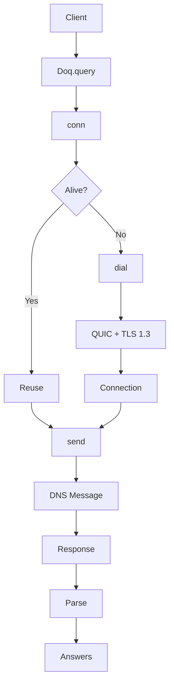
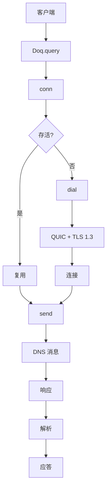

[English](#en) | [中文](#zh)

---

<a id="en"></a>

# idoq : DNS over QUIC Client for Rust

Based on [idns](https://crates.io/crates/idns). See idns for `DnsRace`, `Cache`, `Parse` trait, and more.

## Features

- RFC 9250 compliant DoQ implementation
- Built-in DoQ server list (AdGuard, ControlD, Alibaba DNS)
- Async/await with Tokio
- TLS 1.3 over QUIC
- A, AAAA, MX, TXT, NS, CNAME, PTR, SRV record types
- Connection reuse with auto-reconnect
- 9s timeout

## Installation

```toml
[dependencies]
idoq = "0.1"
idns = "0.1"
```

## Usage

### DnsRace + Cache (Recommended)

Race multiple servers and cache results:

```rust
use idoq::{DOQ_LI, doq_li};
use idns::{Cache, DnsRace, Mx, Query};
use std::time::Instant;

#[tokio::main]
async fn main() {
  let race = DnsRace::new(doq_li(DOQ_LI));
  let cache: Cache<Mx> = Cache::new(60); // 60s TTL

  // First query (cache miss)
  let t1 = Instant::now();
  let r1 = cache.query(&race, "gmail.com").await;
  let d1 = t1.elapsed();
  println!("First: {}ms", d1.as_millis());
  if let Some(mx_list) = &*r1.unwrap() {
    for mx in mx_list {
      println!("  {} {}", mx.priority, mx.server);
    }
  }

  // Second query (cache hit)
  let t2 = Instant::now();
  let _ = cache.query(&race, "gmail.com").await;
  let d2 = t2.elapsed();
  println!("Cache: {}μs", d2.as_micros());
  println!("✓ {}ms -> {}μs ({}x faster)", d1.as_millis(), d2.as_micros(),
    d1.as_micros() / d2.as_micros().max(1));
}
```

Output:

```
First: 22ms
  5 gmail-smtp-in.l.google.com
  10 alt1.gmail-smtp-in.l.google.com
  20 alt2.gmail-smtp-in.l.google.com
  30 alt3.gmail-smtp-in.l.google.com
  40 alt4.gmail-smtp-in.l.google.com
Cache: 0μs
✓ 22ms -> 0μs (22024x faster)
```

### Basic Query

```rust
use idoq::{Doq, host_ip, QType};
use idns::Query;

#[tokio::main]
async fn main() {
  let client = Doq::new(host_ip("dns.alidns.com", 223, 5, 5, 5));

  if let Ok(Some(answers)) = client.answer_li(QType::A, "example.com").await {
    for a in answers {
      println!("{} TTL={}", a.val, a.ttl);
    }
  }
}
```

## API Reference

### Structs

#### `Doq`

DoQ client with connection reuse. Implements `idns::Query` trait.

#### `HostIp`

Server configuration with `host: SmolStr` (TLS SNI) and `ip: IpAddr`.

### Functions

- `host_ip(host, a, b, c, d) -> HostIp` - Create HostIp from hostname and IPv4
- `doq_li(li: &[HostIp]) -> Vec<Doq>` - Create Doq clients from HostIp list

### Constants

#### `DOQ_LI`

Pre-configured DoQ servers:

| Server      | IP                           |
| ----------- | ---------------------------- |
| AdGuard DNS | 94.140.14.140, 94.140.14.141 |
| ControlD    | 76.76.2.11                   |
| Alibaba DNS | 223.5.5.5, 223.6.6.6         |

## Architecture



### Implementation Details

- DNS message ID = 0 (RFC 9250)
- 2-byte length prefix for framing
- EDNS OPT with 4096 byte payload
- `LazyLock` for TLS `ClientConfig`
- `RwLock<Option<Connection>>` for connection reuse
- Auto-reconnect on error
- 9s timeout

## Tech Stack

| Component | Library       |
| --------- | ------------- |
| QUIC      | quinn         |
| TLS       | rustls + ring |
| Async     | tokio         |
| Buffer    | bytes         |
| Error     | thiserror     |
| DNS Parse | dns_parse     |

---

## About

This project is an open-source component of [js0.site ⋅ Refactoring the Internet Plan](https://js0.site).

We are redefining the development paradigm of the Internet in a componentized way. Welcome to follow us:

* [Google Group](https://groups.google.com/g/js0-site)
* [js0site.bsky.social](https://bsky.app/profile/js0site.bsky.social)

---

<a id="zh"></a>

# idoq : Rust DNS over QUIC 客户端

基于 [idns](https://crates.io/crates/idns)。`DnsRace`、`Cache`、`Parse` trait 等更多功能请查看 idns。

## 特性

- 符合 RFC 9250 的 DoQ 实现
- 内置 DoQ 服务器列表 (AdGuard、ControlD、阿里 DNS)
- 基于 Tokio 异步
- TLS 1.3 + QUIC
- 支持 A、AAAA、MX、TXT、NS、CNAME、PTR、SRV 记录
- 连接复用，自动重连
- 9 秒超时

## 安装

```toml
[dependencies]
idoq = "0.1"
idns = "0.1"
```

## 使用

### DnsRace + Cache（推荐）

竞速查询多个服务器并缓存结果：

```rust
use idoq::{DOQ_LI, doq_li};
use idns::{Cache, DnsRace, Mx, Query};
use std::time::Instant;

#[tokio::main]
async fn main() {
  let race = DnsRace::new(doq_li(DOQ_LI));
  let cache: Cache<Mx> = Cache::new(60); // 60 秒 TTL

  // 首次查询（缓存未命中）
  let t1 = Instant::now();
  let r1 = cache.query(&race, "gmail.com").await;
  let d1 = t1.elapsed();
  println!("首次: {}ms", d1.as_millis());
  if let Some(mx_list) = &*r1.unwrap() {
    for mx in mx_list {
      println!("  {} {}", mx.priority, mx.server);
    }
  }

  // 再次查询（缓存命中）
  let t2 = Instant::now();
  let _ = cache.query(&race, "gmail.com").await;
  let d2 = t2.elapsed();
  println!("缓存: {}μs", d2.as_micros());
  println!("✓ {}ms -> {}μs (快 {} 倍)", d1.as_millis(), d2.as_micros(),
    d1.as_micros() / d2.as_micros().max(1));
}
```

输出：

```
首次: 22ms
  5 gmail-smtp-in.l.google.com
  10 alt1.gmail-smtp-in.l.google.com
  20 alt2.gmail-smtp-in.l.google.com
  30 alt3.gmail-smtp-in.l.google.com
  40 alt4.gmail-smtp-in.l.google.com
缓存: 0μs
✓ 22ms -> 0μs (快 22024 倍)
```

### 基本查询

```rust
use idoq::{Doq, host_ip, QType};
use idns::Query;

#[tokio::main]
async fn main() {
  let client = Doq::new(host_ip("dns.alidns.com", 223, 5, 5, 5));

  if let Ok(Some(answers)) = client.answer_li(QType::A, "example.com").await {
    for a in answers {
      println!("{} TTL={}", a.val, a.ttl);
    }
  }
}
```

## API 参考

### 结构体

#### `Doq`

DoQ 客户端，支持连接复用。实现 `idns::Query` trait。

#### `HostIp`

服务器配置，包含 `host: SmolStr`（TLS SNI）和 `ip: IpAddr`。

### 函数

- `host_ip(host, a, b, c, d) -> HostIp` - 从主机名和 IPv4 创建 HostIp
- `doq_li(li: &[HostIp]) -> Vec<Doq>` - 从 HostIp 列表创建 Doq 客户端

### 常量

#### `DOQ_LI`

预配置 DoQ 服务器：

| 服务器      | IP                           |
| ----------- | ---------------------------- |
| AdGuard DNS | 94.140.14.140, 94.140.14.141 |
| ControlD    | 76.76.2.11                   |
| 阿里 DNS    | 223.5.5.5, 223.6.6.6         |

## 架构



### 实现细节

- DNS 消息 ID = 0 (RFC 9250)
- 2 字节长度前缀分帧
- EDNS OPT 4096 字节负载
- `LazyLock` 延迟初始化 TLS `ClientConfig`
- `RwLock<Option<Connection>>` 连接复用
- 错误时自动重连
- 9 秒超时

## 技术栈

| 组件     | 库            |
| -------- | ------------- |
| QUIC     | quinn         |
| TLS      | rustls + ring |
| 异步     | tokio         |
| 缓冲     | bytes         |
| 错误     | thiserror     |
| DNS 解析 | dns_parse     |

---

## 关于

本项目为 [js0.site ⋅ 重构互联网计划](https://js0.site) 的开源组件。

我们正在以组件化的方式重新定义互联网的开发范式，欢迎关注：

* [谷歌邮件列表](https://groups.google.com/g/js0-site)
* [js0site.bsky.social](https://bsky.app/profile/js0site.bsky.social)
