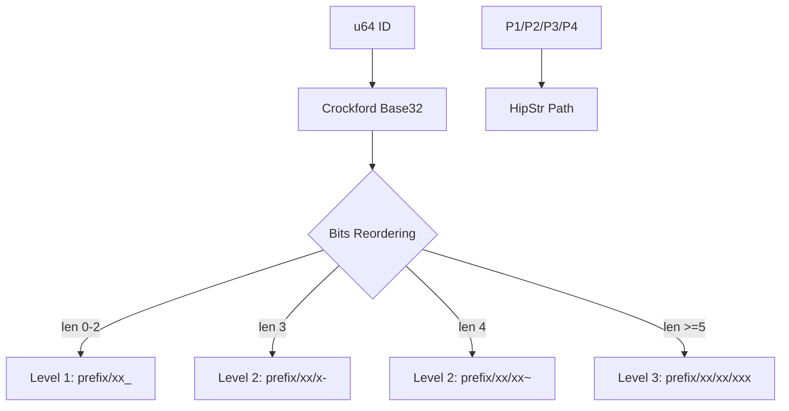
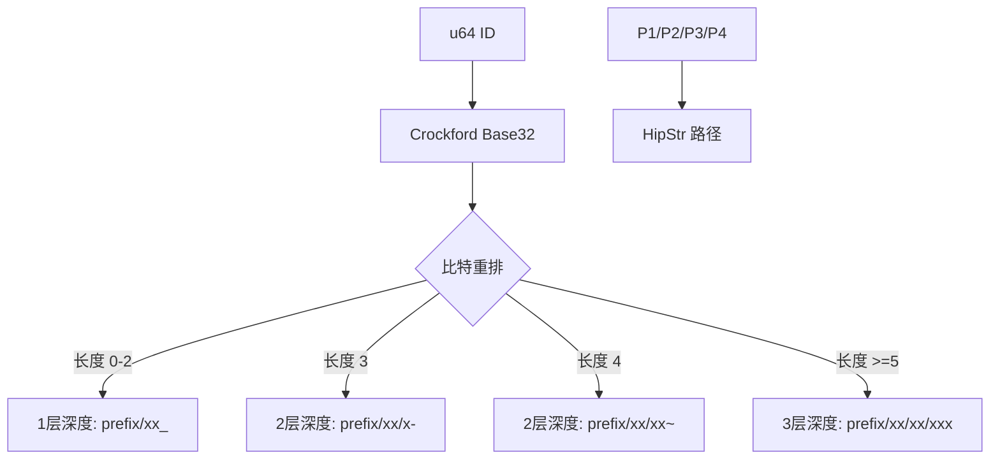

[English](#en) | [中文](#zh)

---

<a id="en"></a>

# idpath : Efficient Hierarchical Path Encoding for Scalable Storage

- [Introduction](#introduction)
- [Features](#features)
- [Usage](#usage)
- [Design Rationale](#design-rationale)
- [Technology Stack](#technology-stack)
- [Directory Structure](#directory-structure)
- [API Reference](#api-reference)
- [History](#history)

## Introduction

`idpath` provides utilities to encode 64-bit integers into hierarchical filesystem paths. By placing low-order bits at higher directory levels, it ensures uniform distribution of files across directories, preventing filesystem performance degradation caused by directory saturation.

## Features

- **Load Balancing**: Low-bits-first strategy ensures even distribution even with sequential IDs.
- **Zero-Allocation Decoding**: Utilizes `HipStr` and stack buffers to eliminate heap allocations during successful decoding.
- **Dynamic Depth**: Adjusts path depth (1 to 3 levels) based on ID magnitude with unique suffixes (`_`, `-`, `~`).
- **Crockford Base32**: Uses a URL-safe, human-readable character set.
- **Robust Error Handling**: Provides detailed context-aware error messages with paths.

## Usage

```rust
use idpath::{encode, decode};

fn main() -> idpath::Result<()> {
  let id = 1234567u64;
  let prefix = "/storage";

  // Encode
  let path = encode(prefix, id);
  println!("Path: {}", path);

  // Decode
  let decoded_id = decode(&path)?;
  assert_eq!(id, decoded_id);

  Ok(())
}
```

## Design Rationale

Modern filesystems (like ext4 or XFS) experience performance drops when a single directory contains thousands of entries. Hierarchical structures mitigate this. By reversing bit significance during path construction (Low-Bits-First), `idpath` avoids hotspots even when IDs are generated sequentially (e.g., from databases).



## Technology Stack

- **Rust**: Language providing safety and performance.
- **fast32**: High-performance Crockford Base32 implementation.
- **hipstr**: Shared string optimization reducing memory footprints.

## Directory Structure

```text
.
├── src/
│   ├── lib.rs   # Core encoding/decoding logic
│   └── error.rs # Custom error definitions
└── tests/
    └── main.rs  # Integration tests
```

## API Reference

### Functions

- `encode(prefix: impl AsRef<str>, id: u64) -> HipStr<'static>`
  Encodes an ID into a path string.
- `decode(path: impl AsRef<str>) -> Result<u64>`
  Decodes a path string back into an ID.

### Constants

- `DEPTH1`: `b'_'`, suffix for 1-level paths.
- `DEPTH2`: `b'-'`, suffix for 2-level paths (3-char encoded).
- `DEPTH3`: `b'~'`, suffix for 2-level paths (4-char encoded).

### Types/Errors

- `Result<T>`: Alias for `std::result::Result<T, Error>`.
- `Error`: Enum containing `InvalidPath(HipStr)` and `DecodeFailed(HipStr)`.

## History

Hierarchical directory structures for data distribution date back to early Unix systems. Large-scale caching proxies like Squid and version control systems like Git popularized this "fan-out" approach. Git, for instance, stores objects in a `.git/objects/xx/xxxxxxxx...` structure using the first two hex digits of a SHA-1 hash. `idpath` extends this concept by prioritizing low-order bits, specifically optimized for numeric IDs where sequential growth is common.

---

## About

This project is an open-source component of [js0.site ⋅ Refactoring the Internet Plan](https://js0.site).

We are redefining the development paradigm of the Internet in a componentized way. Welcome to follow us:

* [Google Group](https://groups.google.com/g/js0-site)
* [js0site.bsky.social](https://bsky.app/profile/js0site.bsky.social)

---

<a id="zh"></a>

# idpath : 为可扩展存储系统设计的层次化路径编码

- [项目介绍](#项目介绍)
- [功能特性](#功能特性)
- [使用演示](#使用演示)
- [设计核心](#设计核心)
- [技术堆栈](#技术堆栈)
- [目录结构](#目录结构)
- [API 介绍](#api-介绍)
- [历史趣闻](#历史趣闻)

## 项目介绍

`idpath` 工具用于将 64 位整数编码为层次化文件系统路径。通过将低位比特放置在目录的高层级，确保文件均匀分布在不同目录中，防止目录由于条目过多导致文件系统性能下降。

## 功能特性

- **负载均衡**：低位优先策略保证即使 ID 连续增长，也能实现均匀分布。
- **零分配解码**：结合 `HipStr` 与栈分配缓冲区，成功解码过程中无需堆分配。
- **动态深度**：根据 ID 数值大小自动调节路径深度（1 至 3 层），并辅以唯一后缀（`_`, `-`, `~`）。
- **Crockford Base32**：采用 URL 安全且易读的字符集。
- **健壮错误处理**：提供包含路径上下文的详细错误信息。

## 使用演示

```rust
use idpath::{encode, decode};

fn main() -> idpath::Result<()> {
  let id = 1234567u64;
  let prefix = "/data";

  // 编码
  let path = encode(prefix, id);
  println!("编码路径: {}", path);

  // 解码
  let decoded_id = decode(&path)?;
  assert_eq!(id, decoded_id);

  Ok(())
}
```

## 设计核心

现代文件系统（如 ext4 或 XFS）在单个目录包含数千个条目时性能会大幅下降。层次化结构能有效缓解此问题。`idpath` 在构建路径时反转比特重要性（低位优先），有效规避了 ID 顺序生成（例如数据库自增主键）产生的存储热点。



## 技术堆栈

- **Rust**：兼顾安全与高性能的编程语言。
- **fast32**：高性能 Crockford Base32 实现。
- **hipstr**：共享字符串优化，降低内存占用。

## 目录结构

```text
.
├── src/
│   ├── lib.rs   # 核心编解码逻辑
│   └── error.rs # 自定义错误定义
└── tests/
    └── main.rs  # 集成测试
```

## API 介绍

### 函数

- `encode(prefix: impl AsRef<str>, id: u64) -> HipStr<'static>`
  将 ID 编码为路径字符串。
- `decode(path: impl AsRef<str>) -> Result<u64>`
  将路径字符串解码回 ID。

### 常量

- `DEPTH1`: `b'_'`，1 层深度的后缀。
- `DEPTH2`: `b'-'`，2 层深度的后缀（编码长度为 3）。
- `DEPTH3`: `b'~'`，2 层深度的后缀（编码长度为 4）。

### 类型与错误

- `Result<T>`：`std::result::Result<T, Error>` 的别名。
- `Error`：包含 `InvalidPath(HipStr)` 与 `DecodeFailed(HipStr)` 的枚举。

## 历史趣闻

层次化目录结构用于数据分发的设计最早可追溯到早期 Unix 系统。Squid 缓存代理和 Git 版本控制系统等大型工具使这种“扇出”（fan-out）方法广为人知。以 Git 为例，它利用 SHA-1 哈希值的前两位作为目录名（如 `.git/objects/xx/xxxxxxxx...`）来存储对象。`idpath` 扩展了这一理念，通过优先处理低位比特，专门针对数字 ID 顺序增长的场景进行了优化，实现了更优的磁盘分布规律。

---

## 关于

本项目为 [js0.site ⋅ 重构互联网计划](https://js0.site) 的开源组件。

我们正在以组件化的方式重新定义互联网的开发范式，欢迎关注：

* [谷歌邮件列表](https://groups.google.com/g/js0-site)
* [js0site.bsky.social](https://bsky.app/profile/js0site.bsky.social)
