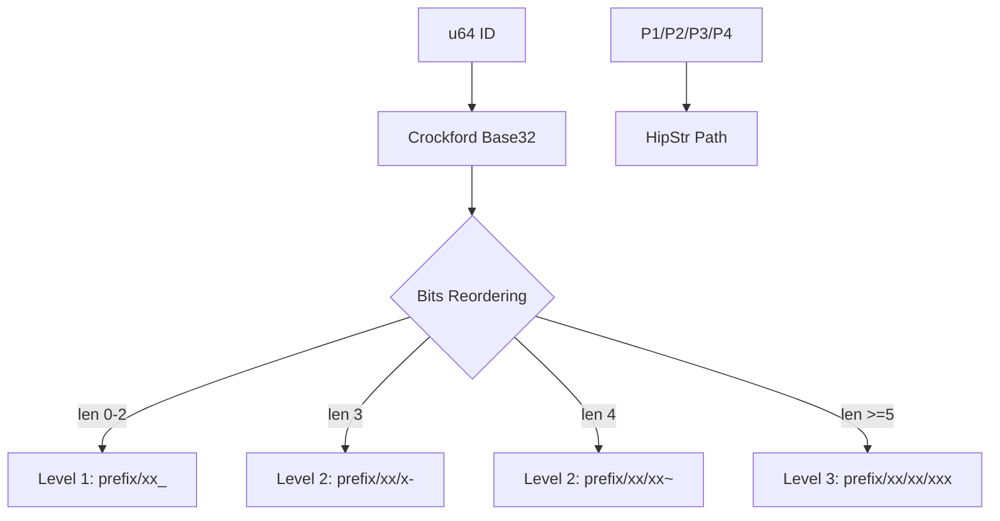

# idpath : Efficient Hierarchical Path Encoding for Scalable Storage

- [Introduction](#introduction)
- [Features](#features)
- [Usage](#usage)
- [Design Rationale](#design-rationale)
- [Technology Stack](#technology-stack)
- [Directory Structure](#directory-structure)
- [API Reference](#api-reference)
- [History](#history)

## Introduction

`idpath` provides utilities to encode 64-bit integers into hierarchical filesystem paths. By placing low-order bits at higher directory levels, it ensures uniform distribution of files across directories, preventing filesystem performance degradation caused by directory saturation.

## Features

- **Load Balancing**: Low-bits-first strategy ensures even distribution even with sequential IDs.
- **Zero-Allocation Decoding**: Utilizes `HipStr` and stack buffers to eliminate heap allocations during successful decoding.
- **Dynamic Depth**: Adjusts path depth (1 to 3 levels) based on ID magnitude with unique suffixes (`_`, `-`, `~`).
- **Crockford Base32**: Uses a URL-safe, human-readable character set.
- **Robust Error Handling**: Provides detailed context-aware error messages with paths.

## Usage

```rust
use idpath::{encode, decode};

fn main() -> idpath::Result<()> {
  let id = 1234567u64;
  let prefix = "/storage";

  // Encode
  let path = encode(prefix, id);
  println!("Path: {}", path);

  // Decode
  let decoded_id = decode(&path)?;
  assert_eq!(id, decoded_id);

  Ok(())
}
```

## Design Rationale

Modern filesystems (like ext4 or XFS) experience performance drops when a single directory contains thousands of entries. Hierarchical structures mitigate this. By reversing bit significance during path construction (Low-Bits-First), `idpath` avoids hotspots even when IDs are generated sequentially (e.g., from databases).



## Technology Stack

- **Rust**: Language providing safety and performance.
- **fast32**: High-performance Crockford Base32 implementation.
- **hipstr**: Shared string optimization reducing memory footprints.

## Directory Structure

```text
.
├── src/
│   ├── lib.rs   # Core encoding/decoding logic
│   └── error.rs # Custom error definitions
└── tests/
    └── main.rs  # Integration tests
```

## API Reference

### Functions

- `encode(prefix: impl AsRef<str>, id: u64) -> HipStr<'static>`
  Encodes an ID into a path string.
- `decode(path: impl AsRef<str>) -> Result<u64>`
  Decodes a path string back into an ID.

### Constants

- `DEPTH1`: `b'_'`, suffix for 1-level paths.
- `DEPTH2`: `b'-'`, suffix for 2-level paths (3-char encoded).
- `DEPTH3`: `b'~'`, suffix for 2-level paths (4-char encoded).

### Types/Errors

- `Result<T>`: Alias for `std::result::Result<T, Error>`.
- `Error`: Enum containing `InvalidPath(HipStr)` and `DecodeFailed(HipStr)`.

## History

Hierarchical directory structures for data distribution date back to early Unix systems. Large-scale caching proxies like Squid and version control systems like Git popularized this "fan-out" approach. Git, for instance, stores objects in a `.git/objects/xx/xxxxxxxx...` structure using the first two hex digits of a SHA-1 hash. `idpath` extends this concept by prioritizing low-order bits, specifically optimized for numeric IDs where sequential growth is common.