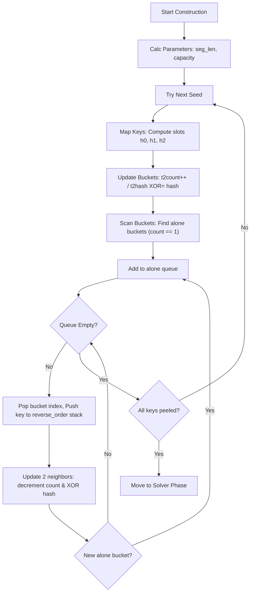
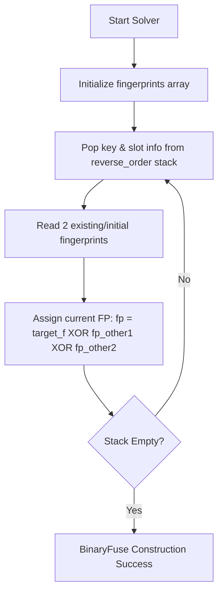
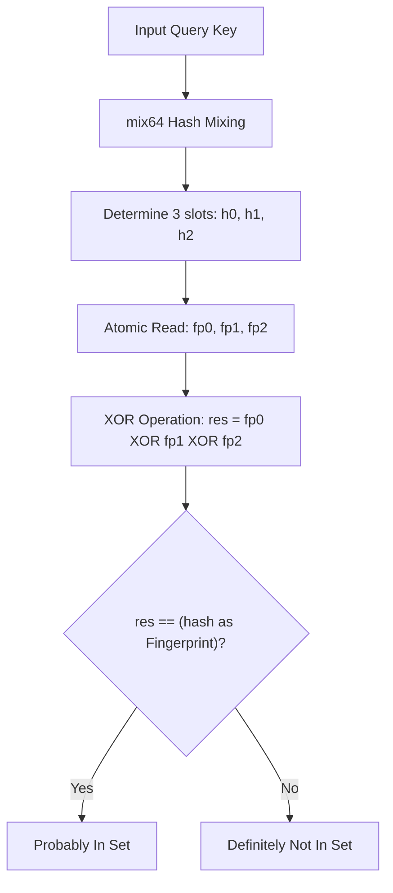
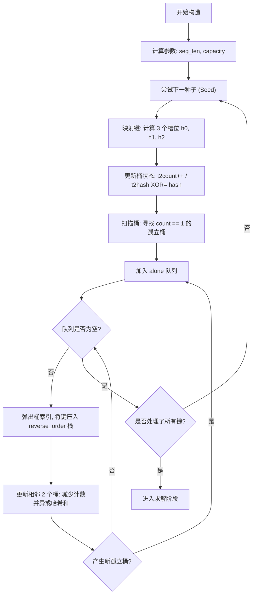
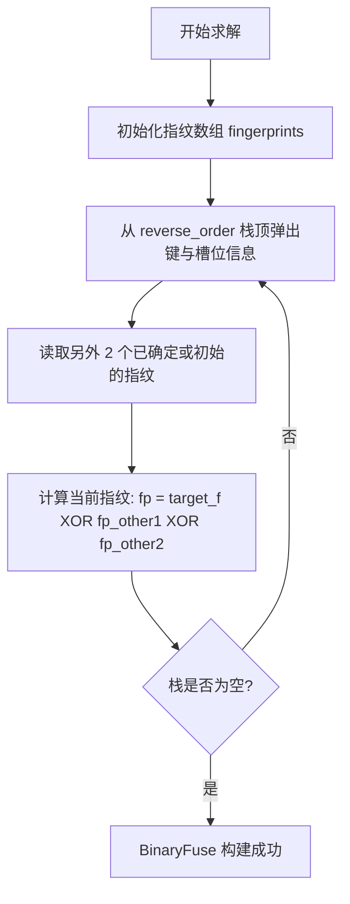
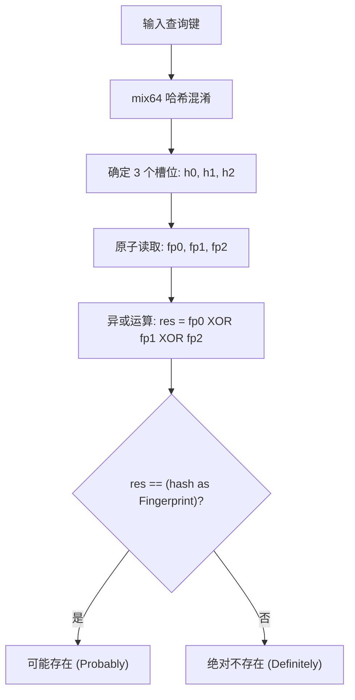

[English](n) | [中文](#zh)

---

<a id="en"></a>


# jdb_xorf : Extremely Fast Binary Fuse Filters for Rust

## Introduction
jdb_xorf provides high-performance implementation of Binary Fuse filters for Rust. These probabilistic data structures offer faster lookups and smaller memory footprints compared to Bloom or Cuckoo filters. Binary Fuse filters represent the state-of-the-art in static set membership testing.

Binary Fuse is the pinnacle of the Xor Filter family and represents the **most efficient** static membership testing structure known today. It significantly outperforms other filters across all key metrics:

### Why Binary Fuse?
- **Faster Construction**: Uses **graph partitioning** to break the problem into small blocks that fit into L1/L2 cache, making construction **10-20x faster** than standard Xor filters.
- **More Compact**: For the same false positive rate, Binary Fuse has a lower theoretical space floor. `BinaryFuse8` achieves ~0.39% FPR with only ~8.64 bits/entry (space overhead is only **1.08x** the theoretical limit).
- **Better Locality**: Partitioned design ensures memory accesses during construction and query are localized, drastically reducing CPU cache misses.
- **Constant Time Query**: Queries are strictly **O(1)**, requiring exactly 3 memory accesses + 1 hash mix + 2 XOR operations.
- **Zero False Negatives**: Like Bloom filters, if an element is in the set, Binary Fuse guarantees a True return.


## Table of Contents
- [Caveats & Prerequisites](#caveats--prerequisites)
- [Usage](#usage)
- [Features](#features)
- [Design](#design)
- [Tech Stack](#tech-stack)
- [Directory Structure](#directory-structure)
- [API Documentation](#api-documentation)
- [Construction Failure Probability](#construction-failure-probability)
- [Historical Note](#historical-note)
- [References](#references)


## Caveats & Prerequisites

### No Duplicates Allowed
It is a strict **pre-condition** that Binary Fuse filters (`BinaryFuse8`, `BinaryFuse16`, `BinaryFuse32`) are constructed from a data structure containing **no duplicate keys**. If duplicates are present in the input `u64` hashes, the construction will almost certainly fail. You must perform any de-duplication needed yourself before constructing a raw filter.

### Automatic Deduplication with Bf
If you use the `Bf` wrapper (recommended for arbitrary types like `String`, `&[u8]`, etc.), it **automatically transforms and deduplicates** the keys for you. `Bf` collects all inputs, hashes them, sorts, and removes duplicates before attempting construction, ensuring a seamless experience.

## Usage

### Basic Binary Fuse Filter
```rust
use jdb_xorf::{Filter, BinaryFuse8};

let keys = vec![1u64, 2, 3];
let filter = BinaryFuse8::from(&keys);

assert!(filter.contains(&1));
assert!(!filter.contains(&4));
```

### Hashing Proxy for Arbitrary Types (e.g., String)
```rust
use jdb_xorf::{Filter, Bf, BinaryFuse8};

let fruits = vec!["apple".to_string(), "banana".to_string()];
// Bf automatically handles hashing and deduplication.
// RapidHasher is used by default for high performance.
let filter: Bf<String, BinaryFuse8> = Bf::from(&fruits);

assert!(filter.contains("apple"));
```

### Bfing from Binary Data
```rust
use jdb_xorf::{Filter, Bf, BinaryFuse8};

let data: Vec<&[u8]> = vec![b"raw_bytes_1", b"raw_bytes_2"];
let filter: Bf<&[u8], BinaryFuse8> = Bf::from(&data);

assert!(filter.contains(&b"raw_bytes_1"[..]));
```

## Features
- **Speed**: Picosecond-level lookup latency.
- **Efficiency**: Ultra-high space utilization (~8.64 bits per entry for BinaryFuse8, 1.08x theoretical limit).
- **Flexibility**: `Bf` adapter for non-u64 types with **automatic deduplication**.
- **Portability**: Full `no_std` support for embedded environments.
- **Serialization**: Optional `bitcode` support or DMA zero-copy loading.

## Algorithm Details (Mermaid)

### 1. Peeling Phase


### 2. Solver Phase


### 3. Query Phase


1. **Hashing**: Keys are mixed using RapidHash or custom hashers.
2. **Mapping**: Hashes determine three slots in the partitioned graph.
3. **Lookup**: Final membership is determined by XORing fingerprints from these slots.

## Tech Stack
- **Language**: Rust (Edition 2024).
- **Core Logic**: Binary-partitioned fuse graph algorithms.
- **Hashing**: RapidHash (via `rapidhash` crate), high-quality `mix64` function.
- **Testing**: Criterion for micro-benchmarking.

## Directory Structure
- `src/`: Core implementation.
  - `base.rs`: Generic Binary Fuse implementation.
  - `bfuse*.rs`: Specific Binary Fuse variants (8, 16, 32-bit).
  - `build/`: Bfer utilities (containing the `Bf` adapter).
  - `hash.rs`: Hasher and avalanche mixing implementation.
- `benches/`: Performance benchmark suites.
- `analysis/`: Uniformity and zero-distribution analysis tools.

## API Documentation

### Traits
- `Filter<T>`: Core trait for membership testing.
  - `contains(&self, key: &T) -> bool`
  - `len(&self) -> usize`
- `FilterRef<'a, T>`: Zero-copy reference to filter data.
- `DmaSerializable`: Interface for direct memory access serialization.

### Types
- `BinaryFuse8`, `BinaryFuse16`, `BinaryFuse32`: Managed memory filters.
- `BinaryFuse8Ref`, `BinaryFuse16Ref`, `BinaryFuse32Ref`: Borrowed memory filters.
- `Bf<T, F, H = RapidHasher>`: Generic wrapper for hashing arbitrary types `T` using hasher `H` and filter `F`, with auto-deduplication.

### Summary Comparison

| Filter | Memory Usage | Query Speed | Bf Speed | Cache Friendliness | Best Use Case |
| :--- | :--- | :--- | :--- | :--- | :--- |
| **Binary Fuse** | **Lowest (≈1.08x theoretical limit)** | **Fastest (3 accesses)** | **Fastest (Partitioned)** | **Excellent** | Static, large datasets |
| **Xor Filter** | Low | Fast | Slow | Poor | Legacy static sets |
| **Bloom Filter** | Medium | Slow (Multiple hashes) | Fast | Poor | Dynamic sets / Simple needs |
| **Cuckoo Filter** | Low | Medium (Random probes) | Slow | Poor | Dynamic sets (supports delete) |

## Construction Failure Probability
The theoretical probability of a Binary Fuse Filter failing to construct is infinitesimal. This library automatically retries construction 1000 times with different seeds.

The theoretical probability of a Binary Fuse Filter failing to construct is infinitesimal. This library automatically retries construction 1000 times with different seeds.

According to Mueller & Lemire [[2]](#references), the success probability of a single construction attempt has a lower bound of **90%** (expected trials ). This implies a single-attempt failure rate .

Therefore, the probability of 1000 consecutive failures is:
^{1000}%20\le%20(0.1)^{1000}%20=%2010^{-1000})

** is a value that can be considered physically zero.**
It is far smaller than the inverse of the number of atoms in the universe, and hundreds of orders of magnitude lower than the probability of an uncorrectable hardware error ().


A study by Google on DRAM reliability showed that approximately **1.3% of machines experience an uncorrectable memory error per year**. The probability of a hardware error occurring during the split-second filter construction is estimated to be around  to .

| Event | Approximate Probability | Risk Classification |
| :--- | :--- | :--- |
| **Hardware Bit Flip (during build)** |  | Real, Non-Zero Risk |
| **Binary Fuse Bf Failure** |  | Physically Impossible |

Therefore, the library design philosophy is: **Treat construction failure as an unrecoverable fatal error (panic), not a runtime error (Result/TryFrom).**

If you encounter a panic during `from()`, it is overwhelmingly likely due to:
1.  **Duplicate keys in input** (Most common cause; use `Bf` wrapper to handle this).
2.  **Hardware failure** (Memory corruption).
3.  **Statistical impossibility** (Winning the "bad luck" lottery).

For usability, we prioritize the `From` trait as it aligns with the expectation that construction just works.

## Historical Note
Probabilistic filters have evolved from Bloom filters (1970) to Cuckoo filters (2014). Xor filters (2020) introduced a paradigm shift by utilizing perfectly hashed XOR sums. Binary Fuse filters (2022) refined this further by partitioning the graph, achieving near-theoretical limits for space and time efficiency.

## References

- [Xor Filters: Faster and Smaller Than Bloom and Cuckoo Filters](https://arxiv.org/abs/1912.08258)
- [Binary Fuse Filters: Fast and Smaller Than Xor Filters](https://arxiv.org/abs/2201.01171)
- [Fuse Graph](https://arxiv.org/abs/1907.04749)
- [Go Implementation](https://github.com/FastFilter/xorfilter)
- [C Implementation](https://github.com/FastFilter/xor_singleheader)
- [fuse graph](https://arxiv.org/abs/1907.04749)

## Bench

## Performance Benchmark

| Library | Filter | Bf Ops | Query Ops | Memory | Speedup |
| --- | --- | --- | --- | --- | --- |
| jdb | BinaryFuse8 | 4793.58 | 88966.34 | 116.04 KB | 1.69x |
| xorf | BinaryFuse8 | 4049.36 | 52580.65 | 116.04 KB | - |
| jdb | BinaryFuse16 | 4894.69 | 77217.39 | 232.04 KB | 1.57x |
| xorf | BinaryFuse16 | 3756.41 | 49195.52 | 232.04 KB | - |
| jdb | BinaryFuse32 | 4525.89 | 67930.45 | 464.04 KB | 1.43x |
| xorf | BinaryFuse32 | 3976.74 | 47487.04 | 464.04 KB | - |

## Accuracy

| Library | Filter | False Positive Rate | False Negative Rate |
| --- | --- | --- | --- |
| jdb | BinaryFuse8 | 0.39100% | 0 |
| xorf | BinaryFuse8 | 0.39175% | 0 |
| jdb | BinaryFuse16 | 0.00172% | 0 |
| xorf | BinaryFuse16 | 0.00178% | 0 |
| jdb | BinaryFuse32 | 0.00000% | 0 |
| xorf | BinaryFuse32 | 0.00000% | 0 |

---

## About

This project is an open-source component of [js0.site ⋅ Refactoring the Internet Plan](https://js0.site).

We are redefining the development paradigm of the Internet in a componentized way. Welcome to follow us:

* [Google Group](https://groups.google.com/g/js0-site)
* [js0site.bsky.social](https://bsky.app/profile/js0site.bsky.social)

---

<a id="zh"></a>

# jdb_xorf : 极致性能的 Rust Binary Fuse 过滤器

## 项目介绍
jdb_xorf 是针对 Rust 开发的高性能 Binary Fuse 过滤器实现。此类概率型数据结构相较于 Bloom 或 Cuckoo 过滤器，具备更快的查询速度与更小的内存占用。Binary Fuse 过滤器代表了目前静态集合成员检测技术的最高水平。

Binary Fuse 是 Xor Filter 系列的巅峰之作，也是目前已知**最高效**的静态成员检测结构。相比于其他过滤器，它在所有关键指标上都具有显著优势：

### 为什么选择 Binary Fuse？
- **构建速度更快**: 采用了**图分区 (Graph Partitioning)** 技术，将问题拆解为适应 L1/L2 缓存的小型块，构建速度比传统 Xor Filter 快 **10-20 倍**。
- **更节省空间**: 相同误报率下空间占用更低。`BinaryFuse8` 仅需约 8.64 bits/entry 即可达到约 0.39% 的误报率（空间开销仅为理论下限的 **1.08x**）。
- **更好的局部性**: 分区设计极大幅度减少了 CPU 缓存失效。
- **极速查询**: 查询是严格的 **O(1)**，仅需 3 次内存访问 + 1 次哈希混淆 + 2 次 XOR 计算。
- **无误漏**: 保证如果元素在集合中，一定会返回 True。


## 目录
- [注意事项与前提条件](#注意事项与前提条件)
- [使用演示](#使用演示)
- [特性介绍](#特性介绍)
- [设计思路](#设计思路)
- [技术堆栈](#技术堆栈)
- [目录结构](#目录结构)
- [API 说明](#api-说明)
- [构建失败概率](#构建失败概率)
- [历史背景](#历史背景)
- [参考引用](#参考引用)


## 注意事项与前提条件

### 严禁重复元素
Binary Fuse 过滤器 (`BinaryFuse8`, `BinaryFuse16`, `BinaryFuse32`) 的构建算法有一个严格的前提条件：输入的数据结构中**不得包含重复的键 (duplicate keys)**。如果输入的 `u64` 哈希值存在重复，构建过程几乎肯定会失败。如果您直接使用原始过滤器，必须在构建前自行去除重复项。

### Bf 自动去重
推荐使用 `Bf` 包装器来处理任意类型（如 `String`, `&[u8]` 等）。`Bf` 会在内部**自动处理所有的哈希计算、排序和去重**工作，确保构建成功率。您只需传入数据，剩下的交给它处理。

## 使用演示

### 基础 Binary Fuse 过滤器
```rust
use jdb_xorf::{Filter, BinaryFuse8};

let keys = vec![1u64, 2, 3];
let filter = BinaryFuse8::from(&keys);

assert!(filter.contains(&1));
assert!(!filter.contains(&4));
```

### 任意类型的构建 (如字符串)
```rust
use jdb_xorf::{Filter, Bf, BinaryFuse8};

let fruits = vec!["apple".to_string(), "banana".to_string()];
// Bf 会自动处理哈希和去重。
// 默认使用 RapidHasher 以获得极高性能。
let filter: Bf<String, BinaryFuse8> = Bf::from(&fruits);

assert!(filter.contains("apple"));
```

### 二进制串 / 字节流构建
```rust
use jdb_xorf::{Filter, Bf, BinaryFuse8};

let data: Vec<&[u8]> = vec![b"raw_bytes_1", b"raw_bytes_2"];
let filter: Bf<&[u8], BinaryFuse8> = Bf::from(&data);

assert!(filter.contains(&b"raw_bytes_1"[..]));
```

## 特性介绍
- **极速**: 皮秒级查询延迟。
- **高效**: 空间利用率极高（BinaryFuse8 每条目仅需约 8.64 bit，空间开销为理论下限的 1.08x）。
- **灵活**: 提供 `Bf` 适配器，支持非 u64 类型并**自动去重**。
- **便携**: 完整支持 `no_std`，适用于嵌入式环境。
- **序列化**: 可选支持 `bitcode` 或 DMA 零拷贝加载。

## 算法细节 (Mermaid)

### 1. 构造阶段 (Peeling Phase)


### 2. 求解阶段 (Solver Phase)


### 3. 查询阶段 (Query Phase)


1. **哈希化**: 使用 RapidHash 或自定义哈希器对键进行混淆。
2. **映射**: 根据哈希值在分区图中确定三个槽位。
3. **查找**: 通过对这三个槽位的指纹进行 XOR 运算，判断成员身份。

## 技术堆栈
- **语言**: Rust (Edition 2024)。
- **核心算法**: 二进制分区保险丝图 (Binary-partitioned Fuse Graph) 算法。
- **哈希算法**: RapidHash (基于 `rapidhash` crate), 高质量混淆函数 `mix64`。
- **性能评估**: Criterion 微基准测试。

## 目录结构
- `src/`: 核心实现。
  - `base.rs`: 泛型 Binary Fuse 算法实现。
  - `bfuse*.rs`: 特定指纹宽度的 Binary Fuse 变体 (8, 16, 32-bit)。
  - `build/`: 构建工具 (包含 `Bf` 适配器)。
  - `hash.rs`: 哈希器与高质量混淆函数实现。
- `benches/`: 性能基准测试集。
- `analysis/`: 均匀性与零分布分析工具。

## API 说明

### Trait
- `Filter<T>`: 成员检测核心 trait。
  - `contains(&self, key: &T) -> bool`
  - `len(&self) -> usize`
- `FilterRef<'a, T>`: 过滤器数据的零拷贝引用。
- `DmaSerializable`: 适用于直接内存访问 (DMA) 的序列化接口。

### 类型
- `BinaryFuse8`, `BinaryFuse16`, `BinaryFuse32`: 托管内存的过滤器。
- `BinaryFuse8Ref`, `BinaryFuse16Ref`, `BinaryFuse32Ref`: 借用内存的过滤器。
- `Bf<T, F, H = RapidHasher>`: 通用包装器，使用哈希器 `H` 与过滤器 `F` 处理任意类型 `T`，具备自动去重功能。

### 总结对比表

| 过滤器 | 内存占用 | 查询速度 | 构建速度 | 缓存友好度 | 场景 |
| :--- | :--- | :--- | :--- | :--- | :--- |
| **Binary Fuse** | **极低 (≈1.08x 理论下限)** | **极快 (3 次访问)** | **极快 (分区优化)** | **优秀** | 静态海量数据最佳选择 |
| **Xor Filter** | 低 | 快 | 慢 | 差 | 旧一代方案 |
| **Bloom Filter** | 中 | 慢 (多次哈希) | 快 | 差 | 动态数据/简单场景 |
| **Cuckoo Filter** | 低 | 中 (随机探测) | 慢 | 差 | 需要支持删除 |

## 构建失败概率

Binary Fuse 过滤器构建失败的理论概率极低。本库在构建时会自动进行 1000 次重试（每次使用不同的随机种子）。

根据 Mueller & Lemire 的论文 [[2]](#参考引用)，单次构建的成功率下界为 **90%**（即期望尝试次数 ）。这意味着单次构建的失败率 。

因此，连续 1000 次构建均失败的概率为：
^{1000}%20\le%20(0.1)^{1000}%20=%2010^{-1000})

** 是一个在物理意义上完全可以视为 0 的数值。**
它比宇宙中的原子总数倒数还要小得多，更比现代计算机硬件发生不可纠正错误的概率（约为 ) 低几百个数量级。

Google 在大规模数据中心的研究表明，每年约有 **1.3%** 的机器经历过至少一次不可纠正的内存错误 (Uncorrectable Error)。假设一次构建过程耗时 0.1 秒，那么在此期间发生硬件错误的概率约为  量级。

| 事件类型 | 近似概率 | 风险定性 |
| :--- | :--- | :--- |
| **构建期间硬件位翻转** |  | 真实存在的极低风险 |
| **Binary Fuse 构建失败** |  | 物理上的“绝对不可能” |

因此，库的设计原则是：**将构建失败视为不可恢复的致命错误（panic），而非运行时错误（Result/TryFrom）。**

如果您在构建过程中遇到了 panic，更有可能是因为：
1. **输入数据存在重复键**（这是最常见的原因，即使您认为已经去重）。
2. **硬件故障**（内存位翻转等）。
3. **极度罕见的概率事件**（此时只需简单的重试即可，但在人类文明的时间尺度内几乎不可能遇到）。

出于易用性考虑，我们优先使用 `From` trait，因为它符合绝大多数场景下的心理预期：构建过程总是成功的。

## 历史背景
概率过滤器的技术演进从 Bloom 过滤器 (1970) 开始，历经 Cuckoo 过滤器 (2014) 的改进。2020 年 Xor 过滤器的出现带来了范式转移，通过完美的 XOR 求和实现更优性能。2022 年，Mueller 与 Lemire 进一步提出 Binary Fuse 过滤器，通过图分区技术使其在空间和时间效率上逼近了理论极限。

## 参考引用

- [Xor Filters: Faster and Smaller Than Bloom and Cuckoo Filters](https://arxiv.org/abs/1912.08258)
- [Binary Fuse Filters: Fast and Smaller Than Xor Filters](https://arxiv.org/abs/2201.01171)
- [Fuse Graph](https://arxiv.org/abs/1907.04749)
- [Go 实现](https://github.com/FastFilter/xorfilter)
- [C 实现](https://github.com/FastFilter/xor_singleheader)
- [fuse graph](https://arxiv.org/abs/1907.04749)

## 评测

## 性能基准

| 库 | 过滤器 | 构建(万ops/s) | 查询(万ops/s) | 内存占用 | 对比 |
| --- | --- | --- | --- | --- | --- |
| jdb | BinaryFuse8 | 4793.58 | 88966.34 | 116.04 KB | 1.69x |
| xorf | BinaryFuse8 | 4049.36 | 52580.65 | 116.04 KB | - |
| jdb | BinaryFuse16 | 4894.69 | 77217.39 | 232.04 KB | 1.57x |
| xorf | BinaryFuse16 | 3756.41 | 49195.52 | 232.04 KB | - |
| jdb | BinaryFuse32 | 4525.89 | 67930.45 | 464.04 KB | 1.43x |
| xorf | BinaryFuse32 | 3976.74 | 47487.04 | 464.04 KB | - |

## 准确率

| 库 | 过滤器 | 假阳率 | 假阴率 |
| --- | --- | --- | --- |
| jdb | BinaryFuse8 | 0.39100% | 0 |
| xorf | BinaryFuse8 | 0.39175% | 0 |
| jdb | BinaryFuse16 | 0.00172% | 0 |
| xorf | BinaryFuse16 | 0.00178% | 0 |
| jdb | BinaryFuse32 | 0.00000% | 0 |
| xorf | BinaryFuse32 | 0.00000% | 0 |

---

## 关于

本项目为 [js0.site ⋅ 重构互联网计划](https://js0.site) 的开源组件。

我们正在以组件化的方式重新定义互联网的开发范式，欢迎关注：

* [谷歌邮件列表](https://groups.google.com/g/js0-site)
* [js0site.bsky.social](https://bsky.app/profile/js0site.bsky.social)
