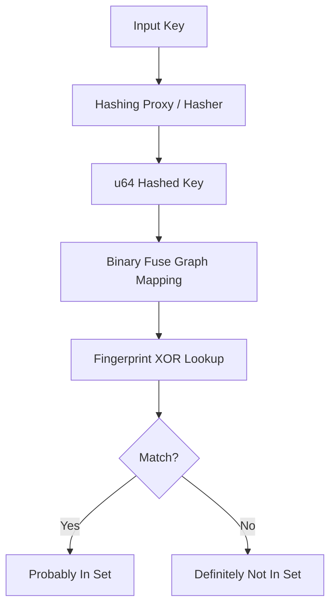
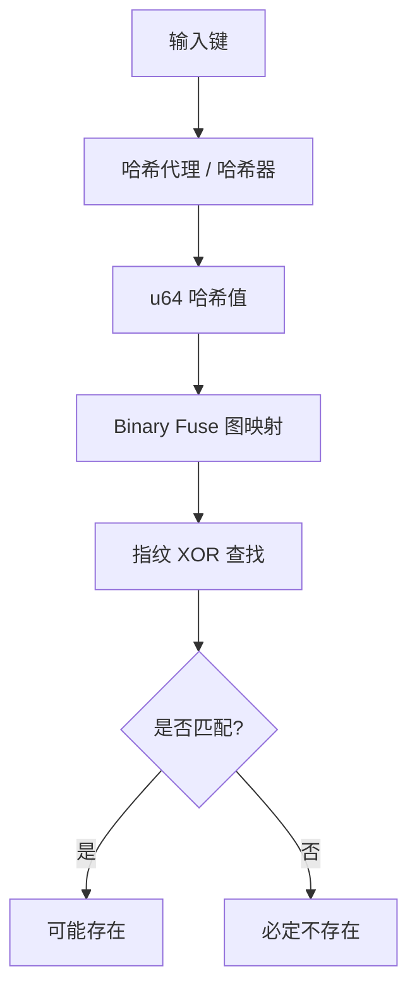

[English](#en) | [中文](#zh)

---

<a id="en"></a>

# jdb_xorf : Fast and compact Xor and Binary Fuse filters for Rust

## Table of Contents
- [Introduction](#introduction)
- [Usage](#usage)
- [Features](#features)
- [Design](#design)
- [Tech Stack](#tech-stack)
- [Directory Structure](#directory-structure)
- [API Documentation](#api-documentation)
- [Historical Note](#historical-note)

## Introduction
jdb_xorf provides high-performance implementation of Xor and Binary Fuse filters. These probabilistic data structures offer faster lookups and smaller memory footprints compared to Bloom or Cuckoo filters. Binary Fuse filters represent the state-of-the-art in static set membership testing.

## Usage

### Basic Binary Fuse Filter
```rust
use jdb_xorf::{Filter, BinaryFuse8};

let keys = vec![1u64, 2, 3];
let filter = BinaryFuse8::try_from(&keys).expect("Construction failed");

assert!(filter.contains(&1));
assert!(!filter.contains(&4));
```

### Hashing Proxy for Arbitrary Types (e.g., String)
```rust
use jdb_xorf::{Filter, HashProxy, BinaryFuse8};

let fruits = vec!["apple".to_string(), "banana".to_string()];
// RapidHasher is used by default for high performance and supports String.
let filter: HashProxy<String, BinaryFuse8> = HashProxy::try_from(&fruits).unwrap();

assert!(filter.contains("apple"));
```

### Building from Binary Data
```rust
use jdb_xorf::{Filter, HashProxy, BinaryFuse8};

let data: Vec<&[u8]> = vec![b"raw_bytes_1", b"raw_bytes_2"];
let filter: HashProxy<&[u8], BinaryFuse8> = HashProxy::try_from(&data).unwrap();

assert!(filter.contains(&b"raw_bytes_1"[..]));
```

## Features
- **Speed**: Picosecond-level lookup latency.
- **Efficiency**: Higher space utilization than Bloom filters (~9 bits per entry for BinaryFuse8).
- **Flexibility**: `HashProxy` adapter for non-u64 types.
- **Portability**: Full `no_std` support for embedded environments.
- **Serialization**: Optional `bitcode` support for rapid persistence.

## Design

The filter mapping follows a binary-partitioned fuse graph architecture.



1. **Hashing**: Keys are mixed using RapidHash or custom hashers.
2. **Mapping**: Hashes determine three slots in the partitioned graph.
3. **Lookup**: Final membership is determined by XORing fingerprints from these slots.

## Tech Stack
- **Language**: Rust (Edition 2024).
- **Core Logic**: Binary-partitioned fuse graph algorithms.
- **Hashing**: RapidHash, SplitMix64.
- **Testing**: Criterion for micro-benchmarking.

## Directory Structure
- `src/`: Core implementation.
  - `bfuse*.rs`: Specific Binary Fuse variants (8, 16, 32-bit).
  - `hash_proxy.rs`: Adapter for arbitrary key types.
  - `prelude/`: Shared macros and utilities.
- `benches/`: Performance benchmark suites.
- `analysis/`: Uniformity and zero-distribution analysis tools.

## API Documentation

### Traits
- `Filter<T>`: Core trait for membership testing.
  - `contains(&self, key: &T) -> bool`
  - `len(&self) -> usize`
- `FilterRef<'a, T>`: Zero-copy reference to filter data.
- `DmaSerializable`: Interface for direct memory access serialization.

### Types
- `BinaryFuse8`, `BinaryFuse16`, `BinaryFuse32`: Managed memory filters.
- `BinaryFuse8Ref`, `BinaryFuse16Ref`, `BinaryFuse32Ref`: Borrowed memory filters.
- `HashProxy<T, F, H = RapidHasher>`: Generic wrapper for hashing arbitrary types `T` using hasher `H` and filter `F`.

## Historical Note
Probabilistic filters have evolved from Bloom filters (1970) to Cuckoo filters (2014). Xor filters (2020) introduced a paradigm shift by utilizing perfectly hashed XOR sums. Binary Fuse filters (2022) refined this further by partitioning the graph, achieving near-theoretical limits for space and time efficiency.

---

## About

This project is an open-source component of [js0.site ⋅ Refactoring the Internet Plan](https://js0.site).

We are redefining the development paradigm of the Internet in a componentized way. Welcome to follow us:

* [Google Group](https://groups.google.com/g/js0-site)
* [js0site.bsky.social](https://bsky.app/profile/js0site.bsky.social)

---

<a id="zh"></a>

# jdb_xorf : 极致性能的 Rust Xor 与 Binary Fuse 过滤器

## 目录
- [项目介绍](#项目介绍)
- [使用演示](#使用演示)
- [特性介绍](#特性介绍)
- [设计思路](#设计思路)
- [技术堆栈](#技术堆栈)
- [目录结构](#目录结构)
- [API 说明](#api-说明)
- [历史背景](#历史背景)

## 项目介绍
jdb_xorf 是针对 Rust 开发的高性能 Xor 与 Binary Fuse 过滤器实现。此类概率型数据结构相较于 Bloom 或 Cuckoo 过滤器，具备更快的查询速度与更小的内存占用。Binary Fuse 过滤器代表了目前静态集合成员检测技术的最高水平。

## 使用演示

### 基础 Binary Fuse 过滤器
```rust
use jdb_xorf::{Filter, BinaryFuse8};

let keys = vec![1u64, 2, 3];
let filter = BinaryFuse8::try_from(&keys).expect("构造失败");

assert!(filter.contains(&1));
assert!(!filter.contains(&4));
```

### 任意类型的哈希代理 (如字符串)
```rust
use jdb_xorf::{Filter, HashProxy, BinaryFuse8};

let fruits = vec!["apple".to_string(), "banana".to_string()];
// 默认使用 RapidHasher，不仅性能极高且支持 String
let filter: HashProxy<String, BinaryFuse8> = HashProxy::try_from(&fruits).unwrap();

assert!(filter.contains("apple"));
```

### 二进制串 / 字节流构建
```rust
use jdb_xorf::{Filter, HashProxy, BinaryFuse8};

let data: Vec<&[u8]> = vec![b"raw_bytes_1", b"raw_bytes_2"];
let filter: HashProxy<&[u8], BinaryFuse8> = HashProxy::try_from(&data).unwrap();

assert!(filter.contains(&b"raw_bytes_1"[..]));
```

## 特性介绍
- **极速**: 皮秒级查询延迟。
- **高效**: 空间利用率优于 Bloom 过滤器（BinaryFuse8 每条目仅需约 9 bit）。
- **灵活**: 提供 `HashProxy` 适配器，支持非 u64 类型。
- **便携**: 完整支持 `no_std`，适用于嵌入式环境。
- **序列化**: 可选支持 `bitcode`，实现极速持久化。

## 设计思路

过滤器映射遵循二进制分区保险丝图 (Binary-partitioned Fuse Graph) 架构。



1. **哈希化**: 使用 RapidHash 或自定义哈希器对键进行混淆。
2. **映射**: 根据哈希值在分区图中确定三个槽位。
3. **查找**: 通过对这三个槽位的指纹进行 XOR 运算，判断成员身份。

## 技术堆栈
- **语言**: Rust (Edition 2024)。
- **核心算法**: 二进制分区保险丝图算法。
- **哈希算法**: RapidHash, SplitMix64。
- **性能评估**: Criterion 微基准测试。

## 目录结构
- `src/`: 核心实现。
  - `bfuse*.rs`: 特定指纹宽度的 Binary Fuse 变体 (8, 16, 32-bit)。
  - `hash_proxy.rs`: 任意键类型适配器。
  - `prelude/`: 共享宏与工具函数。
- `benches/`: 性能基准测试集。
- `analysis/`: 均匀性与零分布分析工具。

## API 说明

### Trait
- `Filter<T>`: 成员检测核心 trait。
  - `contains(&self, key: &T) -> bool`
  - `len(&self) -> usize`
- `FilterRef<'a, T>`: 过滤器数据的零拷贝引用。
- `DmaSerializable`: 适用于直接内存访问 (DMA) 的序列化接口。

### 类型
- `BinaryFuse8`, `BinaryFuse16`, `BinaryFuse32`: 托管内存的过滤器。
- `BinaryFuse8Ref`, `BinaryFuse16Ref`, `BinaryFuse32Ref`: 借用内存的过滤器。
- `HashProxy<T, F, H = RapidHasher>`: 通用包装器，使用哈希器 `H` 与过滤器 `F` 处理任意类型 `T`。

## 历史背景
概率过滤器的技术演进从 Bloom 过滤器 (1970) 开始，历经 Cuckoo 过滤器 (2014) 的改进。2020 年 Xor 过滤器的出现带来了范式转移，通过完美的 XOR 求和实现更优性能。2022 年，Mueller 与 Lemire 进一步提出 Binary Fuse 过滤器，通过图分区技术使其在空间和时间效率上逼近了理论极限。

---

## 关于

本项目为 [js0.site ⋅ 重构互联网计划](https://js0.site) 的开源组件。

我们正在以组件化的方式重新定义互联网的开发范式，欢迎关注：

* [谷歌邮件列表](https://groups.google.com/g/js0-site)
* [js0site.bsky.social](https://bsky.app/profile/js0site.bsky.social)
