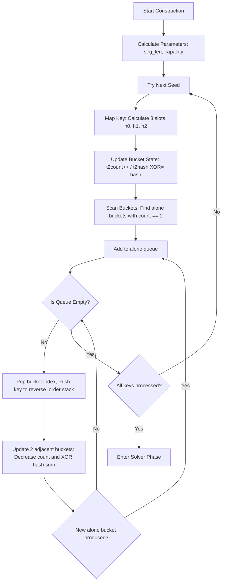
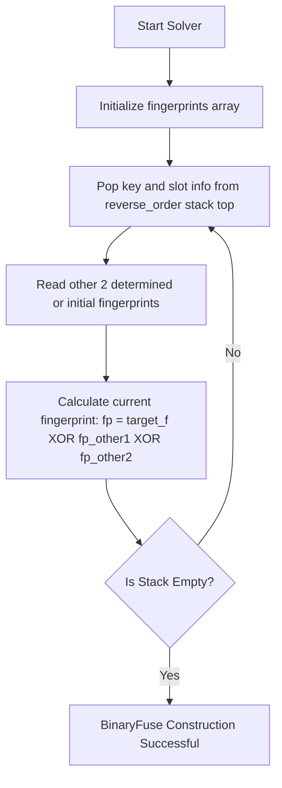
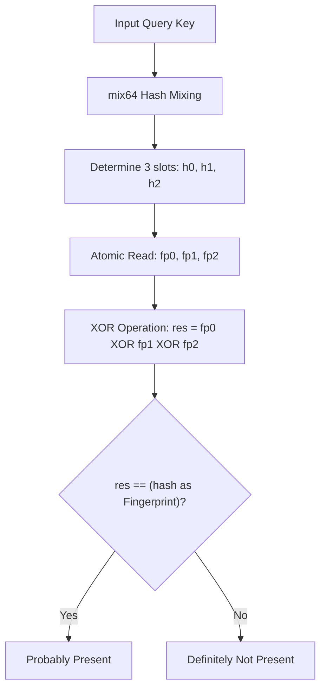

# jdb_xorf: High-Performance Binary Fuse Filter in Rust

## Introduction

jdb_xorf is a high-performance Binary Fuse filter implementation for Rust. Compared to Bloom or Cuckoo filters, this probabilistic data structure offers faster query speeds and smaller memory footprint. Binary Fuse filters represent the state-of-the-art in static set membership testing.

Binary Fuse is the pinnacle of the Xor Filter family and is currently the **most efficient** static membership test structure known. It has significant advantages over other filters in all key metrics:

### Why Choose Binary Fuse?

- **Faster Construction**: Uses **Graph Partitioning** technology to break the problem into small blocks adaptable to L1/L2 cache, making construction **10-20 times** faster than traditional Xor Filters.
- **More Space Efficient**: Lower space occupancy for the same false positive rate. `Bf8` requires only about 8.64 bits/entry to achieve a false positive rate of about 0.39% (space overhead is only **1.08x** the theoretical lower limit).
- **Better Locality**: Partitioned design significantly reduces CPU cache misses.
- **Ultra-Fast Query**: Query is strictly **O(1)**, requiring only 3 memory accesses + 1 hash mixing + 2 XOR calculations.
- **No False Negatives**: Guaranteed to return True if the element is in the set.


## Table of Contents

- [Prerequisites and Caveats](#prerequisites-and-caveats)
- [Usage Demo](#usage-demo)
- [Features](#features)
- [Design](#design)
- [Technology Stack](#technology-stack)
- [Directory Structure](#directory-structure)
- [API](#api)
- [Construction Failure Probability](#construction-failure-probability)
- [Historical Background](#historical-background)
- [References](#references)

## Prerequisites and Caveats

### No Duplicate Keys Allowed

The construction algorithm for Binary Fuse filters (`Bf8`, `Bf16`, `Bf32`) has a strict prerequisite: the input data structure **must not contain duplicate keys**. If the input `u64` hash values contain duplicates, the construction process will almost certainly fail. If you use the raw filter directly, you must remove duplicates yourself before construction.

### automatic deduplication with Bf

It is recommended to use the `Bf` wrapper to handle arbitrary types (such as `String`, `&[u8]`, etc.). `Bf` internally **automatically handles all hash calculation, sorting, and deduplication** work to ensure construction success rate. You only need to pass in the data, and leave the rest to it.

## Usage Demo

### Basic Binary Fuse Filter

```rust
use jdb_xorf::{Filter, Bf8};

let keys = vec![1u64, 2, 3];
let filter = Bf8::from(&keys);

assert!(filter.has(&1));
assert!(!filter.has(&4));
```

### Construction from Arbitrary Types with Borrowed Query

`Bf` supports borrow-based querying similar to `HashMap`. For example, after referencing a `String` filter, you can query it directly using `&str`.

```rust
use jdb_xorf::{Filter, Bf, Bf8};

let fruits = vec!["apple".to_string(), "banana".to_string()];
// Bf automatically handles hashing and deduplication.
// Uses RapidHasher by default for extremely high performance.
let filter: Bf<String, Bf8> = Bf::from(&fruits);

// Query with &str directly on a String filter
assert!(filter.has("apple"));
```

### Wrapper (Wrap) Mode: Using `Bf<str>`

If you want the filter to semantically represent a "Filter of strings" (rather than a "Filter of string references") at the type level, you can use `.into()` to convert `Bf<&str>` to `Bf<str>`. This is particularly useful for Unsized Types.

```rust
use jdb_xorf::{Bf, Bf8, Filter};

let keys = vec!["apple", "banana"];
// 1. Build a normal Bf<&str> first
let temp_filter: Bf<&str, Bf8> = Bf::from(&keys);

// 2. Convert into Bf<str> (Unsized)
let str_filter: Bf<str, Bf8> = temp_filter.into();

// 3. Query
assert!(str_filter.has("apple"));
```

### Binary Data: Using `Bf<[u8]>`

Similarly, you can create filters for byte slices.

```rust
use jdb_xorf::{Bf, Bf8, Filter};

let data: Vec<&[u8]> = vec![b"hello", b"world"];
let temp_filter: Bf<&[u8], Bf8> = Bf::from(&data);

// Convert into Bf<[u8]>
let bytes_filter: Bf<[u8], Bf8> = temp_filter.into();

assert!(bytes_filter.has(b"hello".as_slice()));
```

### Serialization and Deserialization (Optional Feature)

After enabling the `bitcode` feature, you can use `bitcode::encode` / `bitcode::decode` for serialization directly.

```rust
use jdb_xorf::{Bf, Bf8};

// 1. Serialize (Encode)
let keys = vec!["apple", "banana"];
// No need to convert to String, use &str directly
let filter: Bf<&str, Bf8> = Bf::from(&keys);

// Use bitcode library function directly
let bytes = bitcode::encode(&filter);

// 2. Deserialize (Decode)
// Can fully restore type information, including generic parameters
let loaded: Bf<&str, Bf8> = bitcode::decode(&bytes).expect("Decode failed");

assert!(loaded.has("apple"));
```

### Embedding in Structs

Thanks to `bitcode` support, you can easily embed `Bf` into your own structs, such as an SSTable structure in a database.

```rust
use bitcode::{Decode, Encode};
use jdb_xorf::{Bf, Bf8};

#[derive(Encode, Decode)]
pub struct Sst {
  // Filter for binary data
  pub xorf: Bf<[u8], Bf8>,
}

let keys: Vec<&[u8]> = vec![b"key1", b"key2"];
let filter: Bf<&[u8], Bf8> = Bf::from(&keys);

let sst = Sst {
    xorf: filter.into(),
};

// Serialize the entire struct
let bytes = bitcode::encode(&sst);
```

## Features

- **Ultra-Fast**: Picosecond-level query latency.
- **High Efficiency**: Extremely high space utilization (Bf8 requires only about 8.64 bit per entry, space overhead is 1.08x theoretical lower limit).
- **Flexible**: Provides `Bf` adapter, supports non-u64 types and **automatic deduplication**.
- **Portable**: Fully supports `no_std`, suitable for embedded environments.
- **Serialization**: Optional support for `bitcode` serialization.

## Algorithm Details (Mermaid)

### 1. Construction Phase (Peeling Phase)



### 2. Solver Phase (Solver Phase)



### 3. Query Phase (Query Phase)



1. **Hashing**: Mix keys using RapidHash or custom hasher.
2. **Mapping**: Determine three slots in the partition graph based on hash value.
3. **Lookup**: Determine membership by XORing the fingerprints of these three slots.

## Technology Stack

- **Language**: Rust (Edition 2024).
- **Core Algorithm**: Binary-partitioned Fuse Graph algorithm.
- **Hash Algorithm**: RapidHash (based on `rapidhash` crate), high-quality mixing function `mix64`.
- **Performance Evaluation**: Criterion micro-benchmarks.

## Directory Structure

- `src/`: Core implementation.
  - `base/`: Generic Binary Fuse algorithm implementation (construction, query, tools).
  - `bf.rs`: Generic wrapper `Bf` implementation (arbitrary types & deduplication).
  - `hash.rs`: Hasher and high-quality mixing function implementation.
- `benches/`: Performance benchmark suite.
- `analysis/`: Uniformity and zero-distribution analysis tools.

## API

### Trait

- `Filter<T>`: Core trait for membership testing.
  - `has(&self, key: &T) -> bool`
  - `len(&self) -> usize`

### Types

- `Bf8`, `Bf16`, `Bf32`: Managed memory filters (Aliases to `Base<u8>`, `Base<u16>`, `Base<u32>`).
- `Bf<T, F, H = RapidHasher>`: Generic wrapper, uses hasher `H` and filter `F` to handle arbitrary type `T`, with automatic deduplication.

### Summary Comparison Table

| Filter            | Memory Footprint                        | Query Speed                | Construction Speed                  | Cache Friendliness | Scenario                            |
| :---------------- | :-------------------------------------- | :------------------------- | :---------------------------------- | :----------------- | :---------------------------------- |
| **Binary Fuse**   | **Very Low (≈1.08x theoretical limit)** | **Very Fast (3 accesses)** | **Very Fast (partition optimized)** | **Excellent**      | Best choice for static massive data |
| **Xor Filter**    | Low                                     | Fast                       | Slow                                | Poor               | Previous generation solution        |
| **Bloom Filter**  | Medium                                  | Slow (multiple hashes)     | Fast                                | Poor               | Dynamic data/Simple scenarios       |
| **Cuckoo Filter** | Low                                     | Medium (random probing)    | Slow                                | Poor               | Deletion support needed             |

## Construction Failure Probability

The theoretical probability of Binary Fuse filter construction failure is extremely low. This library automatically retries 1000 times during construction (using a different random seed each time).

According to Mueller & Lemire's paper [[2]](#references), the lower bound for single construction success rate is **90%**. Based on measured data from this library (1000 rounds of testing on 100,000 random keys):

- **First-time Construction Success Rate**: **98.70%** (Successful on first try in 987 out of 1000 times)
- **Average Attempts**: **1.013**

This means the failure rate for a single construction is only .

Therefore, the probability of failure for 1000 consecutive constructions is:
^{1000}%20\approx%20(0.013)^{1000}%20\approx%2010^{-1880}>)

** is a value that can be considered absolutely 0.**
It is much smaller than the reciprocal of the total number of atoms in the universe, and hundreds of orders of magnitude lower than the probability of uncorrectable errors in modern computer hardware (about ).

Google's research on large-scale data centers shows that about **1.3%** of machines experience at least one Uncorrectable Error per year. Assuming a construction process takes 0.1 seconds, the probability of a hardware error occurring during this period is on the order of .

| Event Type                                | Approximate Probability                                     | Risk Qualification                 |
| :---------------------------------------- | :---------------------------------------------------------- | :--------------------------------- |
| **Hardware Bit Flip During Construction** |    | Real existent extremely low risk   |
| **Binary Fuse Construction Failure**      |  | Physically "Absolutely Impossible" |

Therefore, the library's design principle is: **Treat construction failure as an unrecoverable fatal error (panic), rather than a runtime error (Result/TryFrom).**

If you encounter a panic during construction, it is more likely due to:

1. **Duplicate keys in input data** (This is the most common reason, even if you think you have deduplicated).
2. **Hardware failure** (Memory bit flip, etc.).
3. **Extremely rare probabilistic event** (In this case, a simple retry is sufficient, but it is almost impossible to encounter within the timescale of human civilization).

For ease of use, we prioritize using the `From` trait because it matches the psychological expectation in most scenarios: the construction process is always successful.

## Historical Background

The technical evolution of probabilistic filters began with Bloom filters (1970) and went through improvements with Cuckoo filters (2014). The emergence of Xor filters in 2020 brought a paradigm shift, achieving better performance through perfect XOR summation. In 2022, Mueller and Lemire further proposed Binary Fuse filters, which approached theoretical limits in space and time efficiency through graph partitioning technology.

## References

- [Xor Filters: Faster and Smaller Than Bloom and Cuckoo Filters](https://arxiv.org/abs/1912.08258)
- [Binary Fuse Filters: Fast and Smaller Than Xor Filters](https://arxiv.org/abs/2201.01171)
- [Fuse Graph](https://arxiv.org/abs/1907.04749)
- [Go Implementation](https://github.com/FastFilter/xorfilter)
- [C Implementation](https://github.com/FastFilter/xor_singleheader)
- [fuse graph](https://arxiv.org/abs/1907.04749)

---

## About

This project is an open-source component of [js0.site ⋅ Refactoring the Internet Plan](https://js0.site).

We are redefining the development paradigm of the Internet in a componentized way. Welcome to follow us:

- [Google Group](https://groups.google.com/g/js0-site)
- [js0site.bsky.social](https://bsky.app/profile/js0site.bsky.social)
