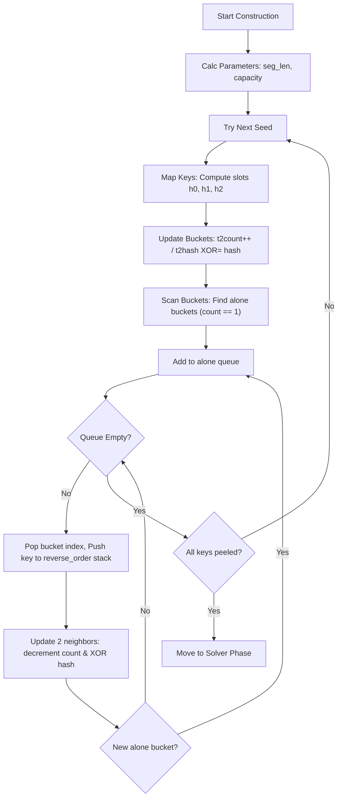
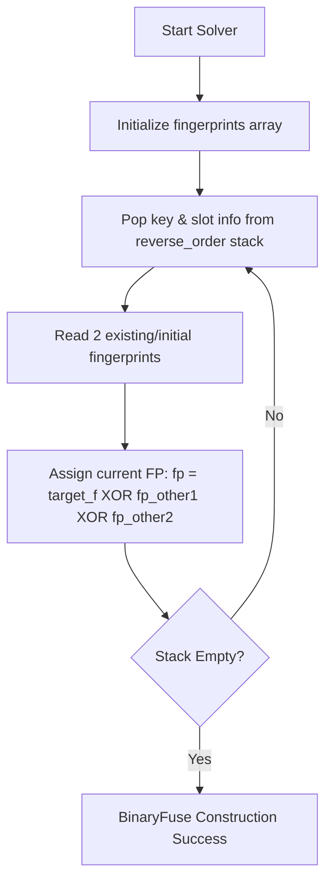
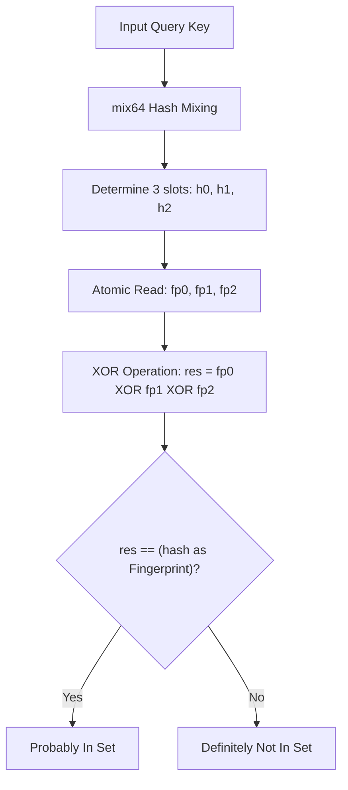

# jdb_xorf : Extremely Fast Binary Fuse Filters for Rust

## Introduction
jdb_xorf provides high-performance implementation of Binary Fuse filters for Rust. These probabilistic data structures offer faster lookups and smaller memory footprints compared to Bloom or Cuckoo filters. Binary Fuse filters represent the state-of-the-art in static set membership testing.

Binary Fuse is the pinnacle of the Xor Filter family and represents the **most efficient** static membership testing structure known today. It significantly outperforms other filters across all key metrics:

### Why Binary Fuse?
- **Faster Construction**: Uses **graph partitioning** to break the problem into small blocks that fit into L1/L2 cache, making construction **10-20x faster** than standard Xor filters.
- **More Compact**: For the same false positive rate, Binary Fuse has a lower theoretical space floor. `Bf8` achieves ~0.39% FPR with only ~8.64 bits/entry (space overhead is only **1.08x** the theoretical limit).
- **Better Locality**: Partitioned design ensures memory accesses during construction and query are localized, drastically reducing CPU cache misses.
- **Constant Time Query**: Queries are strictly **O(1)**, requiring exactly 3 memory accesses + 1 hash mix + 2 XOR operations.
- **Zero False Negatives**: Like Bloom filters, if an element is in the set, Binary Fuse guarantees a True return.


## Table of Contents
- [Caveats & Prerequisites](#caveats--prerequisites)
- [Usage](#usage)
- [Features](#features)
- [Design](#design)
- [Tech Stack](#tech-stack)
- [Directory Structure](#directory-structure)
- [API Documentation](#api-documentation)
- [Construction Failure Probability](#construction-failure-probability)
- [Historical Note](#historical-note)
- [References](#references)


## Caveats & Prerequisites

### No Duplicates Allowed
It is a strict **pre-condition** that Binary Fuse filters (`Bf8`, `Bf16`, `Bf32`) are constructed from a data structure containing **no duplicate keys**. If duplicates are present in the input `u64` hashes, the construction will almost certainly fail. You must perform any de-duplication needed yourself before constructing a raw filter.

### Automatic Deduplication with Bf
If you use the `Bf` wrapper (recommended for arbitrary types like `String`, `&[u8]`, etc.), it **automatically transforms and deduplicates** the keys for you. `Bf` collects all inputs, hashes them, sorts, and removes duplicates before attempting construction, ensuring a seamless experience.

## Usage

### Basic Binary Fuse Filter
```rust
use jdb_xorf::{Filter, Bf8};

let keys = vec![1u64, 2, 3];
let filter = Bf8::from(&keys);

assert!(filter.contains(&1));
assert!(!filter.contains(&4));
```

### Hashing Proxy for Arbitrary Types (e.g., String)
```rust
use jdb_xorf::{Filter, Bf, Bf8};

let fruits = vec!["apple".to_string(), "banana".to_string()];
// Bf automatically handles hashing and deduplication.
// RapidHasher is used by default for high performance.
let filter: Bf<String, Bf8> = Bf::from(&fruits);

assert!(filter.contains("apple"));
```

### Bfing from Binary Data
```rust
use jdb_xorf::{Filter, Bf, Bf8};

let data: Vec<&[u8]> = vec![b"raw_bytes_1", b"raw_bytes_2"];
let filter: Bf<&[u8], Bf8> = Bf::from(&data);

assert!(filter.contains(&b"raw_bytes_1"[..]));
```

## Features
- **Speed**: Picosecond-level lookup latency.
- **Efficiency**: Ultra-high space utilization (~8.64 bits per entry for Bf8, 1.08x theoretical limit).
- **Flexibility**: `Bf` adapter for non-u64 types with **automatic deduplication**.
- **Portability**: Full `no_std` support for embedded environments.
- **Serialization**: Optional `bitcode` support or DMA zero-copy loading.

## Algorithm Details (Mermaid)

### 1. Peeling Phase


### 2. Solver Phase


### 3. Query Phase


1. **Hashing**: Keys are mixed using RapidHash or custom hashers.
2. **Mapping**: Hashes determine three slots in the partitioned graph.
3. **Lookup**: Final membership is determined by XORing fingerprints from these slots.

## Tech Stack
- **Language**: Rust (Edition 2024).
- **Core Logic**: Binary-partitioned fuse graph algorithms.
- **Hashing**: RapidHash (via `rapidhash` crate), high-quality `mix64` function.
- **Testing**: Criterion for micro-benchmarking.

## Directory Structure
- `src/`: Core implementation.
  - `base.rs`: Generic Binary Fuse implementation.
  - `bfuse*.rs`: Specific Binary Fuse variants (8, 16, 32-bit).
  - `bf/`: Bfer utilities (containing the `Bf` adapter).
  - `hash.rs`: Hasher and avalanche mixing implementation.
- `benches/`: Performance benchmark suites.
- `analysis/`: Uniformity and zero-distribution analysis tools.

## API Documentation

### Traits
- `Filter<T>`: Core trait for membership testing.
  - `contains(&self, key: &T) -> bool`
  - `len(&self) -> usize`
- `FilterRef<'a, T>`: Zero-copy reference to filter data.
- `DmaSerializable`: Interface for direct memory access serialization.

### Types
- `Bf8`, `Bf16`, `Bf32`: Managed memory filters.
- `Bf8Ref`, `Bf16Ref`, `Bf32Ref`: Borrowed memory filters.
- `Bf<T, F, H = RapidHasher>`: Generic wrapper for hashing arbitrary types `T` using hasher `H` and filter `F`, with auto-deduplication.

### Summary Comparison

| Filter | Memory Usage | Query Speed | Bf Speed | Cache Friendliness | Best Use Case |
| :--- | :--- | :--- | :--- | :--- | :--- |
| **Binary Fuse** | **Lowest (≈1.08x theoretical limit)** | **Fastest (3 accesses)** | **Fastest (Partitioned)** | **Excellent** | Static, large datasets |
| **Xor Filter** | Low | Fast | Slow | Poor | Legacy static sets |
| **Bloom Filter** | Medium | Slow (Multiple hashes) | Fast | Poor | Dynamic sets / Simple needs |
| **Cuckoo Filter** | Low | Medium (Random probes) | Slow | Poor | Dynamic sets (supports delete) |

## Construction Failure Probability
The theoretical probability of a Binary Fuse Filter failing to construct is infinitesimal. This library automatically retries construction 1000 times with different seeds.

The theoretical probability of a Binary Fuse Filter failing to construct is infinitesimal. This library automatically retries construction 1000 times with different seeds.

According to Mueller & Lemire [[2]](#references), the success probability of a single construction attempt has a lower bound of **90%** (expected trials ). This implies a single-attempt failure rate .

Therefore, the probability of 1000 consecutive failures is:
^{1000}%20\le%20(0.1)^{1000}%20=%2010^{-1000})

** is a value that can be considered physically zero.**
It is far smaller than the inverse of the number of atoms in the universe, and hundreds of orders of magnitude lower than the probability of an uncorrectable hardware error ().


A study by Google on DRAM reliability showed that approximately **1.3% of machines experience an uncorrectable memory error per year**. The probability of a hardware error occurring during the split-second filter construction is estimated to be around  to .

| Event | Approximate Probability | Risk Classification |
| :--- | :--- | :--- |
| **Hardware Bit Flip (during bf)** |  | Real, Non-Zero Risk |
| **Binary Fuse Bf Failure** |  | Physically Impossible |

Therefore, the library design philosophy is: **Treat construction failure as an unrecoverable fatal error (panic), not a runtime error (Result/TryFrom).**

If you encounter a panic during `from()`, it is overwhelmingly likely due to:
1.  **Duplicate keys in input** (Most common cause; use `Bf` wrapper to handle this).
2.  **Hardware failure** (Memory corruption).
3.  **Statistical impossibility** (Winning the "bad luck" lottery).

For usability, we prioritize the `From` trait as it aligns with the expectation that construction just works.

## Historical Note
Probabilistic filters have evolved from Bloom filters (1970) to Cuckoo filters (2014). Xor filters (2020) introduced a paradigm shift by utilizing perfectly hashed XOR sums. Binary Fuse filters (2022) refined this further by partitioning the graph, achieving near-theoretical limits for space and time efficiency.

## References

- [Xor Filters: Faster and Smaller Than Bloom and Cuckoo Filters](https://arxiv.org/abs/1912.08258)
- [Binary Fuse Filters: Fast and Smaller Than Xor Filters](https://arxiv.org/abs/2201.01171)
- [Fuse Graph](https://arxiv.org/abs/1907.04749)
- [Go Implementation](https://github.com/FastFilter/xorfilter)
- [C Implementation](https://github.com/FastFilter/xor_singleheader)
- [fuse graph](https://arxiv.org/abs/1907.04749)