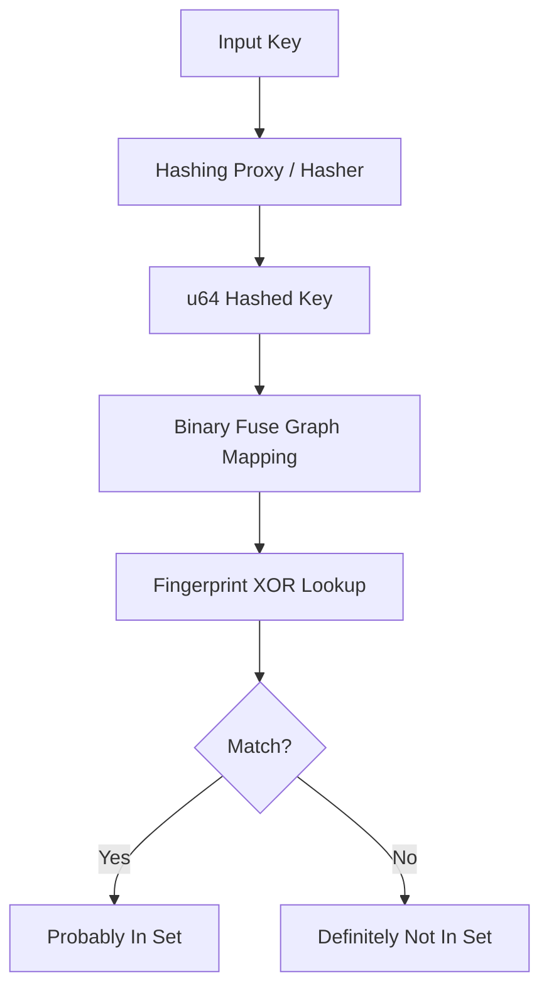

# jdb_xorf : Fast and compact Xor and Binary Fuse filters for Rust

## Table of Contents
- [Introduction](#introduction)
- [Usage](#usage)
- [Features](#features)
- [Design](#design)
- [Tech Stack](#tech-stack)
- [Directory Structure](#directory-structure)
- [API Documentation](#api-documentation)
- [Historical Note](#historical-note)

## Introduction
jdb_xorf provides high-performance implementation of Xor and Binary Fuse filters. These probabilistic data structures offer faster lookups and smaller memory footprints compared to Bloom or Cuckoo filters. Binary Fuse filters represent the state-of-the-art in static set membership testing.

## Usage

### Basic Binary Fuse Filter
```rust
use jdb_xorf::{Filter, BinaryFuse8};

let keys = vec![1u64, 2, 3];
let filter = BinaryFuse8::try_from(&keys).expect("Construction failed");

assert!(filter.contains(&1));
assert!(!filter.contains(&4));
```

### Hashing Proxy for Arbitrary Types (e.g., String)
```rust
use jdb_xorf::{Filter, HashProxy, BinaryFuse8};

let fruits = vec!["apple".to_string(), "banana".to_string()];
// RapidHasher is used by default for high performance and supports String.
let filter: HashProxy<String, BinaryFuse8> = HashProxy::try_from(&fruits).unwrap();

assert!(filter.contains("apple"));
```

### Building from Binary Data
```rust
use jdb_xorf::{Filter, HashProxy, BinaryFuse8};

let data: Vec<&[u8]> = vec![b"raw_bytes_1", b"raw_bytes_2"];
let filter: HashProxy<&[u8], BinaryFuse8> = HashProxy::try_from(&data).unwrap();

assert!(filter.contains(&b"raw_bytes_1"[..]));
```

## Features
- **Speed**: Picosecond-level lookup latency.
- **Efficiency**: Higher space utilization than Bloom filters (~9 bits per entry for BinaryFuse8).
- **Flexibility**: `HashProxy` adapter for non-u64 types.
- **Portability**: Full `no_std` support for embedded environments.
- **Serialization**: Optional `bitcode` support for rapid persistence.

## Design

The filter mapping follows a binary-partitioned fuse graph architecture.



1. **Hashing**: Keys are mixed using RapidHash or custom hashers.
2. **Mapping**: Hashes determine three slots in the partitioned graph.
3. **Lookup**: Final membership is determined by XORing fingerprints from these slots.

## Tech Stack
- **Language**: Rust (Edition 2024).
- **Core Logic**: Binary-partitioned fuse graph algorithms.
- **Hashing**: RapidHash, SplitMix64.
- **Testing**: Criterion for micro-benchmarking.

## Directory Structure
- `src/`: Core implementation.
  - `bfuse*.rs`: Specific Binary Fuse variants (8, 16, 32-bit).
  - `hash_proxy.rs`: Adapter for arbitrary key types.
  - `prelude/`: Shared macros and utilities.
- `benches/`: Performance benchmark suites.
- `analysis/`: Uniformity and zero-distribution analysis tools.

## API Documentation

### Traits
- `Filter<T>`: Core trait for membership testing.
  - `contains(&self, key: &T) -> bool`
  - `len(&self) -> usize`
- `FilterRef<'a, T>`: Zero-copy reference to filter data.
- `DmaSerializable`: Interface for direct memory access serialization.

### Types
- `BinaryFuse8`, `BinaryFuse16`, `BinaryFuse32`: Managed memory filters.
- `BinaryFuse8Ref`, `BinaryFuse16Ref`, `BinaryFuse32Ref`: Borrowed memory filters.
- `HashProxy<T, F, H = RapidHasher>`: Generic wrapper for hashing arbitrary types `T` using hasher `H` and filter `F`.

## Historical Note
Probabilistic filters have evolved from Bloom filters (1970) to Cuckoo filters (2014). Xor filters (2020) introduced a paradigm shift by utilizing perfectly hashed XOR sums. Binary Fuse filters (2022) refined this further by partitioning the graph, achieving near-theoretical limits for space and time efficiency.
