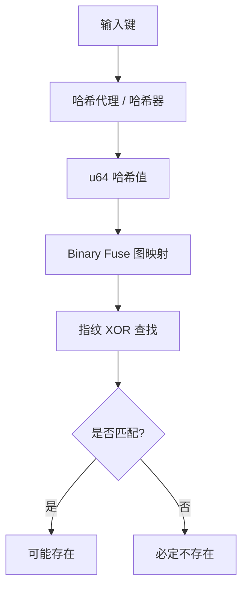

# jdb_xorf : 极致性能的 Rust Xor 与 Binary Fuse 过滤器

## 目录
- [项目介绍](#项目介绍)
- [使用演示](#使用演示)
- [特性介绍](#特性介绍)
- [设计思路](#设计思路)
- [技术堆栈](#技术堆栈)
- [目录结构](#目录结构)
- [API 说明](#api-说明)
- [历史背景](#历史背景)

## 项目介绍
jdb_xorf 是针对 Rust 开发的高性能 Xor 与 Binary Fuse 过滤器实现。此类概率型数据结构相较于 Bloom 或 Cuckoo 过滤器，具备更快的查询速度与更小的内存占用。Binary Fuse 过滤器代表了目前静态集合成员检测技术的最高水平。

## 使用演示

### 基础 Binary Fuse 过滤器
```rust
use jdb_xorf::{Filter, BinaryFuse8};

let keys = vec![1u64, 2, 3];
let filter = BinaryFuse8::try_from(&keys).expect("构造失败");

assert!(filter.contains(&1));
assert!(!filter.contains(&4));
```

### 任意类型的哈希代理 (如字符串)
```rust
use jdb_xorf::{Filter, HashProxy, BinaryFuse8};

let fruits = vec!["apple".to_string(), "banana".to_string()];
// 默认使用 RapidHasher，不仅性能极高且支持 String
let filter: HashProxy<String, BinaryFuse8> = HashProxy::try_from(&fruits).unwrap();

assert!(filter.contains("apple"));
```

### 二进制串 / 字节流构建
```rust
use jdb_xorf::{Filter, HashProxy, BinaryFuse8};

let data: Vec<&[u8]> = vec![b"raw_bytes_1", b"raw_bytes_2"];
let filter: HashProxy<&[u8], BinaryFuse8> = HashProxy::try_from(&data).unwrap();

assert!(filter.contains(&b"raw_bytes_1"[..]));
```

## 特性介绍
- **极速**: 皮秒级查询延迟。
- **高效**: 空间利用率优于 Bloom 过滤器（BinaryFuse8 每条目仅需约 9 bit）。
- **灵活**: 提供 `HashProxy` 适配器，支持非 u64 类型。
- **便携**: 完整支持 `no_std`，适用于嵌入式环境。
- **序列化**: 可选支持 `bitcode`，实现极速持久化。

## 设计思路

过滤器映射遵循二进制分区保险丝图 (Binary-partitioned Fuse Graph) 架构。



1. **哈希化**: 使用 RapidHash 或自定义哈希器对键进行混淆。
2. **映射**: 根据哈希值在分区图中确定三个槽位。
3. **查找**: 通过对这三个槽位的指纹进行 XOR 运算，判断成员身份。

## 技术堆栈
- **语言**: Rust (Edition 2024)。
- **核心算法**: 二进制分区保险丝图算法。
- **哈希算法**: RapidHash, SplitMix64。
- **性能评估**: Criterion 微基准测试。

## 目录结构
- `src/`: 核心实现。
  - `bfuse*.rs`: 特定指纹宽度的 Binary Fuse 变体 (8, 16, 32-bit)。
  - `hash_proxy.rs`: 任意键类型适配器。
  - `prelude/`: 共享宏与工具函数。
- `benches/`: 性能基准测试集。
- `analysis/`: 均匀性与零分布分析工具。

## API 说明

### Trait
- `Filter<T>`: 成员检测核心 trait。
  - `contains(&self, key: &T) -> bool`
  - `len(&self) -> usize`
- `FilterRef<'a, T>`: 过滤器数据的零拷贝引用。
- `DmaSerializable`: 适用于直接内存访问 (DMA) 的序列化接口。

### 类型
- `BinaryFuse8`, `BinaryFuse16`, `BinaryFuse32`: 托管内存的过滤器。
- `BinaryFuse8Ref`, `BinaryFuse16Ref`, `BinaryFuse32Ref`: 借用内存的过滤器。
- `HashProxy<T, F, H = RapidHasher>`: 通用包装器，使用哈希器 `H` 与过滤器 `F` 处理任意类型 `T`。

## 历史背景
概率过滤器的技术演进从 Bloom 过滤器 (1970) 开始，历经 Cuckoo 过滤器 (2014) 的改进。2020 年 Xor 过滤器的出现带来了范式转移，通过完美的 XOR 求和实现更优性能。2022 年，Mueller 与 Lemire 进一步提出 Binary Fuse 过滤器，通过图分区技术使其在空间和时间效率上逼近了理论极限。
