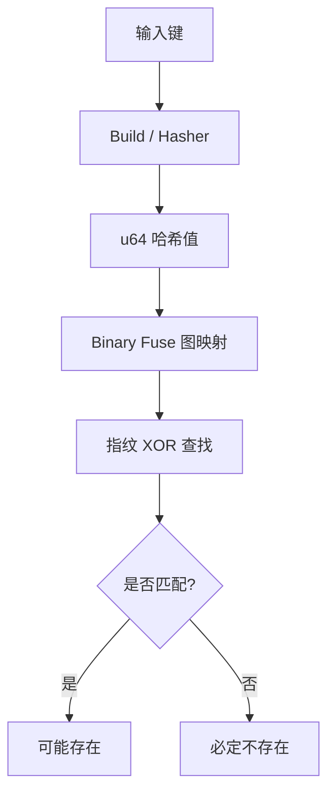

# jdb_xorf : 极致性能的 Rust Binary Fuse 过滤器

## 项目介绍
jdb_xorf 是针对 Rust 开发的高性能 Binary Fuse 过滤器实现。此类概率型数据结构相较于 Bloom 或 Cuckoo 过滤器，具备更快的查询速度与更小的内存占用。Binary Fuse 过滤器代表了目前静态集合成员检测技术的最高水平。

Binary Fuse 是 Xor Filter 系列的巅峰之作，也是目前已知**最高效**的静态成员检测结构。相比于其他过滤器，它在所有关键指标上都具有显著优势：

### 为什么选择 Binary Fuse？
- **构建速度更快**: 采用了**图分区 (Graph Partitioning)** 技术，将问题拆解为适应 L1/L2 缓存的小型块，构建速度比传统 Xor Filter 快 **10-20 倍**。
- **更节省空间**: 相同误报率下空间占用更低。`BinaryFuse8` 仅需约 9 bits/entry 即可达到 0.39% 的误报率，比传统 Bloom Filter 节省 30% 以上空间。
- **更好的局部性**: 分区设计极大幅度减少了 CPU 缓存失效。
- **极速查询**: 查询是严格的 **O(1)**，仅需 3 次内存访问 + 2 次 XOR 计算。
- **无误漏**: 保证如果元素在集合中，一定会返回 True。


## 目录
- [注意事项与前提条件](#注意事项与前提条件)
- [使用演示](#使用演示)
- [特性介绍](#特性介绍)
- [设计思路](#设计思路)
- [技术堆栈](#技术堆栈)
- [目录结构](#目录结构)
- [API 说明](#api-说明)
- [构建失败概率](#构建失败概率)
- [历史背景](#历史背景)
- [参考引用](#参考引用)


## 注意事项与前提条件

### 严禁重复元素
Binary Fuse 过滤器 (`BinaryFuse8`, `BinaryFuse16`, `BinaryFuse32`) 的构建算法有一个严格的前提条件：输入的数据结构中**不得包含重复的键 (duplicate keys)**。如果输入的 `u64` 哈希值存在重复，构建过程几乎肯定会失败。如果您直接使用原始过滤器，必须在构建前自行去除重复项。

### Build (HashProxy) 自动去重
推荐使用 `Build` 包装器来处理任意类型（如 `String`, `&[u8]` 等）。`Build` 会在内部**自动处理所有的哈希计算、排序和去重**工作，确保构建成功率。您只需传入数据，剩下的交给它处理。

## 使用演示

### 基础 Binary Fuse 过滤器
```rust
use jdb_xorf::{Filter, BinaryFuse8};

let keys = vec![1u64, 2, 3];
let filter = BinaryFuse8::from(&keys);

assert!(filter.contains(&1));
assert!(!filter.contains(&4));
```

### 任意类型的构建 (如字符串)
```rust
use jdb_xorf::{Filter, Build, BinaryFuse8};

let fruits = vec!["apple".to_string(), "banana".to_string()];
// Build 会自动处理哈希和去重。
// 默认使用 RapidHasher 以获得极高性能。
let filter: Build<String, BinaryFuse8> = Build::from(&fruits);

assert!(filter.contains("apple"));
```

### 二进制串 / 字节流构建
```rust
use jdb_xorf::{Filter, Build, BinaryFuse8};

let data: Vec<&[u8]> = vec![b"raw_bytes_1", b"raw_bytes_2"];
let filter: Build<&[u8], BinaryFuse8> = Build::from(&data);

assert!(filter.contains(&b"raw_bytes_1"[..]));
```

## 特性介绍
- **极速**: 皮秒级查询延迟。
- **高效**: 空间利用率优于 Bloom 过滤器（BinaryFuse8 每条目仅需约 9 bit）。
- **灵活**: 提供 `Build` 适配器，支持非 u64 类型并**自动去重**。
- **便携**: 完整支持 `no_std`，适用于嵌入式环境。
- **序列化**: 可选支持 `bitcode`，实现极速持久化。

## 设计思路

过滤器映射遵循二进制分区保险丝图 (Binary-partitioned Fuse Graph) 架构。



1. **哈希化**: 使用 RapidHash 或自定义哈希器对键进行混淆。
2. **映射**: 根据哈希值在分区图中确定三个槽位。
3. **查找**: 通过对这三个槽位的指纹进行 XOR 运算，判断成员身份。

## 技术堆栈
- **语言**: Rust (Edition 2024)。
- **核心算法**: 二进制分区保险丝图算法。
- **哈希算法**: RapidHash, SplitMix64。
- **性能评估**: Criterion 微基准测试。

## 目录结构
- `src/`: 核心实现。
  - `bfuse*.rs`: 特定指纹宽度的 Binary Fuse 变体 (8, 16, 32-bit)。
  - `build/`: 构建工具 (HashProxy 替代品)。
  - `prelude/`: 共享宏与工具函数。
- `benches/`: 性能基准测试集。
- `analysis/`: 均匀性与零分布分析工具。

## API 说明

### Trait
- `Filter<T>`: 成员检测核心 trait。
  - `contains(&self, key: &T) -> bool`
  - `len(&self) -> usize`
- `FilterRef<'a, T>`: 过滤器数据的零拷贝引用。
- `DmaSerializable`: 适用于直接内存访问 (DMA) 的序列化接口。

### 类型
- `BinaryFuse8`, `BinaryFuse16`, `BinaryFuse32`: 托管内存的过滤器。
- `BinaryFuse8Ref`, `BinaryFuse16Ref`, `BinaryFuse32Ref`: 借用内存的过滤器。
- `Build<T, F, H = RapidHasher>`: 通用包装器，使用哈希器 `H` 与过滤器 `F` 处理任意类型 `T`，具备自动去重功能。

### 总结对比表

| 过滤器 | 内存占用 | 查询速度 | 构建速度 | 缓存友好度 | 场景 |
| :--- | :--- | :--- | :--- | :--- | :--- |
| **Binary Fuse** | **极低 (≈1.08x 理论下限)** | **极快 (3 次访问)** | **极快 (分区优化)** | **优秀** | 静态海量数据最佳选择 |
| **Xor Filter** | 低 | 快 | 慢 | 差 | 旧一代方案 |
| **Bloom Filter** | 中 | 慢 (多次哈希) | 快 | 差 | 动态数据/简单场景 |
| **Cuckoo Filter** | 低 | 中 (随机探测) | 慢 | 差 | 需要支持删除 |

## 构建失败概率

Binary Fuse 过滤器构建失败的理论概率极低。本库在构建时会自动进行 1000 次重试（每次使用不同的随机种子）。

根据 Mueller & Lemire 的论文 [[2]](#参考引用)，单次构建的成功率下界为 **90%**（即期望尝试次数 $\le 1.1$）。这意味着单次构建的失败率 $P_{fail} \le 10\%$。

因此，连续 1000 次构建均失败的概率为：
$$P_{total\_fail} = (P_{fail})^{1000} \le (0.1)^{1000} = 10^{-1000}$$

**$10^{-1000}$ 是一个在物理意义上完全可以视为 0 的数值。**
它比宇宙中的原子总数倒数还要小得多，更比现代计算机硬件发生不可纠正错误的概率（约为 $10^{-11}$）低几百个数量级。

Google 在大规模数据中心的研究表明，每年约有 **1.3%** 的机器经历过至少一次不可纠正的内存错误 (Uncorrectable Error)。假设一次构建过程耗时 0.1 秒，那么在此期间发生硬件错误的概率约为 $10^{-11}$ 量级。

| 事件类型 | 近似概率 | 风险定性 |
| :--- | :--- | :--- |
| **构建期间硬件位翻转** | $\approx 10^{-11}$ | 真实存在的极低风险 |
| **Binary Fuse 构建失败** | $\le 10^{-1000}$ | 物理上的“绝对不可能” |

因此，库的设计原则是：**将构建失败视为不可恢复的致命错误（panic），而非运行时错误（Result/TryFrom）。**

如果您在构建过程中遇到了 panic，更有可能是因为：
1. **输入数据存在重复键**（这是最常见的原因，即使您认为已经去重）。
2. **硬件故障**（内存位翻转等）。
3. **极度罕见的概率事件**（此时只需简单的重试即可，但在人类文明的时间尺度内几乎不可能遇到）。

出于易用性考虑，我们优先使用 `From` trait，因为它符合绝大多数场景下的心理预期：构建过程总是成功的。

## 历史背景
概率过滤器的技术演进从 Bloom 过滤器 (1970) 开始，历经 Cuckoo 过滤器 (2014) 的改进。2020 年 Xor 过滤器的出现带来了范式转移，通过完美的 XOR 求和实现更优性能。2022 年，Mueller 与 Lemire 进一步提出 Binary Fuse 过滤器，通过图分区技术使其在空间和时间效率上逼近了理论极限。

## 参考引用

- [Xor Filters: Faster and Smaller Than Bloom and Cuckoo Filters](https://arxiv.org/abs/1912.08258)
- [Binary Fuse Filters: Fast and Smaller Than Xor Filters](https://arxiv.org/abs/2201.01171)
- [Fuse Graph](https://arxiv.org/abs/1907.04749)
- [Go 实现](https://github.com/FastFilter/xorfilter)
- [C 实现](https://github.com/FastFilter/xor_singleheader)
- [fuse graph]: https://arxiv.org/abs/1907.04749