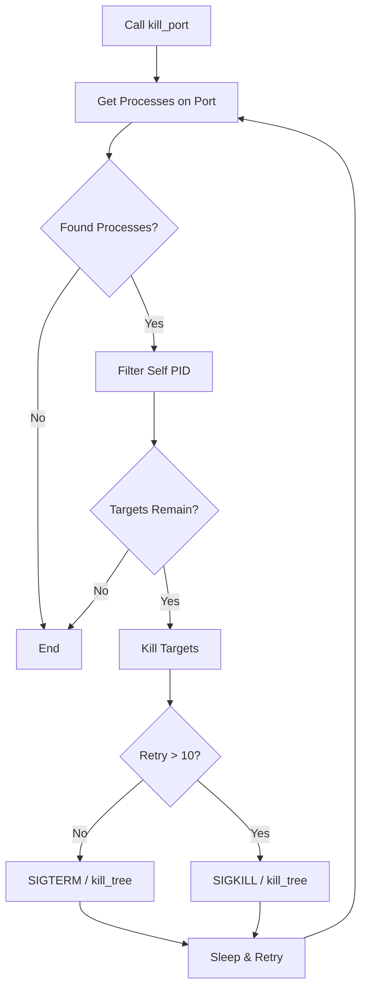
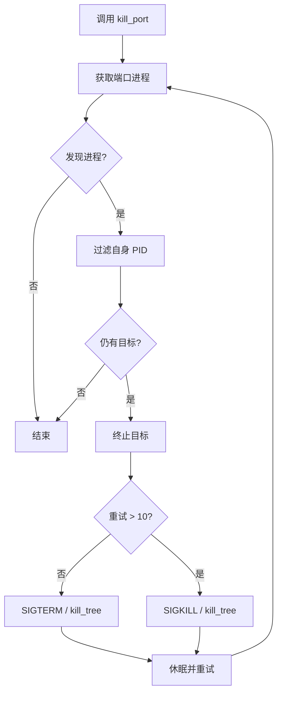

[English](#en) | [中文](#zh)

---

<a id="en"></a>

# kill_port : Terminate Processes by Port Efficiently

## Table of Contents

- [Introduction](#introduction)
- [Usage](#usage)
- [Design](#design)
- [Tech Stack](#tech-stack)
- [Project Structure](#project-structure)
- [API](#api)
- [History](#history-of-process-termination)

## Introduction

Cross-platform utility to terminate processes listening on specific ports. Designed for robustness and ease of use in development and automation workflows.

## Usage

Source code available in `src/`. For runnable examples, refer to `tests/`.

### Basic Example

```rust
use kill_port::kill_port;

fn main() {
  // Terminate all processes listening on port 8080
  kill_port(8080);
}
```

### With Logging

```rust
use kill_port::kill_port;
use log::info;

fn main() {
  // Initialize logger
  // env_logger::init();

  info!("Cleaning up port 3000...");
  kill_port(3000);
  info!("Done.");
}
```

## Design

The library employs a progressive termination strategy. It first identifies processes bound to the target port, filters out the caller to prevent self-termination, and then attempts to stop them.

### Termination Flow

1.  **Discovery**: Identify PIDs binding the port.
2.  **Filtration**: Exclude current process PID.
3.  **Escalation**:
    - **Unix**: Send `SIGTERM` (graceful). If process persists after 10 retries, upgrade to `SIGKILL` (forceful).
    - **Windows**: Execute `kill_tree` to remove process tree.
4.  **Verification**: Loop until port is free.



## Tech Stack

- **Rust**: System programming language (Edition 2024).
- **listeners**: Cross-platform port detection.
- **nix**: Unix system APIs for signal handling.
- **kill_tree**: Windows process tree management.
- **log**: Logging abstraction.

## Project Structure

```text
kill_port/
├── src/
│   └── lib.rs       # Core logic export
├── tests/
│   └── main.rs      # Integration tests
├── readme/
│   ├── en.md        # English Documentation
│   └── zh.md        # Chinese Documentation
└── Cargo.toml       # Manifest
```

## API

### `kill_port::kill_port`

```rust
pub fn kill_port(port: u16)
```

Target and terminate processes on the specified `port`.

- **Parameters**: `port` (u16) - The network port number.
- **Behavior**: Blocks until processes are terminated. Logs attempts and retries.

## History of Process Termination

The concept of "killing" a process dates back to early Unix systems. The `kill` command, despite its aggressive name, was originally designed to send signals to processes, not just terminate them. The most famous signal, `SIGKILL` (Signal 9), was introduced as the "sure kill" that cannot be intercepted or ignored by a process, contrasting with `SIGTERM` (Signal 15) which asks politely.

In modern development, "zombie" processes holding onto ports (like `EADDRINUSE` errors) became a frequent nuisance with the rise of hot-reloading web servers. Tools like `fuser` and `lsof` helped identify these culprits manually. `kill_port` automates this age-old ritual, bringing the precision of signal handling to a simple function call.

---

## About

This project is an open-source component of [js0.site ⋅ Refactoring the Internet Plan](https://js0.site).

We are redefining the development paradigm of the Internet in a componentized way. Welcome to follow us:

- [Google Group](https://groups.google.com/g/js0-site)
- [js0site.bsky.social](https://bsky.app/profile/js0site.bsky.social)

---

<a id="zh"></a>

# kill_port : 高效终止端口进程

## 目录

- [简介](#简介)
- [使用演示](#使用演示)
- [设计思路](#设计思路)
- [技术栈](#技术栈)
- [目录结构](#目录结构)
- [API 接口](#api-接口)
- [历史趣闻](#历史趣闻)

## 简介

跨平台端口进程终止工具。专为开发和自动化工作流设计，高效且稳定。

## 使用演示

源代码位于 `src/`。完整演示代码请参考 `tests/`。

### 基础用法

```rust
use kill_port::kill_port;

fn main() {
  // 终止占用 8080 端口的所有进程
  kill_port(8080);
}
```

### 配合日志

```rust
use kill_port::kill_port;
use log::info;

fn main() {
  // 初始化日志系统
  // env_logger::init();

  info!("正在清理 3000 端口...");
  kill_port(3000);
  info!("清理完成。");
}
```

## 设计思路

采用渐进式终止策略。首先识别绑定目标端口的进程，过滤掉当前自身进程，然后尝试停止目标。

### 调用流程

1.  **发现**: 识别占用端口的 PID。
2.  **过滤**: 排除当前进程 PID 防止自杀。
3.  **升级**:
    - **Unix**: 优先发送 `SIGTERM`（优雅退出）。若重试超过 10 次仍未结束，升级为 `SIGKILL`（强制结束）。
    - **Windows**: 调用 `kill_tree` 清除进程树。
4.  **验证**: 循环检查直到端口释放。



## 技术栈

- **Rust**: 系统级编程语言 (Edition 2024).
- **listeners**: 跨平台端口检测。
- **nix**: Unix 系统信号处理 API。
- **kill_tree**: Windows 进程树管理。
- **log**: 日志抽象层。

## 目录结构

```text
kill_port/
├── src/
│   └── lib.rs       # 核心逻辑导出
├── tests/
│   └── main.rs      # 集成测试代码
├── readme/
│   ├── en.md        # 英文文档
│   └── zh.md        # 中文文档
└── Cargo.toml       # 项目配置清单
```

## API 接口

### `kill_port::kill_port`

```rust
pub fn kill_port(port: u16)
```

定位并终止指定 `port` 上的进程。

- **参数**: `port` (u16) - 目标端口号。
- **行为**: 阻塞线程直到进程被终止。会自动记录尝试和重试日志。

## 历史趣闻

“Kill”（杀）这个术语最早可以追溯到早期的 Unix 系统。尽管名字听起来充满暴力色彩，但在操作系统中，`kill` 命令的本意仅是向进程发送信号，而非单纯的终止。最著名的信号莫过于 `SIGKILL` (Signal 9)，它是进程无法捕获或忽略的“必杀技”，与请求进程自行退出的 `SIGTERM` (Signal 15) 形成鲜明对比。

在现代 Web 开发中，随着热重载服务的普及，由“僵尸”进程导致的端口占用（`EADDRINUSE` 错误）变得屡见不鲜。过去，开发者常需借助 `lsof` 或 `netstat` 等工具手动查找并清理这些进程。`kill_port` 将这一古老的仪式自动化，把精准的信号控制封装为简单的函数调用。

---

## 关于

本项目为 [js0.site ⋅ 重构互联网计划](https://js0.site) 的开源组件。

我们正在以组件化的方式重新定义互联网的开发范式，欢迎关注：

- [谷歌邮件列表](https://groups.google.com/g/js0-site)
- [js0site.bsky.social](https://bsky.app/profile/js0site.bsky.social)
