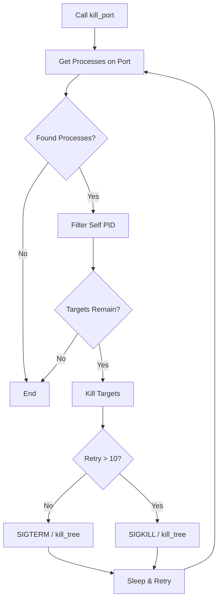

# kill_port : Terminate Processes by Port Efficiently

## Table of Contents

- [Introduction](#introduction)
- [Usage](#usage)
- [Design](#design)
- [Tech Stack](#tech-stack)
- [Project Structure](#project-structure)
- [API](#api)
- [History](#history-of-process-termination)

## Introduction

Cross-platform utility to terminate processes listening on specific ports. Designed for robustness and ease of use in development and automation workflows.

## Usage

Source code available in `src/`. For runnable examples, refer to `tests/`.

### Basic Example

```rust
use kill_port::kill_port;

fn main() {
  // Terminate all processes listening on port 8080
  kill_port(8080);
}
```

### With Logging

```rust
use kill_port::kill_port;
use log::info;

fn main() {
  // Initialize logger
  // env_logger::init();
  
  info!("Cleaning up port 3000...");
  kill_port(3000);
  info!("Done.");
}
```

## Design

The library employs a progressive termination strategy. It first identifies processes bound to the target port, filters out the caller to prevent self-termination, and then attempts to stop them.

### Termination Flow

1.  **Discovery**: Identify PIDs binding the port.
2.  **Filtration**: Exclude current process PID.
3.  **Escalation**:
    *   **Unix**: Send `SIGTERM` (graceful). If process persists after 10 retries, upgrade to `SIGKILL` (forceful).
    *   **Windows**: Execute `kill_tree` to remove process tree.
4.  **Verification**: Loop until port is free.



## Tech Stack

*   **Rust**: System programming language (Edition 2024).
*   **listeners**: Cross-platform port detection.
*   **nix**: Unix system APIs for signal handling.
*   **kill_tree**: Windows process tree management.
*   **log**: Logging abstraction.

## Project Structure

```text
kill_port/
├── src/
│   └── lib.rs       # Core logic export
├── tests/
│   └── main.rs      # Integration tests
├── readme/
│   ├── en.md        # English Documentation
│   └── zh.md        # Chinese Documentation
└── Cargo.toml       # Manifest
```

## API

### `kill_port::kill_port`

```rust
pub fn kill_port(port: u16)
```

Target and terminate processes on the specified `port`.

*   **Parameters**: `port` (u16) - The network port number.
*   **Behavior**: Blocks until processes are terminated. Logs attempts and retries.

## History of Process Termination

The concept of "killing" a process dates back to early Unix systems. The `kill` command, despite its aggressive name, was originally designed to send signals to processes, not just terminate them. The most famous signal, `SIGKILL` (Signal 9), was introduced as the "sure kill" that cannot be intercepted or ignored by a process, contrasting with `SIGTERM` (Signal 15) which asks politely.

In modern development, "zombie" processes holding onto ports (like `EADDRINUSE` errors) became a frequent nuisance with the rise of hot-reloading web servers. Tools like `fuser` and `lsof` helped identify these culprits manually. `kill_port` automates this age-old ritual, bringing the precision of signal handling to a simple function call.