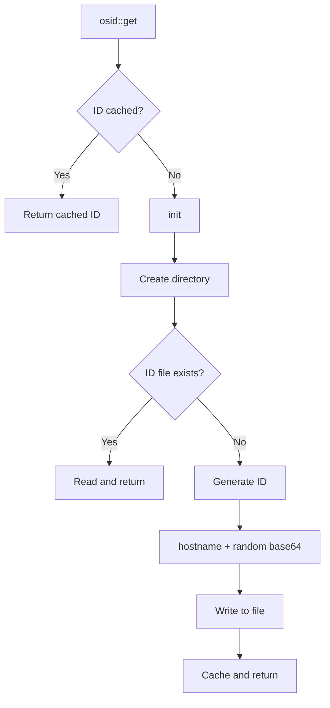
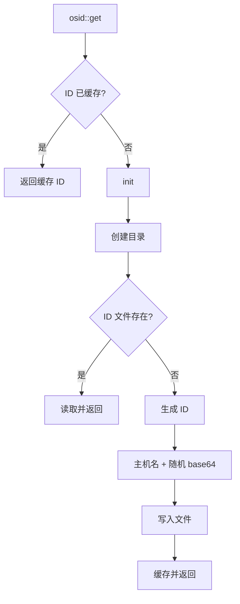

[English](#en) | [中文](#zh)

---

<a id="en"></a>

# osid : Persistent Machine ID for Rust

## Table of Contents

- [Introduction](#introduction)
- [Installation](#installation)
- [Usage](#usage)
- [API Reference](#api-reference)
- [Design](#design)
- [Tech Stack](#tech-stack)
- [Project Structure](#project-structure)
- [History](#history)

## Introduction

osid generates and persists unique machine identifier across reboots.

Features:

- Cross-platform support (Linux, macOS, Windows)
- Automatic ID generation on first call
- Thread-safe with zero-cost caching
- Human-readable format: `hostname:random_base64`

## Installation

```sh
cargo add osid
```

## Usage

```rust
fn main() -> Result<(), Box<dyn std::error::Error>> {
  let id = osid::get()?;
  println!("Machine ID: {id}");
  Ok(())
}
```

Output example:

```
Machine ID: myhost:bPxWJS2bzT8
```

## API Reference

### `osid::get()`

```rust
pub fn get() -> Result<&'static str, &'static Error>
```

Returns cached machine ID. Creates and persists ID on first call.

ID format: `{hostname}:{base64_random}`

### `osid::dir()`

```rust
pub fn dir() -> PathBuf
```

Returns storage directory path:

| Platform | Path                                 |
| -------- | ------------------------------------ |
| Linux    | `~/.local/share/osid`                |
| macOS    | `~/Library/Application Support/osid` |
| Windows  | `C:\Users\<User>\AppData\Local\osid` |

### `osid::Error`

```rust
pub enum Error {
  CreateDir(io::Error),  // Failed to create storage directory
  WriteId(io::Error),    // Failed to write ID file
}
```

## Design



Key design decisions:

- `OnceLock` ensures thread-safe single initialization
- Static lifetime avoids allocation on subsequent calls
- Base64 encoding keeps ID compact and URL-safe

## Tech Stack

| Crate                                           | Purpose                        |
| ----------------------------------------------- | ------------------------------ |
| [dirs](https://crates.io/crates/dirs)           | Cross-platform directory paths |
| [hostname](https://crates.io/crates/hostname)   | System hostname retrieval      |
| [rand](https://crates.io/crates/rand)           | Random number generation       |
| [ub64](https://crates.io/crates/ub64)           | Base64 encoding                |
| [thiserror](https://crates.io/crates/thiserror) | Error type derivation          |

## Project Structure

```
osid/
├── src/
│   ├── lib.rs      # Core logic: get(), dir(), init()
│   └── error.rs    # Error type definitions
├── tests/
│   └── main.rs     # Integration tests
└── Cargo.toml
```

## History

The concept of machine ID originated from D-Bus project in early 2000s, stored at `/var/lib/dbus/machine-id`.

When Lennart Poettering developed systemd, he generalized this concept into `/etc/machine-id` as system-wide unique identifier. The format—32 hexadecimal characters representing 128-bit UUID—became standard across Linux distributions.

osid follows this philosophy but with improvements:

- Human-readable format with hostname prefix
- Cross-platform support beyond Linux
- Application-level isolation in user data directory

This approach avoids conflicts with system machine-id while providing similar persistence guarantees.

---

## About

This project is an open-source component of [js0.site ⋅ Refactoring the Internet Plan](https://js0.site).

We are redefining the development paradigm of the Internet in a componentized way. Welcome to follow us:

- [Google Group](https://groups.google.com/g/js0-site)
- [js0site.bsky.social](https://bsky.app/profile/js0site.bsky.social)

---

<a id="zh"></a>

# osid : Rust 持久化机器标识

## 目录

- [简介](#简介)
- [安装](#安装)
- [使用](#使用)
- [API 参考](#api-参考)
- [设计思路](#设计思路)
- [技术栈](#技术栈)
- [项目结构](#项目结构)
- [历史](#历史)

## 简介

osid 生成并持久化机器唯一标识，重启后保持不变。

特性：

- 跨平台支持 (Linux, macOS, Windows)
- 首次调用自动生成 ID
- 线程安全，零开销缓存
- 可读格式：`主机名:随机base64`

## 安装

```sh
cargo add osid
```

## 使用

```rust
fn main() -> Result<(), Box<dyn std::error::Error>> {
  let id = osid::get()?;
  println!("Machine ID: {id}");
  Ok(())
}
```

输出示例：

```
Machine ID: myhost:bPxWJS2bzT8
```

## API 参考

### `osid::get()`

```rust
pub fn get() -> Result<&'static str, &'static Error>
```

返回缓存的机器 ID。首次调用时创建并持久化。

ID 格式：`{主机名}:{base64随机数}`

### `osid::dir()`

```rust
pub fn dir() -> PathBuf
```

返回存储目录路径：

| 平台    | 路径                                 |
| ------- | ------------------------------------ |
| Linux   | `~/.local/share/osid`                |
| macOS   | `~/Library/Application Support/osid` |
| Windows | `C:\Users\<用户>\AppData\Local\osid` |

### `osid::Error`

```rust
pub enum Error {
  CreateDir(io::Error),  // 创建存储目录失败
  WriteId(io::Error),    // 写入 ID 文件失败
}
```

## 设计思路



核心设计：

- `OnceLock` 保证线程安全的单次初始化
- 静态生命周期避免后续调用的内存分配
- Base64 编码保持 ID 紧凑且 URL 安全

## 技术栈

| Crate                                           | 用途           |
| ----------------------------------------------- | -------------- |
| [dirs](https://crates.io/crates/dirs)           | 跨平台目录路径 |
| [hostname](https://crates.io/crates/hostname)   | 获取系统主机名 |
| [rand](https://crates.io/crates/rand)           | 随机数生成     |
| [ub64](https://crates.io/crates/ub64)           | Base64 编码    |
| [thiserror](https://crates.io/crates/thiserror) | 错误类型派生   |

## 项目结构

```
osid/
├── src/
│   ├── lib.rs      # 核心逻辑：get(), dir(), init()
│   └── error.rs    # 错误类型定义
├── tests/
│   └── main.rs     # 集成测试
└── Cargo.toml
```

## 历史

机器 ID 概念源于 2000 年代初的 D-Bus 项目，存储于 `/var/lib/dbus/machine-id`。

Lennart Poettering 开发 systemd 时，将此概念推广为 `/etc/machine-id`，作为系统级唯一标识。其格式——32 位十六进制字符表示 128 位 UUID——成为 Linux 发行版标准。

osid 延续此理念并做出改进：

- 带主机名前缀的可读格式
- 超越 Linux 的跨平台支持
- 用户数据目录中的应用级隔离

这种方式避免与系统 machine-id 冲突，同时提供相同的持久化保证。

---

## 关于

本项目为 [js0.site ⋅ 重构互联网计划](https://js0.site) 的开源组件。

我们正在以组件化的方式重新定义互联网的开发范式，欢迎关注：

- [谷歌邮件列表](https://groups.google.com/g/js0-site)
- [js0site.bsky.social](https://bsky.app/profile/js0site.bsky.social)
