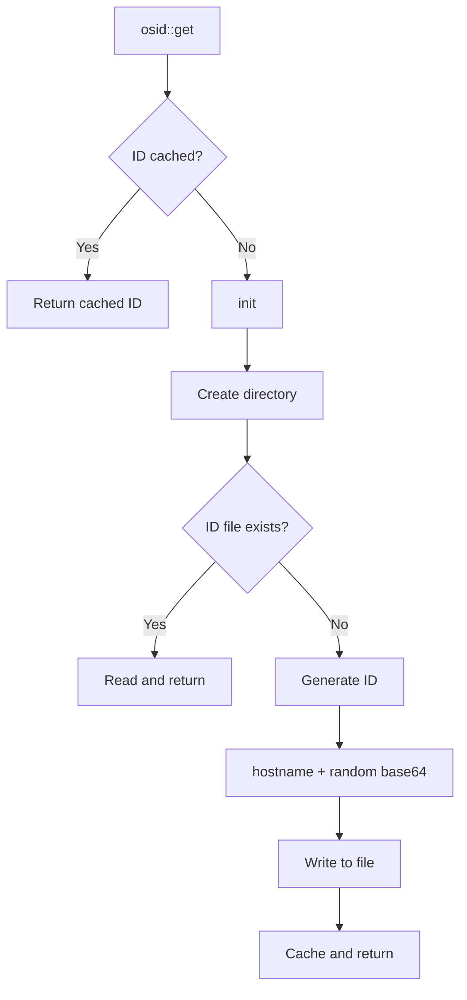

# osid : Persistent Machine ID for Rust

## Table of Contents

- [Introduction](#introduction)
- [Installation](#installation)
- [Usage](#usage)
- [API Reference](#api-reference)
- [Design](#design)
- [Tech Stack](#tech-stack)
- [Project Structure](#project-structure)
- [History](#history)

## Introduction

osid generates and persists unique machine identifier across reboots.

Features:

- Cross-platform support (Linux, macOS, Windows)
- Automatic ID generation on first call
- Thread-safe with zero-cost caching
- Human-readable format: `hostname:random_base64`

## Installation

```sh
cargo add osid
```

## Usage

```rust
fn main() -> Result<(), Box<dyn std::error::Error>> {
  let id = osid::get()?;
  println!("Machine ID: {id}");
  Ok(())
}
```

Output example:

```
Machine ID: myhost:bPxWJS2bzT8
```

## API Reference

### `osid::get()`

```rust
pub fn get() -> Result<&'static str, &'static Error>
```

Returns cached machine ID. Creates and persists ID on first call.

ID format: `{hostname}:{base64_random}`

### `osid::dir()`

```rust
pub fn dir() -> PathBuf
```

Returns storage directory path:

| Platform | Path                                 |
| -------- | ------------------------------------ |
| Linux    | `~/.local/share/osid`                |
| macOS    | `~/Library/Application Support/osid` |
| Windows  | `C:\Users\<User>\AppData\Local\osid` |

### `osid::Error`

```rust
pub enum Error {
  CreateDir(io::Error),  // Failed to create storage directory
  WriteId(io::Error),    // Failed to write ID file
}
```

## Design



Key design decisions:

- `OnceLock` ensures thread-safe single initialization
- Static lifetime avoids allocation on subsequent calls
- Base64 encoding keeps ID compact and URL-safe

## Tech Stack

| Crate                                           | Purpose                        |
| ----------------------------------------------- | ------------------------------ |
| [dirs](https://crates.io/crates/dirs)           | Cross-platform directory paths |
| [hostname](https://crates.io/crates/hostname)   | System hostname retrieval      |
| [rand](https://crates.io/crates/rand)           | Random number generation       |
| [ub64](https://crates.io/crates/ub64)           | Base64 encoding                |
| [thiserror](https://crates.io/crates/thiserror) | Error type derivation          |

## Project Structure

```
osid/
├── src/
│   ├── lib.rs      # Core logic: get(), dir(), init()
│   └── error.rs    # Error type definitions
├── tests/
│   └── main.rs     # Integration tests
└── Cargo.toml
```

## History

The concept of machine ID originated from D-Bus project in early 2000s, stored at `/var/lib/dbus/machine-id`.

When Lennart Poettering developed systemd, he generalized this concept into `/etc/machine-id` as system-wide unique identifier. The format—32 hexadecimal characters representing 128-bit UUID—became standard across Linux distributions.

osid follows this philosophy but with improvements:

- Human-readable format with hostname prefix
- Cross-platform support beyond Linux
- Application-level isolation in user data directory

This approach avoids conflicts with system machine-id while providing similar persistence guarantees.
