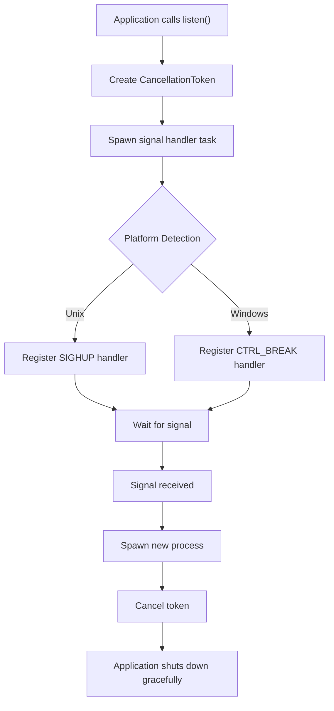
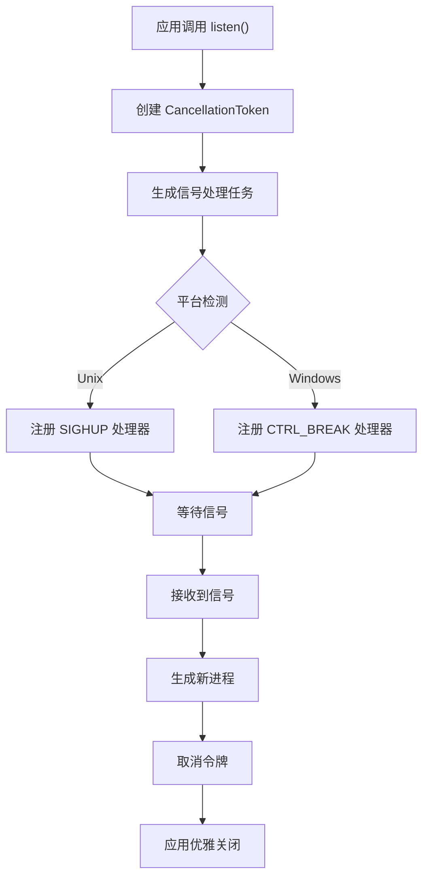

[English](#en) | [中文](#zh)

---

<a id="en"></a>

# reload_self: Cross-Platform Process Hot Reload

- [Features](#features)
- [Quick Start](#quick-start)
- [API Reference](#api-reference)
- [Design Architecture](#design-architecture)
- [Tech Stack](#tech-stack)
- [Project Structure](#project-structure)
- [Historical Context](#historical-context)

## Features

Cross-platform process hot reload library that enables applications to restart themselves gracefully upon receiving platform-specific signals. Supports Unix SIGHUP and Windows CTRL_BREAK_EVENT signals with zero-downtime process replacement.

## Quick Start

Add to your `Cargo.toml`:

```toml
[dependencies]
reload_self = "0.1.14"
```

Basic usage:

```rust
use reload_self::{listen, CancellationToken};
use tokio::time::Duration;

#[tokio::main]
async fn main() -> Result<(), Box<dyn std::error::Error>> {
    // Start listening for reload signals
    let cancel_token = listen()?;
    
    let pid = std::process::id();
    println!("Process started with PID: {pid}");
    println!("Send reload signal: kill -SIGHUP {pid}");
    
    // Main application loop
    loop {
        tokio::select! {
            _ = cancel_token.cancelled() => {
                println!("Received shutdown signal, exiting gracefully");
                break;
            }
            _ = tokio::time::sleep(Duration::from_secs(1)) => {
                // Your application logic here
            }
        }
    }
    
    Ok(())
}
```

## API Reference

### `listen() -> Result<CancellationToken, std::io::Error>`

Starts listening for platform-specific reload signals and returns a cancellation token.

**Platform Signals:**
- **Unix/Linux/macOS**: `SIGHUP` signal
- **Windows**: `CTRL_BREAK_EVENT` signal

**Returns:**
- `CancellationToken`: Token that gets cancelled when the process should shut down
- `std::io::Error`: If signal handler setup fails

### `CancellationToken`

Re-exported from `tokio_util::sync::CancellationToken`. Use this token to detect when the process should gracefully shutdown to make way for the new process.

**Key Methods:**
- `cancelled()`: Returns a future that completes when cancellation is requested
- `is_cancelled()`: Returns true if cancellation has been requested

## Design Architecture

The library follows a platform-abstraction pattern where common logic resides in the main module while platform-specific implementations are separated into dedicated modules.



**Call Flow:**

1. **Initialization**: `listen()` creates a cancellation token and spawns background task
2. **Signal Registration**: Platform-specific signal handlers are registered
3. **Signal Waiting**: Background task waits for reload signal
4. **Process Spawning**: New process starts with same executable and arguments
5. **Graceful Shutdown**: Original process receives cancellation signal and exits

## Tech Stack

- **Runtime**: Tokio async runtime
- **Unix Signals**: `tokio::signal::unix` for SIGHUP handling
- **Windows Signals**: `winapi` for console control events
- **Process Management**: `nix` crate for Unix process detachment
- **Logging**: `log` crate for structured logging

## Project Structure

```
reload_self/
├── src/
│   ├── lib.rs          # Main API and common logic
│   ├── unix.rs         # Unix-specific signal handling
│   └── windows.rs      # Windows-specific signal handling
├── test/
│   └── src/main.rs     # Example application
├── readme/
│   ├── en.md          # English documentation
│   └── zh.md          # Chinese documentation
└── Cargo.toml         # Project configuration
```

**Module Responsibilities:**

- `lib.rs`: Exports public API, contains process spawning logic
- `unix.rs`: SIGHUP signal handling and Unix process detachment
- `windows.rs`: CTRL_BREAK_EVENT handling and Windows process management

## Historical Context

Process hot reloading has been a cornerstone of high-availability systems since the early days of Unix. The SIGHUP signal, originally designed to notify processes of terminal hangups, was repurposed by daemon processes as a configuration reload trigger.

Modern applications like Nginx popularized graceful reloading patterns where new worker processes start while old ones finish existing requests. This library brings similar capabilities to Rust applications, enabling zero-downtime deployments and configuration updates.

The cross-platform approach addresses the historical divide between Unix signal handling and Windows event systems, providing a unified interface for process lifecycle management across operating systems.

---

## About

This project is an open-source component of [js0.site ⋅ Refactoring the Internet Plan](https://js0.site).

We are redefining the development paradigm of the Internet in a componentized way. Welcome to follow us:

* [Google Group](https://groups.google.com/g/js0-site)
* [js0site.bsky.social](https://bsky.app/profile/js0site.bsky.social)

---

<a id="zh"></a>

# reload_self: 跨平台进程热重载

- [功能特性](#功能特性)
- [快速开始](#快速开始)
- [API 参考](#api-参考)
- [设计架构](#设计架构)
- [技术栈](#技术栈)
- [项目结构](#项目结构)
- [历史背景](#历史背景)

## 功能特性

跨平台进程热重载库，支持应用程序在接收到平台特定信号时优雅地重启自身。支持 Unix SIGHUP 和 Windows CTRL_BREAK_EVENT 信号，实现零停机时间的进程替换。

## 快速开始

在 `Cargo.toml` 中添加依赖：

```toml
[dependencies]
reload_self = "0.1.14"
```

基本用法：

```rust
use reload_self::{listen, CancellationToken};
use tokio::time::Duration;

#[tokio::main]
async fn main() -> Result<(), Box<dyn std::error::Error>> {
    // 开始监听重载信号
    let cancel_token = listen()?;
    
    let pid = std::process::id();
    println!("进程已启动，PID: {pid}");
    println!("发送重载信号: kill -SIGHUP {pid}");
    
    // 主应用循环
    loop {
        tokio::select! {
            _ = cancel_token.cancelled() => {
                println!("接收到关闭信号，优雅退出");
                break;
            }
            _ = tokio::time::sleep(Duration::from_secs(1)) => {
                // 应用逻辑
            }
        }
    }
    
    Ok(())
}
```

## API 参考

### `listen() -> Result<CancellationToken, std::io::Error>`

开始监听平台特定的重载信号并返回取消令牌。

**平台信号：**
- **Unix/Linux/macOS**: `SIGHUP` 信号
- **Windows**: `CTRL_BREAK_EVENT` 信号

**返回值：**
- `CancellationToken`: 进程需要关闭时会被取消的令牌
- `std::io::Error`: 信号处理器设置失败时的错误

### `CancellationToken`

从 `tokio_util::sync::CancellationToken` 重新导出。使用此令牌检测进程何时应优雅关闭以为新进程让路。

**主要方法：**
- `cancelled()`: 返回在请求取消时完成的 future
- `is_cancelled()`: 如果已请求取消则返回 true

## 设计架构

库采用平台抽象模式，通用逻辑位于主模块中，而平台特定实现分离到专用模块中。



**调用流程：**

1. **初始化**: `listen()` 创建取消令牌并生成后台任务
2. **信号注册**: 注册平台特定的信号处理器
3. **信号等待**: 后台任务等待重载信号
4. **进程生成**: 使用相同可执行文件和参数启动新进程
5. **优雅关闭**: 原进程接收取消信号并退出

## 技术栈

- **运行时**: Tokio 异步运行时
- **Unix 信号**: `tokio::signal::unix` 处理 SIGHUP
- **Windows 信号**: `winapi` 处理控制台控制事件
- **进程管理**: `nix` crate 用于 Unix 进程分离
- **日志**: `log` crate 提供结构化日志

## 项目结构

```
reload_self/
├── src/
│   ├── lib.rs          # 主 API 和通用逻辑
│   ├── unix.rs         # Unix 特定信号处理
│   └── windows.rs      # Windows 特定信号处理
├── test/
│   └── src/main.rs     # 示例应用
├── readme/
│   ├── en.md          # 英文文档
│   └── zh.md          # 中文文档
└── Cargo.toml         # 项目配置
```

**模块职责：**

- `lib.rs`: 导出公共 API，包含进程生成逻辑
- `unix.rs`: SIGHUP 信号处理和 Unix 进程分离
- `windows.rs`: CTRL_BREAK_EVENT 处理和 Windows 进程管理

## 历史背景

进程热重载自 Unix 早期以来一直是高可用系统的基石。SIGHUP 信号最初设计用于通知进程终端挂断，后来被守护进程重新用作配置重载触发器。

Nginx 等现代应用程序普及了优雅重载模式，新工作进程启动的同时旧进程完成现有请求。此库为 Rust 应用程序带来类似功能，支持零停机部署和配置更新。

跨平台方法解决了 Unix 信号处理和 Windows 事件系统之间的历史分歧，为跨操作系统的进程生命周期管理提供统一接口。

---

## 关于

本项目为 [js0.site ⋅ 重构互联网计划](https://js0.site) 的开源组件。

我们正在以组件化的方式重新定义互联网的开发范式，欢迎关注：

* [谷歌邮件列表](https://groups.google.com/g/js0-site)
* [js0site.bsky.social](https://bsky.app/profile/js0site.bsky.social)
