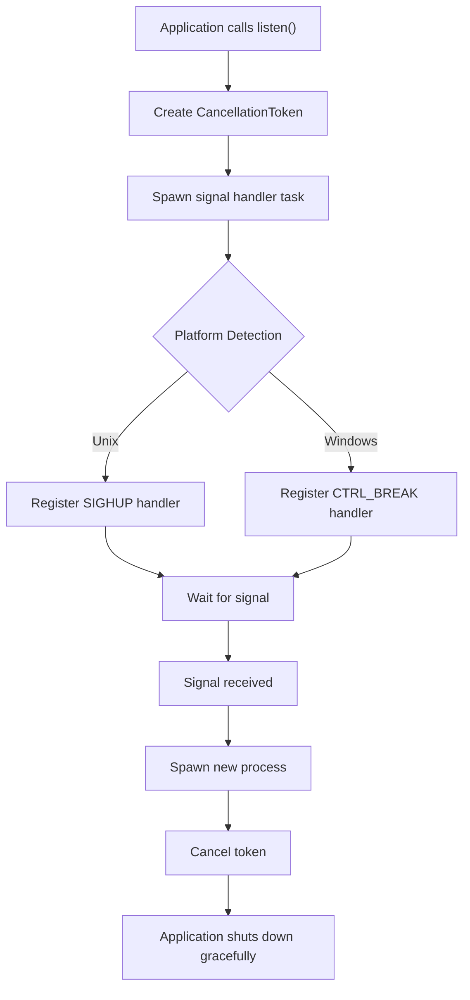

# reload_self: Cross-Platform Process Hot Reload

- [Features](#features)
- [Quick Start](#quick-start)
- [API Reference](#api-reference)
- [Design Architecture](#design-architecture)
- [Tech Stack](#tech-stack)
- [Project Structure](#project-structure)
- [Historical Context](#historical-context)

## Features

Cross-platform process hot reload library that enables applications to restart themselves gracefully upon receiving platform-specific signals. Supports Unix SIGHUP and Windows CTRL_BREAK_EVENT signals with zero-downtime process replacement.

## Quick Start

Add to your `Cargo.toml`:

```toml
[dependencies]
reload_self = "0.1.14"
```

Basic usage:

```rust
use reload_self::{listen, CancellationToken};
use tokio::time::Duration;

#[tokio::main]
async fn main() -> Result<(), Box<dyn std::error::Error>> {
    // Start listening for reload signals
    let cancel_token = listen()?;
    
    let pid = std::process::id();
    println!("Process started with PID: {pid}");
    println!("Send reload signal: kill -SIGHUP {pid}");
    
    // Main application loop
    loop {
        tokio::select! {
            _ = cancel_token.cancelled() => {
                println!("Received shutdown signal, exiting gracefully");
                break;
            }
            _ = tokio::time::sleep(Duration::from_secs(1)) => {
                // Your application logic here
            }
        }
    }
    
    Ok(())
}
```

## API Reference

### `listen() -> Result<CancellationToken, std::io::Error>`

Starts listening for platform-specific reload signals and returns a cancellation token.

**Platform Signals:**
- **Unix/Linux/macOS**: `SIGHUP` signal
- **Windows**: `CTRL_BREAK_EVENT` signal

**Returns:**
- `CancellationToken`: Token that gets cancelled when the process should shut down
- `std::io::Error`: If signal handler setup fails

### `CancellationToken`

Re-exported from `tokio_util::sync::CancellationToken`. Use this token to detect when the process should gracefully shutdown to make way for the new process.

**Key Methods:**
- `cancelled()`: Returns a future that completes when cancellation is requested
- `is_cancelled()`: Returns true if cancellation has been requested

## Design Architecture

The library follows a platform-abstraction pattern where common logic resides in the main module while platform-specific implementations are separated into dedicated modules.



**Call Flow:**

1. **Initialization**: `listen()` creates a cancellation token and spawns background task
2. **Signal Registration**: Platform-specific signal handlers are registered
3. **Signal Waiting**: Background task waits for reload signal
4. **Process Spawning**: New process starts with same executable and arguments
5. **Graceful Shutdown**: Original process receives cancellation signal and exits

## Tech Stack

- **Runtime**: Tokio async runtime
- **Unix Signals**: `tokio::signal::unix` for SIGHUP handling
- **Windows Signals**: `winapi` for console control events
- **Process Management**: `nix` crate for Unix process detachment
- **Logging**: `log` crate for structured logging

## Project Structure

```
reload_self/
├── src/
│   ├── lib.rs          # Main API and common logic
│   ├── unix.rs         # Unix-specific signal handling
│   └── windows.rs      # Windows-specific signal handling
├── test/
│   └── src/main.rs     # Example application
├── readme/
│   ├── en.md          # English documentation
│   └── zh.md          # Chinese documentation
└── Cargo.toml         # Project configuration
```

**Module Responsibilities:**

- `lib.rs`: Exports public API, contains process spawning logic
- `unix.rs`: SIGHUP signal handling and Unix process detachment
- `windows.rs`: CTRL_BREAK_EVENT handling and Windows process management

## Historical Context

Process hot reloading has been a cornerstone of high-availability systems since the early days of Unix. The SIGHUP signal, originally designed to notify processes of terminal hangups, was repurposed by daemon processes as a configuration reload trigger.

Modern applications like Nginx popularized graceful reloading patterns where new worker processes start while old ones finish existing requests. This library brings similar capabilities to Rust applications, enabling zero-downtime deployments and configuration updates.

The cross-platform approach addresses the historical divide between Unix signal handling and Windows event systems, providing a unified interface for process lifecycle management across operating systems.