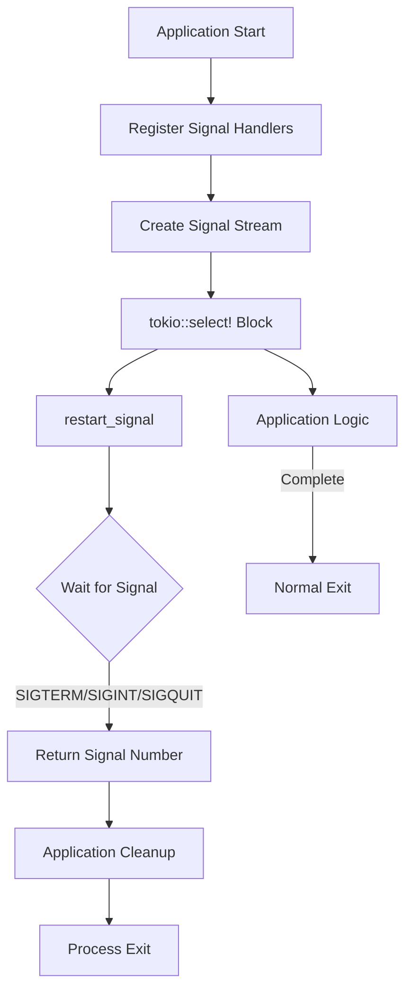
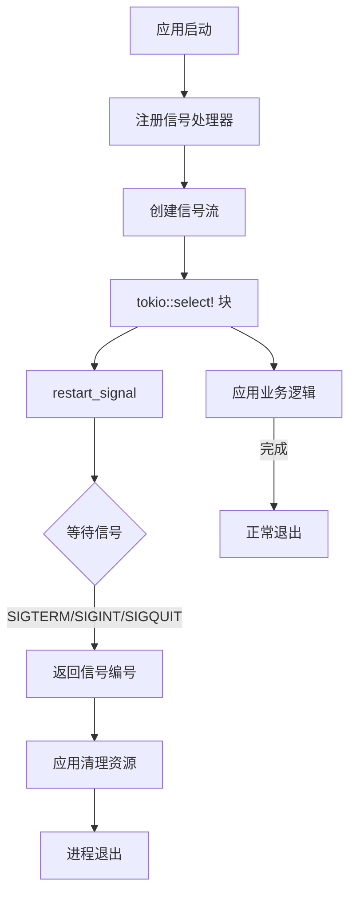

[English](#en) | [中文](#zh)

---

<a id="en"></a>

# restart_signal : Graceful Process Termination Made Simple

## Table of Contents

- Introduction
- Features
- Installation
- Usage Example
- API Reference
- Design Philosophy
- Technology Stack
- Project Structure
- Signal Handling History

## Introduction

`restart_signal` is a lightweight Rust library that simplifies graceful shutdown for asynchronous applications. It provides async/await-based signal handling for common termination signals (SIGTERM, SIGINT, SIGQUIT) across Unix-like systems.

## Features

- **Async-first design** - Native Tokio integration
- **Cross-platform** - Works on Linux, macOS, and Unix-like systems
- **Zero configuration** - Handles SIGTERM, SIGINT, and SIGQUIT out of the box
- **Minimal dependencies** - Built on signal-hook ecosystem
- **Production-ready** - Clean API for graceful shutdown patterns

## Installation

Add to your `Cargo.toml`:

```toml
[dependencies]
restart_signal = "0.1"
tokio = { version = "1", features = ["rt-multi-thread", "macros"] }
```

## Usage Example

```rust
use restart_signal::restart_signal;

#[tokio::main]
async fn main() -> Result<(), Box<dyn std::error::Error>> {
    tokio::select! {
        result = restart_signal() => {
            match result {
                Ok(signal) => println!("Received signal: {}", signal),
                Err(e) => eprintln!("Signal handler error: {}", e),
            }
        }
        _ = run_application() => {
            println!("Application completed normally");
        }
    }
    Ok(())
}

async fn run_application() {
    // Your application logic here
    loop {
        tokio::time::sleep(tokio::time::Duration::from_secs(1)).await;
    }
}
```

### Graceful Shutdown Pattern

```rust
use restart_signal::restart_signal;
use tokio::sync::broadcast;

async fn server_with_graceful_shutdown() {
    let (tx, mut rx) = broadcast::channel(1);
    
    tokio::spawn(async move {
        if let Ok(signal) = restart_signal().await {
            println!("Shutdown signal received: {}", signal);
            let _ = tx.send(());
        }
    });
    
    tokio::select! {
        _ = rx.recv() => {
            println!("Shutting down gracefully...");
            // Cleanup resources, close connections, etc.
        }
    }
}
```

## API Reference

### Function: `restart_signal()`

```rust
pub async fn restart_signal() -> Result<i32, std::io::Error>
```

Asynchronously waits for termination signals. Returns the signal number when received.

**Monitored Signals:**
- `SIGTERM` (15) - Termination request from system (systemctl stop, docker stop, kill)
- `SIGINT` (2) - Interrupt from terminal (Ctrl+C)
- `SIGQUIT` (3) - Quit from terminal (Ctrl+\\)

**Returns:**
- `Ok(signal)` - Signal number received
- `Err(e)` - I/O error during signal registration

### Constants

```rust
pub use signal_hook::consts::{SIGINT, SIGQUIT, SIGTERM};
```

Exported signal constants for comparison and testing.

## Design Philosophy

### Signal Flow



### Architecture

The library implements a stream-based signal handling approach:

1. **Signal Registration** - Uses `signal-hook` to register OS signal handlers
2. **Async Stream** - Converts signals into Tokio-compatible async stream via `signal-hook-tokio`
3. **Await Pattern** - Exposes simple async function that resolves on first signal
4. **Integration** - Designed for `tokio::select!` macro for concurrent task management

## Technology Stack

- **Runtime** - Tokio async runtime
- **Signal Handling** - signal-hook (low-level signal registration)
- **Async Bridge** - signal-hook-tokio (Tokio integration)
- **Stream Processing** - futures crate for stream utilities

## Project Structure

```
restart_signal/
├── Cargo.toml           # Package manifest and dependencies
├── src/
│   └── lib.rs          # Main library implementation
├── tests/
│   └── main.rs         # Integration tests with signal injection
└── readme/
    ├── en.md           # English documentation
    └── zh.md           # Chinese documentation
```

## Signal Handling History

UNIX signals were introduced in Version 7 Unix (1979) by Dennis Ritchie and Ken Thompson. The signal mechanism provided a way for the kernel to notify processes of asynchronous events - from hardware exceptions to user interrupts.

The original signal API was notoriously difficult to use correctly due to race conditions and platform inconsistencies. POSIX.1-1990 standardized `sigaction()` to address these issues, introducing more reliable semantics.

SIGTERM (signal 15) was designed as the "polite" termination request - giving processes time to cleanup before exit. In contrast, SIGKILL (signal 9) forces immediate termination without cleanup. This distinction became crucial for containerized environments: Docker's `docker stop` sends SIGTERM, waits 10 seconds, then sends SIGKILL.

Modern async runtimes like Tokio brought new challenges to signal handling - signals are synchronous C callbacks, but Rust's async code requires thread-safe, future-aware notification. Projects like `signal-hook` emerged to bridge this gap, providing safe primitives for integrating UNIX signals with async ecosystems.

The principle of graceful shutdown - catching signals, closing connections, flushing buffers, saving state - has become a cornerstone of reliable distributed systems. What started as a kernel notification mechanism in 1979 now orchestrates the lifecycle of microservices across global infrastructure.

---

## About

This project is an open-source component of [js0.site ⋅ Refactoring the Internet Plan](https://js0.site).

We are redefining the development paradigm of the Internet in a componentized way. Welcome to follow us:

* [Google Group](https://groups.google.com/g/js0-site)
* [js0site.bsky.social](https://bsky.app/profile/js0site.bsky.social)

---

<a id="zh"></a>

# restart_signal : 优雅终止进程的简洁方案

## 目录

- 项目介绍
- 功能特性
- 安装配置
- 使用示例
- API 文档
- 设计思路
- 技术栈
- 项目结构
- 信号处理历史

## 项目介绍

`restart_signal` 是轻量级 Rust 库，用于简化异步应用的优雅关闭流程。基于 async/await 模式处理常见终止信号（SIGTERM、SIGINT、SIGQUIT），支持类 Unix 系统。

## 功能特性

- **异步优先设计** - 原生 Tokio 集成
- **跨平台支持** - 兼容 Linux、macOS 及类 Unix 系统
- **零配置开箱即用** - 默认处理 SIGTERM、SIGINT、SIGQUIT
- **最小依赖** - 基于 signal-hook 生态构建
- **生产环境就绪** - 清晰的优雅关闭模式 API

## 安装配置

在 `Cargo.toml` 中添加依赖：

```toml
[dependencies]
restart_signal = "0.1"
tokio = { version = "1", features = ["rt-multi-thread", "macros"] }
```

## 使用示例

```rust
use restart_signal::restart_signal;

#[tokio::main]
async fn main() -> Result<(), Box<dyn std::error::Error>> {
    tokio::select! {
        result = restart_signal() => {
            match result {
                Ok(signal) => println!("收到信号: {}", signal),
                Err(e) => eprintln!("信号处理错误: {}", e),
            }
        }
        _ = run_application() => {
            println!("应用正常结束");
        }
    }
    Ok(())
}

async fn run_application() {
    // 应用业务逻辑
    loop {
        tokio::time::sleep(tokio::time::Duration::from_secs(1)).await;
    }
}
```

### 优雅关闭模式

```rust
use restart_signal::restart_signal;
use tokio::sync::broadcast;

async fn server_with_graceful_shutdown() {
    let (tx, mut rx) = broadcast::channel(1);
    
    tokio::spawn(async move {
        if let Ok(signal) = restart_signal().await {
            println!("收到关闭信号: {}", signal);
            let _ = tx.send(());
        }
    });
    
    tokio::select! {
        _ = rx.recv() => {
            println!("开始优雅关闭...");
            // 清理资源、关闭连接等
        }
    }
}
```

## API 文档

### 函数: `restart_signal()`

```rust
pub async fn restart_signal() -> Result<i32, std::io::Error>
```

异步等待终止信号，收到信号时返回信号编号。

**监听信号：**
- `SIGTERM` (15) - 系统终止请求（systemctl stop、docker stop、kill）
- `SIGINT` (2) - 终端中断（Ctrl+C）
- `SIGQUIT` (3) - 终端退出（Ctrl+\\）

**返回值：**
- `Ok(signal)` - 接收到的信号编号
- `Err(e)` - 信号注册过程中的 I/O 错误

### 常量

```rust
pub use signal_hook::consts::{SIGINT, SIGQUIT, SIGTERM};
```

导出的信号常量，用于比较和测试。

## 设计思路

### 信号流转



### 架构设计

本库采用基于流的信号处理方案：

1. **信号注册** - 使用 `signal-hook` 注册操作系统信号处理器
2. **异步流** - 通过 `signal-hook-tokio` 将信号转换为 Tokio 兼容的异步流
3. **等待模式** - 暴露简洁的异步函数，在接收到首个信号时返回
4. **集成方式** - 设计用于 `tokio::select!` 宏，支持并发任务管理

## 技术栈

- **运行时** - Tokio 异步运行时
- **信号处理** - signal-hook（底层信号注册）
- **异步桥接** - signal-hook-tokio（Tokio 集成）
- **流处理** - futures 库提供流工具

## 项目结构

```
restart_signal/
├── Cargo.toml           # 包清单和依赖配置
├── src/
│   └── lib.rs          # 主库实现
├── tests/
│   └── main.rs         # 集成测试（信号注入）
└── readme/
    ├── en.md           # 英文文档
    └── zh.md           # 中文文档
```

## 信号处理历史

UNIX 信号机制由 Dennis Ritchie 和 Ken Thompson 在第 7 版 Unix（1979 年）中引入。信号机制为内核提供了向进程通知异步事件的方式——从硬件异常到用户中断。

早期的信号 API 因竞态条件和平台不一致性而难以正确使用。POSIX.1-1990 标准化了 `sigaction()` 以解决这些问题，引入了更可靠的语义。

SIGTERM（信号 15）被设计为"礼貌的"终止请求——给进程时间进行清理后退出。相比之下，SIGKILL（信号 9）强制立即终止而不进行清理。这种区别在容器化环境中变得至关重要：Docker 的 `docker stop` 发送 SIGTERM，等待 10 秒后发送 SIGKILL。

像 Tokio 这样的现代异步运行时给信号处理带来了新挑战——信号是同步的 C 回调，而 Rust 的异步代码需要线程安全、future 感知的通知机制。`signal-hook` 等项目应运而生，为将 UNIX 信号集成到异步生态系统提供了安全原语。

优雅关闭原则——捕获信号、关闭连接、刷新缓冲区、保存状态——已成为可靠分布式系统的基石。从 1979 年的内核通知机制开始，如今已发展为编排全球基础设施中微服务生命周期的核心技术。

---

## 关于

本项目为 [js0.site ⋅ 重构互联网计划](https://js0.site) 的开源组件。

我们正在以组件化的方式重新定义互联网的开发范式，欢迎关注：

* [谷歌邮件列表](https://groups.google.com/g/js0-site)
* [js0site.bsky.social](https://bsky.app/profile/js0site.bsky.social)
