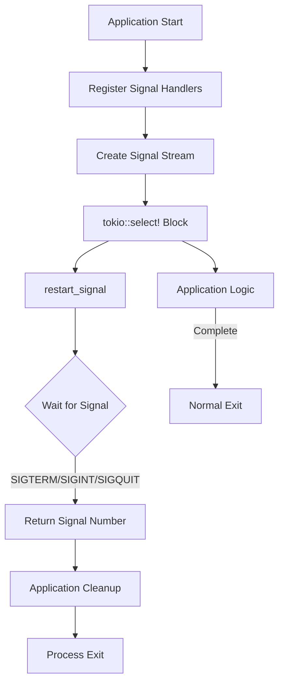

# restart_signal : Graceful Process Termination Made Simple

## Table of Contents

- Introduction
- Features
- Installation
- Usage Example
- API Reference
- Design Philosophy
- Technology Stack
- Project Structure
- Signal Handling History

## Introduction

`restart_signal` is a lightweight Rust library that simplifies graceful shutdown for asynchronous applications. It provides async/await-based signal handling for common termination signals (SIGTERM, SIGINT, SIGQUIT) across Unix-like systems.

## Features

- **Async-first design** - Native Tokio integration
- **Cross-platform** - Works on Linux, macOS, and Unix-like systems
- **Zero configuration** - Handles SIGTERM, SIGINT, and SIGQUIT out of the box
- **Minimal dependencies** - Built on signal-hook ecosystem
- **Production-ready** - Clean API for graceful shutdown patterns

## Installation

Add to your `Cargo.toml`:

```toml
[dependencies]
restart_signal = "0.1"
tokio = { version = "1", features = ["rt-multi-thread", "macros"] }
```

## Usage Example

```rust
use restart_signal::restart_signal;

#[tokio::main]
async fn main() -> Result<(), Box<dyn std::error::Error>> {
    tokio::select! {
        result = restart_signal() => {
            match result {
                Ok(signal) => println!("Received signal: {}", signal),
                Err(e) => eprintln!("Signal handler error: {}", e),
            }
        }
        _ = run_application() => {
            println!("Application completed normally");
        }
    }
    Ok(())
}

async fn run_application() {
    // Your application logic here
    loop {
        tokio::time::sleep(tokio::time::Duration::from_secs(1)).await;
    }
}
```

### Graceful Shutdown Pattern

```rust
use restart_signal::restart_signal;
use tokio::sync::broadcast;

async fn server_with_graceful_shutdown() {
    let (tx, mut rx) = broadcast::channel(1);
    
    tokio::spawn(async move {
        if let Ok(signal) = restart_signal().await {
            println!("Shutdown signal received: {}", signal);
            let _ = tx.send(());
        }
    });
    
    tokio::select! {
        _ = rx.recv() => {
            println!("Shutting down gracefully...");
            // Cleanup resources, close connections, etc.
        }
    }
}
```

## API Reference

### Function: `restart_signal()`

```rust
pub async fn restart_signal() -> Result<i32, std::io::Error>
```

Asynchronously waits for termination signals. Returns the signal number when received.

**Monitored Signals:**
- `SIGTERM` (15) - Termination request from system (systemctl stop, docker stop, kill)
- `SIGINT` (2) - Interrupt from terminal (Ctrl+C)
- `SIGQUIT` (3) - Quit from terminal (Ctrl+\\)

**Returns:**
- `Ok(signal)` - Signal number received
- `Err(e)` - I/O error during signal registration

### Constants

```rust
pub use signal_hook::consts::{SIGINT, SIGQUIT, SIGTERM};
```

Exported signal constants for comparison and testing.

## Design Philosophy

### Signal Flow



### Architecture

The library implements a stream-based signal handling approach:

1. **Signal Registration** - Uses `signal-hook` to register OS signal handlers
2. **Async Stream** - Converts signals into Tokio-compatible async stream via `signal-hook-tokio`
3. **Await Pattern** - Exposes simple async function that resolves on first signal
4. **Integration** - Designed for `tokio::select!` macro for concurrent task management

## Technology Stack

- **Runtime** - Tokio async runtime
- **Signal Handling** - signal-hook (low-level signal registration)
- **Async Bridge** - signal-hook-tokio (Tokio integration)
- **Stream Processing** - futures crate for stream utilities

## Project Structure

```
restart_signal/
├── Cargo.toml           # Package manifest and dependencies
├── src/
│   └── lib.rs          # Main library implementation
├── tests/
│   └── main.rs         # Integration tests with signal injection
└── readme/
    ├── en.md           # English documentation
    └── zh.md           # Chinese documentation
```

## Signal Handling History

UNIX signals were introduced in Version 7 Unix (1979) by Dennis Ritchie and Ken Thompson. The signal mechanism provided a way for the kernel to notify processes of asynchronous events - from hardware exceptions to user interrupts.

The original signal API was notoriously difficult to use correctly due to race conditions and platform inconsistencies. POSIX.1-1990 standardized `sigaction()` to address these issues, introducing more reliable semantics.

SIGTERM (signal 15) was designed as the "polite" termination request - giving processes time to cleanup before exit. In contrast, SIGKILL (signal 9) forces immediate termination without cleanup. This distinction became crucial for containerized environments: Docker's `docker stop` sends SIGTERM, waits 10 seconds, then sends SIGKILL.

Modern async runtimes like Tokio brought new challenges to signal handling - signals are synchronous C callbacks, but Rust's async code requires thread-safe, future-aware notification. Projects like `signal-hook` emerged to bridge this gap, providing safe primitives for integrating UNIX signals with async ecosystems.

The principle of graceful shutdown - catching signals, closing connections, flushing buffers, saving state - has become a cornerstone of reliable distributed systems. What started as a kernel notification mechanism in 1979 now orchestrates the lifecycle of microservices across global infrastructure.
