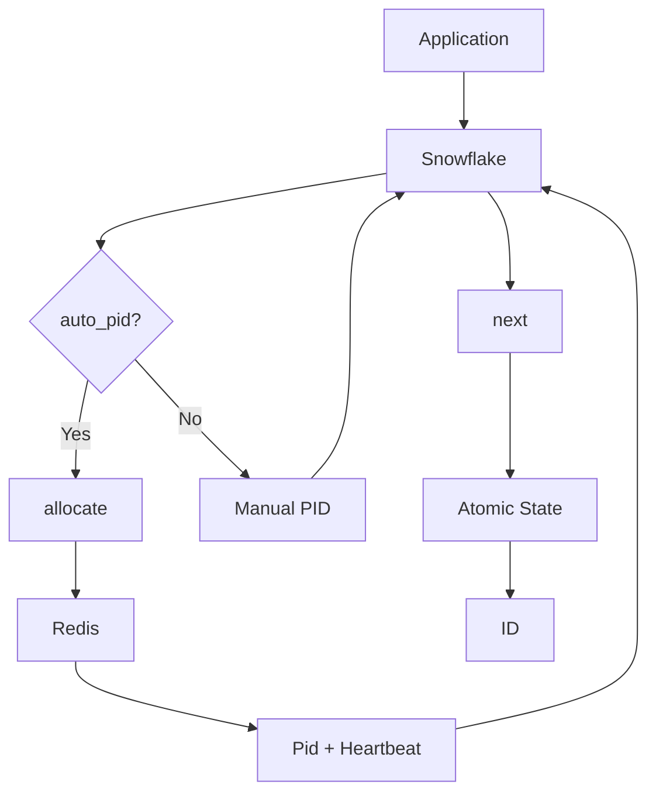
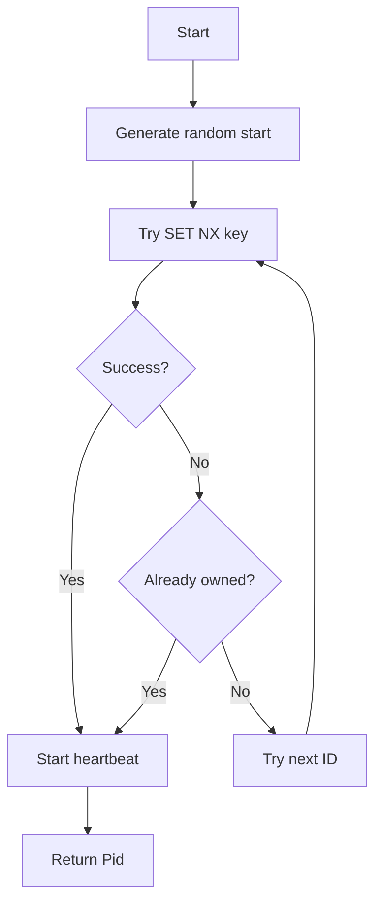
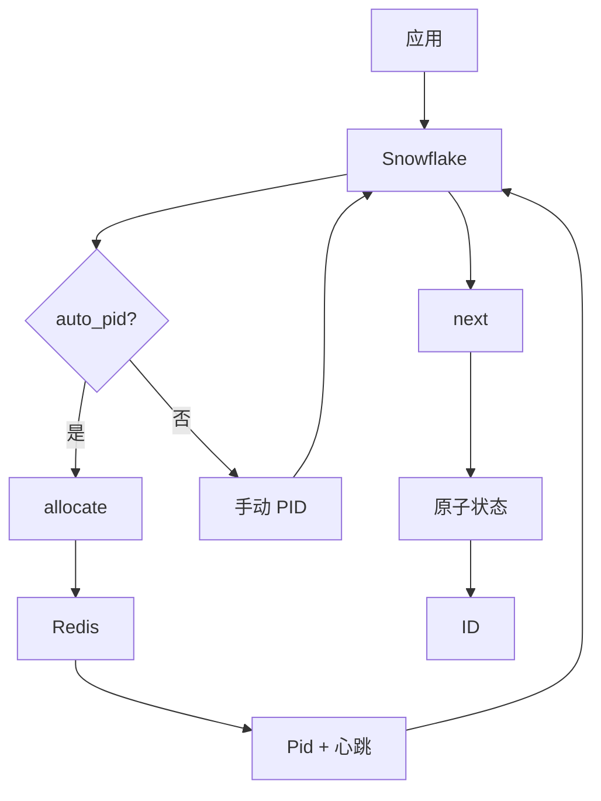
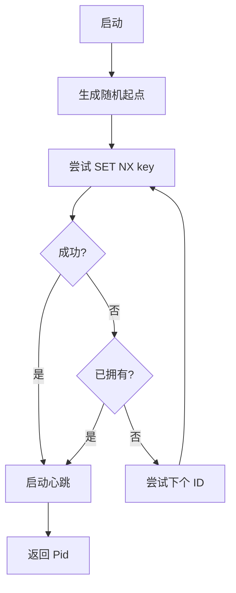

[English](#en) | [中文](#zh)

---

<a id="en"></a>

# sfid : Distributed Snowflake ID Generator with Auto-Allocated Machine ID

## Table of Contents

- [Features](#features)
- [Installation](#installation)
- [Quick Start](#quick-start)
- [API Reference](#api-reference)
- [ID Structure](#id-structure)
- [Architecture](#architecture)
- [Machine ID Allocation](#machine-id-allocation)
- [Tech Stack](#tech-stack)
- [Project Structure](#project-structure)
- [Why "Process ID" Instead of "Machine ID"?](#why-process-id-instead-of-machine-id)
- [History](#history)

## Features

- Lock-free atomic ID generation
- Redis-based automatic machine ID allocation
- Heartbeat mechanism with auto-release on crash
- Clock drift tolerance (sequence borrowing)
- Sequence exhaustion handling (timestamp advance)
- Configurable epoch

## Installation

```sh
cargo add sfid
```

With specific features:

```sh
cargo add sfid -F snowflake,auto_pid,parse
```

## Quick Start

### Manual Machine ID

```rust
use sfid::{Snowflake, EPOCH};

let sf = Snowflake::new(EPOCH, 1);
let id = sf.next();
println!("{id}");
```

### Auto-Allocated Machine ID (Redis)

```rust
use sfid::{Snowflake, EPOCH};

#[tokio::main]
async fn main() -> sfid::Result<()> {
  let sf = Snowflake::auto("myapp", EPOCH).await?;
  let id = sf.next();
  println!("{id}");
  Ok(())
}
```

### Parse ID

```rust
use sfid::parse;

let parsed = parse(id);
println!("ts: {}, pid: {}, seq: {}", parsed.ts, parsed.pid, parsed.seq);
```

## API Reference

### Constants

| Name | Type | Description |
|------|------|-------------|
| `EPOCH` | `u64` | Default epoch: 2025-12-22 00:00:00 UTC |
| `MAX_PID` | `u32` | Maximum machine ID count (1024) |
| `PID_BITS` | `u32` | Machine ID bits (10) |

### Structs

#### `Snowflake`

ID generator with atomic state.

| Method | Description |
|--------|-------------|
| `new(epoch, pid)` | Create with manual machine ID |
| `auto(app, epoch)` | Create with Redis-allocated machine ID |
| `next()` | Generate next ID |

#### `Pid`

Machine ID handle with heartbeat. Stops heartbeat on drop.

| Method | Description |
|--------|-------------|
| `id()` | Get allocated machine ID |

#### `ParsedId`

Parsed ID components.

| Field | Type | Description |
|-------|------|-------------|
| `ts` | `u64` | Timestamp offset from epoch (ms) |
| `pid` | `u16` | Machine ID |
| `seq` | `u16` | Sequence number |

### Functions

| Name | Description |
|------|-------------|
| `allocate(app)` | Allocate machine ID from Redis |
| `parse(id)` | Parse ID into components |

## ID Structure

64-bit signed integer:

```
┌───────┬──────────────────────────┬────────────┬──────────────┐
│ 1 bit │        41 bits           │  10 bits   │   12 bits    │
│ sign  │     timestamp (ms)       │ machine ID │   sequence   │
│  (0)  │   (offset from epoch)    │  (0-1023)  │   (0-4095)   │
└───────┴──────────────────────────┴────────────┴──────────────┘
```

- Timestamp: ~69 years from epoch
- Machine ID: 1024 instances
- Sequence: 4096 IDs per millisecond per instance

## Architecture



## Machine ID Allocation

### Flow



### Redis Key Format

```
sfid:{app}:{pid_le_bytes}
```

### Heartbeat

- Interval: 3 minutes
- Expiration: 10 minutes
- Auto-release on process exit (Drop trait)

## Tech Stack

| Crate | Purpose |
|-------|---------|
| coarsetime | Fast timestamp retrieval |
| fred | Redis client |
| tokio | Async runtime |
| uuid | Unique identifier generation |
| thiserror | Error handling |

## Project Structure

```
sfid/
├── src/
│   ├── lib.rs      # Module exports
│   ├── snowflake.rs # ID generator
│   ├── pid.rs      # Machine ID allocation
│   ├── bits.rs     # Bit constants
│   ├── parse.rs    # ID parsing
│   └── error.rs    # Error types
├── tests/
│   └── main.rs     # Integration tests
└── Cargo.toml
```

## Why "Process ID" Instead of "Machine ID"?

Traditional Snowflake implementations use "machine ID" or "worker ID", assuming one generator per physical machine. This assumption breaks in modern deployments:

- Containers: Multiple instances on same host
- Kubernetes: Pods scale dynamically
- Serverless: No persistent machine identity
- Microservices: Multiple services per node

"Process ID" (pid) better reflects reality — each running process needs unique identifier, regardless of physical location. This naming:

- Avoids confusion with OS-level machine identifiers
- Accurately describes the allocation granularity
- Works naturally with container orchestration
- Supports multiple generators per host

The 10-bit limit (1024) applies to concurrent processes, not machines.

## History

In 2010, Twitter faced a scaling crisis. Their MySQL-based ID generation couldn't keep up with the explosive growth of tweets. The auto-increment approach required coordination between database shards, creating bottlenecks and single points of failure. They were migrating to Cassandra and sharded MySQL (using Gizzard), neither of which provided built-in unique ID generation.

Twitter's requirements were demanding: tens of thousands of IDs per second, high availability, rough time-ordering (tweets posted around the same time should have proximate IDs), and everything must fit in 64 bits. They evaluated MySQL ticket servers (like Flickr's), UUIDs (required 128 bits), and Zookeeper sequential nodes (coordination overhead hurt availability).

In June 2010, Twitter [announced Snowflake](https://blog.twitter.com/engineering/en_us/a/2010/announcing-snowflake) — an uncoordinated approach composing timestamp, worker number, and sequence number. Worker numbers were assigned via Zookeeper at startup. The implementation went live in October 2010.

The bit allocation was carefully chosen:
- 41 bits for timestamp: ~69 years of operation
- 10 bits for machine ID: 1024 concurrent generators (Twitter splits this into 5-bit datacenter ID + 5-bit worker ID)
- 12 bits for sequence: 4096 IDs per millisecond per generator

Twitter open-sourced Snowflake in Scala, and the design spread rapidly:
- Discord adopted it in 2015 (epoch: 2015-01-01)
- Instagram modified the format: 41-bit timestamp, 13-bit shard ID, 10-bit sequence
- Mastodon uses 48-bit timestamp (UNIX epoch) + 16-bit sequence
- Sony's Sonyflake adjusted bit allocation for longer lifespan

The name "Snowflake" captures the essence: like snowflakes in nature, each ID is unique, yet they all share the same elegant structure. Today, Snowflake-style IDs are ubiquitous in distributed systems — from social media to databases to message queues.

---

## About

This project is an open-source component of [js0.site ⋅ Refactoring the Internet Plan](https://js0.site).

We are redefining the development paradigm of the Internet in a componentized way. Welcome to follow us:

* [Google Group](https://groups.google.com/g/js0-site)
* [js0site.bsky.social](https://bsky.app/profile/js0site.bsky.social)

---

<a id="zh"></a>

# sfid : 自动分配机器号的分布式雪花 ID 生成器

## 目录

- [特性](#特性)
- [安装](#安装)
- [快速开始](#快速开始)
- [API 参考](#api-参考)
- [ID 结构](#id-结构)
- [架构](#架构)
- [机器号分配](#机器号分配)
- [技术栈](#技术栈)
- [目录结构](#目录结构)
- [为何用"进程号"而非"机器号"？](#为何用进程号而非机器号)
- [历史](#历史)

## 特性

- 无锁原子 ID 生成
- 基于 Redis 自动分配机器号
- 心跳机制，进程崩溃自动释放
- 时钟回拨容错（序列号借用）
- 序列号耗尽处理（时间戳推进）
- 可配置纪元

## 安装

```sh
cargo add sfid
```

指定特性：

```sh
cargo add sfid -F snowflake,auto_pid,parse
```

## 快速开始

### 手动指定机器号

```rust
use sfid::{Snowflake, EPOCH};

let sf = Snowflake::new(EPOCH, 1);
let id = sf.next();
println!("{id}");
```

### 自动分配机器号 (Redis)

```rust
use sfid::{Snowflake, EPOCH};

#[tokio::main]
async fn main() -> sfid::Result<()> {
  let sf = Snowflake::auto("myapp", EPOCH).await?;
  let id = sf.next();
  println!("{id}");
  Ok(())
}
```

### 解析 ID

```rust
use sfid::parse;

let parsed = parse(id);
println!("ts: {}, pid: {}, seq: {}", parsed.ts, parsed.pid, parsed.seq);
```

## API 参考

### 常量

| 名称 | 类型 | 说明 |
|------|------|------|
| `EPOCH` | `u64` | 默认纪元：2025-12-22 00:00:00 UTC |
| `MAX_PID` | `u32` | 机器号上限 (1024) |
| `PID_BITS` | `u32` | 机器号位数 (10) |

### 结构体

#### `Snowflake`

原子状态 ID 生成器。

| 方法 | 说明 |
|------|------|
| `new(epoch, pid)` | 手动指定机器号创建 |
| `auto(app, epoch)` | Redis 自动分配机器号创建 |
| `next()` | 生成下个 ID |

#### `Pid`

带心跳的机器号句柄，drop 时停止心跳。

| 方法 | 说明 |
|------|------|
| `id()` | 获取分配的机器号 |

#### `ParsedId`

解析后的 ID 组件。

| 字段 | 类型 | 说明 |
|------|------|------|
| `ts` | `u64` | 相对纪元的时间戳偏移 (ms) |
| `pid` | `u16` | 机器号 |
| `seq` | `u16` | 序列号 |

### 函数

| 名称 | 说明 |
|------|------|
| `allocate(app)` | 从 Redis 分配机器号 |
| `parse(id)` | 解析 ID 为组件 |

## ID 结构

64 位有符号整数：

```
┌───────┬──────────────────────────┬────────────┬──────────────┐
│ 1 bit │        41 bits           │  10 bits   │   12 bits    │
│ 符号  │       时间戳 (ms)         │   机器号   │    序列号    │
│  (0)  │     (相对纪元偏移)        │  (0-1023)  │   (0-4095)   │
└───────┴──────────────────────────┴────────────┴──────────────┘
```

- 时间戳：纪元起约 69 年
- 机器号：1024 实例
- 序列号：每实例每毫秒 4096 ID

## 架构



## 机器号分配

### 流程



### Redis 键格式

```
sfid:{app}:{pid_le_bytes}
```

### 心跳

- 间隔：3 分钟
- 过期：10 分钟
- 进程退出自动释放 (Drop trait)

## 技术栈

| Crate | 用途 |
|-------|------|
| coarsetime | 快速时间戳获取 |
| fred | Redis 客户端 |
| tokio | 异步运行时 |
| uuid | 唯一标识生成 |
| thiserror | 错误处理 |

## 目录结构

```
sfid/
├── src/
│   ├── lib.rs      # 模块导出
│   ├── snowflake.rs # ID 生成器
│   ├── pid.rs      # 机器号分配
│   ├── bits.rs     # 位常量
│   ├── parse.rs    # ID 解析
│   └── error.rs    # 错误类型
├── tests/
│   └── main.rs     # 集成测试
└── Cargo.toml
```

## 为何用"进程号"而非"机器号"？

传统雪花实现使用"机器号"或"工作节点号"，假设每台物理机运行一个生成器。这一假设在现代部署中已不成立：

- 容器：同一主机运行多个实例
- Kubernetes：Pod 动态伸缩
- Serverless：无持久机器身份
- 微服务：单节点多服务

"进程号"(pid) 更贴合现实——每个运行中的进程需要唯一标识，与物理位置无关。这一命名：

- 避免与操作系统级机器标识混淆
- 准确描述分配粒度
- 与容器编排自然契合
- 支持单主机多生成器

10 位限制 (1024) 针对并发进程数，而非机器数。

## 历史

2010 年，Twitter 面临扩展危机。基于 MySQL 的 ID 生成无法跟上推文的爆发式增长。自增方案需要数据库分片间协调，造成瓶颈和单点故障。他们正迁移至 Cassandra 和分片 MySQL（使用 Gizzard），两者都不提供内置唯一 ID 生成。

Twitter 的需求很苛刻：每秒数万 ID、高可用、大致按时间排序（相近时间发布的推文应有相近 ID）、且必须装进 64 位。他们评估了 MySQL ticket 服务器（如 Flickr 方案）、UUID（需要 128 位）、Zookeeper 顺序节点（协调开销影响可用性）。

2010 年 6 月，Twitter [宣布 Snowflake](https://blog.twitter.com/engineering/en_us/a/2010/announcing-snowflake)——无协调方案，组合时间戳、工作节点号、序列号。工作节点号在启动时通过 Zookeeper 分配。实现于 2010 年 10 月上线。

位分配经过精心设计：
- 41 位时间戳：约 69 年运行周期
- 10 位机器号：1024 个并发生成器（Twitter 拆分为 5 位数据中心 ID + 5 位工作节点 ID）
- 12 位序列号：每生成器每毫秒 4096 个 ID

Twitter 以 Scala 开源了 Snowflake，设计迅速传播：
- Discord 于 2015 年采用（纪元：2015-01-01）
- Instagram 修改了格式：41 位时间戳、13 位分片 ID、10 位序列号
- Mastodon 使用 48 位时间戳（UNIX 纪元）+ 16 位序列号
- Sony 的 Sonyflake 调整位分配以延长寿命

"Snowflake"（雪花）之名道出本质：如同自然界的雪花，每个 ID 独一无二，却共享同样优雅的结构。如今，雪花式 ID 在分布式系统中无处不在——从社交媒体到数据库再到消息队列。

---

## 关于

本项目为 [js0.site ⋅ 重构互联网计划](https://js0.site) 的开源组件。

我们正在以组件化的方式重新定义互联网的开发范式，欢迎关注：

* [谷歌邮件列表](https://groups.google.com/g/js0-site)
* [js0site.bsky.social](https://bsky.app/profile/js0site.bsky.social)
