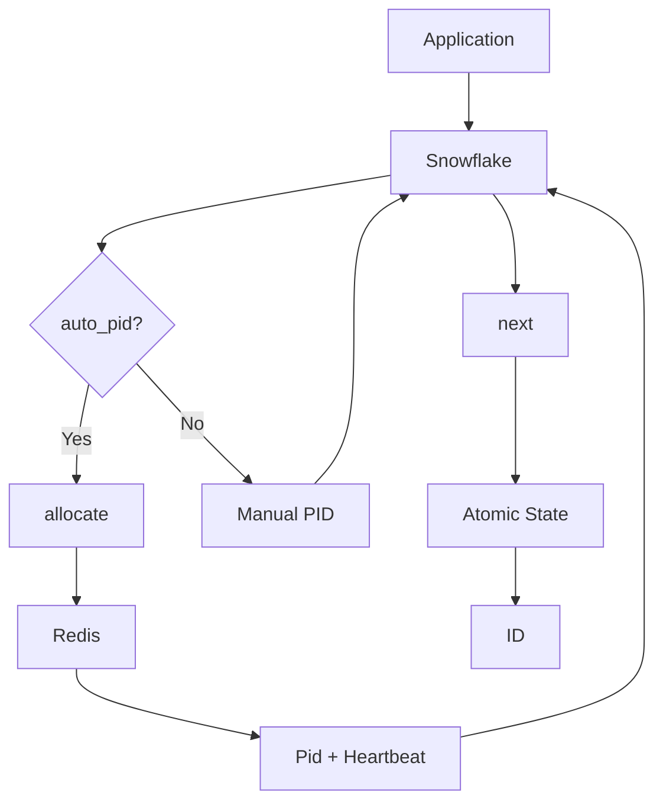
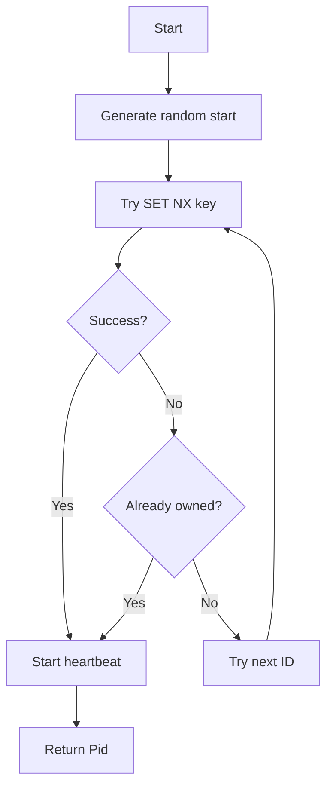

# sfid : Distributed Snowflake ID Generator with Auto-Allocated Machine ID

## Table of Contents

- [Features](#features)
- [Installation](#installation)
- [Quick Start](#quick-start)
- [API Reference](#api-reference)
- [ID Structure](#id-structure)
- [Architecture](#architecture)
- [Machine ID Allocation](#machine-id-allocation)
- [Tech Stack](#tech-stack)
- [Project Structure](#project-structure)
- [Why "Process ID" Instead of "Machine ID"?](#why-process-id-instead-of-machine-id)
- [History](#history)

## Features

- Lock-free atomic ID generation
- Redis-based automatic machine ID allocation
- Heartbeat mechanism with auto-release on crash
- Clock drift tolerance (sequence borrowing)
- Sequence exhaustion handling (timestamp advance)
- Configurable epoch

## Installation

```sh
cargo add sfid
```

With specific features:

```sh
cargo add sfid -F snowflake,auto_pid,parse
```

## Quick Start

### Manual Machine ID

```rust
use sfid::{Snowflake, EPOCH};

let sf = Snowflake::new(EPOCH, 1);
let id = sf.next();
println!("{id}");
```

### Auto-Allocated Machine ID (Redis)

```rust
use sfid::{Snowflake, EPOCH};

#[tokio::main]
async fn main() -> sfid::Result<()> {
  let sf = Snowflake::auto("myapp", EPOCH).await?;
  let id = sf.next();
  println!("{id}");
  Ok(())
}
```

### Parse ID

```rust
use sfid::parse;

let parsed = parse(id);
println!("ts: {}, pid: {}, seq: {}", parsed.ts, parsed.pid, parsed.seq);
```

## API Reference

### Constants

| Name | Type | Description |
|------|------|-------------|
| `EPOCH` | `u64` | Default epoch: 2025-12-22 00:00:00 UTC |
| `MAX_PID` | `u32` | Maximum machine ID count (1024) |
| `PID_BITS` | `u32` | Machine ID bits (10) |

### Structs

#### `Snowflake`

ID generator with atomic state.

| Method | Description |
|--------|-------------|
| `new(epoch, pid)` | Create with manual machine ID |
| `auto(app, epoch)` | Create with Redis-allocated machine ID |
| `next()` | Generate next ID |

#### `Pid`

Machine ID handle with heartbeat. Stops heartbeat on drop.

| Method | Description |
|--------|-------------|
| `id()` | Get allocated machine ID |

#### `ParsedId`

Parsed ID components.

| Field | Type | Description |
|-------|------|-------------|
| `ts` | `u64` | Timestamp offset from epoch (ms) |
| `pid` | `u16` | Machine ID |
| `seq` | `u16` | Sequence number |

### Functions

| Name | Description |
|------|-------------|
| `allocate(app)` | Allocate machine ID from Redis |
| `parse(id)` | Parse ID into components |

## ID Structure

64-bit signed integer:

```
┌───────┬──────────────────────────┬────────────┬──────────────┐
│ 1 bit │        41 bits           │  10 bits   │   12 bits    │
│ sign  │     timestamp (ms)       │ machine ID │   sequence   │
│  (0)  │   (offset from epoch)    │  (0-1023)  │   (0-4095)   │
└───────┴──────────────────────────┴────────────┴──────────────┘
```

- Timestamp: ~69 years from epoch
- Machine ID: 1024 instances
- Sequence: 4096 IDs per millisecond per instance

## Architecture



## Machine ID Allocation

### Flow



### Redis Key Format

```
sfid:{app}:{pid_le_bytes}
```

### Heartbeat

- Interval: 3 minutes
- Expiration: 10 minutes
- Auto-release on process exit (Drop trait)

## Tech Stack

| Crate | Purpose |
|-------|---------|
| coarsetime | Fast timestamp retrieval |
| fred | Redis client |
| tokio | Async runtime |
| uuid | Unique identifier generation |
| thiserror | Error handling |

## Project Structure

```
sfid/
├── src/
│   ├── lib.rs      # Module exports
│   ├── snowflake.rs # ID generator
│   ├── pid.rs      # Machine ID allocation
│   ├── bits.rs     # Bit constants
│   ├── parse.rs    # ID parsing
│   └── error.rs    # Error types
├── tests/
│   └── main.rs     # Integration tests
└── Cargo.toml
```

## Why "Process ID" Instead of "Machine ID"?

Traditional Snowflake implementations use "machine ID" or "worker ID", assuming one generator per physical machine. This assumption breaks in modern deployments:

- Containers: Multiple instances on same host
- Kubernetes: Pods scale dynamically
- Serverless: No persistent machine identity
- Microservices: Multiple services per node

"Process ID" (pid) better reflects reality — each running process needs unique identifier, regardless of physical location. This naming:

- Avoids confusion with OS-level machine identifiers
- Accurately describes the allocation granularity
- Works naturally with container orchestration
- Supports multiple generators per host

The 10-bit limit (1024) applies to concurrent processes, not machines.

## History

In 2010, Twitter faced a scaling crisis. Their MySQL-based ID generation couldn't keep up with the explosive growth of tweets. The auto-increment approach required coordination between database shards, creating bottlenecks and single points of failure. They were migrating to Cassandra and sharded MySQL (using Gizzard), neither of which provided built-in unique ID generation.

Twitter's requirements were demanding: tens of thousands of IDs per second, high availability, rough time-ordering (tweets posted around the same time should have proximate IDs), and everything must fit in 64 bits. They evaluated MySQL ticket servers (like Flickr's), UUIDs (required 128 bits), and Zookeeper sequential nodes (coordination overhead hurt availability).

In June 2010, Twitter [announced Snowflake](https://blog.twitter.com/engineering/en_us/a/2010/announcing-snowflake) — an uncoordinated approach composing timestamp, worker number, and sequence number. Worker numbers were assigned via Zookeeper at startup. The implementation went live in October 2010.

The bit allocation was carefully chosen:
- 41 bits for timestamp: ~69 years of operation
- 10 bits for machine ID: 1024 concurrent generators (Twitter splits this into 5-bit datacenter ID + 5-bit worker ID)
- 12 bits for sequence: 4096 IDs per millisecond per generator

Twitter open-sourced Snowflake in Scala, and the design spread rapidly:
- Discord adopted it in 2015 (epoch: 2015-01-01)
- Instagram modified the format: 41-bit timestamp, 13-bit shard ID, 10-bit sequence
- Mastodon uses 48-bit timestamp (UNIX epoch) + 16-bit sequence
- Sony's Sonyflake adjusted bit allocation for longer lifespan

The name "Snowflake" captures the essence: like snowflakes in nature, each ID is unique, yet they all share the same elegant structure. Today, Snowflake-style IDs are ubiquitous in distributed systems — from social media to databases to message queues.
