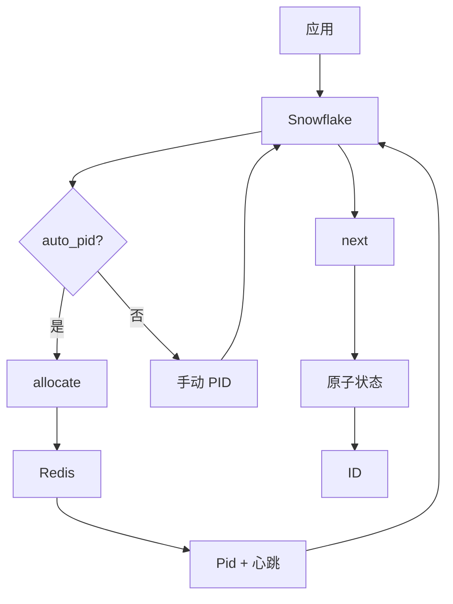
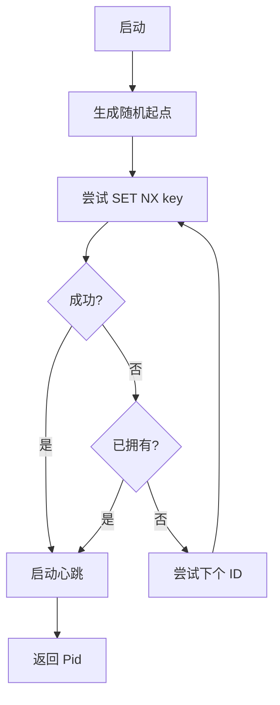

# sfid : 自动分配机器号的分布式雪花 ID 生成器

## 目录

- [特性](#特性)
- [安装](#安装)
- [快速开始](#快速开始)
- [API 参考](#api-参考)
- [ID 结构](#id-结构)
- [架构](#架构)
- [机器号分配](#机器号分配)
- [技术栈](#技术栈)
- [目录结构](#目录结构)
- [为何用"进程号"而非"机器号"？](#为何用进程号而非机器号)
- [历史](#历史)

## 特性

- 无锁原子 ID 生成
- 基于 Redis 自动分配机器号
- 心跳机制，进程崩溃自动释放
- 时钟回拨容错（序列号借用）
- 序列号耗尽处理（时间戳推进）
- 可配置纪元

## 安装

```sh
cargo add sfid
```

指定特性：

```sh
cargo add sfid -F snowflake,auto_pid,parse
```

## 快速开始

### 手动指定机器号

```rust
use sfid::{Snowflake, EPOCH};

let sf = Snowflake::new(EPOCH, 1);
let id = sf.next();
println!("{id}");
```

### 自动分配机器号 (Redis)

```rust
use sfid::{Snowflake, EPOCH};

#[tokio::main]
async fn main() -> sfid::Result<()> {
  let sf = Snowflake::auto("myapp", EPOCH).await?;
  let id = sf.next();
  println!("{id}");
  Ok(())
}
```

### 解析 ID

```rust
use sfid::parse;

let parsed = parse(id);
println!("ts: {}, pid: {}, seq: {}", parsed.ts, parsed.pid, parsed.seq);
```

## API 参考

### 常量

| 名称 | 类型 | 说明 |
|------|------|------|
| `EPOCH` | `u64` | 默认纪元：2025-12-22 00:00:00 UTC |
| `MAX_PID` | `u32` | 机器号上限 (1024) |
| `PID_BITS` | `u32` | 机器号位数 (10) |

### 结构体

#### `Snowflake`

原子状态 ID 生成器。

| 方法 | 说明 |
|------|------|
| `new(epoch, pid)` | 手动指定机器号创建 |
| `auto(app, epoch)` | Redis 自动分配机器号创建 |
| `next()` | 生成下个 ID |

#### `Pid`

带心跳的机器号句柄，drop 时停止心跳。

| 方法 | 说明 |
|------|------|
| `id()` | 获取分配的机器号 |

#### `ParsedId`

解析后的 ID 组件。

| 字段 | 类型 | 说明 |
|------|------|------|
| `ts` | `u64` | 相对纪元的时间戳偏移 (ms) |
| `pid` | `u16` | 机器号 |
| `seq` | `u16` | 序列号 |

### 函数

| 名称 | 说明 |
|------|------|
| `allocate(app)` | 从 Redis 分配机器号 |
| `parse(id)` | 解析 ID 为组件 |

## ID 结构

64 位有符号整数：

```
┌───────┬──────────────────────────┬────────────┬──────────────┐
│ 1 bit │        41 bits           │  10 bits   │   12 bits    │
│ 符号  │       时间戳 (ms)         │   机器号   │    序列号    │
│  (0)  │     (相对纪元偏移)        │  (0-1023)  │   (0-4095)   │
└───────┴──────────────────────────┴────────────┴──────────────┘
```

- 时间戳：纪元起约 69 年
- 机器号：1024 实例
- 序列号：每实例每毫秒 4096 ID

## 架构



## 机器号分配

### 流程



### Redis 键格式

```
sfid:{app}:{pid_le_bytes}
```

### 心跳

- 间隔：3 分钟
- 过期：10 分钟
- 进程退出自动释放 (Drop trait)

## 技术栈

| Crate | 用途 |
|-------|------|
| coarsetime | 快速时间戳获取 |
| fred | Redis 客户端 |
| tokio | 异步运行时 |
| uuid | 唯一标识生成 |
| thiserror | 错误处理 |

## 目录结构

```
sfid/
├── src/
│   ├── lib.rs      # 模块导出
│   ├── snowflake.rs # ID 生成器
│   ├── pid.rs      # 机器号分配
│   ├── bits.rs     # 位常量
│   ├── parse.rs    # ID 解析
│   └── error.rs    # 错误类型
├── tests/
│   └── main.rs     # 集成测试
└── Cargo.toml
```

## 为何用"进程号"而非"机器号"？

传统雪花实现使用"机器号"或"工作节点号"，假设每台物理机运行一个生成器。这一假设在现代部署中已不成立：

- 容器：同一主机运行多个实例
- Kubernetes：Pod 动态伸缩
- Serverless：无持久机器身份
- 微服务：单节点多服务

"进程号"(pid) 更贴合现实——每个运行中的进程需要唯一标识，与物理位置无关。这一命名：

- 避免与操作系统级机器标识混淆
- 准确描述分配粒度
- 与容器编排自然契合
- 支持单主机多生成器

10 位限制 (1024) 针对并发进程数，而非机器数。

## 历史

2010 年，Twitter 面临扩展危机。基于 MySQL 的 ID 生成无法跟上推文的爆发式增长。自增方案需要数据库分片间协调，造成瓶颈和单点故障。他们正迁移至 Cassandra 和分片 MySQL（使用 Gizzard），两者都不提供内置唯一 ID 生成。

Twitter 的需求很苛刻：每秒数万 ID、高可用、大致按时间排序（相近时间发布的推文应有相近 ID）、且必须装进 64 位。他们评估了 MySQL ticket 服务器（如 Flickr 方案）、UUID（需要 128 位）、Zookeeper 顺序节点（协调开销影响可用性）。

2010 年 6 月，Twitter [宣布 Snowflake](https://blog.twitter.com/engineering/en_us/a/2010/announcing-snowflake)——无协调方案，组合时间戳、工作节点号、序列号。工作节点号在启动时通过 Zookeeper 分配。实现于 2010 年 10 月上线。

位分配经过精心设计：
- 41 位时间戳：约 69 年运行周期
- 10 位机器号：1024 个并发生成器（Twitter 拆分为 5 位数据中心 ID + 5 位工作节点 ID）
- 12 位序列号：每生成器每毫秒 4096 个 ID

Twitter 以 Scala 开源了 Snowflake，设计迅速传播：
- Discord 于 2015 年采用（纪元：2015-01-01）
- Instagram 修改了格式：41 位时间戳、13 位分片 ID、10 位序列号
- Mastodon 使用 48 位时间戳（UNIX 纪元）+ 16 位序列号
- Sony 的 Sonyflake 调整位分配以延长寿命

"Snowflake"（雪花）之名道出本质：如同自然界的雪花，每个 ID 独一无二，却共享同样优雅的结构。如今，雪花式 ID 在分布式系统中无处不在——从社交媒体到数据库再到消息队列。
