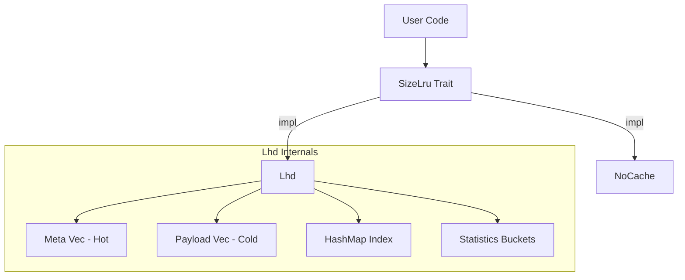
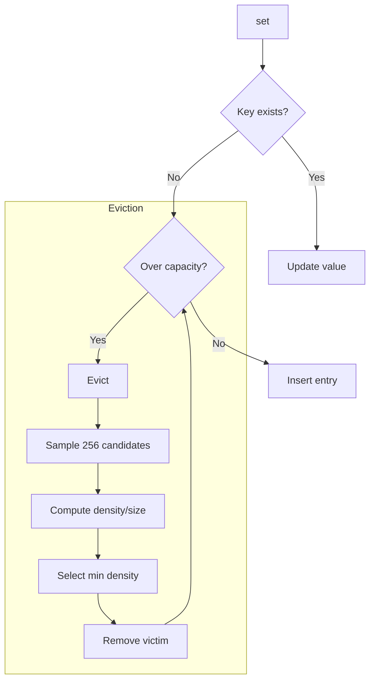
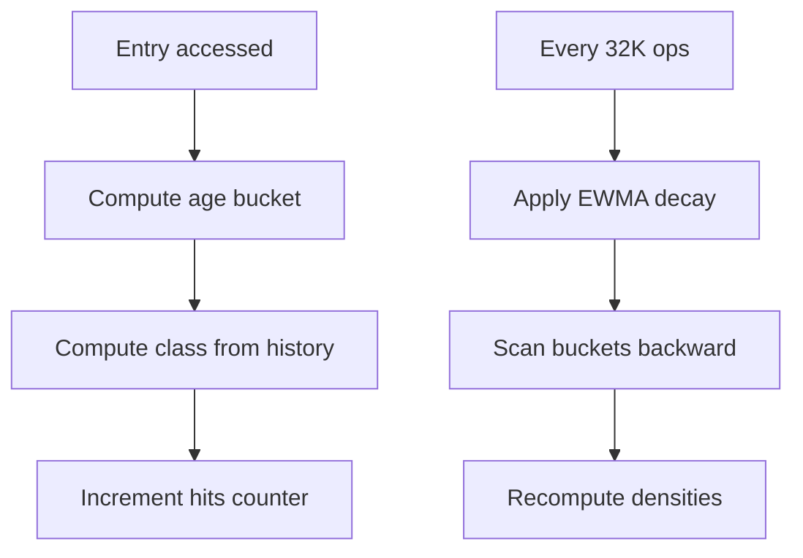
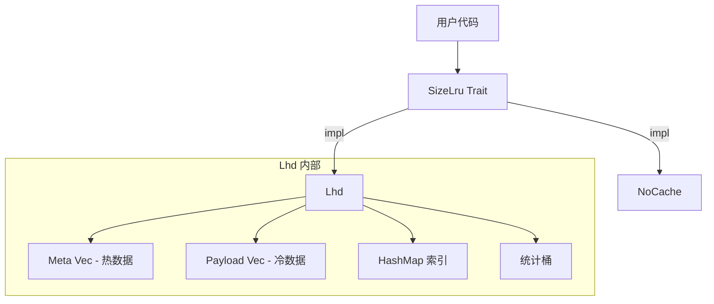
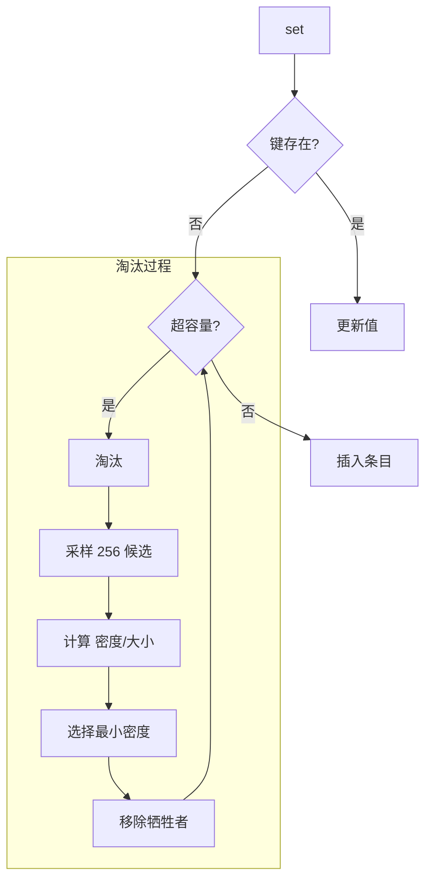
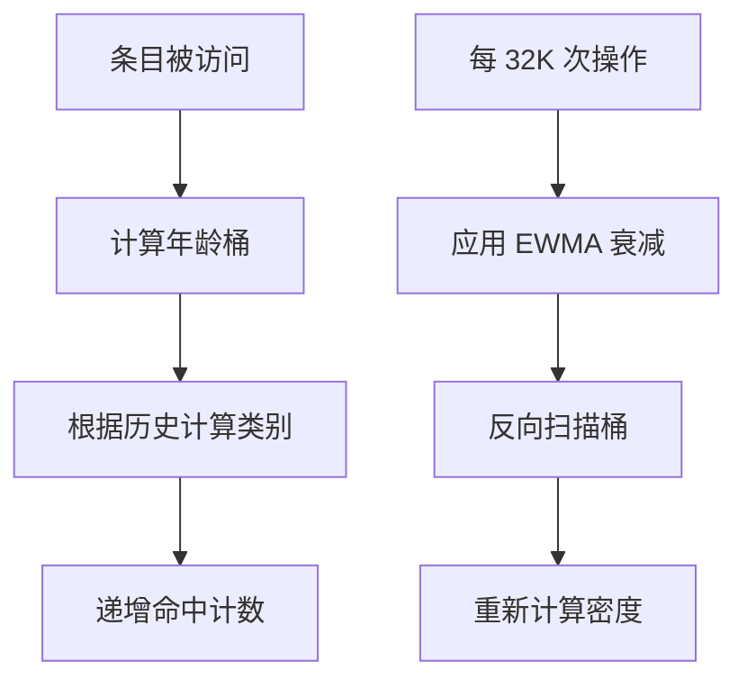

[English](n) | [中文](#zh)

---

<a id="en"></a>


# size_lru : Fastest Size-Aware LRU Cache

[](https://crates.io/crates/size_lru)
[](https://docs.rs/size_lru)
[](https://opensource.org/licenses/MulanPSL-2.0)

Fastest size-aware LRU cache in Rust. Implements LHD (Least Hit Density) algorithm to achieve optimal hit rates while maintaining O(1) operations. Best for variable-sized keys and values (strings, byte arrays, serialized objects).

## Table of Contents

- [Features](#features)
- [Usage](#usage)
- [JavaScript / TypeScript Support](#javascript--typescript-support)
- [Design](#design)
- [Tech Stack](#tech-stack)
- [Directory Structure](#directory-structure)
- [API Reference](#api-reference)
- [History](#history)

## Features

- **Size-Aware Eviction**: Eviction considers actual byte size instead of entry count.
- **Intelligent Eviction**: LHD maximizes hit rate per byte of memory.
- **O(1) Complexity**: Get, set, and remove all run in constant time.
- **Adaptive Tuning**: Internal parameters adjust to workload patterns.
- **Zero Overhead Option**: `NoCache` implementation for baseline testing.

## Usage

### Examples

```rust
use size_lru::{Lhd, SizeLru};

fn main() {
  // Create cache with capacity of 1024 bytes (plus entry overhead)
  let mut cache: Lhd<String, Vec<u8>> = Lhd::new(1024 * 1024);

  // Insert entry with value and size weight
  let val = vec![0u8; 1000];
  cache.set("key".to_string(), val, 1000);

  // Retrieve entry
  if let Some(data) = cache.get(&"key".to_string()) {
    println!("Found data: {:?}", data);
  }
}
```

### Guidelines

#### 1. Accurate size Parameter

The `size` parameter in `set` should reflect actual memory usage. An internal 96-byte overhead is added automatically.

```rust
use size_lru::Lhd;

let mut cache: Lhd<String, Vec<u8>> = Lhd::new(1024 * 1024);

// Correct: pass actual data size
let data = vec![0u8; 1000];
cache.set("key".into(), data, 1000);
```

#### 2. OnRm Callback Notes

Callback fires before removal or eviction. Use `cache.peek(key)` to access the value being evicted.

- Many use cases only need key (logging, counting, notifying external systems).
- If value not needed, avoids one memory access overhead.
- When value needed, call `cache.peek(key)` to retrieve it.
- Only `peek` is safe during callback (read-only, no state mutation).

```rust
use size_lru::{Lhd, OnRm};

struct EvictLogger;

impl<V> OnRm<i32, Lhd<i32, V, Self>> for EvictLogger {
  fn call(&mut self, key: &i32, cache: &Lhd<i32, V, Self>) {
    if let Some(_val) = cache.peek(key) {
      println!("Evicting key={key}");
    }
  }
}

let mut cache: Lhd<i32, String, EvictLogger> = Lhd::with_on_rm(1024, EvictLogger);
cache.set(1, "value".into(), 5);
```

## Design

### Architecture



### Data Layout

SoA (Structure of Arrays) layout separates hot metadata from cold payload:

```
Meta (16 bytes, 4 per cache line):
  ts: u64        - Last access timestamp
  size: u32      - Entry size (includes 96-byte overhead)
  last_age: u16  - Previous access age
  prev_age: u16  - Age before previous

Payload (cold):
  key: K
  val: V
```

This improves cache locality during eviction sampling.

### Eviction Flow



### Statistics Update



## Tech Stack

| Component | Purpose |
| :--- | :--- |
| [rapidhash](https://crates.io/crates/rapidhash) | Fast non-cryptographic hashing |
| [fastrand](https://crates.io/crates/fastrand) | Efficient PRNG for sampling |

## Directory Structure

```
src/
  lib.rs    # Trait definition, module exports
  lhd.rs    # LHD implementation
  no.rs     # NoCache implementation
  wasm.rs   # Wasm bindings
tests/
  main.rs   # Integration tests
benches/
  comparison.rs  # Performance benchmarks
```

## API Reference

### `trait OnRm<K, C>`

Removal callback interface. Called before actual removal or eviction, use `cache.peek(key)` to get value.

- `call(&mut self, key: &K, cache: &C)` — Called on entry removal/eviction

### `struct NoOnRm`

No-op callback with zero overhead. Default when using `new()`.

### `trait SizeLru<K, V>`

Core cache interface.

- `with_on_rm(max: usize, on_rm: Rm) -> Self::WithRm<Rm>` — Create with max byte capacity and optional callback.
- `get<Q>(&mut self, key: &Q) -> Option<&V>` — Retrieve value, update hit statistics.
- `peek<Q>(&self, key: &Q) -> Option<&V>` — Peek value without updating hit statistics.
- `set(&mut self, key: K, val: V, size: u32)` — Insert/update, trigger eviction if needed.
- `rm<Q>(&mut self, key: &Q)` — Remove entry.
- `is_empty(&self) -> bool` — Check if cache is empty.
- `len(&self) -> usize` — Get entry count.

### `struct Lhd<K, V, F = NoOnRm>`

LHD implementation with configurable removal callback. Implements `SizeLru` trait.

- `size(&self) -> usize` — Total bytes stored
- `len(&self) -> usize` — Entry count
- `is_empty(&self) -> bool` — Check if empty

### `struct NoCache`

Zero-overhead no-op cache implementation. Implements `SizeLru` trait.

## History

In 1966, László Bélády proved that the optimal cache eviction strategy is to remove the item that will be needed furthest in the future. This clairvoyant algorithm (MIN/OPT) is theoretically perfect but practically impossible.

Traditional algorithms treat all entries equally. In real workloads, object sizes vary by orders of magnitude. A 1MB image and a 100B metadata record compete for the same cache slot under LRU, despite vastly different costs.

In 2018, Nathan Beckmann and colleagues at CMU published "LHD: Improving Cache Hit Rate by Maximizing Hit Density" at NSDI. Instead of heuristics, they modeled caching as an optimization problem: maximize total hits given fixed memory. By estimating expected future hits and dividing by size, LHD identifies which bytes contribute least to hit rate.

Their evaluation showed LHD requires 8x less space than LRU to achieve the same hit rate, and 2-3x less than contemporary algorithms like ARC.

## JavaScript / TypeScript Support

# @3-/lru : Fastest Size-Aware LRU Cache (Wasm)

Install the package via Bun:

```bash
bun i @3-/lru
```

## Usage Example

```javascript
import init, { WasmCache } from "@3-/lru";

// Initialize the WebAssembly module
await init();

// Initialize cache and binary items
const cache = new WasmCache(250),
  bin_a = new Uint8Array([1, 2, 3, 4]),
  bin_b = new Uint8Array([5, 6, 7, 8]);
cache.set("a", bin_a, bin_a.length); // size = 4 + 96 = 100
cache.set("b", bin_b, bin_b.length); // size = 4 + 96 = 100

// Retrieve cached items
console.log("Get a:", cache.get("a"));
console.log("Get b:", cache.get("b"));

// Insert an item that triggers eviction of 'a' (100 + 100 + 100 = 300 > 250)
const bin_c = new Uint8Array([9, 10, 11, 12]);
cache.set("c", bin_c, bin_c.length); // size = 4 + 96 = 100

// Verify eviction of 'a' and retention of 'b' and 'c'
console.log("Get a after eviction:", cache.get("a")); // undefined
console.log("Get b after eviction:", cache.get("b")); // Uint8Array
```

## Eviction Callback

You can provide an optional eviction callback function when instantiating `WasmCache`. The callback will be triggered synchronously with the evicted key and value:

```javascript
const cacheWithCallback = new WasmCache(250, (key, value) => {
  console.log(`Evicted: key="${key}", value=`, value);
});

cacheWithCallback.set("a", bin_a, bin_a.length);
cacheWithCallback.set("b", bin_b, bin_b.length);

// Trigger eviction
cacheWithCallback.set("c", bin_c, bin_c.length);
```

## Bench

## LRU Cache Benchmark

Real-world data distribution, fixed memory budget, comparing hit rate and effective OPS.

### Results

| Library | Hit Rate | Effective OPS | Perf | Memory |
|---------|----------|---------------|------|--------|
| size_lru | 74.88% | 0.17M/s | 100% | 63.838MB |
| schnellru | 44.14% | 0.09M/s | 54% | 64.042MB |
| lru | 43.43% | 0.09M/s | 53% | 63.520MB |
| hashlink | 41.67% | 0.09M/s | 52% | 63.879MB |
| clru | 41.26% | 0.09M/s | 51% | 63.778MB |
| moka | 60.27% | 0.08M/s | 48% | 64.051MB |
| mini-moka | 58.07% | 0.08M/s | 46% | 63.829MB |

### Configuration

Memory: 64.0MB · Zipf s=1 · R/W/D: 90/9/1% · Miss: 5% · Ops: 0M×0

### Size Distribution

| Range | Items | Size |
|-------|-------|------|
| <100B | 40.00% | 0.30% |
| 100B-1KB | 35.00% | 2.20% |
| 1-10KB | 20.00% | 11.98% |
| 10-100KB | 4.00% | 24.01% |
| >=100KB | 1.00% | 61.51% |

---

### Notes

#### Data Distribution

Based on Facebook USR/APP/VAR pools and Twitter/Meta traces:

| Tier | Size | Items% | Size% |
|------|------|--------|-------|
| Tiny Metadata | 16-100B | 40% | ~0.3% |
| Small Structs | 100B-1KB | 35% | ~2.2% |
| Medium Content | 1-10KB | 20% | ~12% |
| Large Objects | 10-100KB | 4% | ~24% |
| Huge Blobs | 100KB-1MB | 1% | ~61% |

#### Operation Mix

| Op | % | Source |
|----|---|--------|
| Read | 90% | Twitter: 99%+ reads, TAO: 99.8% reads |
| Write | 9% | TAO: ~0.1% writes, relaxed for testing |
| Delete | 1% | TAO: ~0.1% deletes |

#### Environment

- OS: macOS 26.3 (arm64)
- CPU: Apple M2 Max
- Cores: 12
- Memory: 64.0GB
- Rust: rustc 1.95.0 (59807616e 2026-04-14) (Homebrew)

#### Why Effective OPS?

Raw OPS ignores hit rate — a cache with 99% hit rate at 1M ops/s outperforms one with 50% hit rate at 2M ops/s in real workloads.

**Effective OPS** models real-world performance by penalizing cache misses with actual I/O latency.


#### Why NVMe Latency?

LRU caches typically sit in front of persistent storage (databases, KV stores). On cache miss, data must be fetched from disk.

Miss penalty: 18,000ns — measured via DapuStor X5900 PCIe 5.0 NVMe (18µs)


Formula: `effective_ops = 1 / (hit_time + miss_rate × miss_latency)`

- hit_time = 1 / raw_ops

- Higher hit rate → fewer disk reads → better effective throughput

#### References

- [cache_dataset](https://github.com/cacheMon/cache_dataset)
- OSDI'20: Twitter cache analysis
- FAST'20: Facebook RocksDB workloads
- ATC'13: Scaling Memcache at Facebook

---

## About

This project is an open-source component of [js0.site ⋅ Refactoring the Internet Plan](https://js0.site).

We are redefining the development paradigm of the Internet in a componentized way. Welcome to follow us:

* [Google Group](https://groups.google.com/g/js0-site)
* [js0site.bsky.social](https://bsky.app/profile/js0site.bsky.social)

---

<a id="zh"></a>

# size_lru : 最快的大小感知 LRU 缓存

[](https://crates.io/crates/size_lru)
[](https://docs.rs/size_lru)
[](https://opensource.org/licenses/MulanPSL-2.0)

Rust 中极速大小感知 LRU 缓存。实现 LHD（最低命中密度）淘汰算法，于保持 O(1) 操作复杂度的同时实现更高缓存命中率。适用于变长键值对（如字符串、字节数组、序列化对象）。

## 目录

- [特性介绍](#特性介绍)
- [使用演示](#使用演示)
- [JavaScript / TypeScript 支持](#javascript--typescript-支持)
- [设计思路](#设计思路)
- [技术堆栈](#技术堆栈)
- [目录结构](#目录结构)
- [API 说明](#api-说明)
- [历史故事](#历史故事)

## 特性介绍

- **大小感知淘汰**：淘汰考量实际字节大小，而非单纯条目数量。
- **智能密度淘汰**：基于 LHD 算法实现每字节内存命中率最大化。
- **O(1) 复杂度**：获取、设置与删除操作均在常数时间内完成。
- **自适应调整**：内部参数根据工作负载特征自动优化。
- **零开销基线**：提供 `NoCache` 实现以供对比测试。

## 使用演示

### 示例

```rust
use size_lru::{Lhd, SizeLru};

fn main() {
  // 创建指定最大字节容量之缓存（包含条目固定开销）
  let mut cache: Lhd<String, Vec<u8>> = Lhd::new(1024 * 1024);

  // 插入值并指定大小权重
  let val = vec![0u8; 1000];
  cache.set("key".to_string(), val, 1000);

  // 获取值
  if let Some(data) = cache.get(&"key".to_string()) {
    println!("获取数据: {:?}", data);
  }
}
```

### 指南

#### 1. 精确大小参数

`set` 方法中的 `size` 参数应真实反映内存占用。系统自动附加 96 字节固定条目开销。

```rust
use size_lru::Lhd;

let mut cache: Lhd<String, Vec<u8>> = Lhd::new(1024 * 1024);

// 正确：传入实际字节大小
let data = vec![0u8; 1000];
cache.set("key".into(), data, 1000);
```

#### 2. OnRm 回调函数

回调在数据移除或淘汰前执行。可利用 `cache.peek(key)` 获取即将被移除之数据。

- 大量场景仅需键信息（如日志、计数、通知外部系统）。
- 若无需访问值，可免除内存访问开销。
- 回调触发时只读 `peek` 安全，禁止调用修改状态之操作。

```rust
use size_lru::{Lhd, OnRm};

struct EvictLogger;

impl<V> OnRm<i32, Lhd<i32, V, Self>> for EvictLogger {
  fn call(&mut self, key: &i32, cache: &Lhd<i32, V, Self>) {
    if let Some(_val) = cache.peek(key) {
      println!("淘汰键={key}");
    }
  }
}

let mut cache: Lhd<i32, String, EvictLogger> = Lhd::with_on_rm(1024, EvictLogger);
cache.set(1, "value".into(), 5);
```

## 设计思路

### 架构



### 数据布局

SoA（数组结构）布局将热元数据与冷载荷分离：

```
Meta（16 字节，每缓存行 4 条）：
  ts: u64        - 最后访问时间戳
  size: u32      - 条目大小（包含 96 字节开销）
  last_age: u16  - 上次访问年龄
  prev_age: u16  - 上上次年龄

Payload（冷数据）：
  key: K
  val: V
```

这改善了淘汰采样时的缓存局部性。

### 淘汰流程



### 统计更新



## 技术堆栈

| 组件 | 用途 |
| :--- | :--- |
| [rapidhash](https://crates.io/crates/rapidhash) | 快速非加密哈希 |
| [fastrand](https://crates.io/crates/fastrand) | 高效伪随机数生成器用于采样 |

## 目录结构

```
src/
  lib.rs    # Trait 定义，模块导出
  lhd.rs    # LHD 实现
  no.rs     # NoCache 实现
  wasm.rs   # Wasm 绑定实现
tests/
  main.rs   # 集成测试
benches/
  comparison.rs  # 性能基准测试
```

## API 说明

### `trait OnRm<K, C>`

删除回调接口。在删除或淘汰前调用，用 `cache.peek(key)` 获取值。

- `call(&mut self, key: &K, cache: &C)` — 条目删除/淘汰时调用

### `struct NoOnRm`

空回调，零开销。使用 `new()` 时的默认值。

### `trait SizeLru<K, V>`

核心缓存接口。

- `with_on_rm(max: usize, on_rm: Rm) -> Self::WithRm<Rm>` — 创建指定最大字节容量和可选回调。
- `get<Q>(&mut self, key: &Q) -> Option<&V>` — 获取值，更新命中统计。
- `peek<Q>(&self, key: &Q) -> Option<&V>` — 查看值但不更新命中统计。
- `set(&mut self, key: K, val: V, size: u32)` — 插入或更新，必要时触发淘汰。
- `rm<Q>(&mut self, key: &Q)` — 删除条目。
- `is_empty(&self) -> bool` — 检查是否为空。
- `len(&self) -> usize` — 获取条目数量。

### `struct Lhd<K, V, F = NoOnRm>`

LHD 实现，支持配置删除回调。实现了 `SizeLru` 属性。

- `size(&self) -> usize` — 已存储总字节数
- `len(&self) -> usize` — 条目数量
- `is_empty(&self) -> bool` — 检查是否为空

### `struct NoCache`

零开销空操作缓存实现。实现了 `SizeLru` 接口。

## 历史故事

1966 年，László Bélády 提出最优缓存淘汰策略（MIN/OPT），即淘汰将来最晚被访问的数据，因需预测未来而无法付诸实用。传统算法如 LRU 等同对待全部数据，忽视变长数据对存储容量之竞争。

2018 年，Nathan Beckmann 与卡内基梅隆大学（CMU）研究团队于 NSDI 发表 LHD（最低命中密度）算法，将缓存淘汰转化为数学优化问题，通过计算期望命中数与体积之比（命中密度）实现内存命中率最大化。

## JavaScript / TypeScript 支持

# @3-/lru : 最快的大小感知 LRU 缓存 (Wasm)

通过 Bun 安装：

```bash
bun i @3-/lru
```

## 使用演示

```javascript
import init, { WasmCache } from "@3-/lru";

// 初始化 WebAssembly 模块
await init();

// 初始化缓存并写入二进制数据
const cache = new WasmCache(250),
  bin_a = new Uint8Array([1, 2, 3, 4]),
  bin_b = new Uint8Array([5, 6, 7, 8]);
cache.set("a", bin_a, bin_a.length); // 实际大小 = 4 + 96 = 100
cache.set("b", bin_b, bin_b.length); // 实际大小 = 4 + 96 = 100

// 获取缓存数据
console.log("获取 a:", cache.get("a"));
console.log("获取 b:", cache.get("b"));

// 插入新数据触发淘汰（300 > 250，因为之后访问了 'b'，'a' 最久未被访问将被淘汰）
const bin_c = new Uint8Array([9, 10, 11, 12]);
cache.set("c", bin_c, bin_c.length); // 实际大小 = 4 + 96 = 100

// 验证淘汰结果
console.log("淘汰后获取 a:", cache.get("a")); // undefined
console.log("淘汰后获取 b:", cache.get("b")); // Uint8Array
```

## 淘汰回调

你可以在实例化 `WasmCache` 时传入一个可选的回调函数。当有条目被淘汰时，该函数会被同步触发，并传入被淘汰的键和值：

```javascript
const cacheWithCallback = new WasmCache(250, (key, value) => {
  console.log(`条目被淘汰: 键="${key}", 值=`, value);
});

cacheWithCallback.set("a", bin_a, bin_a.length);
cacheWithCallback.set("b", bin_b, bin_b.length);

// 插入新数据触发淘汰
cacheWithCallback.set("c", bin_c, bin_c.length);
```

## 评测

## LRU 缓存评测

模拟真实数据分布，固定内存预算，对比命中率和有效吞吐。

### 结果

| 库 | 命中率 | 有效吞吐 | 性能 | 内存 |
|-----|--------|----------|------|------|
| size_lru | 74.88% | 0.17M/s | 100% | 63.838MB |
| schnellru | 44.14% | 0.09M/s | 54% | 64.042MB |
| lru | 43.43% | 0.09M/s | 53% | 63.520MB |
| hashlink | 41.67% | 0.09M/s | 52% | 63.879MB |
| clru | 41.26% | 0.09M/s | 51% | 63.778MB |
| moka | 60.27% | 0.08M/s | 48% | 64.051MB |
| mini-moka | 58.07% | 0.08M/s | 46% | 63.829MB |

### 配置

内存: 64.0MB · Zipf s=1 · 读/写/删: 90/9/1% · 未命中: 5% · 操作: 0M×0

### 大小分布

| 范围 | 条目 | 容量 |
|------|------|------|
| <100B | 40.00% | 0.30% |
| 100B-1KB | 35.00% | 2.20% |
| 1-10KB | 20.00% | 11.98% |
| 10-100KB | 4.00% | 24.01% |
| >=100KB | 1.00% | 61.51% |

---

### 备注

#### 数据分布

基于 Facebook USR/APP/VAR 池和 Twitter/Meta 追踪数据：

| 层级 | 大小 | 条目% | 容量% |
|------|------|-------|-------|
| 微小元数据 | 16-100B | 40% | ~0.3% |
| 小型结构体 | 100B-1KB | 35% | ~2.2% |
| 中型内容 | 1-10KB | 20% | ~12% |
| 大型对象 | 10-100KB | 4% | ~24% |
| 巨型数据 | 100KB-1MB | 1% | ~61% |

#### 操作分布

| 操作 | % | 来源 |
|------|---|------|
| 读取 | 90% | Twitter: 99%+ reads, TAO: 99.8% reads |
| 写入 | 9% | TAO: ~0.1% writes, relaxed for testing |
| 删除 | 1% | TAO: ~0.1% deletes |

#### 环境

- 系统: macOS 26.3 (arm64)
- CPU: Apple M2 Max
- 核心数: 12
- 内存: 64.0GB
- Rust版本: rustc 1.95.0 (59807616e 2026-04-14) (Homebrew)

#### 为什么用有效吞吐？

原始 OPS 忽略了命中率 — 99% 命中率、1M ops/s 缓存，实际性能远超 50% 命中率、2M ops/s 缓存。

**有效吞吐**通过对缓存未命中施加真实 I/O 延迟惩罚，模拟真实场景性能。


#### 为什么用 NVMe 延迟？

LRU 缓存通常位于持久化存储（数据库、KV 存储）前面。缓存未命中时，必须从磁盘读取数据。

未命中惩罚: 18,000ns — 通过 DapuStor X5900 PCIe 5.0 NVMe (18µs) 实测


公式: `有效吞吐 = 1 / (命中时间 + 未命中率 × 未命中延迟)`

- 命中时间 = 1 / 原始吞吐

- 命中率越高 → 磁盘读取越少 → 有效吞吐越高

#### 参考

- [cache_dataset](https://github.com/cacheMon/cache_dataset)
- OSDI'20: Twitter 缓存分析
- FAST'20: Facebook RocksDB 负载
- ATC'13: Facebook Memcache 扩展

---

## 关于

本项目为 [js0.site ⋅ 重构互联网计划](https://js0.site) 的开源组件。

我们正在以组件化的方式重新定义互联网的开发范式，欢迎关注：

* [谷歌邮件列表](https://groups.google.com/g/js0-site)
* [js0site.bsky.social](https://bsky.app/profile/js0site.bsky.social)
