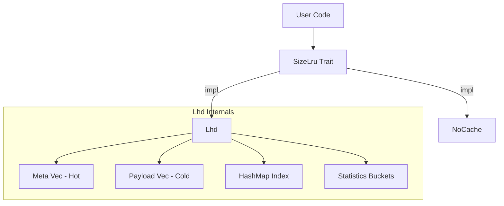
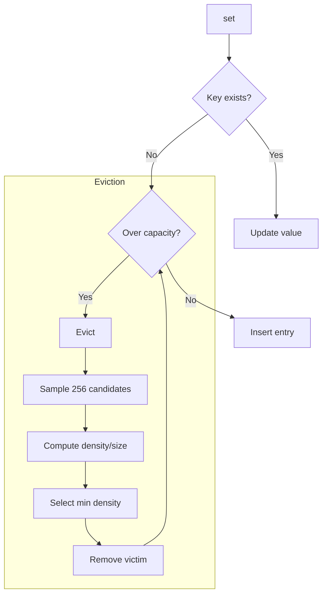
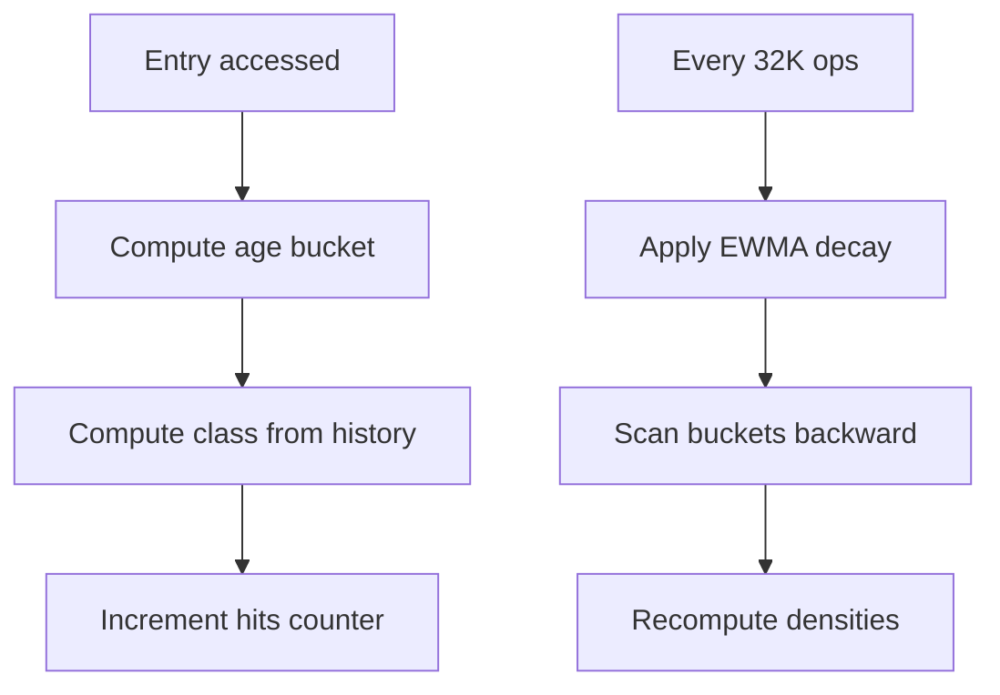

# size_lru : Fastest Size-Aware LRU Cache

[](https://crates.io/crates/size_lru)
[](https://docs.rs/size_lru)
[](https://opensource.org/licenses/MulanPSL-2.0)

Fastest size-aware LRU cache in Rust. Implements LHD (Least Hit Density) algorithm to achieve optimal hit rates while maintaining O(1) operations. Best for variable-sized keys and values (strings, byte arrays, serialized objects).

## Table of Contents

- [Features](#features)
- [Usage](#usage)
- [JavaScript / TypeScript Support](#javascript--typescript-support)
- [Design](#design)
- [Tech Stack](#tech-stack)
- [Directory Structure](#directory-structure)
- [API Reference](#api-reference)
- [History](#history)

## Features

- **Size-Aware Eviction**: Eviction considers actual byte size instead of entry count.
- **Intelligent Eviction**: LHD maximizes hit rate per byte of memory.
- **O(1) Complexity**: Get, set, and remove all run in constant time.
- **Adaptive Tuning**: Internal parameters adjust to workload patterns.
- **Zero Overhead Option**: `NoCache` implementation for baseline testing.

## Usage

### Examples

```rust
use size_lru::{Lhd, SizeLru};

fn main() {
  // Create cache with capacity of 1024 bytes (plus entry overhead)
  let mut cache: Lhd<String, Vec<u8>> = Lhd::new(1024 * 1024);

  // Insert entry with value and size weight
  let val = vec![0u8; 1000];
  cache.set("key".to_string(), val, 1000);

  // Retrieve entry
  if let Some(data) = cache.get(&"key".to_string()) {
    println!("Found data: {:?}", data);
  }
}
```

### Guidelines

#### 1. Accurate size Parameter

The `size` parameter in `set` should reflect actual memory usage. An internal 96-byte overhead is added automatically.

```rust
use size_lru::Lhd;

let mut cache: Lhd<String, Vec<u8>> = Lhd::new(1024 * 1024);

// Correct: pass actual data size
let data = vec![0u8; 1000];
cache.set("key".into(), data, 1000);
```

#### 2. OnRm Callback Notes

Callback fires before removal or eviction. Use `cache.peek(key)` to access the value being evicted.

- Many use cases only need key (logging, counting, notifying external systems).
- If value not needed, avoids one memory access overhead.
- When value needed, call `cache.peek(key)` to retrieve it.
- Only `peek` is safe during callback (read-only, no state mutation).

```rust
use size_lru::{Lhd, OnRm};

struct EvictLogger;

impl<V> OnRm<i32, Lhd<i32, V, Self>> for EvictLogger {
  fn call(&mut self, key: &i32, cache: &Lhd<i32, V, Self>) {
    if let Some(_val) = cache.peek(key) {
      println!("Evicting key={key}");
    }
  }
}

let mut cache: Lhd<i32, String, EvictLogger> = Lhd::with_on_rm(1024, EvictLogger);
cache.set(1, "value".into(), 5);
```

## Design

### Architecture



### Data Layout

SoA (Structure of Arrays) layout separates hot metadata from cold payload:

```
Meta (16 bytes, 4 per cache line):
  ts: u64        - Last access timestamp
  size: u32      - Entry size (includes 96-byte overhead)
  last_age: u16  - Previous access age
  prev_age: u16  - Age before previous

Payload (cold):
  key: K
  val: V
```

This improves cache locality during eviction sampling.

### Eviction Flow



### Statistics Update



## Tech Stack

| Component | Purpose |
| :--- | :--- |
| [rapidhash](https://crates.io/crates/rapidhash) | Fast non-cryptographic hashing |
| [fastrand](https://crates.io/crates/fastrand) | Efficient PRNG for sampling |

## Directory Structure

```
src/
  lib.rs    # Trait definition, module exports
  lhd.rs    # LHD implementation
  no.rs     # NoCache implementation
  wasm.rs   # Wasm bindings
tests/
  main.rs   # Integration tests
benches/
  comparison.rs  # Performance benchmarks
```

## API Reference

### `trait OnRm<K, C>`

Removal callback interface. Called before actual removal or eviction, use `cache.peek(key)` to get value.

- `call(&mut self, key: &K, cache: &C)` — Called on entry removal/eviction

### `struct NoOnRm`

No-op callback with zero overhead. Default when using `new()`.

### `trait SizeLru<K, V>`

Core cache interface.

- `with_on_rm(max: usize, on_rm: Rm) -> Self::WithRm<Rm>` — Create with max byte capacity and optional callback.
- `get<Q>(&mut self, key: &Q) -> Option<&V>` — Retrieve value, update hit statistics.
- `peek<Q>(&self, key: &Q) -> Option<&V>` — Peek value without updating hit statistics.
- `set(&mut self, key: K, val: V, size: u32)` — Insert/update, trigger eviction if needed.
- `rm<Q>(&mut self, key: &Q)` — Remove entry.
- `is_empty(&self) -> bool` — Check if cache is empty.
- `len(&self) -> usize` — Get entry count.

### `struct Lhd<K, V, F = NoOnRm>`

LHD implementation with configurable removal callback. Implements `SizeLru` trait.

- `size(&self) -> usize` — Total bytes stored
- `len(&self) -> usize` — Entry count
- `is_empty(&self) -> bool` — Check if empty

### `struct NoCache`

Zero-overhead no-op cache implementation. Implements `SizeLru` trait.

## History

In 1966, László Bélády proved that the optimal cache eviction strategy is to remove the item that will be needed furthest in the future. This clairvoyant algorithm (MIN/OPT) is theoretically perfect but practically impossible.

Traditional algorithms treat all entries equally. In real workloads, object sizes vary by orders of magnitude. A 1MB image and a 100B metadata record compete for the same cache slot under LRU, despite vastly different costs.

In 2018, Nathan Beckmann and colleagues at CMU published "LHD: Improving Cache Hit Rate by Maximizing Hit Density" at NSDI. Instead of heuristics, they modeled caching as an optimization problem: maximize total hits given fixed memory. By estimating expected future hits and dividing by size, LHD identifies which bytes contribute least to hit rate.

Their evaluation showed LHD requires 8x less space than LRU to achieve the same hit rate, and 2-3x less than contemporary algorithms like ARC.
