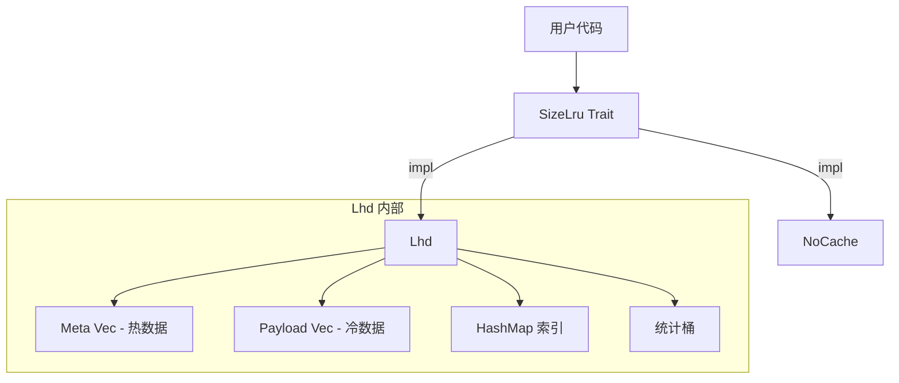
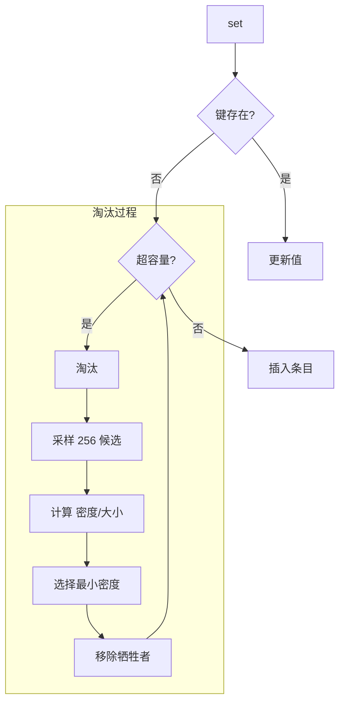
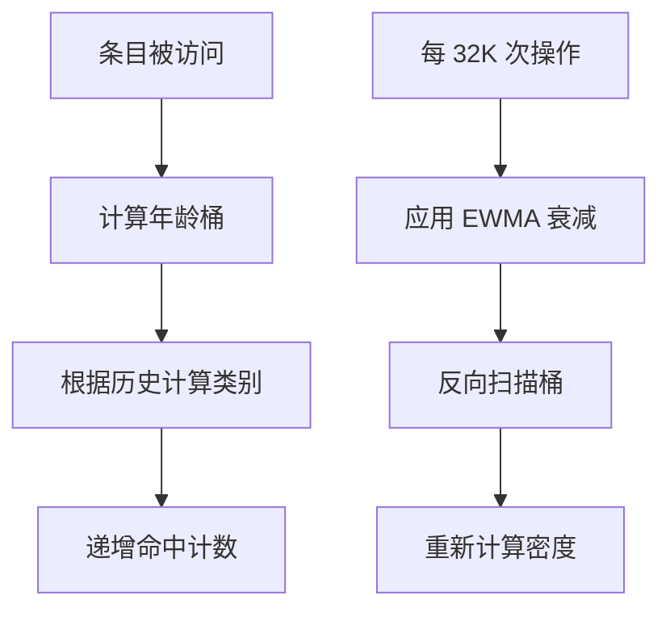

# size_lru : 最快的大小感知 LRU 缓存

[](https://crates.io/crates/size_lru)
[](https://docs.rs/size_lru)
[](https://opensource.org/licenses/MulanPSL-2.0)

Rust 中极速大小感知 LRU 缓存。实现 LHD（最低命中密度）淘汰算法，于保持 O(1) 操作复杂度的同时实现更高缓存命中率。适用于变长键值对（如字符串、字节数组、序列化对象）。

## 目录

- [特性介绍](#特性介绍)
- [使用演示](#使用演示)
- [JavaScript / TypeScript 支持](#javascript--typescript-支持)
- [设计思路](#设计思路)
- [技术堆栈](#技术堆栈)
- [目录结构](#目录结构)
- [API 说明](#api-说明)
- [历史故事](#历史故事)

## 特性介绍

- **大小感知淘汰**：淘汰考量实际字节大小，而非单纯条目数量。
- **智能密度淘汰**：基于 LHD 算法实现每字节内存命中率最大化。
- **O(1) 复杂度**：获取、设置与删除操作均在常数时间内完成。
- **自适应调整**：内部参数根据工作负载特征自动优化。
- **零开销基线**：提供 `NoCache` 实现以供对比测试。

## 使用演示

### 示例

```rust
use size_lru::{Lhd, SizeLru};

fn main() {
  // 创建指定最大字节容量之缓存（包含条目固定开销）
  let mut cache: Lhd<String, Vec<u8>> = Lhd::new(1024 * 1024);

  // 插入值并指定大小权重
  let val = vec![0u8; 1000];
  cache.set("key".to_string(), val, 1000);

  // 获取值
  if let Some(data) = cache.get(&"key".to_string()) {
    println!("获取数据: {:?}", data);
  }
}
```

### 指南

#### 1. 精确大小参数

`set` 方法中的 `size` 参数应真实反映内存占用。系统自动附加 96 字节固定条目开销。

```rust
use size_lru::Lhd;

let mut cache: Lhd<String, Vec<u8>> = Lhd::new(1024 * 1024);

// 正确：传入实际字节大小
let data = vec![0u8; 1000];
cache.set("key".into(), data, 1000);
```

#### 2. OnRm 回调函数

回调在数据移除或淘汰前执行。可利用 `cache.peek(key)` 获取即将被移除之数据。

- 大量场景仅需键信息（如日志、计数、通知外部系统）。
- 若无需访问值，可免除内存访问开销。
- 回调触发时只读 `peek` 安全，禁止调用修改状态之操作。

```rust
use size_lru::{Lhd, OnRm};

struct EvictLogger;

impl<V> OnRm<i32, Lhd<i32, V, Self>> for EvictLogger {
  fn call(&mut self, key: &i32, cache: &Lhd<i32, V, Self>) {
    if let Some(_val) = cache.peek(key) {
      println!("淘汰键={key}");
    }
  }
}

let mut cache: Lhd<i32, String, EvictLogger> = Lhd::with_on_rm(1024, EvictLogger);
cache.set(1, "value".into(), 5);
```

## 设计思路

### 架构



### 数据布局

SoA（数组结构）布局将热元数据与冷载荷分离：

```
Meta（16 字节，每缓存行 4 条）：
  ts: u64        - 最后访问时间戳
  size: u32      - 条目大小（包含 96 字节开销）
  last_age: u16  - 上次访问年龄
  prev_age: u16  - 上上次年龄

Payload（冷数据）：
  key: K
  val: V
```

这改善了淘汰采样时的缓存局部性。

### 淘汰流程



### 统计更新



## 技术堆栈

| 组件 | 用途 |
| :--- | :--- |
| [rapidhash](https://crates.io/crates/rapidhash) | 快速非加密哈希 |
| [fastrand](https://crates.io/crates/fastrand) | 高效伪随机数生成器用于采样 |

## 目录结构

```
src/
  lib.rs    # Trait 定义，模块导出
  lhd.rs    # LHD 实现
  no.rs     # NoCache 实现
  wasm.rs   # Wasm 绑定实现
tests/
  main.rs   # 集成测试
benches/
  comparison.rs  # 性能基准测试
```

## API 说明

### `trait OnRm<K, C>`

删除回调接口。在删除或淘汰前调用，用 `cache.peek(key)` 获取值。

- `call(&mut self, key: &K, cache: &C)` — 条目删除/淘汰时调用

### `struct NoOnRm`

空回调，零开销。使用 `new()` 时的默认值。

### `trait SizeLru<K, V>`

核心缓存接口。

- `with_on_rm(max: usize, on_rm: Rm) -> Self::WithRm<Rm>` — 创建指定最大字节容量和可选回调。
- `get<Q>(&mut self, key: &Q) -> Option<&V>` — 获取值，更新命中统计。
- `peek<Q>(&self, key: &Q) -> Option<&V>` — 查看值但不更新命中统计。
- `set(&mut self, key: K, val: V, size: u32)` — 插入或更新，必要时触发淘汰。
- `rm<Q>(&mut self, key: &Q)` — 删除条目。
- `is_empty(&self) -> bool` — 检查是否为空。
- `len(&self) -> usize` — 获取条目数量。

### `struct Lhd<K, V, F = NoOnRm>`

LHD 实现，支持配置删除回调。实现了 `SizeLru` 属性。

- `size(&self) -> usize` — 已存储总字节数
- `len(&self) -> usize` — 条目数量
- `is_empty(&self) -> bool` — 检查是否为空

### `struct NoCache`

零开销空操作缓存实现。实现了 `SizeLru` 接口。

## 历史故事

1966 年，László Bélády 提出最优缓存淘汰策略（MIN/OPT），即淘汰将来最晚被访问的数据，因需预测未来而无法付诸实用。传统算法如 LRU 等同对待全部数据，忽视变长数据对存储容量之竞争。

2018 年，Nathan Beckmann 与卡内基梅隆大学（CMU）研究团队于 NSDI 发表 LHD（最低命中密度）算法，将缓存淘汰转化为数学优化问题，通过计算期望命中数与体积之比（命中密度）实现内存命中率最大化。
