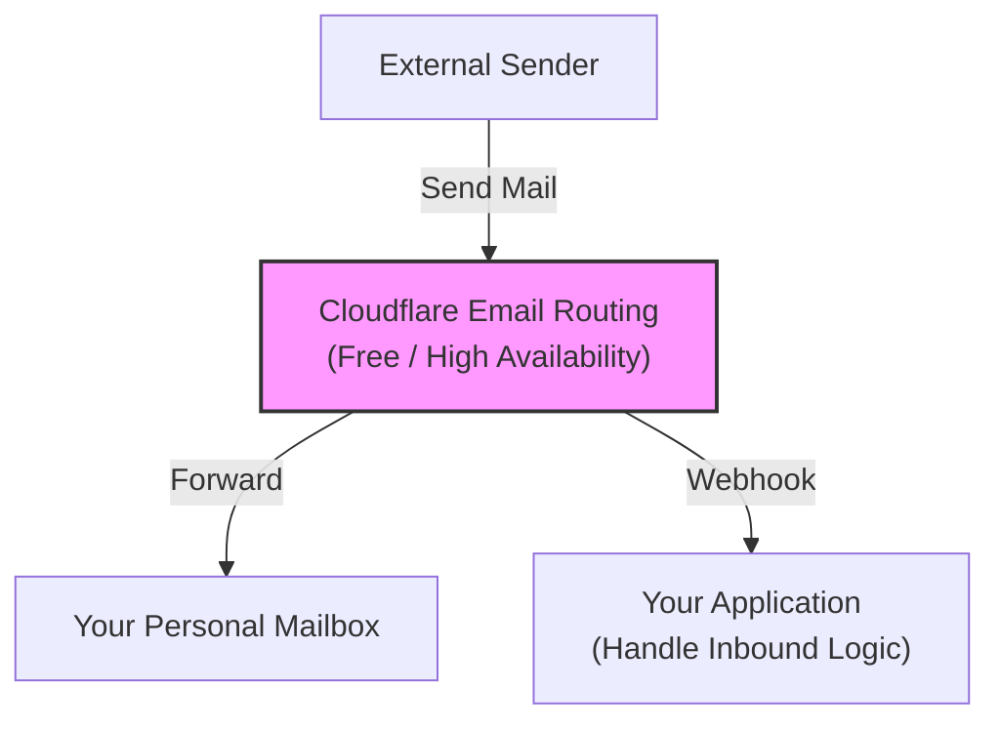
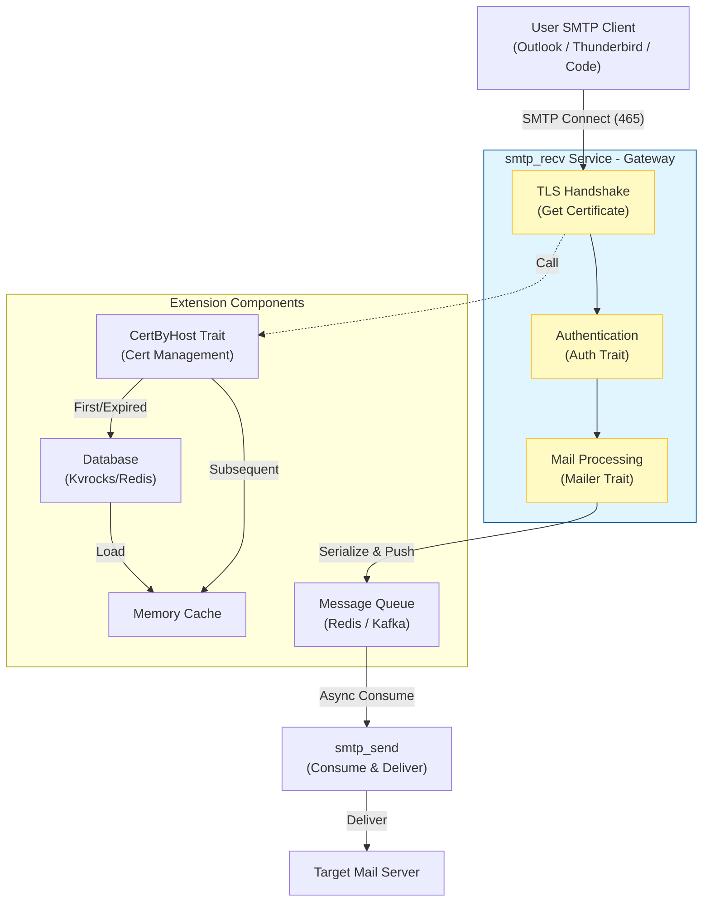
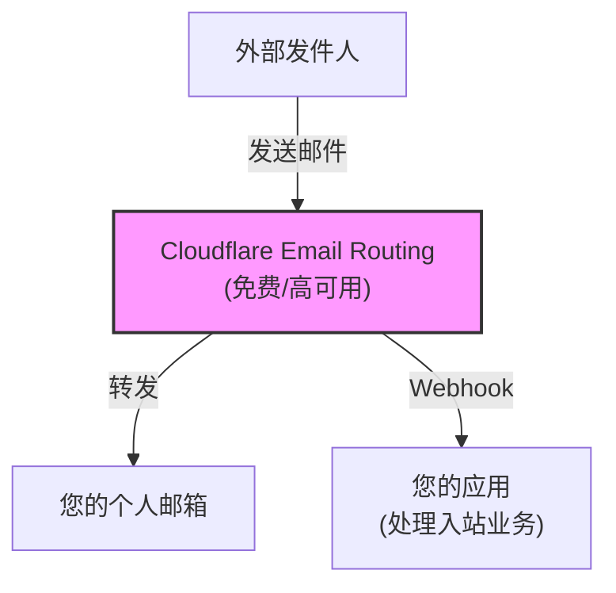
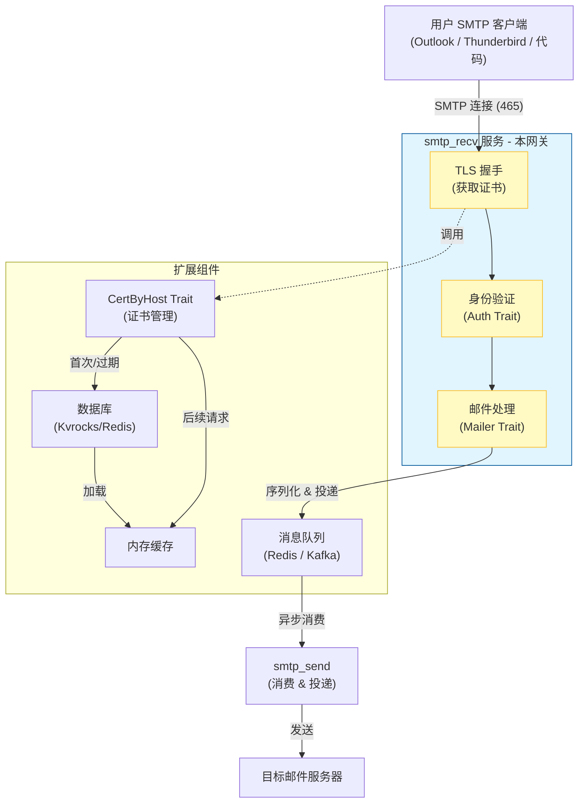

[English](#en) | [中文](#zh)

---

<a id="en"></a>

# smtp_recv : Secure, High-Performance SMTP Server

A complete, secure-by-default SMTP server implementation in Rust, designed for high performance and modern security standards.

## Table of Contents

- [Background and Architecture](#background-and-architecture)
- [Core Traits & Integration](#core-traits--integration)
  - [1. Mailer Trait: Email Handling](#1-mailer-trait-email-handling)
  - [2. CertByHost Trait: Certificate Management](#2-certbyhost-trait-certificate-management)
  - [3. Integration Example](#3-integration-example)
- [Features](#features)
- [Design](#design)
- [Tech Stack](#tech-stack)
- [Directory Structure](#directory-structure)
- [API Reference](#api-reference)
- [History](#history)

## Background and Architecture

### Era Background: Focus on Sending

In modern email architectures, **Inbound Email (Receiving)** has become very simple and often free. Services like Cloudflare Email Routing can efficiently handle all inbound emails for free, forwarding them to your personal mailbox (e.g., Gmail) or a Webhook.

Therefore, we no longer need to maintain complex inbound email servers. The core pain point now lies in **Outbound Email (Sending)**: how to allow your applications or email clients (Outlook, Thunderbird) to send emails via a custom domain while ensuring high deliverability and security.

**smtp_recv** is built exactly for this purpose. It serves as an **SMTP Sending Gateway**, accepting email delivery requests from your clients and forwarding them to a sending queue.

### Architecture Diagram

**1. Receiving Flow (Cloudflare)**

No need to build your own server, leverage existing services:



**2. Sending Flow (This Project)**

The core is handling client connections and securely queuing emails:



### Core Components

In this architecture, `smtp_recv` acts as a **Producer**.

-   **User Client**: Connects to `smtp_recv` (port 465).
-   **smtp_recv**: Handles TLS encryption, authentication (Auth Trait) and protocol parsing.
-   **Mailer Trait**: Core extension, defines "how to handle received emails" (e.g., push to MQ).
-   **CertByHost Trait**: Security core, defines "how to fetch SSL certificates" (supports dynamic loading, auto-expiry).

## Core Traits & Integration

`smtp_recv` interfaces with your business logic via two core traits: `Mailer` for email flow, and `CertByHost` for security certificates.

### 1. Mailer Trait: Email Handling

Called when the server receives a complete email.

```rust
pub trait Mailer: Send + Sync + 'static {
    fn send(&self, mail: UserMail) -> impl Future<Output = Result<()>> + Send;
}
```

-   **UserMail**: Contains email content (`mail`) and recipient ID (`id`).
-   **Usage**: Typically used to serialize and push emails to Redis/Kafka, rather than sending directly.

### 2. CertByHost Trait: Certificate Management

Supports dynamic certificate loading based on SNI, used for **SSL encryption when user clients connect to the server**.

For example: When a user configures the SMTP server as `smtp.js0.site` in Outlook, the server must return the certificate for `smtp.js0.site` (or a wildcard certificate for `*.js0.site`) to establish a secure connection.

```rust
pub trait CertByHost: Send + Sync + 'static {
    type Item: Borrow<SslConfig>;
    async fn get(&self, host: &str) -> anyhow::Result<Option<Self::Item>>;
}
```

-   **Purpose**: Ensures secure connection for user login and email submission.
-   **Benefits**: On-demand loading, memory caching, auto-expiration (with `cert_by_host` crate).
-   **No-Restart Refresh**: Certificates update without restarting the service.

### 3. Integration Example

The following code demonstrates implementing both traits and starting the server:

```rust
use smtp_recv::{run, Mailer, Result};
use mail_struct::UserMail;

// --- 1. Implement Mailer ---
struct MyMailer;

impl Mailer for MyMailer {
    async fn send(&self, user_mail: UserMail) -> anyhow::Result<()> {
        println!("Received mail from: {}", user_mail.mail.sender);
        // Real-world: redis.lpush("mail_queue", serde_json::to_string(&user_mail)?)
        Ok(())
    }
}

// --- 2. Implement CertByHost ---
// Recommended: use cert_by_host crate for efficient dynamic management
#[derive(Clone)]
struct CertByHost;

impl ssl_trait::CertByHost for CertByHost {
  type Item = cert_by_host::Cert;
  async fn get(&self, host: &str) -> Result<Option<Self::Item>> {
    // Simple example: delegate to cert_by_host library
    cert_by_host::CertByHost
      .get(if let Some((_, tld)) = host.split_once(".") { tld } else { host })
      .await
  }
}

#[tokio::main]
async fn main() -> Result<()> {
    // Initialize certificate system
    xboot::init().await?;

    // --- 3. Start Server ---
    // Listen on port 465, pass Auth, Mailer, and CertByHost implementations
    run(465, my_auth, MyMailer, CertByHost).await
}
```

## Design

The server follows a secure connection flow:

1.  **Connection**: Accepts TCP connection.
2.  **TLS Handshake**: Initiates Implicit TLS immediately.
3.  **SNI Extraction**: Extracts the server name from the ClientHello.
4.  **Certificate Selection**: Fetches the appropriate certificate using `ssl_trait::CertByHost`. Recommended to use with `cert_by_host` crate, which enables:
    - **Asynchronous Loading**: Certificates are loaded on-demand from Kvrocks, avoiding upfront loading of all certificates for SaaS platforms with hundreds or thousands of domains.
    - **Intelligent Caching**: `cert_by_host` provides a high-performance in-memory cache with automatic expiration based on certificate validity periods.
    - **Resource Efficiency**: Only active certificates are kept in memory, significantly reducing resource consumption compared to traditional approaches.
5.  **Session**: Establishes an SMTP session (`Session::run`).
6.  **Command Processing**: Handles SMTP commands (HELO, MAIL, RCPT, DATA) with pipelining support.
7.  **Authentication**: Verifies credentials using the `Auth` trait.
8.  **Delivery**: Delivers the email via the `Mailer` trait.

## Tech Stack

-   **Runtime**: `tokio`
-   **TLS**: `rustls`, `tokio-rustls`
-   **Certificate Management**: Recommended `cert_by_host` for dynamic SSL certificate loading
-   **Error Handling**: `anyhow`, `thiserror`
-   **Logging**: `log`

## Directory Structure

```
src/
├── lib.rs       # Library entry point, server run loop
├── error.rs     # Error definitions
├── mailer.rs    # Mailer trait definition
└── session.rs   # SMTP session handling logic
```

## API Reference

### `run`

```rust
pub async fn run<A: Auth, M: Mailer>(
    port: u16,
    auth: A,
    mailer: impl Into<Arc<M>>,
    ssl: impl CertByHost,
) -> Result<()>
```

Starts the SMTP server.
-   `port`: Listening port (usually 465).
-   `auth`: Authentication provider.
-   `mailer`: Email handler.
-   `ssl`: Certificate provider.

### `Mailer` Trait

```rust
pub trait Mailer: Send + Sync + 'static {
    fn send(&self, mail: UserMail) -> impl Future<Output = Result<()>> + Send;
}
```

Implement this to handle received emails.

### `UserMail` Struct

Contains the email data (`Mail`) and the user ID associated with the recipient.


## History

**The Story of Port 465**

In 1997, port 465 was registered for "SMTPS" - SMTP over SSL. It was intended to be the secure equivalent of port 25, encrypting the connection from the very beginning (Implicit TLS). However, it was never officially standardized by the IETF.

In 1998, the IETF standardized STARTTLS on port 587, which starts as plain text and upgrades to TLS. Port 465 was reassigned and considered deprecated for SMTP.

Despite this, many major email providers (like Gmail) continued to support port 465 because it is often more robust against misconfigured firewalls or intermediaries that might strip the STARTTLS command. Today, port 465 with Implicit TLS has seen a resurgence and is widely recommended for secure email submission, offering a "secure or nothing" approach that prevents downgrade attacks.

---

## About

This project is an open-source component of [js0.site ⋅ Refactoring the Internet Plan](https://js0.site).

We are redefining the development paradigm of the Internet in a componentized way. Welcome to follow us:

* [Google Group](https://groups.google.com/g/js0-site)
* [js0site.bsky.social](https://bsky.app/profile/js0site.bsky.social)

---

<a id="zh"></a>

# smtp_recv : 安全高性能的 SMTP 服务器

一个基于 Rust 实现的、默认安全的完整 SMTP 服务器，专为高性能和现代安全标准而设计。

## 目录

- [背景与架构](#背景与架构)
- [核心 Traits 与集成](#核心-traits-与集成)
  - [1. Mailer Trait: 邮件处理](#1-mailer-trait-邮件处理)
  - [2. CertByHost Trait: 证书管理](#2-certbyhost-trait-证书管理)
  - [3. 集成演示](#3-集成演示)
- [功能特性](#功能特性)
- [设计思路](#设计思路)
- [技术堆栈](#技术堆栈)
- [目录结构](#目录结构)
- [API 参考](#api-参考)
- [历史背景](#历史背景)

## 背景与架构

### 时代背景：专注于发送

在现代邮件架构中，**接收邮件（Inbound）** 已经变得非常简单且免费。例如，Cloudflare Email Routing 等服务可以免费且高效地处理所有入站邮件，将其转发到您的个人邮箱（如 Gmail）或 Webhook。

因此，我们不再需要维护复杂的入站邮件服务器。现在的核心痛点在于 **邮件发送（Outbound）**：如何让您的应用或邮件客户端（Outlook, Thunderbird）通过自定义域名发送邮件，同时保证高送达率和安全性。

**smtp_recv** 正是为此而生。它作为一个 **SMTP 发送网关**，接收来自您客户端的邮件投递请求，并将其转发到发送队列。

### 架构流程图

**1. 接收流程 (Cloudflare)**

无需自建服务器，直接利用现成服务：



**2. 发送流程 (本项目)**

核心在于处理客户端连接并安全地将邮件放入队列：



### 核心组件

在此架构中，`smtp_recv` 扮演 **生产者** 的角色。

-   **用户客户端**：连接到 `smtp_recv` (端口 465)。
-   **smtp_recv**：处理 TLS 加密、身份验证 (Auth Trait) 和协议解析。
-   **Mailer Trait**：扩展核心，定义"如何处理接收到的邮件"（如推送到 MQ）。
-   **CertByHost Trait**：安全核心，定义"如何获取 SSL 证书"（支持动态加载、自动过期）。

## 核心 Traits 与集成

`smtp_recv` 通过两个核心 Trait 与您的业务逻辑对接：`Mailer` 负责邮件流向，`CertByHost` 负责安全证书。

### 1. Mailer Trait: 邮件处理

当服务器接收到一封完整的邮件后，会调用此接口。

```rust
pub trait Mailer: Send + Sync + 'static {
    fn send(&self, mail: UserMail) -> impl Future<Output = Result<()>> + Send;
}
```

-   **UserMail**: 包含邮件内容 (`mail`) 和接收者 ID (`id`)。
-   **用途**: 通常在此处将邮件序列化并推送到 Redis/Kafka，而不是直接发送。

### 2. CertByHost Trait: 证书管理

支持基于 SNI 动态加载证书，用于**用户客户端连接服务器时的 SSL 加密**。

例如：当用户在 Outlook 中配置 SMTP 服务器为 `smtp.js0.site` 时，服务器需要返回 `smtp.js0.site` 的证书（或 `*.js0.site` 的泛域名证书）以建立安全连接。

```rust
pub trait CertByHost: Send + Sync + 'static {
    type Item: Borrow<SslConfig>;
    async fn get(&self, host: &str) -> anyhow::Result<Option<Self::Item>>;
}
```

-   **用途**: 确保用户登录和发送邮件时的连接安全。
-   **优势**: 按需加载、内存缓存、自动过期（配合 `cert_by_host` crate）。
-   **无重启刷新**: 证书更新时无需重启服务。

### 3. 集成演示

以下代码展示了如何同时实现这两个 Trait 并启动服务器：

```rust
use smtp_recv::{run, Mailer, Result};
use mail_struct::UserMail;

// --- 1. 实现 Mailer ---
struct MyMailer;

impl Mailer for MyMailer {
    async fn send(&self, user_mail: UserMail) -> anyhow::Result<()> {
        println!("收到来自 {} 的邮件", user_mail.mail.sender);
        // 实际场景：redis.lpush("mail_queue", serde_json::to_string(&user_mail)?)
        Ok(())
    }
}

// --- 2. 实现 CertByHost ---
// 推荐使用 cert_by_host crate 实现高效的动态证书管理
#[derive(Clone)]
struct CertByHost;

impl ssl_trait::CertByHost for CertByHost {
  type Item = cert_by_host::Cert;
  async fn get(&self, host: &str) -> Result<Option<Self::Item>> {
    // 简单示例：直接委托给 cert_by_host 库
    cert_by_host::CertByHost
      .get(if let Some((_, tld)) = host.split_once(".") { tld } else { host })
      .await
  }
}

#[tokio::main]
async fn main() -> Result<()> {
    // 初始化证书系统
    xboot::init().await?;

    // --- 3. 启动服务器 ---
    // 监听 465 端口，传入 Auth, Mailer 和 CertByHost 实现
    run(465, my_auth, MyMailer, CertByHost).await
}
```

## 设计思路

服务器采用安全优先的连接处理流程：

1.  **连接建立**: 接受 TCP 连接。
2.  **TLS 握手**: 立即启动隐式 TLS 握手。
3.  **SNI 提取**: 从 ClientHello 中提取服务器名称。
4.  **证书选择**: 使用 `ssl_trait::CertByHost` 获取匹配的证书。推荐配合 `cert_by_host` crate 使用，这实现了：
    - **异步加载**: 证书按需从 Kvrocks 加载，避免了在 SaaS 平台有成百上千个域名时一次性加载所有证书。
    - **智能缓存**: `cert_by_host` 提供了基于证书有效期自动过期的高性能内存缓存。
    - **资源高效**: 只有活跃的证书保留在内存中，相比传统方法显著降低了资源消耗。
5.  **会话建立**: 创建 SMTP 会话 (`Session::run`)。
6.  **命令处理**: 处理 SMTP 命令 (HELO, MAIL, RCPT, DATA)，支持流水线。
7.  **身份验证**: 使用 `Auth` trait 验证用户凭据。
8.  **邮件投递**: 通过 `Mailer` trait 将邮件交给上层应用处理。

## 技术堆栈

-   **运行时**: `tokio`
-   **TLS**: `rustls`, `tokio-rustls`
-   **错误处理**: `anyhow`, `thiserror`
-   **日志**: `log`

## 目录结构

```
src/
├── lib.rs       # 库入口，包含服务器运行主循环
├── error.rs     # 错误类型定义
├── mailer.rs    # Mailer trait 定义
└── session.rs   # SMTP 会话处理逻辑
```

## API 参考

### `run`

```rust
pub async fn run<A: Auth, M: Mailer>(
    port: u16,
    auth: A,
    mailer: impl Into<Arc<M>>,
    ssl: impl CertByHost,
) -> Result<()>
```

启动 SMTP 服务器。
-   `port`: 监听端口（通常为 465）。
-   `auth`: 认证服务提供者。
-   `mailer`: 邮件处理器。
-   `ssl`: 证书提供者。

### `Mailer` Trait

```rust
pub trait Mailer: Send + Sync + 'static {
    fn send(&self, mail: UserMail) -> impl Future<Output = Result<()>> + Send;
}
```

实现此 trait 以处理接收到的邮件。

### `UserMail` Struct

包含邮件数据 (`Mail`) 和接收者的用户 ID。


## 历史背景

**端口 465 的前世今生**

1997 年，端口 465 被注册用于 "SMTPS" —— 即基于 SSL 的 SMTP。它的初衷是作为端口 25 的安全版本，从连接一开始就进行加密（隐式 TLS）。然而，这种方式从未被 IETF 正式标准化。

1998 年，IETF 标准化了运行在 587 端口的 STARTTLS 协议，它允许连接以明文开始，然后升级到 TLS。端口 465 随即被重新分配，并在 SMTP 协议中被视为"已弃用"。

尽管如此，许多主流邮件服务商（如 Gmail）仍坚持支持端口 465。这是因为相比于 STARTTLS，隐式 TLS 更能抵抗配置错误的防火墙或中间人干扰（这些干扰可能会剥离 STARTTLS 命令）。如今，端口 465 及其隐式 TLS 模式迎来了复兴，被广泛推荐用于安全的邮件提交，它提供了一种"要么安全，要么不连"的强硬态度，有效防止了降级攻击。

---

## 关于

本项目为 [js0.site ⋅ 重构互联网计划](https://js0.site) 的开源组件。

我们正在以组件化的方式重新定义互联网的开发范式，欢迎关注：

* [谷歌邮件列表](https://groups.google.com/g/js0-site)
* [js0site.bsky.social](https://bsky.app/profile/js0site.bsky.social)
