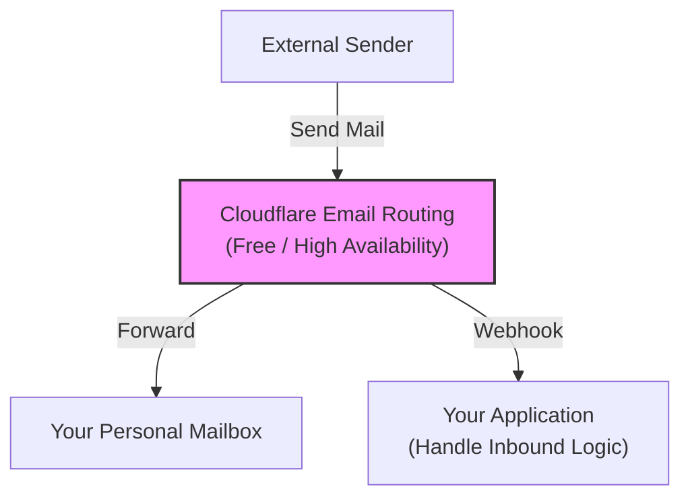
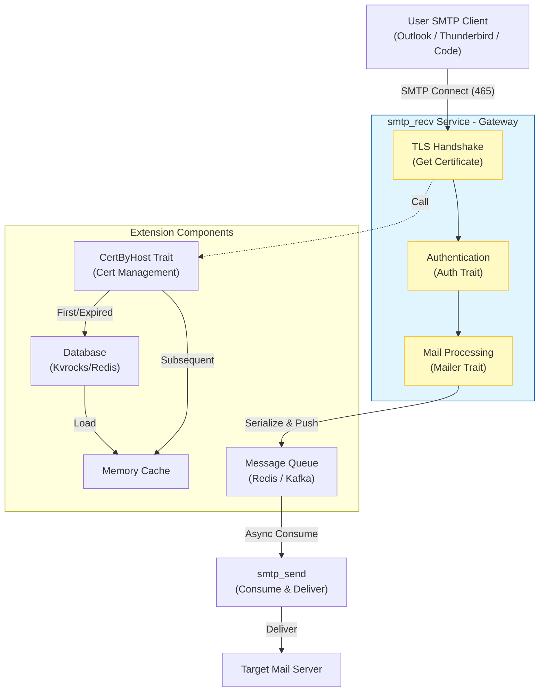

# smtp_recv : Secure, High-Performance SMTP Server

A complete, secure-by-default SMTP server implementation in Rust, designed for high performance and modern security standards.

## Table of Contents

- [Background and Architecture](#background-and-architecture)
- [Core Traits & Integration](#core-traits--integration)
  - [1. Mailer Trait: Email Handling](#1-mailer-trait-email-handling)
  - [2. CertByHost Trait: Certificate Management](#2-certbyhost-trait-certificate-management)
  - [3. Integration Example](#3-integration-example)
- [Features](#features)
- [Design](#design)
- [Tech Stack](#tech-stack)
- [Directory Structure](#directory-structure)
- [API Reference](#api-reference)
- [History](#history)

## Background and Architecture

### Era Background: Focus on Sending

In modern email architectures, **Inbound Email (Receiving)** has become very simple and often free. Services like Cloudflare Email Routing can efficiently handle all inbound emails for free, forwarding them to your personal mailbox (e.g., Gmail) or a Webhook.

Therefore, we no longer need to maintain complex inbound email servers. The core pain point now lies in **Outbound Email (Sending)**: how to allow your applications or email clients (Outlook, Thunderbird) to send emails via a custom domain while ensuring high deliverability and security.

**smtp_recv** is built exactly for this purpose. It serves as an **SMTP Sending Gateway**, accepting email delivery requests from your clients and forwarding them to a sending queue.

### Architecture Diagram

**1. Receiving Flow (Cloudflare)**

No need to build your own server, leverage existing services:



**2. Sending Flow (This Project)**

The core is handling client connections and securely queuing emails:



### Core Components

In this architecture, `smtp_recv` acts as a **Producer**.

-   **User Client**: Connects to `smtp_recv` (port 465).
-   **smtp_recv**: Handles TLS encryption, authentication (Auth Trait) and protocol parsing.
-   **Mailer Trait**: Core extension, defines "how to handle received emails" (e.g., push to MQ).
-   **CertByHost Trait**: Security core, defines "how to fetch SSL certificates" (supports dynamic loading, auto-expiry).

## Core Traits & Integration

`smtp_recv` interfaces with your business logic via two core traits: `Mailer` for email flow, and `CertByHost` for security certificates.

### 1. Mailer Trait: Email Handling

Called when the server receives a complete email.

```rust
pub trait Mailer: Send + Sync + 'static {
    fn send(&self, mail: UserMail) -> impl Future<Output = Result<()>> + Send;
}
```

-   **UserMail**: Contains email content (`mail`) and recipient ID (`id`).
-   **Usage**: Typically used to serialize and push emails to Redis/Kafka, rather than sending directly.

### 2. CertByHost Trait: Certificate Management

Supports dynamic certificate loading based on SNI, used for **SSL encryption when user clients connect to the server**.

For example: When a user configures the SMTP server as `smtp.js0.site` in Outlook, the server must return the certificate for `smtp.js0.site` (or a wildcard certificate for `*.js0.site`) to establish a secure connection.

```rust
pub trait CertByHost: Send + Sync + 'static {
    type Item: Borrow<SslConfig>;
    async fn get(&self, host: &str) -> anyhow::Result<Option<Self::Item>>;
}
```

-   **Purpose**: Ensures secure connection for user login and email submission.
-   **Benefits**: On-demand loading, memory caching, auto-expiration (with `cert_by_host` crate).
-   **No-Restart Refresh**: Certificates update without restarting the service.

### 3. Integration Example

The following code demonstrates implementing both traits and starting the server:

```rust
use smtp_recv::{run, Mailer, Result};
use mail_struct::UserMail;

// --- 1. Implement Mailer ---
struct MyMailer;

impl Mailer for MyMailer {
    async fn send(&self, user_mail: UserMail) -> anyhow::Result<()> {
        println!("Received mail from: {}", user_mail.mail.sender);
        // Real-world: redis.lpush("mail_queue", serde_json::to_string(&user_mail)?)
        Ok(())
    }
}

// --- 2. Implement CertByHost ---
// Recommended: use cert_by_host crate for efficient dynamic management
#[derive(Clone)]
struct CertByHost;

impl ssl_trait::CertByHost for CertByHost {
  type Item = cert_by_host::Cert;
  async fn get(&self, host: &str) -> Result<Option<Self::Item>> {
    // Simple example: delegate to cert_by_host library
    cert_by_host::CertByHost
      .get(if let Some((_, tld)) = host.split_once(".") { tld } else { host })
      .await
  }
}

#[tokio::main]
async fn main() -> Result<()> {
    // Initialize certificate system
    xboot::init().await?;

    // --- 3. Start Server ---
    // Listen on port 465, pass Auth, Mailer, and CertByHost implementations
    run(465, my_auth, MyMailer, CertByHost).await
}
```

## Design

The server follows a secure connection flow:

1.  **Connection**: Accepts TCP connection.
2.  **TLS Handshake**: Initiates Implicit TLS immediately.
3.  **SNI Extraction**: Extracts the server name from the ClientHello.
4.  **Certificate Selection**: Fetches the appropriate certificate using `ssl_trait::CertByHost`. Recommended to use with `cert_by_host` crate, which enables:
    - **Asynchronous Loading**: Certificates are loaded on-demand from Kvrocks, avoiding upfront loading of all certificates for SaaS platforms with hundreds or thousands of domains.
    - **Intelligent Caching**: `cert_by_host` provides a high-performance in-memory cache with automatic expiration based on certificate validity periods.
    - **Resource Efficiency**: Only active certificates are kept in memory, significantly reducing resource consumption compared to traditional approaches.
5.  **Session**: Establishes an SMTP session (`Session::run`).
6.  **Command Processing**: Handles SMTP commands (HELO, MAIL, RCPT, DATA) with pipelining support.
7.  **Authentication**: Verifies credentials using the `Auth` trait.
8.  **Delivery**: Delivers the email via the `Mailer` trait.

## Tech Stack

-   **Runtime**: `tokio`
-   **TLS**: `rustls`, `tokio-rustls`
-   **Certificate Management**: Recommended `cert_by_host` for dynamic SSL certificate loading
-   **Error Handling**: `anyhow`, `thiserror`
-   **Logging**: `log`

## Directory Structure

```
src/
├── lib.rs       # Library entry point, server run loop
├── error.rs     # Error definitions
├── mailer.rs    # Mailer trait definition
└── session.rs   # SMTP session handling logic
```

## API Reference

### `run`

```rust
pub async fn run<A: Auth, M: Mailer>(
    port: u16,
    auth: A,
    mailer: impl Into<Arc<M>>,
    ssl: impl CertByHost,
) -> Result<()>
```

Starts the SMTP server.
-   `port`: Listening port (usually 465).
-   `auth`: Authentication provider.
-   `mailer`: Email handler.
-   `ssl`: Certificate provider.

### `Mailer` Trait

```rust
pub trait Mailer: Send + Sync + 'static {
    fn send(&self, mail: UserMail) -> impl Future<Output = Result<()>> + Send;
}
```

Implement this to handle received emails.

### `UserMail` Struct

Contains the email data (`Mail`) and the user ID associated with the recipient.


## History

**The Story of Port 465**

In 1997, port 465 was registered for "SMTPS" - SMTP over SSL. It was intended to be the secure equivalent of port 25, encrypting the connection from the very beginning (Implicit TLS). However, it was never officially standardized by the IETF.

In 1998, the IETF standardized STARTTLS on port 587, which starts as plain text and upgrades to TLS. Port 465 was reassigned and considered deprecated for SMTP.

Despite this, many major email providers (like Gmail) continued to support port 465 because it is often more robust against misconfigured firewalls or intermediaries that might strip the STARTTLS command. Today, port 465 with Implicit TLS has seen a resurgence and is widely recommended for secure email submission, offering a "secure or nothing" approach that prevents downgrade attacks.